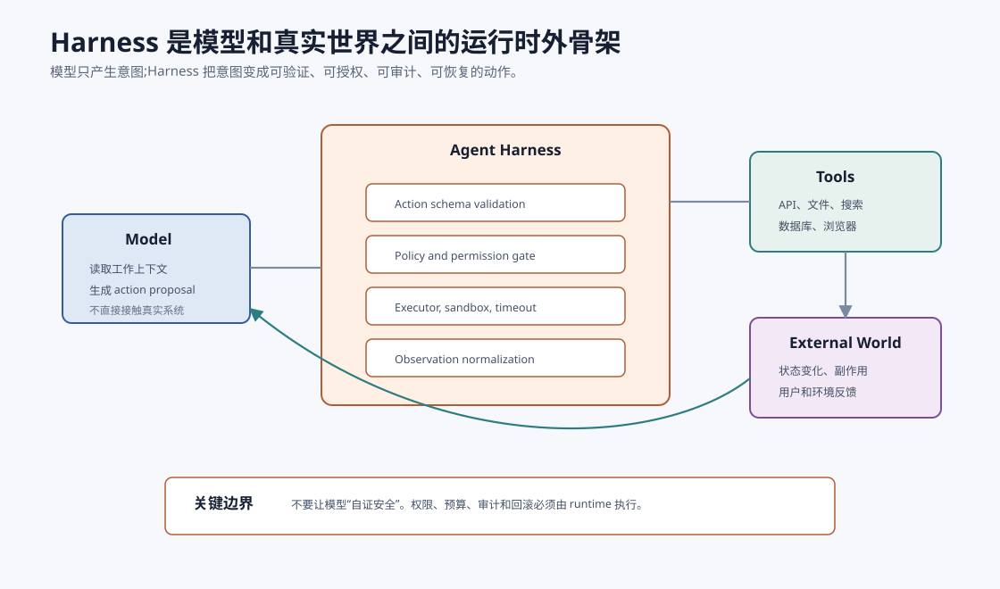
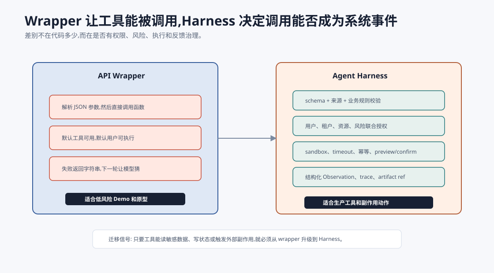
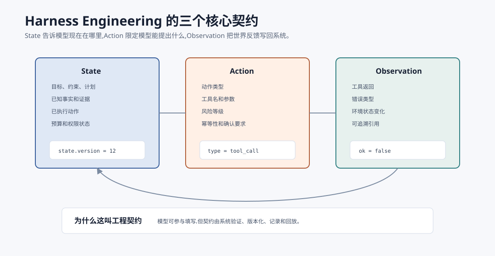
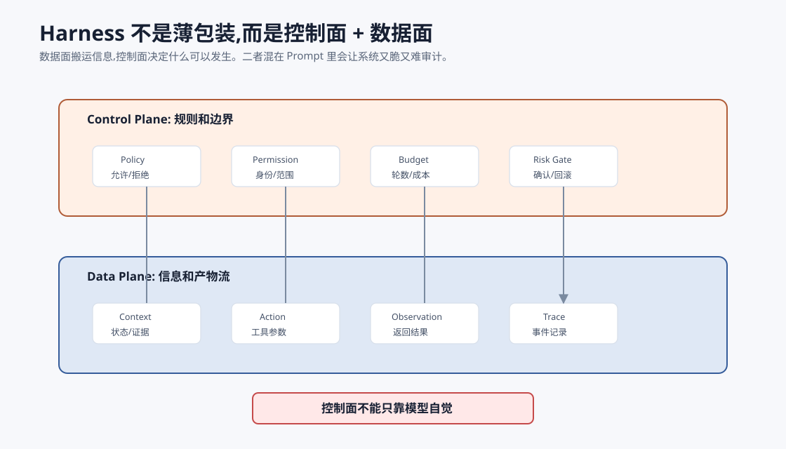
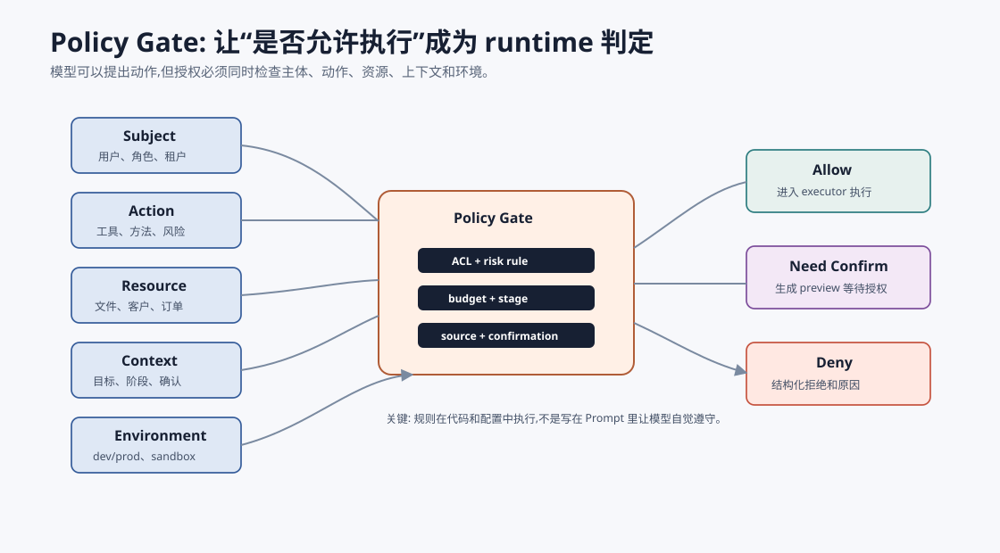
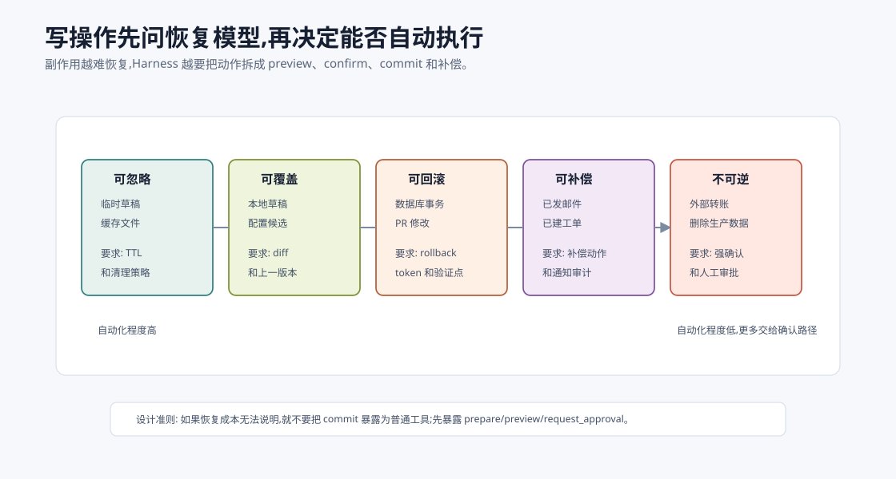

# Harness Engineering:给 Agent 装上运行时外骨架 `[主线]` ★

如果说 Prompt 是你写给模型看的工作说明,Context 是你摆在模型面前的工作材料,那么 Harness 就是模型和真实世界之间的运行时外骨架。

没有 Harness 的 Agent 很像一个很会说话但没有安全边界的实习生:它能建议下一步,但你不能让它直接接触数据库、文件系统、支付接口、邮件系统和生产环境。

Harness Engineering 关心的问题是:

> 模型提出的动作,如何被系统验证、授权、执行、记录、恢复和评估?

公开工程讨论里,Harness 常被用来指“模型本体之外,让 Agent 能稳定干活的那套代码、配置、协议和基础设施”。这个词和测试里的 test harness 有相通之处:模型不是直接撞向真实世界,而是被一套外部结构固定、约束、供给输入、接收输出并观察结果。放到 Agent 里,Harness Engineering 就是系统化设计这套外部结构。

所以不要把 Harness 理解成某个特定框架名。它更像一个工程边界词:只要你在设计工具注册、schema、权限、执行器、sandbox、trace、错误协议和回滚,你就在做 Harness Engineering。

这是一层经常被低估的工程。很多 Agent Demo 可以没有强 Harness,因为它只读文件、只生成文本、失败了刷新一下就好。生产系统不行。只要 Agent 能调用工具、写状态、触发外部副作用,Harness 就不是可选项。



本章会讲:

- Harness 到底是什么。
- 它和 API wrapper、Function Calling、ACI 的区别。
- Harness 的状态、动作、观察三个核心契约。
- 控制面和数据面如何分离。
- 权限、预算、sandbox、trace、回滚为什么属于 Harness。
- 如何评估一个 Harness 是否可靠。

## Harness 不是 API wrapper

很多人第一次写 Agent 工具时,会这样做:

```python
if model_wants_tool_call:
    result = call_api(model_arguments)
    append_to_messages(result)
```

这只是 API wrapper,不是完整 Harness。

API wrapper 只回答:

> 怎么把函数调起来?

Harness 要回答更多问题:

- 模型是否被允许调用这个工具?
- 参数是否有效?
- 参数是否来自可信来源?
- 工具是否会产生副作用?
- 当前任务状态是否允许执行?
- 是否需要用户确认?
- 失败后如何反馈给模型?
- 执行结果如何写回状态?
- 这次动作如何被审计和复现?
- 如果动作做错了,能否回滚或补偿?

少了这些问题,Agent 看起来能跑,但一遇到真实环境就会失控。

更准确地说,API wrapper 是“函数适配层”,Harness 是“运行时治理层”。前者让模型能调用函数,后者决定这个调用是否可以成为系统事件。



一个成熟 Harness 至少跨过四条线:

| 层次 | 只做 wrapper | 做到 Harness |
| --- | --- | --- |
| 结构 | 把 JSON 参数传给函数 | 参数校验、默认值、枚举、来源、业务规则 |
| 权限 | 假设工具可用 | 用户、租户、资源、动作、风险联合授权 |
| 执行 | 直接调用 API | sandbox、超时、幂等、预览、确认、回滚 |
| 反馈 | 返回字符串 | 结构化 Observation、trace、artifact 引用、错误协议 |

这也是为什么很多“工具调用 Demo”迁到生产会突然变脆。Demo 里工具只是模型能力的一部分;生产里工具是系统权限的一部分。一旦工具能读取客户数据、写数据库、发送邮件、创建工单或改代码,它就必须被 Harness 接管。

## Harness 的核心边界

最重要的边界是这句:

**模型提出动作,系统执行动作。**

模型可以输出:

```json
{
  "action": "delete_file",
  "path": "reports/final.md"
}
```

但系统不应该因为模型这么说就删除文件。

Harness 必须先判断:

- `delete_file` 是否在当前动作空间中。
- 当前用户是否有删除权限。
- 路径是否在允许工作区。
- 文件是否受保护。
- 删除是否需要确认。
- 是否已经生成 preview。
- 是否能恢复。
- trace 是否记录了发起原因和确认人。

这就是从“模型能调用工具”到“系统可以安全执行工具”的差别。

## 三个核心契约:State、Action、Observation

Harness 最核心的设计,不是某个框架类名,而是三个契约。



### State 契约

State 是任务当前的系统事实。

它不应该只是聊天历史。一个可靠 State 至少包含:

| 字段 | 用途 |
| --- | --- |
| `goal` | 用户真正要完成什么 |
| `constraints` | 系统、用户、安全和业务约束 |
| `plan` | 当前计划和阶段 |
| `observations` | 工具和环境返回的事实 |
| `actions_taken` | 已执行动作和结果 |
| `artifacts` | 文件、报告、diff、证据包等产物 |
| `permissions` | 当前可用能力和授权范围 |
| `budget` | 轮数、成本、时间、工具调用限制 |
| `status` | running、needs_user、blocked、done、failed |

State 的关键是**由 runtime 维护**。

模型可以建议如何更新状态,但最终写入必须由系统控制。否则模型可能把猜测写成事实,把失败写成成功,把临时假设写成长期记忆。

### Action 契约

Action 是模型提出的动作请求。

一个好的 Action 不只是工具名和参数,还应该包含:

| 字段 | 用途 |
| --- | --- |
| `type` | final、tool_call、ask_user、handoff、abort |
| `tool` | 工具名 |
| `arguments` | 参数 |
| `reason_summary` | 简短说明为什么需要这步 |
| `risk_level` | none、low、medium、high |
| `idempotency_key` | 防止重复执行 |
| `requires_confirmation` | 是否需要确认 |

注意 `reason_summary` 不是要求暴露完整思维链。它是工程解释,用于审计和用户确认。例如:

```json
{
  "type": "tool_call",
  "tool": "run_tests",
  "arguments": {"target": "UserService.test.ts"},
  "reason_summary": "验证刚才修改是否修复 active 默认值问题",
  "risk_level": "low",
  "requires_confirmation": false
}
```

Action 契约越清楚,Harness 越容易做校验。

### Observation 契约

Observation 是工具或环境返回给系统的反馈。

它不应该只是一段自然语言。

例如测试工具失败时,不要只返回:

```text
Tests failed.
```

更好的 Observation 是:

```json
{
  "ok": false,
  "error_type": "test_failure",
  "summary": "1 test failed: creates active user by default",
  "details_ref": "trace://run_tests/turn-4/full-log",
  "key_facts": [
    "expected user.active === true",
    "actual user.active === undefined",
    "failure points to src/user-service.ts:18"
  ],
  "retryable": true
}
```

这样下一轮模型看到的是可行动信息,不是一团日志。

Observation 契约还可以防止模型假装成功。只要 `ok=false`,Loop 就不能进入 `done` 状态。

## 控制面和数据面

Harness 可以分成两部分:控制面和数据面。



### 数据面

数据面负责搬运信息:

- 构建 Context。
- 接收 Action。
- 调用工具。
- 返回 Observation。
- 保存 artifact。
- 写 trace。

数据面关心的是“信息怎么流动”。

### 控制面

控制面负责决定什么可以发生:

- 权限。
- 策略。
- 风险分级。
- 预算。
- 速率限制。
- 用户确认。
- sandbox。
- 回滚策略。

控制面关心的是“动作是否被允许”。

真正危险的设计,是把控制面写进 Prompt:

```text
请不要做危险操作。
```

这可以作为模型行为提示,但不能作为系统边界。

更可靠的设计是:

```python
if action.risk_level == "high":
    require_user_confirmation(action)

if not policy.allowed(user, action, state):
    reject_action(action)

if not sandbox.within_scope(action):
    reject_action(action)
```

模型可以犯错,控制面不能跟着犯错。

## Harness 和 Function Calling 的关系

Function Calling 解决的是:

> 模型如何用结构化形式表达工具调用?

Harness 解决的是:

> 这个结构化工具调用是否应该执行,如何执行,如何记录,失败后如何处理?

它们是相邻但不同的层。

| 维度 | Function Calling | Harness |
| --- | --- | --- |
| 关注点 | 模型输出结构化动作 | 系统执行动作的边界 |
| 典型内容 | tool schema、arguments | validation、policy、executor、trace |
| 错误类型 | JSON 不合法、参数缺失 | 越权、副作用、重复执行、失败恢复 |
| 谁负责 | 模型接口 + prompt/schema | runtime |

所以有 Function Calling 不等于有 Harness。

## Harness 和 ACI 的关系

ACI 强调工具要适合 Agent 使用。比如工具名清晰、参数少、返回结构化、错误可恢复。

Harness 则是运行这些工具的系统外骨架。

可以这样理解:

- ACI 设计“工具长什么样”。
- Harness 设计“工具如何被安全使用”。

一个好工具 schema 是 ACI 的成果。但这个工具是否能被当前用户调用,调用是否需要确认,失败如何重试,这些属于 Harness。

## 动作风险分级

Harness 必须知道不同动作的风险不同。

| 风险级别 | 例子 | 控制策略 |
| --- | --- | --- |
| L0 纯文本 | 生成摘要、解释概念 | 可直接执行 |
| L1 只读查询 | 搜索文档、读取文件 | 权限和范围校验 |
| L2 临时计算 | 运行测试、生成草稿 | sandbox、超时、资源限制 |
| L3 可回滚写入 | 修改草稿文件、创建 PR | diff preview、回滚点 |
| L4 外部副作用 | 发邮件、付款、删数据 | 强确认、审计、最小权限 |

风险分级不是为了吓人,而是为了给不同动作配置不同 Harness。

不要用同一套规则处理“读取 README”和“发送客户邮件”。

## 参数来源追踪

一个经常被忽视的问题是:工具参数从哪里来?

例如模型要调用:

```json
{
  "tool": "refund_order",
  "arguments": {
    "order_id": "O-1024",
    "amount": 199
  }
}
```

Harness 不应该只检查 `order_id` 是字符串、`amount` 是数字。

还要问:

- `order_id` 来自用户输入、数据库查询,还是模型猜的?
- `amount` 是否来自可信订单记录?
- 当前用户是否有权退款这个订单?
- 退款金额是否超过订单金额?
- 是否需要人工确认?

所以 Action 契约最好支持参数来源:

```json
{
  "order_id": {
    "value": "O-1024",
    "source": "tool:lookup_order#turn-3",
    "trust": "verified"
  }
}
```

这对防止模型编造关键参数非常重要。

更进一步,参数来源可以参与权限决策。比如同样是 `customer_id=C-18`,来源不同,风险不同:

| 参数来源 | 风险判断 |
| --- | --- |
| 用户手动输入 | 需要确认用户是否有权访问该客户 |
| `lookup_customer` 工具返回 | 可校验来源工具、租户和时间戳 |
| 模型从聊天中推断 | 不能直接用于高风险动作 |
| 长期记忆中读出 | 需要检查记忆新鲜度和用户绑定 |

所以 Harness 不应只校验“形状正确”,还要校验“来路可靠”。这点在金融、客服、医疗、企业知识库和代码仓库场景尤其重要。模型填出一个合法字符串很容易,但这个字符串是否是当前用户可操作的真实资源,必须由 runtime 验证。

## Policy Gate:把规则做成可执行判定

很多团队会把安全规则写在 Prompt 里:

```text
不要访问未授权客户数据。发送邮件前必须确认。不要删除生产数据。
```

这些话应该保留,但它们只是行为提示。Harness 还需要可执行的 policy gate。

一个 policy gate 通常同时看五类信息:

- `subject`: 谁在请求动作,包括用户、角色、租户、会话授权。
- `action`: 要做什么,包括工具、方法、副作用类型、风险等级。
- `resource`: 作用于什么资源,包括文件路径、客户、订单、数据表、外部账号。
- `context`: 当前任务状态,包括目标、阶段、预算、确认状态、来源证据。
- `environment`: 运行环境,包括 dev/prod、sandbox、网络、密钥可见性。



一个简化判定可以写成:

```python
def allowed(subject, action, resource, context, env):
    if action.tool not in context.available_tools:
        return deny("unknown_tool")

    if not acl.can(subject, action.verb, resource):
        return deny("permission_denied")

    if action.risk >= "L3" and not context.confirmed(action.id):
        return require_confirmation("high_risk_action")

    if env.name == "prod" and action.side_effect and not context.change_ticket:
        return deny("missing_change_ticket")

    if budget.exceeded(context.budget, action.estimated_cost):
        return deny("budget_exceeded")

    return allow()
```

这段代码的重点不是具体语法,而是判断权在 runtime。模型可以解释为什么需要动作,但不能自己宣布动作被授权。

## Sandbox 和执行环境

只要工具能执行代码、命令、浏览器操作或文件写入,Harness 就应该考虑 sandbox。

Sandbox 可以限制:

- 文件系统范围。
- 网络访问。
- 环境变量。
- 命令白名单。
- CPU、内存和时间。
- 可写目录。
- 外部凭据。

例如代码修复 Agent 可以在临时工作区中修改文件、运行测试,确认 diff 后再应用到真实仓库。

这种设计让错误更容易恢复。

## Idempotency:避免重复副作用

Loop 中常会发生重试。如果工具有副作用,重复执行可能很危险。

例如:

- 重复发送邮件。
- 重复创建工单。
- 重复扣款。
- 重复写入数据库。

Harness 应给副作用动作设计 idempotency key。

```json
{
  "tool": "create_ticket",
  "arguments": {...},
  "idempotency_key": "task-123:create-ticket:billing-error"
}
```

如果同一个 key 已经成功执行,Harness 应返回已有结果,而不是再次执行。

## Preview、Confirm、Commit

高风险写操作最好分三段:

```text
preview -> confirm -> commit
```

例如发送邮件:

1. `draft_email`:生成草稿,无副作用。
2. `preview_email`:展示收件人、主题、正文、附件。
3. `send_email`:用户确认后发送。

例如修改代码:

1. `propose_patch`:生成 diff。
2. `run_tests`:验证。
3. `apply_patch`:写入。

这种拆分比在 Prompt 里写“发送前请小心”可靠得多。

## 写操作的恢复模型

Harness 处理写操作时,不能只问“能不能执行”,还要问“执行错了怎么办”。不同写操作有不同恢复模型。



| 恢复模型 | 例子 | Harness 要求 |
| --- | --- | --- |
| 可忽略 | 生成临时草稿、写缓存 | 清理策略和过期时间 |
| 可覆盖 | 更新本地草稿文件 | 保存上一版本或 diff |
| 可回滚 | 数据库事务、PR 修改 | rollback token、事务边界、验证点 |
| 可补偿 | 已发送邮件、已创建工单 | 补偿动作、通知、审计记录 |
| 不可逆 | 外部转账、删除生产数据 | 强确认、双人审批、最小权限,通常不自动化 |

一个容易犯的错误是把“有 API 可以调用”理解成“适合 Agent 自动调用”。如果动作不可逆,或补偿成本很高,它就不应该直接暴露为普通工具。更好的设计是暴露成 `prepare_*`、`preview_*`、`request_approval` 这类低风险动作,把最后一步 commit 留给明确授权路径。

写操作还需要 artifact 级 trace。例如代码 Agent 不能只记录“修改成功”,而要记录 patch、文件哈希、测试结果、应用时间和回滚方式。业务 Agent 不能只记录“邮件已发送”,而要记录草稿版本、收件人、确认人、确认时间、发送结果和外部系统 ID。

## Trace:Harness 的黑匣子

Harness 必须留下 trace。一个动作 trace 至少包括:

```json
{
  "turn": 5,
  "state_id": "task-17:v8",
  "model": "model-version",
  "prompt_version": "research-agent-v3",
  "action": {
    "type": "tool_call",
    "tool": "send_email",
    "arguments_hash": "...",
    "risk_level": "high"
  },
  "validation": {
    "schema_ok": true,
    "permission_ok": true,
    "confirmation": "user-confirmed"
  },
  "result": {
    "ok": true,
    "artifact_ref": "email://draft-123"
  }
}
```

Trace 的价值不是“记录越多越好”,而是让系统可以回答:

- 为什么执行了这个动作?
- 执行前看到了什么状态?
- 谁授权了它?
- 工具返回了什么?
- 后续回答是否基于真实 Observation?
- 失败能否复现?

没有 trace 的 Harness,几乎无法生产化。

Trace 还承担一个常被忽略的职责:把模型输出和系统事实分开。模型说“我已经运行测试并通过”,这只是文本;Harness trace 里有 `run_tests` 的 action、exit code、stdout 摘要和 artifact 引用,这才是系统事实。

所以 trace 最好分层记录:

| Trace 层 | 记录什么 | 用途 |
| --- | --- | --- |
| intent | 模型提出的 action proposal | 调试模型决策 |
| validation | schema、policy、budget、risk 判断 | 证明边界生效 |
| execution | 工具输入摘要、环境、耗时、退出码 | 复现工具行为 |
| observation | 结构化结果、错误、artifact ref | 约束下一轮状态 |
| state_delta | State 如何变化 | 排查错误写回 |

没有 `state_delta`,很多 trace 只能解释“发生了什么”,不能解释“系统为什么下一轮会那么做”。

## 错误协议

Harness 不应该把所有错误都丢给模型猜。

错误返回应结构化:

```json
{
  "ok": false,
  "error_type": "permission_denied",
  "message": "当前用户不能访问 billing 数据源",
  "retryable": false,
  "suggested_next_actions": ["ask_user_for_permission", "continue_without_billing_data"]
}
```

错误类型至少包括:

| 错误 | 含义 | 后续策略 |
| --- | --- | --- |
| `schema_error` | 参数结构不合法 | 让模型修参数 |
| `permission_denied` | 权限不足 | 请求授权或停止 |
| `policy_blocked` | 策略拒绝 | 不应重试同动作 |
| `timeout` | 工具超时 | 有限重试或降级 |
| `not_found` | 资源不存在 | 改查询或请求用户 |
| `side_effect_failed` | 写操作失败 | 报告状态,不要假装成功 |

错误协议是 Loop 能否自我修正的基础。

## Harness 的最小伪代码

下面是一个框架无关的 Harness 形状:

```python
def handle_action(action, state, user, tool_registry):
    if not action_schema_valid(action):
        return observation_error("schema_error", retryable=True)

    tool = tool_registry.get(action.tool)
    if tool is None:
        return observation_error("unknown_tool", retryable=True)

    risk = classify_risk(tool, action.arguments, state)
    if not policy_allowed(user, action, risk, state):
        return observation_error("policy_blocked", retryable=False)

    if risk.requires_confirmation:
        preview = tool.preview(action.arguments)
        return ask_user_confirmation(preview, action)

    with sandbox_for(tool, state) as sandbox:
        result = tool.execute(action.arguments, sandbox=sandbox)

    observation = normalize_result(result)
    trace_action(action, state, observation, risk)
    return observation
```

关键点是:

- schema 校验在执行前。
- policy 校验在执行前。
- 高风险动作先 preview/confirm。
- 工具运行在受控环境。
- 返回 Observation,不是随便一段字符串。
- 每次动作都写 trace。

## Harness 的质量指标

评估 Harness 不能只看任务成功率。还要看边界是否真的生效。

| 指标 | 说明 |
| --- | --- |
| schema 拒绝率 | 模型生成非法动作时是否被拦住 |
| 未知工具拒绝率 | 模型幻觉工具时是否被拦住 |
| 权限拦截率 | 越权动作是否被拒绝 |
| 高风险确认覆盖率 | L3/L4 动作是否都有确认 |
| 工具失败显式率 | 失败是否进入 Observation |
| 重复副作用防护率 | 幂等机制是否避免重复执行 |
| trace 完整率 | 动作是否可复现和审计 |
| 回滚成功率 | 写操作失败后能否恢复 |

这些指标比“模型看起来听话”更重要。

## Harness 的故障注入测试

真正验证 Harness,不能只跑成功路径。要专门构造失败样本。

| 注入样本 | 期望 Harness 行为 |
| --- | --- |
| 模型调用不存在的工具 | 拒绝,返回 `unknown_tool`,不给执行器 |
| 参数类型正确但资源越权 | 拒绝,返回 `permission_denied` |
| 参数来自模型猜测的订单号 | 要求先查询确认,不能直接退款 |
| 高风险动作缺少确认 | 返回 `requires_confirmation`,生成 preview |
| 相同幂等键重复调用 | 返回首次执行结果或拒绝重复副作用 |
| 工具超时 | 结构化 `timeout`,标注 retryable 和重试预算 |
| 工具返回包含未授权数据 | 截断或拒绝写入 Context,记录 policy 事件 |
| 工具成功但业务校验失败 | 返回 `business_rule_failed`,不能写成成功 |

这类测试越早写越好。它们不依赖模型变强,而是证明系统边界在模型犯错时仍然成立。

一个很实用的 Harness 评估集是“恶意但格式正确的 action”。例如 JSON 完全符合 schema,但路径是 `../../secrets.env`;订单号存在但属于其他租户;邮件收件人合法但不是当前客户;SQL 查询只读但跨越权限边界。只测 JSON 格式会漏掉这些真正危险的问题。

## Harness 设计清单

给一个实用检查表:

| 问题 | 是否必须回答 |
| --- | --- |
| 工具动作空间是否显式注册? | 是 |
| 每个工具是否有 schema、描述、风险等级? | 是 |
| 参数是否校验类型、范围、来源和业务规则? | 是 |
| 当前用户权限是否参与工具决策? | 是 |
| 高风险动作是否 preview/confirm? | 是 |
| 写操作是否有幂等或回滚策略? | 是 |
| 工具失败是否结构化返回? | 是 |
| Observation 是否写回 State? | 是 |
| 每次动作是否可审计? | 是 |

如果这些问题大多答不上来,系统还不能算有可靠 Harness。

## 常见误解

### 误解一:有 Function Calling 就有 Harness

不是。Function Calling 只是结构化表达动作,Harness 负责动作能否执行和如何执行。

### 误解二:工具都是内部 API,所以不需要权限

不对。内部 API 也可能读敏感数据、写生产状态、触发外部副作用。Agent 的调用路径更需要最小权限。

### 误解三:只读工具都安全

不一定。只读工具可能泄露隐私、商业机密或跨租户数据。读取也需要权限和数据最小化。

### 误解四:让模型解释理由就能审计

不够。模型解释只是补充。真正的审计来自状态、动作、校验、确认、工具返回和 trace。

### 误解五:Harness 会限制 Agent 智能

Harness 限制的是不可控动作,不是智能本身。好的 Harness 让模型在安全动作空间中发挥能力,并让错误可恢复。

## 本章小结

Harness Engineering 是 Agent 从 Demo 走向生产的关键层。它把模型的动作建议变成可验证、可授权、可执行、可记录、可恢复的系统事件。Harness 的核心不是包装 API,而是设计 State、Action、Observation 契约,分离控制面和数据面,实现 schema 校验、权限策略、sandbox、预算、preview/confirm、幂等、错误协议和 trace。模型可以建议下一步,但系统必须控制下一步是否真的发生。

下一章会讲 Loop Engineering。Harness 保证单步动作可控,Loop 则保证多步任务能持续推进并最终收敛。
