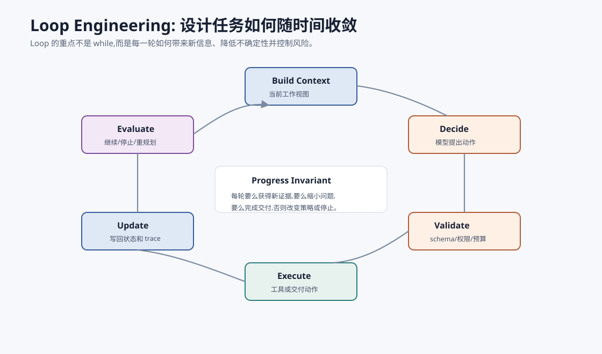
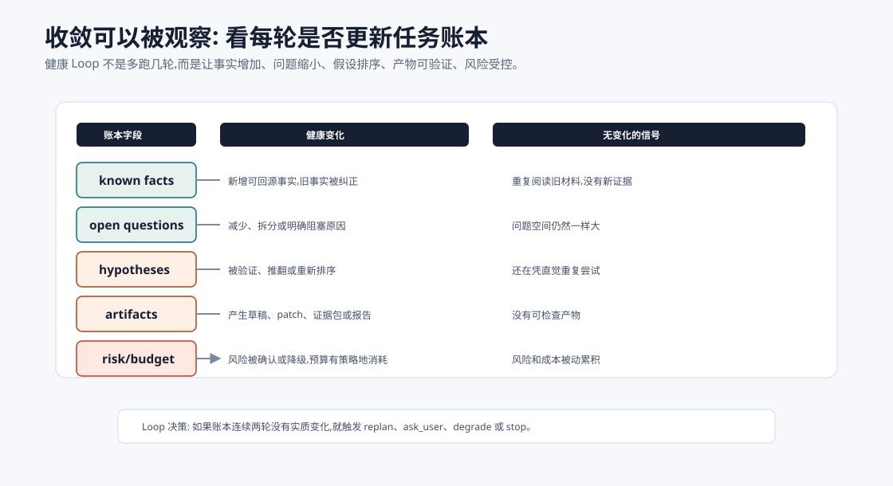
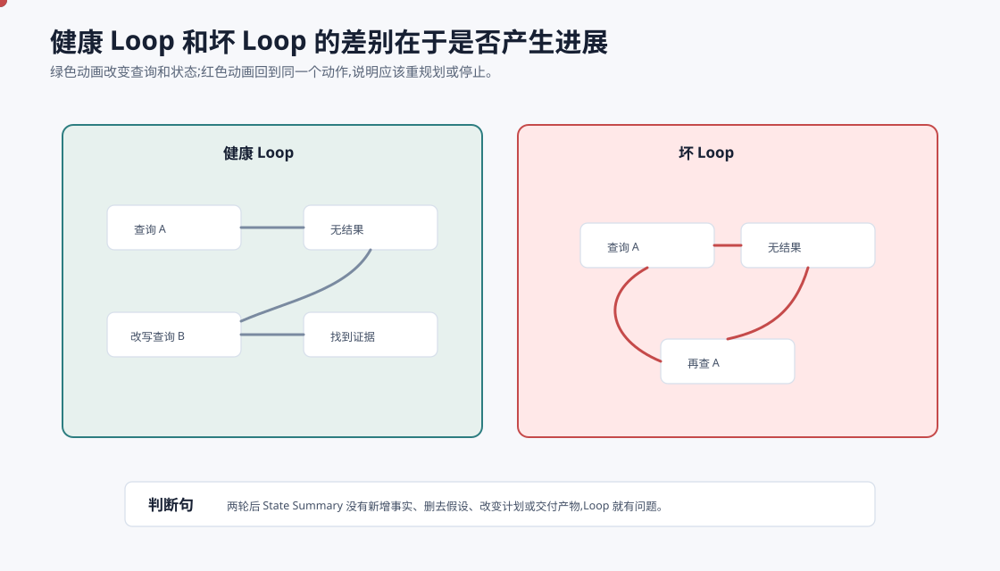
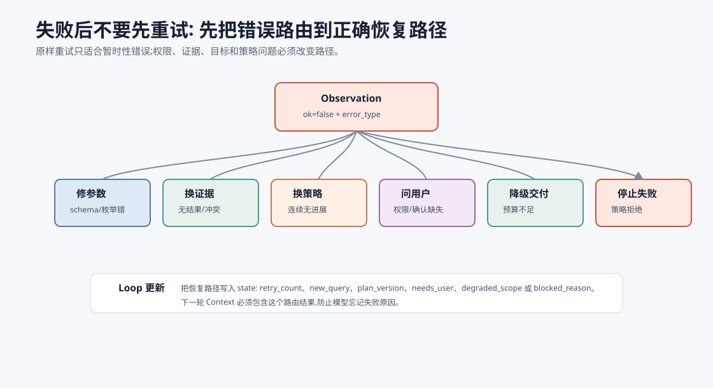
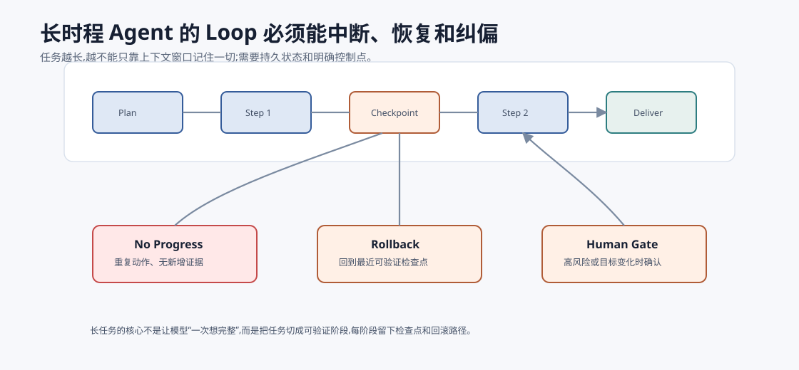
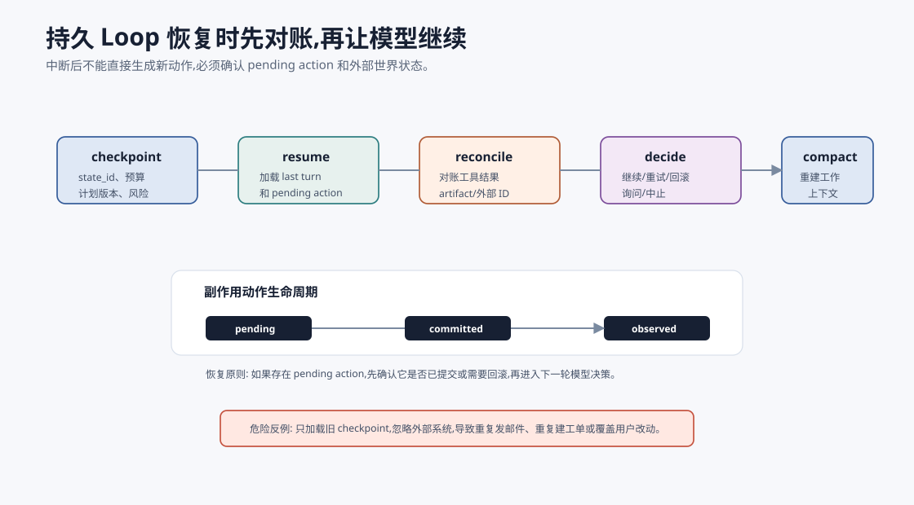
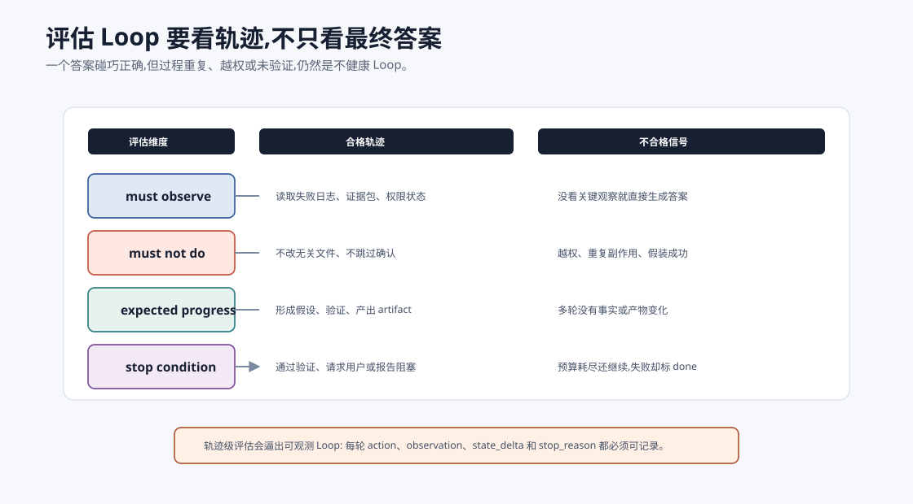

# Loop Engineering:让 Agent 多轮任务真正收敛 `[主线]` ★

第 1 章已经讲过 Agent Loop 的基本形状:观察、决策、行动、更新。那是“循环是什么”。

本章讲的是更工程化的问题:

> 一个循环怎样才能稳定推进任务,而不是越跑越乱、越跑越贵、越跑越危险?

这就是 Loop Engineering。

公开语境里,Loop Engineering 常被用来描述一个正在上升的范式:开发者不再只是一轮一轮手写 prompt,而是设计能反复提示、调度、验证和修正 Agent 的循环。它不是“while 循环”这个语法结构,而是围绕目标、状态、动作、反馈、停止和恢复设计一套可持续运行的控制系统。

如果说 Prompt Engineering 是把“一次模型调用”写清楚,Loop Engineering 就是把“多轮模型调用如何不断接近目标”设计清楚。

很多 Agent 看起来失败在模型能力,其实失败在 Loop:

- 反复搜索同一个关键词。
- 工具失败后继续假装成功。
- 计划已经过期却不重规划。
- 目标做着做着漂移。
- 预算耗尽前没有降级策略。
- 用户确认还没回来就继续执行。
- 长任务中断后无法恢复。

这些问题不是“再加一句 Prompt”能解决的。它们需要系统性 Loop 设计。



本章会讲:

- Loop Engineering 和普通 Agent Loop 的区别。
- 什么是进展不变量。
- 状态机、预算、停止条件、重规划如何配合。
- 长时程任务为什么需要检查点和回滚。
- 如何评价一个 Loop 是否健康。

## Loop Engineering 不是写 while 循环

最小 Agent 可以写成:

```python
while not done:
    decision = model(state)
    observation = execute(decision)
    state = update(state, observation)
```

这只是循环骨架。生产级 Loop 还要回答:

- 每轮是否真的带来了新信息?
- 当前动作是否和目标相关?
- 什么时候应该停止?
- 什么情况下应该重试?
- 什么情况下应该换策略?
- 什么情况下应该请求用户?
- 什么情况下应该回滚?
- 状态是否可恢复?
- 成本是否可控?
- 风险是否随轮数上升?

Loop Engineering 的核心,是让多轮任务**有方向、有边界、有收敛机制**。

## 收敛不是玄学

一个 Loop 是否健康,不能只看“模型有没有继续努力”。真正的收敛,是任务状态里的不确定性在减少。

可以把每轮看成对一个状态账本的更新:



| 账本字段 | 每轮应该怎样变化 | 没变化意味着什么 |
| --- | --- | --- |
| `known_facts` | 增加经过工具或证据验证的事实 | 只是重复阅读旧材料 |
| `open_questions` | 减少、拆分或明确阻塞原因 | 问题空间没有缩小 |
| `hypotheses` | 被验证、推翻或排序 | 还在凭直觉乱试 |
| `artifacts` | 产生草稿、patch、证据包或报告 | 没有可检验产物 |
| `risk_state` | 被确认、降级或交还用户 | 风险在暗中累积 |
| `budget` | 被有意识地消耗或降级 | 成本只是被动流失 |

所以 Loop Engineering 的目标不是“让模型想更久”,而是让每一轮都能回答三个问题:

1. 这一轮让我们比上一轮多知道了什么?
2. 哪些可能性被排除了,哪些风险被确认了?
3. 下一轮为什么不是重复上一轮?

如果回答不上来,这轮就不该无条件继续。它应该触发重规划、换工具、请求用户、降级输出或停止。

## 进展不变量

最重要的原则是:

> 每一轮要么获得新证据,要么缩小问题空间,要么产生可验证产物,否则必须改变策略或停止。

这就是进展不变量。



举个搜索例子。

坏 Loop:

```text
搜索: "agent memory"
结果不相关
搜索: "agent memory"
结果不相关
搜索: "agent memory"
结果不相关
```

健康 Loop:

```text
搜索: "agent memory"
结果太泛
改写: "long-term memory governance agent source confidence"
找到候选
重排并筛选
证据仍不足
切换数据源或向用户说明缺口
```

差别不是第二个模型更聪明,而是 Loop 要求每轮改变状态或策略。

## State Summary 必须可比较

要检测进展,状态摘要必须能比较。

如果 State 只是不断增长的聊天记录,你很难判断是否有进展。

一个可比较的 State Summary 可以包含:

```json
{
  "goal": "修复 UserService 测试失败",
  "current_hypothesis": "active 默认值没有被设置",
  "known_facts": [
    "测试 creates active user by default 失败",
    "actual active 是 undefined",
    "src/user-service.ts:18 创建 user 对象"
  ],
  "ruled_out": [
    "测试数据缺失"
  ],
  "next_step": "检查 User 构造逻辑",
  "progress_marker": "new_fact_added"
}
```

下一轮后,系统可以比较:

- `known_facts` 是否增加?
- `ruled_out` 是否增加?
- `current_hypothesis` 是否更新?
- `artifact` 是否产生?
- `next_step` 是否改变?

如果都没有变化,Loop 可能在空转。

这里有一个关键细节:State Summary 应该由 reducer 更新,而不是让模型自由改写。模型可以提出“我认为当前假设是 X”,但系统要根据 Observation 判断哪些内容能进入 `known_facts`,哪些只能进入 `hypotheses`,哪些应该进入 `open_questions`。

例如工具返回 `ok=false` 时,reducer 不应该允许状态变成 `done`;引用校验失败时,reducer 不应该允许报告进入 `verified`;用户确认未返回时,reducer 不应该允许高风险动作进入 `committed`。这就是 Loop 和 Harness 的连接点:Harness 给出可信 Observation,Loop 的 reducer 决定它如何改变状态。

一个状态字段如果不能被比较、不能被追踪来源、不能被回滚,就不适合承担 Loop 控制职责。它可以放进聊天历史,但不应成为“是否继续”的依据。

## 停止条件要显式

没有停止条件的 Loop 会无限消耗资源。

停止条件不只是一句“任务完成”。常见停止条件包括:

| 停止条件 | 含义 | 输出 |
| --- | --- | --- |
| `done` | 目标完成且可验证 | 最终答案或产物 |
| `needs_user` | 缺少用户输入或确认 | 明确问题/确认项 |
| `blocked` | 缺少权限、数据源或工具 | 阻塞原因和可选方案 |
| `budget_exhausted` | 轮数、时间、token、成本耗尽 | 当前进展和建议下一步 |
| `no_progress` | 多轮没有新增信息 | 停止或重规划 |
| `risk_escalated` | 下一步风险超过当前授权 | 请求确认或降级 |
| `tool_unavailable` | 关键工具不可用 | 降级方案 |

停止不是失败。可靠 Agent 应该能优雅地说:

```text
我已经完成了 A 和 B,但 C 缺少权限。当前无法继续自动推进。你可以授权访问 X,或让我基于现有证据输出一个带缺口说明的版本。
```

这比无限尝试更专业。

## 重试不是默认答案

工具失败后,很多系统直接重试。重试有时有用,但不能成为默认反射。

| 错误类型 | 是否适合重试 | 更好的策略 |
| --- | --- | --- |
| 网络超时 | 适合有限重试 | 指数退避,最多 N 次 |
| 参数错误 | 不适合原样重试 | 修正参数 |
| 权限不足 | 不适合重试 | 请求授权或停止 |
| 资源不存在 | 不适合原样重试 | 改查询或确认输入 |
| 测试失败 | 不叫重试 | 读取失败信息,更新假设 |
| 策略拒绝 | 不适合重试 | 改动作或交还用户 |

Loop Engineering 要把错误类型纳入状态,而不是把所有失败都交给模型自由解释。

更实用的做法是建立错误路由表。Loop 不直接问“要不要再试一次”,而是先把错误分到不同恢复路径。



| 错误路径 | 触发条件 | Loop 动作 |
| --- | --- | --- |
| 修参数 | schema 错、字段缺失、枚举错误 | 让模型基于错误信息重写 action |
| 换证据 | 检索无结果、证据过旧、来源冲突 | 改写查询、换数据源、标注缺口 |
| 换策略 | 连续无进展、假设被推翻 | 重规划,改变工具或任务分解 |
| 请求用户 | 权限不足、目标不清、确认缺失 | 进入 `needs_user`,停止自动推进 |
| 降级交付 | 预算不足、非关键工具不可用 | 输出带限制说明的结果 |
| 停止失败 | 策略拒绝、不可恢复副作用失败 | 进入 `blocked` 或 `failed` |

这个表的价值是避免“反射式重试”。重试只适合暂时性错误。对于权限、策略、目标、证据和业务规则问题,原样重试是在消耗预算,不是在推进任务。

## 计划会过期

Planning 章节讲过计划。Loop Engineering 要补一句重要的话:

**计划不是命令,计划是可更新的假设。**

一个 Agent 初始计划可能是:

```text
1. 搜索资料
2. 提取证据
3. 写报告
4. 校验引用
```

如果搜索发现资料源质量很差,原计划就应该改变:

```text
1. 改用官方文档和论文
2. 降低博客权重
3. 增加证据可信度分级
4. 输出缺口说明
```

Loop 要支持重规划触发器:

- 连续 N 轮无进展。
- 新证据推翻核心假设。
- 预算剩余不足。
- 风险等级变化。
- 用户目标变化。
- 工具不可用。

## Loop 和状态机

生产 Loop 最好显式状态机化。

一个研究助手可以有这些状态:

```text
planning -> retrieving -> synthesizing -> verifying -> done
retrieving -> needs_user
verifying -> revising -> verifying
any -> blocked
any -> failed
```

状态机的价值在于限制动作空间。

| 状态 | 允许动作 | 不应允许 |
| --- | --- | --- |
| `planning` | 分解任务、提出检索策略 | 直接生成最终报告 |
| `retrieving` | 搜索、读取资料、构建证据包 | 编造引用 |
| `synthesizing` | 基于证据生成草稿 | 调用高风险写工具 |
| `verifying` | 校验引用、检查缺口 | 忽略校验失败直接 done |
| `needs_user` | 等待输入 | 自动推进依赖确认的动作 |
| `done` | 返回结果 | 继续调用工具 |

没有状态机,模型可能在任何时刻做任何事。状态机不是让 Agent 变死板,而是让它在正确阶段做正确动作。

## 长时程 Loop:检查点和回滚

长任务最怕“一路跑到最后才发现前面错了”。

所以长时程 Loop 需要检查点。



检查点可以保存:

- 当前 goal 和 constraints。
- 计划版本。
- 已验证事实。
- 已生成 artifact。
- 工具调用结果引用。
- 已消耗预算。
- 当前风险状态。

检查点的作用有三个。

第一,恢复。系统中断后可以继续,不用重新读全部上下文。

第二,回滚。发现后续策略错了,可以回到最近可靠状态。

第三,审计。你可以解释任务为什么走到当前状态。

长任务没有检查点,就像没有保存点的长流程自动化。

## 持久执行和恢复协议

长时程 Agent 还需要回答一个更工程化的问题:进程重启、网络断开、用户隔天回来、工具半路超时之后,Loop 如何继续?



最小恢复协议可以拆成五步:

| 步骤 | 作用 | 关键字段 |
| --- | --- | --- |
| checkpoint | 保存可恢复状态 | `state_id`、`plan_version`、`budget`、`risk_state` |
| resume | 重新加载任务 | `last_committed_turn`、`pending_action` |
| reconcile | 对账外部世界 | 工具结果、artifact 哈希、外部系统 ID |
| decide | 判断继续路径 | continue、retry、rollback、ask_user、abort |
| compact | 重建工作上下文 | 最新 goal、事实、缺口、下一步 |

这里最容易漏掉的是 `reconcile`。系统不能只从自己的 checkpoint 继续,还要检查外部世界到底发生了什么。例如邮件是否真的发出,PR 是否已经创建,测试命令是否完成,文件是否被用户手动改过。否则恢复后的 Loop 可能重复副作用,或基于过期状态继续。

持久 Loop 的原则是:每个有副作用的动作都要有 `pending -> committed -> observed` 的生命周期。系统中断时,恢复逻辑先处理 pending action,而不是立刻让模型生成新动作。

## 预算是 Loop 的一等变量

预算不只是“防止花太多钱”。预算会影响策略选择。

例如剩余预算充足时:

- 可以多源检索。
- 可以运行完整测试。
- 可以让 Critic 审查。

剩余预算不足时:

- 应缩小范围。
- 优先验证关键假设。
- 输出带缺口说明的结果。
- 请求用户增加预算或选择取舍。

Loop 中应该把预算放入状态:

```json
{
  "budget": {
    "turns_left": 3,
    "tool_calls_left": 5,
    "max_latency_seconds": 60,
    "cost_usd_left": 0.20
  }
}
```

模型看到预算,才能做出更现实的下一步建议。Harness 看到预算,才能拒绝超额动作。

## 目标漂移检测

多轮任务里,模型很容易从原始目标漂移到相邻但不同的任务。

例如用户要求:

```text
比较两个 RAG 框架是否适合我们公司的权限场景。
```

Agent 最后写成了:

```text
RAG 技术发展综述。
```

这就是目标漂移。

防止目标漂移的方法:

- State 中始终保留原始 goal。
- 每轮 context 都包含当前阶段目标。
- 计划步骤要和 goal 对齐。
- 产物生成前做 goal alignment check。
- Critic 检查“是否回答了用户真正问题”。

这不是 Prompt 细节,而是 Loop 的状态设计。

## 无进展检测

无进展检测可以很简单:

```python
def has_progress(prev, curr):
    return any([
        curr.known_facts != prev.known_facts,
        curr.ruled_out != prev.ruled_out,
        curr.artifacts != prev.artifacts,
        curr.plan_version != prev.plan_version,
        curr.status != prev.status,
    ])
```

如果连续两轮无进展,系统可以触发:

- 改写查询。
- 换工具。
- 请求用户澄清。
- 降级输出。
- 停止并说明阻塞。

重点不是算法复杂,而是系统必须把“没进展”当成可观测事件。

## Loop 的最小伪代码

下面是一个更生产化的 Loop 形状:

```python
def run_loop(task):
    state = init_state(task)
    checkpoint(state)

    while True:
        if should_stop(state):
            return final_report(state)

        context = build_context(state)
        action = model_decide(context)
        observation = harness_handle(action, state)

        prev = state.summary()
        state = update_state(state, action, observation)
        curr = state.summary()

        if not has_progress(prev, curr):
            state.no_progress_count += 1
        else:
            state.no_progress_count = 0

        if state.no_progress_count >= 2:
            state = replan_or_stop(state)

        if should_checkpoint(state):
            checkpoint(state)
```

这段伪代码比最小 while 循环多了几件事:

- 显式 stop。
- 显式 context builder。
- Harness 处理动作。
- 比较前后状态。
- 无进展触发重规划或停止。
- 检查点持久化。

这就是 Loop Engineering 的核心。

## Loop 和 Evaluation

Loop 的质量不能只看最终答案。

还要看过程指标:

| 指标 | 说明 |
| --- | --- |
| 平均轮数 | 完成任务需要多少轮 |
| 无进展轮比例 | 多少轮没有状态变化 |
| 重复动作比例 | 是否反复做同一件事 |
| 重规划触发率 | 是否能在失败后改变策略 |
| 停止正确率 | 是否该停时停,该继续时继续 |
| 工具失败恢复率 | 工具失败后是否恢复 |
| 预算遵守率 | 是否超时、超 token、超成本 |
| 目标漂移率 | 最终产物是否偏离目标 |
| 人类介入准确率 | 请求用户的时机是否合理 |

如果一个 Agent 最终偶尔答对,但用了 30 轮、重复 12 次搜索、忽略 3 次工具失败,这个 Loop 仍然不健康。

## 轨迹级评估集

Loop 的评估样本不应该只有输入和最终答案,还应该包含期望轨迹特征。



例如一个代码修复任务,评估集可以写成:

```json
{
  "task": "修复 UserService 默认 active 测试失败",
  "must_observe": ["test_failure", "source_file_read"],
  "must_not_do": ["edit_unrelated_files", "claim_success_without_tests"],
  "expected_progress": [
    "form_hypothesis",
    "apply_minimal_patch",
    "run_targeted_test"
  ],
  "stop_condition": "tests_pass_or_report_blocker"
}
```

这种评估比只看最终 diff 更能发现 Loop 问题。一个 Agent 可能最终碰巧改对,但如果它没有读取失败日志、没有运行测试、改了无关文件,这个轨迹仍然不合格。反过来,一个 Agent 最终因为权限不足没有完成,但它正确识别阻塞、保留证据、停止并请求授权,这个 Loop 可能是合格的。

轨迹级评估至少覆盖四类样本:

| 样本类型 | 检查重点 |
| --- | --- |
| 正常完成 | 是否用最少必要轮数完成并验证 |
| 工具失败 | 是否根据错误类型恢复或降级 |
| 证据不足 | 是否补搜、标注缺口,而不是编造 |
| 高风险动作 | 是否停在 preview/confirm,而不是自动 commit |

这类评估会逼着 Loop 变得可观测。你不能只说“模型会自己判断”,必须把每轮状态、动作、Observation 和停止原因记录下来。

## Loop 的设计模式

### 固定阶段 Loop

适合流程明确的任务:

```text
plan -> retrieve -> draft -> verify -> revise -> final
```

优点是容易评估和调试。

缺点是不适合高度开放探索。

### 探索-收敛 Loop

适合调研、排错、代码修复:

```text
explore -> form hypothesis -> test -> narrow -> fix -> verify
```

关键是每轮要缩小问题空间。

### Evaluator-Optimizer Loop

适合输出可评审的任务:

```text
generate -> evaluate -> improve -> evaluate -> final
```

关键是 Evaluator 要有明确 rubric,不能只是“再想想”。

### Human-in-the-loop Loop

适合高风险或低可评估任务:

```text
prepare -> preview -> ask confirmation -> commit
```

关键是用户确认点必须由 runtime 执行,不能靠模型自觉。

## 常见误解

### 误解一:Loop 越长越智能

不一定。Loop 越长,成本、延迟和错误积累越高。健康 Loop 追求收敛,不是追求轮数。

### 误解二:失败后多试几次就好

不对。原样重试只能解决暂时性错误。参数错、权限错、证据错、目标漂移都需要改变策略。

### 误解三:只要最终答案对,中间过程无所谓

生产系统不行。中间过程决定成本、安全、可审计性和可复现性。

### 误解四:长上下文能替代 Loop 状态

不能。长上下文可以容纳更多材料,但不能自动提供检查点、状态机、权限、预算和无进展检测。

### 误解五:Loop 问题靠更强模型就能解决

更强模型有帮助,但不会替你设计停止条件、预算、回滚和审计。系统动力学仍然要工程化。

## 本章小结

Loop Engineering 关注 Agent 如何在多轮任务中稳定推进并收敛。它不是写一个 while 循环,而是设计状态摘要、进展不变量、停止条件、错误策略、重规划、检查点、预算、目标漂移检测和过程评估。Harness 保证单步动作可控,Loop 保证多步任务不空转、不漂移、不无限消耗。一个成熟 Agent 的智能,不只体现在每次模型回答,更体现在它能根据反馈持续缩小问题空间并知道何时停止。

到这里,Part 2 的核心机制更完整了:从模型调用到工具,从 Prompt/Context 到 Harness/Loop,再到 Workflow 和自主 Agent 选型。下一篇 Part 3 会进入能力构建:记忆、RAG、工具使用进阶、自我修正和上下文工程。
