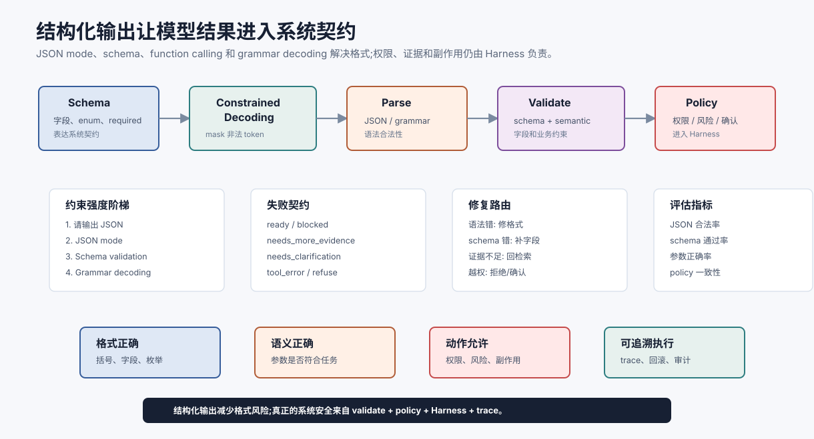

# 结构化输出与约束解码 `[主线]` ★

Agent 不是只要“说得像对”就行。它经常需要输出 JSON、调用工具、生成数据库查询、写配置、更新状态或返回可评估的证据包。此时自然语言的自由度反而会变成风险。

结构化输出要解决的问题是:

**如何让模型的输出变成可解析、可校验、可执行、可恢复的系统对象。**



本章会区分几个容易混在一起的概念:JSON 提示、JSON mode、schema validation、function calling、grammar constrained decoding 和运行时修复。它们都能提高稳定性,但边界不同。

## 为什么结构化输出重要

普通问答里,模型输出一段文字就够了。Agent 系统里,输出经常是下游逻辑的输入。

例如一次工具调用需要:

```json
{
  "tool": "search_docs",
  "arguments": {
    "query": "香港团队差旅审批政策",
    "top_k": 8
  }
}
```

如果模型多写一句“好的,我来搜索”,或者把 `top_k` 写成字符串,或者漏掉 `query`,下游执行器就必须处理错误。没有结构化输出,Agent Loop 会在解析失败、参数错误和隐式意图里消耗大量预算。

## 从弱到强的约束层级

结构化输出不是单一技术,而是一组约束层级。

| 层级 | 做法 | 能保证什么 | 不能保证什么 |
| --- | --- | --- | --- |
| 自然语言提示 | “请输出 JSON” | 有时改善格式 | 不能保证合法 JSON |
| 示例约束 | 给 few-shot 样例 | 改善字段习惯 | 长尾仍可能漂移 |
| JSON mode | 平台限制输出为 JSON | 语法更稳 | 不一定符合业务 schema |
| Schema validation | 生成后校验字段 | 能发现错误 | 发现不等于自动正确 |
| Function calling | 模型按工具 schema 表达动作 | 工具参数更稳定 | 权限和副作用仍靠 Harness |
| Grammar constrained decoding | 解码时屏蔽非法 token | 可强约束语法 | 语义正确仍需验证 |

越靠下约束越强,但系统也越需要明确 schema、错误协议和恢复策略。

## Schema 是契约,不是装饰

一个好的 schema 应该表达下游真正需要的约束,而不是把所有字段都写成自由文本。

坏例子:

```json
{
  "action": "string",
  "data": "string"
}
```

好一些的例子:

```json
{
  "action": "search_docs",
  "query": "香港团队差旅审批政策",
  "source_scope": "internal_policy",
  "top_k": 8,
  "risk_level": "read_only"
}
```

schema 设计要尽量使用:

- enum 表达有限动作集合。
- number/integer 表达数值范围。
- required 字段表达必要信息。
- object/array 表达嵌套结构。
- description 解释业务语义。
- additionalProperties 控制未知字段。

字段越模糊,模型越容易把语义藏进自然语言里。字段越贴近运行时需要,Harness 越容易验证和执行。

## 约束解码做了什么

普通解码时,模型在每一步从词表里选择下一个 token。约束解码会根据 grammar 或 schema 屏蔽当前状态下不合法的 token。

例如正在生成 JSON 对象:

```text
{"action": "search_docs",
```

此时下一个 token 可能只能是字段名、右括号或合法分隔符,不能随便生成 Markdown 标题。约束解码相当于把“语法规则”变成解码时的状态机。

简化流程:

```text
schema/grammar -> parser state -> allowed tokens -> model logits mask -> next token
```

这样可以显著减少括号不闭合、字段名错误、格式多余文本等问题。

## 它不能保证语义正确

约束解码只能约束形式,不能保证事实和业务语义。

下面这个输出语法完全合法,但可能业务上错误:

```json
{
  "action": "send_email",
  "to": "all@company.com",
  "body": "已批准所有报销。"
}
```

是否允许给全员发邮件、是否需要确认、内容是否有证据支持,这些都不是 JSON 语法能决定的。它们属于 Harness、Policy、Evidence Check 和人工确认的职责。

因此要记住:

> 结构化输出让模型表达动作更可靠,但不让动作天然可信。

## Function Calling 和结构化输出的关系

Function Calling 可以看作一种特殊结构化输出:模型不是直接输出最终文本,而是按工具 schema 输出工具名和参数。

但 Function Calling 不是完整 Harness。它通常只回答“模型想调用什么工具,参数是什么”,不负责:

- 用户是否有权限。
- 参数是否来自可信来源。
- 动作是否有副作用。
- 是否需要人工确认。
- 失败后如何恢复。
- 执行结果如何写入状态和 trace。

所以 Part 2 之前讲过 Function Calling,后面又讲 Harness Engineering。二者是上下游关系。

## 输出契约要覆盖失败

很多系统只设计成功输出,没有设计失败输出。结果模型无法回答时,只能编造或输出一段散文。

建议给结构化输出设计明确状态:

```json
{
  "status": "needs_more_evidence",
  "answer": null,
  "missing_evidence": ["旧版政策条款", "香港地区补充规则"],
  "next_action": "retrieve_more"
}
```

常见状态包括:

- `ready`:可回答或可执行。
- `needs_clarification`:需要用户补充。
- `needs_more_evidence`:证据不足。
- `blocked_by_policy`:被权限或安全策略阻止。
- `tool_error`:工具失败,需要恢复。
- `refuse`:应拒绝。

没有失败契约,Agent 会倾向于把不确定性藏在自然语言里。

## 解析、校验和修复循环

生产系统通常要有一个输出处理流水线:

```text
model output -> parse -> schema validate -> semantic validate -> policy check -> execute or repair
```

修复也要分类型。

| 错误 | 修复方式 |
| --- | --- |
| JSON 语法错误 | 用原始输出和 parser error 让模型修格式,或重新生成 |
| schema 缺字段 | 要求补字段,不能猜业务关键字段 |
| enum 非法 | 给出合法 enum 重新选择 |
| 参数越权 | 不修复为“看起来可执行”,而是走拒绝或确认 |
| 证据不足 | 回到检索或请求澄清 |
| 工具返回错误 | 根据错误类型改参数、换工具或停止 |

注意,不是所有错误都应该让模型“修一下”。权限失败、危险动作和证据不足应该改变流程,而不是格式修补。

## 结构化输出对评估的好处

结构化输出能让评估更具体。它可以拆成:

- 字段完整率。
- JSON 合法率。
- schema 合法率。
- enum 准确率。
- 工具参数正确率。
- 引用支持率。
- 拒答状态准确率。
- policy decision 一致性。

这些指标能直接进入回归测试。

## 设计模式

### 决策对象

让模型输出下一步决策,而不是直接执行动作:

```json
{
  "decision": "call_tool",
  "tool_name": "search_docs",
  "arguments": {"query": "..."},
  "reason_for_trace": "缺少当前政策证据"
}
```

### 证据包对象

让模型把 claim 和 evidence ID 对齐:

```json
{
  "claims": [
    {"text": "一等座需事前审批", "evidence_ids": ["S1"]}
  ]
}
```

### 状态差分对象

让模型提出 state diff,由 runtime 决定是否写入:

```json
{
  "state_patch": [
    {"op": "add", "path": "/open_questions/0", "value": "旧政策是否有地区例外"}
  ]
}
```

不要让模型直接拥有数据库写权限。它可以提出结构化 patch,但提交、审计和回滚应由 runtime 负责。

## 常见误解

### 误解一:JSON mode 等于 schema 正确

不等于。JSON mode 主要保证语法更像 JSON,不保证字段符合业务 schema。

### 误解二:有 Function Calling 就不需要 Harness

不对。Function Calling 是动作表达,Harness 是动作执行边界。权限、策略、确认、回滚和 trace 仍然需要 Harness。

### 误解三:约束越强越好

不一定。过强的 schema 会让模型无法表达不确定性或新错误类型。关键是把可枚举的部分约束住,把需要解释的部分留出受控文本字段。

### 误解四:解析失败后直接重试就行

不够。解析失败要带着错误信息修复;语义失败要回到证据、权限或工具;连续失败要停止并暴露原因。

### 误解五:结构化输出会消除幻觉

不会。它能减少格式幻觉,但事实幻觉仍需要 RAG、工具验证、引用校验和评估。

## 本章小结

结构化输出把模型输出变成系统可消费的对象。JSON mode、schema validation、function calling 和 grammar constrained decoding 分别在不同层面提高可靠性。它们能减少格式错误,改善工具调用和评估,但不能替代证据、权限、安全和 Harness。可靠 Agent 应把结构化输出接入 parse、validate、policy、execute、repair 和 trace 的完整流水线。

下一步进入 Part 3 时,你会看到类似思想如何用于 RAG 的 evidence pack、记忆写入和上下文工程。
