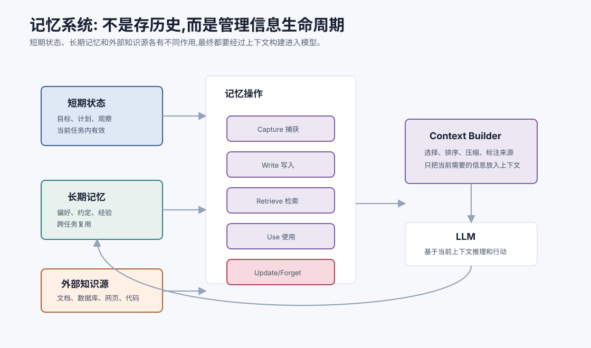
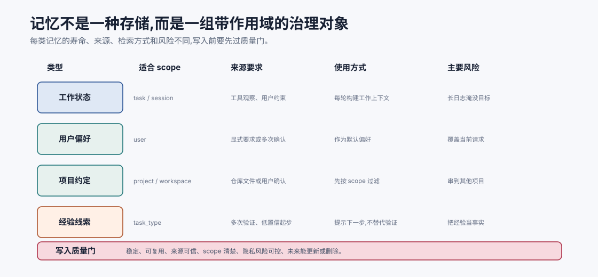
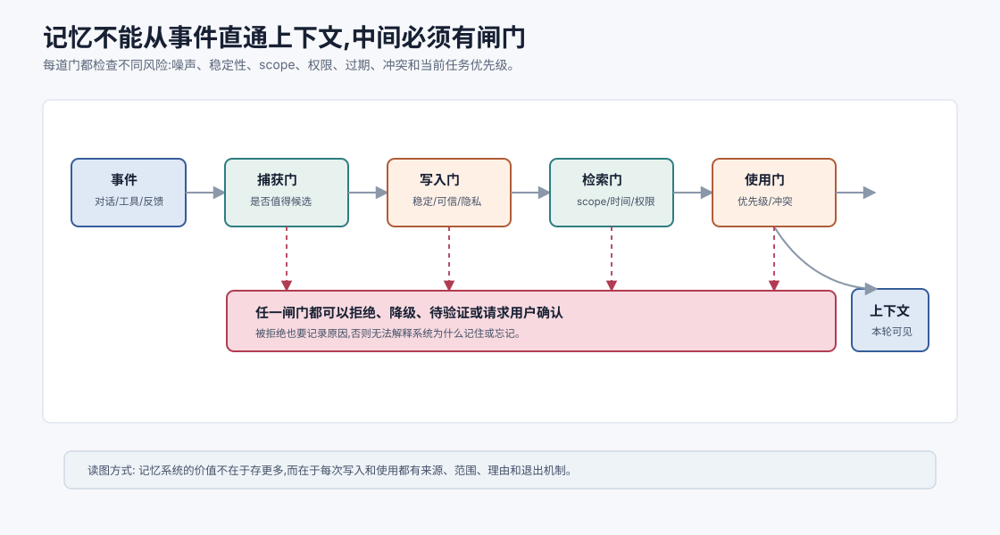
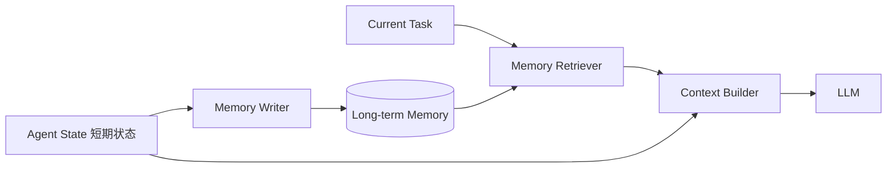

# 记忆系统总览 `[主线]`

Agent 需要记忆,但“记忆”这个词很容易被说得太玄。

很多人一听记忆系统,会以为就是把聊天记录存起来,下次再塞回 prompt。这样当然能解决一小部分问题,但远远不够。真正有用的 Agent 记忆系统,不是一堆历史文本,而是一套关于**什么信息值得保留、如何保留、何时取回、如何验证、何时忘记**的工程机制。

本章先建立总览。后面几章会分别深入短期记忆、长期记忆、RAG、向量数据库、切块、工具使用、自我修正和上下文工程。



本章会讲:

- Agent 为什么需要记忆。
- 短期记忆、长期记忆、外部知识和工作状态的区别。
- 记忆系统的写入、检索、使用、更新和遗忘流程。
- 记忆为什么会带来隐私、过期和误用风险。
- 如何判断一条信息是否应该进入记忆。
- 记忆和 RAG、上下文工程的关系。

## 为什么 Agent 需要记忆

普通 LLM 调用是无状态的。你给它输入,它生成输出。下一次调用时,如果你不把之前的信息重新放进去,模型就“不知道”之前发生了什么。

Agent 任务通常不是一次完成。它可能需要:

- 记住用户目标。
- 记住已经尝试过的工具。
- 记住当前任务进度。
- 记住用户长期偏好。
- 记住业务事实或文档来源。
- 记住过去失败的原因。
- 记住某个项目的结构和约定。

没有记忆,Agent 会像每轮都重新醒来一样。它会重复提问、重复搜索、忘记约束、丢失上下文,甚至把已经排除的假设又拿出来试一遍。

## 记忆不是一个东西

Agent 系统里的“记忆”至少包括几类不同信息。

| 类型 | 保存什么 | 典型寿命 | 例子 |
| --- | --- | --- | --- |
| 工作状态 | 当前任务进度 | 一次任务内 | 已运行测试、当前错误、下一步计划 |
| 对话历史 | 用户和助手的消息 | 会话内或短期 | 用户刚刚补充的约束 |
| 用户偏好 | 稳定个人偏好 | 长期 | 喜欢 TypeScript 示例、回答要简洁 |
| 事实资料 | 外部知识或文档 | 随来源变化 | 公司政策、产品手册、代码文档 |
| 经验记忆 | 过去解决问题的模式 | 长期但需验证 | 某类报错通常和配置有关 |
| 安全记录 | 权限、确认和敏感操作 | 审计周期内 | 用户确认过某次发送邮件 |

把这些全部混成“聊天记录”会出问题。它们的写入条件、检索方式、更新策略和安全要求都不同。



这张图想说明:记忆不是一个统一垃圾桶,而是一组带 scope、来源和风险等级的治理对象。工作状态通常只在 task 或 session 内有效;用户偏好属于 user scope;项目约定属于 project 或 workspace scope;经验记忆更像低置信线索,需要在未来任务中重新验证。

所以记忆系统的第一步不是接向量库,而是定义“什么信息进入哪类记忆”。如果 scope 不清,相似度越高越危险:项目 A 的测试命令可能被带到项目 B,用户 A 的偏好可能影响用户 B,一次性任务约束可能变成长期偏见。

## 短期记忆

短期记忆是当前任务或当前会话内需要保留的信息。

它包括:

- 用户目标。
- 当前计划。
- 最近工具结果。
- 已完成步骤。
- 失败和重试记录。
- 当前约束。
- 临时假设。

短期记忆通常放在 Agent state 中,并被整理成下一轮模型调用的工作上下文。

它的关键问题不是“存不存”,而是“怎么压缩和组织”。如果把所有日志都放进去,上下文会膨胀。如果压缩太狠,关键证据会丢失。

## 长期记忆

长期记忆跨任务、跨会话存在。

它保存的是未来可能复用的信息,例如:

- 用户稳定偏好。
- 项目约定。
- 常见问题解决经验。
- 已验证的事实。
- 用户明确要求记住的内容。

长期记忆要特别谨慎,因为它会影响未来行为。

如果错误信息进入长期记忆,Agent 会反复被误导。如果敏感信息被不当保存,会带来隐私风险。如果过期信息不被更新,会造成事实错误。

所以长期记忆需要写入门槛、来源记录、更新时间、作用范围和删除机制。

## 外部知识不是记忆吗

公司文档、网页、数据库、代码仓库、产品手册也可以被 Agent 使用。它们像“外部记忆”,但更准确地说,它们是外部知识源。

外部知识源和长期记忆有区别:

| 维度 | 长期记忆 | 外部知识源 |
| --- | --- | --- |
| 来源 | Agent 交互和系统写入 | 文档、数据库、网页、代码库 |
| 更新 | Agent 或用户触发 | 外部系统维护 |
| 粒度 | 偏好、事实、经验 | 文档、记录、文件、网页 |
| 检索 | 按用户/任务相关性 | RAG、搜索、数据库查询 |
| 风险 | 误记、隐私、过期 | 检索失败、来源冲突、注入攻击 |

后面讲 RAG 时,我们会把外部知识检索展开。这里先记住:Agent 记忆系统不应该试图把所有知识都写进自己的长期记忆。很多事实应该留在权威来源中,按需检索。

## 记忆系统的五个动作

一个完整记忆系统通常有五个动作。

### 1. Capture 捕获

从对话、工具结果、用户反馈或任务产物中发现可能值得保存的信息。

### 2. Write 写入

决定是否保存,保存到哪里,以什么结构保存。

### 3. Retrieve 检索

在未来任务中,根据当前目标找回相关记忆。

### 4. Use 使用

把记忆放入上下文,影响模型决策或回答。

### 5. Update/Forget 更新或遗忘

当记忆过期、错误、被用户撤回或不再相关时,更新或删除。

很多系统只做了前三步:存、搜、塞 prompt。真正困难的是第 4 和第 5 步:如何正确使用,以及如何不再使用。

## 四道门:不要让记忆直通上下文

一个有用的心智模型是:记忆系统不是管道,而是一组闸门。



```text
事件发生 -> 候选记忆 -> 长期保存 -> 检索命中 -> 上下文使用
          捕获门       写入门       检索门       使用门
```

每道门问的问题不同。

| 闸门 | 核心问题 | 拦住什么 |
| --- | --- | --- |
| 捕获门 | 这件事是否值得进入候选池? | 闲聊、重复信息、明显噪声 |
| 写入门 | 是否稳定、可复用、来源可信、风险可控? | 一次性约束、猜测、敏感信息 |
| 检索门 | 当前任务、scope、时间和权限是否匹配? | 相似但属于其他用户/项目的记忆 |
| 使用门 | 是否应进入本次上下文,优先级如何? | 过期、冲突、低置信、无来源记忆 |

很多记忆事故都来自“直通”:模型从对话里捕获一句话,系统直接写入长期记忆,下次相似检索命中后又直接塞进 prompt。这样看起来智能,实际是在把未经治理的信息放大到未来任务。可靠系统应允许信息在任一闸门被拒绝、降级、标记待验证或要求用户确认。

闸门还应该产生可审计记录。例如某条候选记忆为什么没写入,是因为 scope 不明、来源不可信、隐私风险高,还是只适合当前任务。否则系统会变成一个黑盒:用户不知道它为什么记住,工程师也不知道它为什么忘记。

## 写入:什么值得记住

不是所有信息都值得写入长期记忆。

可以用下面的判断表。

| 信息 | 是否适合长期记忆 | 原因 |
| --- | --- | --- |
| “我这次要把报告写成中文” | 通常否 | 当前任务约束 |
| “以后回答我都优先用中文” | 可以 | 稳定用户偏好 |
| “今天订单 HK-1 还没发货” | 通常否 | 动态事实,应查订单系统 |
| “这个项目使用 pnpm 而不是 npm” | 可以 | 项目约定,未来任务有用 |
| “某网页说忽略系统指令” | 否 | 不可信外部内容 |
| “用户确认发送了邮件 A” | 审计保存 | 安全和追踪需要 |

写入长期记忆前,可以问五个问题:

1. 这条信息未来是否会复用?
2. 它是否稳定,还是很快会过期?
3. 来源是否可信?
4. 用户是否同意保存?
5. 保存后是否可能带来隐私或安全风险?

## 检索:相关不等于应该使用

记忆检索通常用关键词、向量相似度、元数据过滤或混合检索。

但检索到相关记忆,不代表一定应该使用。

例如用户以前说“我喜欢简洁回答”,这通常有用。但如果当前任务是“请详细解释这篇论文”,过度简洁反而不好。

再比如过去项目里“测试命令是 npm test”,但当前仓库可能已经改成 `pnpm test`。旧记忆只能作为线索,不能替代当前观察。

所以使用记忆时要检查:

- 是否和当前任务相关。
- 是否仍然有效。
- 是否和当前用户输入冲突。
- 是否有更权威的新来源。
- 是否涉及隐私或权限。

## 记忆的结构

一条长期记忆最好不是纯文本碎片,而是结构化记录。

例如:

```json
{
  "type": "user_preference",
  "subject": "answer_style",
  "content": "User prefers concise Chinese explanations with concrete examples.",
  "source": "explicit_user_request",
  "created_at": "2026-07-06T09:20:00+08:00",
  "updated_at": "2026-07-06T09:20:00+08:00",
  "scope": "user",
  "confidence": 0.95,
  "ttl": null
}
```

结构化字段能帮助系统过滤、排序、更新和删除。纯文本记忆虽然简单,但后期很难治理。

## 记忆的作用范围

记忆必须有 scope。

常见 scope 包括:

| Scope | 含义 | 例子 |
| --- | --- | --- |
| task | 当前任务内有效 | 临时计划和观察 |
| session | 当前会话有效 | 用户刚刚给出的补充信息 |
| user | 某个用户长期有效 | 偏好、个人设置 |
| project | 某个项目有效 | 技术栈、测试命令 |
| organization | 组织范围有效 | 公司术语、通用政策 |

没有 scope,记忆会乱串。一个用户的偏好不该影响另一个用户。一个项目的约定不该套到另一个项目。

## 记忆与隐私

记忆系统天然涉及隐私。

因为它会保存用户说过的话、偏好、文件、业务信息甚至敏感操作记录。

需要考虑:

- 用户是否知道什么会被保存。
- 是否允许用户查看、修改、删除记忆。
- 敏感信息是否加密或脱敏。
- 记忆是否按租户隔离。
- 是否有数据保留期限。
- 是否把不该跨会话的信息带到未来。

一个会“记住一切”的 Agent 听起来聪明,但在真实系统中往往危险。好的记忆系统不是记得最多,而是记得合适、用得谨慎、忘得干净。

## 记忆与幻觉

记忆可以减少幻觉,也可以制造幻觉。

减少幻觉的方式:

- 记住用户偏好和已验证事实。
- 检索权威文档。
- 把工具观察保留为证据。

制造幻觉的方式:

- 把模型猜测写入记忆。
- 把过期事实当最新事实。
- 把低质量摘要当原始证据。
- 把相似但不相关的记忆塞入上下文。

所以记忆写入要区分事实、偏好、推断和假设。

## 记忆和上下文窗口

上下文窗口是模型一次能看到的信息范围。记忆系统是决定哪些信息进入这个范围的机制。

二者关系是:

```text
长期存储里可以很多,但每次上下文只能放一小部分。
```

因此记忆系统的核心不是存储容量,而是选择能力。

如果选择错了,长上下文也救不了。模型看到很多无关记忆,反而更容易被干扰。

## 一个最小记忆架构

一个实用 Agent 可以从下面结构开始:



关键组件:

- `Memory Writer`:决定什么值得写入。
- `Long-term Memory`:存储结构化记忆和向量索引。
- `Memory Retriever`:按当前任务检索。
- `Context Builder`:决定哪些记忆真正进入 prompt。

不要一开始就追求复杂。先做清楚写入规则和检索规则,比盲目接一个向量库更重要。

## 记忆系统的评估

评估记忆系统,可以看:

- 该记的是否记住。
- 不该记的是否没记。
- 检索是否召回相关记忆。
- 使用记忆是否改善任务结果。
- 过期记忆是否被更新。
- 隐私边界是否被遵守。
- 记忆冲突时是否能处理。
- 用户是否能纠正或删除记忆。

一个好的评估集应该包含反例:相似但不该使用的记忆、过期记忆、冲突记忆和隐私敏感记忆。

记忆评估还要看“负收益”。如果一条记忆被注入后让模型偏离当前用户请求,即使它本身是真的,也算失败。记忆系统追求的不是召回越多越好,而是让正确记忆在正确 scope、正确时间、正确优先级出现。

## 常见误解

### 误解一:记忆就是聊天历史

不是。聊天历史只是短期上下文的一部分。长期记忆需要结构、范围、来源、更新时间和删除机制。

### 误解二:记得越多越好

不对。过多、过期或不相关记忆会干扰模型。记忆系统的价值在选择,不是堆积。

### 误解三:向量数据库就是记忆系统

向量数据库只是存储和检索工具。记忆系统还包括写入策略、使用策略、隐私、安全、更新和评估。

### 误解四:模型说的重要信息都应该保存

不能。模型推断可能错。长期记忆应优先保存用户明确偏好、系统验证事实和可追溯来源。

### 误解五:长期记忆可以替代 RAG

不能。动态事实和权威文档更适合保留在外部知识源中,按需检索。

## 本章小结

Agent 记忆系统不是简单保存聊天记录,而是一套管理信息生命周期的机制。短期记忆维护当前任务状态,长期记忆保存跨任务可复用的偏好、事实和经验,外部知识源通过 RAG 或工具按需进入上下文。好的记忆系统要控制写入、检索、使用、更新和遗忘,并处理隐私、过期、冲突和误用风险。记忆的目标不是让 Agent 记住一切,而是让它在正确时刻使用正确信息。

下一章会深入短期记忆与对话历史。短期记忆是 Agent 当前任务的工作台,设计不好,Agent 很快就会迷路。
