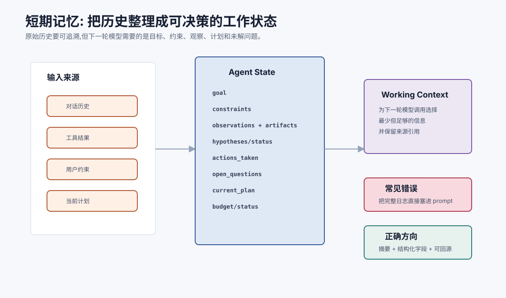
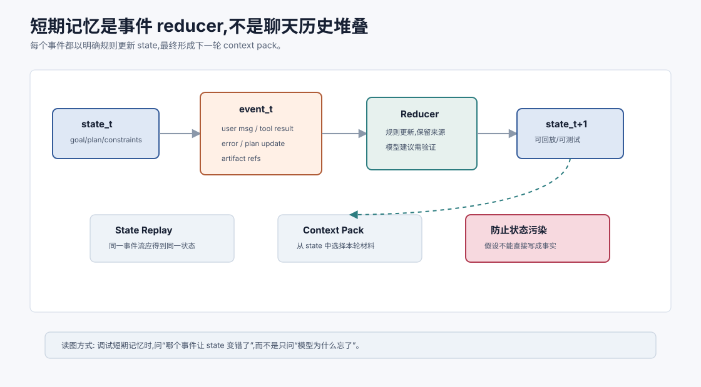

# 短期记忆与对话历史 `[主线]`

短期记忆是 Agent 当前任务的工作台。

它保存的是“此刻完成任务所需的信息”:用户目标、刚刚说过的约束、工具结果、当前计划、已尝试动作、失败原因和下一步候选。

很多 Agent 看起来不稳定,不是因为模型弱,而是短期记忆管理太粗糙。它们把所有消息和工具输出原样堆进上下文,导致 token 成本上升、关键信息被淹没、旧错误继续干扰,最后模型在一堆历史里迷路。



本章会讲:

- 短期记忆和对话历史有什么区别。
- Agent state 应该保存哪些字段。
- 如何把长历史整理成工作上下文。
- 摘要、滑动窗口、结构化状态如何配合。
- 工具结果如何进入短期记忆。
- 短期记忆的常见失败模式和评估方法。

## 短期记忆不是完整聊天记录

对话历史是用户和助手说过的话。短期记忆是当前任务需要使用的状态。

二者有重叠,但不相同。

例如用户说:

```text
先不要改代码,只帮我定位问题。
```

这当然在对话历史中,但更重要的是它应该进入状态里的 `constraints` 字段:

```json
{
  "constraints": ["Do not edit files; diagnose only."]
}
```

如果只是保存在聊天记录里,模型可能在几轮工具调用后忘记它。结构化状态会让约束更稳定地进入下一轮决策。

## 短期记忆的目标

短期记忆有三个目标。

### 1. 保持任务连续性

Agent 要知道已经做过什么、现在在哪里、下一步要干什么。

### 2. 降低上下文噪声

不是所有历史都要进入 prompt。短期记忆要把原始历史整理成当前决策所需的工作视图。

### 3. 支持错误恢复

当工具失败或方向错误时,Agent 要能回看失败原因,避免重复犯错。

## 一个实用 Agent state

短期记忆可以用结构化 state 表示。

```json
{
  "goal": "Diagnose why UserService tests fail",
  "constraints": ["Do not edit files"],
  "current_plan": [
    {"step": "run focused test", "status": "done"},
    {"step": "inspect failing test", "status": "in_progress"}
  ],
  "observations": [
    {
      "id": 7,
      "source": "run_tests",
      "summary": "active expected true, got undefined",
      "artifact": "tool-result://7"
    }
  ],
  "hypotheses": [
    {"text": "createUser does not set active default", "status": "unverified"}
  ],
  "actions_taken": ["run_tests:npm test -- UserService"],
  "open_questions": ["What does createUser return?"],
  "status": "running"
}
```

这个 state 比完整聊天历史更适合决策。

## 把短期记忆看成 reducer

短期记忆不应该靠模型在长历史里“回忆”。更稳的做法是把它看成一个状态机的 reducer:



$$
state_{t+1}=reduce(state_t,event_t)
$$

这里的 $event_t$ 可以是用户新消息、工具观察、测试结果、计划变更或错误返回。每个事件都会以明确规则更新 state,例如:

| 事件 | 更新方式 |
| --- | --- |
| 用户新增约束 | 写入 `constraints`,标记来源 turn |
| 工具成功返回 | 写入 `observations`,更新计划步骤 |
| 工具失败 | 写入错误类型,决定重试、降级或询问 |
| 假设被证伪 | 将 hypothesis 标记为 `rejected` |
| 用户改变目标 | 更新 `goal`,旧目标标记为 superseded |

这个模型的好处是:短期记忆不再是越堆越长的文本,而是可检查、可回放、可测试的任务状态。调试 Agent 时,你可以问:“是哪一个事件把 state 更新错了?”而不是只能抱怨“模型忘了”。

短期 reducer 最好由 runtime 负责,模型只能提出状态更新建议。比如模型可以说“这个假设已被测试否定”,但系统要根据测试事件和 artifact 确认后再把 hypothesis 标成 `rejected`。否则模型会把自己的解释直接写成状态事实。

## 对话历史的三种处理方式

### 1. 原样保留最近窗口

保留最近若干轮消息。

优点是简单,能保留语气和细节。缺点是长任务会超出窗口,并且旧约束可能被裁掉。

适合短对话。

### 2. 滚动摘要

把较早历史压缩成摘要,最近消息原样保留。

```text
历史摘要: 用户要求只定位问题不改代码。已运行测试,失败集中在 UserService active 默认值。
最近消息: ...
```

优点是节省 token。缺点是摘要可能丢细节或引入错误。

### 3. 结构化状态

把目标、约束、观察、计划、假设分字段保存。

优点是稳定、可检查、便于更新。缺点是实现稍复杂。

生产 Agent 通常会混合使用三者:最近对话窗口 + 结构化状态 + 可回源原始日志。

## 摘要不是越短越好

短期记忆摘要的目标不是压到最短,而是保留决策必要信息。

坏摘要:

```text
用户在调试测试,有一些失败。
```

这个摘要几乎没用。

好摘要:

```text
用户要求只定位问题,暂不改代码。已运行 `npm test -- UserService`,失败用例为 `creates active user by default`: 期望 `active=true`,实际 `undefined`。当前假设是 `createUser` 没有设置默认 active 值,但尚未读取实现验证。
```

好摘要保留:

- 用户约束。
- 已执行动作。
- 关键观察。
- 当前假设。
- 未完成验证。

## 摘要的风险

摘要会带来三类风险。

### 1. 遗漏

把关键约束丢掉。比如忘记“不要改代码”。

### 2. 扭曲

把工具结果改写错。比如把 “active 为 undefined” 写成 “active 为 false”。

### 3. 过度概括

把具体错误概括成“测试失败”,导致后续无法定位。

因此摘要最好保留原始来源引用。需要细节时可以回源。

## 工具结果如何进入短期记忆

工具结果通常有三层保存方式。

| 层次 | 内容 | 用途 |
| --- | --- | --- |
| 原始结果 | 完整 stdout、网页、文件内容 | 审计和回源 |
| 结构化提取 | 错误码、路径、关键字段 | 决策和校验 |
| 工作摘要 | 当前任务相关结论 | 放入 prompt |

例如一次测试输出:

```text
原始结果: 保存完整日志 artifact://test-17
结构化提取: failed_file, assertion, stack
工作摘要: active 默认值缺失导致测试失败
```

不要只保存摘要,否则后面无法复查。也不要每次都把完整日志塞进 prompt,否则上下文会被撑爆。

## 当前任务状态应靠近末尾

很多模型对上下文位置敏感。长上下文中,关键信息放在中间容易被忽略。

一个实用布局是:

```text
系统规则
工具说明
长期偏好/项目约定
任务状态摘要
最近关键观察
当前用户消息
要求模型下一步输出
```

当前任务状态和最新用户消息应靠近模型生成位置。早期约束也要在状态摘要中重复,不要只依赖最早的系统消息。

## 短期记忆的更新规则

每轮结束后,短期记忆应该更新:

- 新观察写入 observations。
- 已执行动作写入 actions_taken。
- 当前计划更新 step 状态。
- 被否定的假设标记 rejected。
- 新发现的问题写入 open_questions。
- 如果达成目标,状态设为 done。
- 如果需要用户,状态设为 needs_user。

这比“把工具结果追加到历史”更可靠。

## 避免重复动作

短期记忆应帮助 Agent 避免重复。

可以记录动作签名:

```text
run_tests:npm test -- UserService
read_file:src/user-service.ts
search_code:createUser active
```

如果模型下一步又要做完全相同动作,系统可以提醒:

```text
This action was already performed in observation #7. Use the existing result or explain why rerun is necessary.
```

重复不是绝对错误。有时重跑测试有意义。但 Agent 应该知道自己在重复,并说明原因。

## 短期记忆和多轮澄清

用户经常补充约束:

```text
不要动数据库。
只看最近 7 天。
用中文总结。
先给我方案,不要执行。
```

这些约束必须进入短期状态,而不是只留在对话文本里。

可以用字段:

```json
{
  "constraints": [
    {"text": "Do not modify database", "source_turn": 4},
    {"text": "Provide plan before execution", "source_turn": 6}
  ]
}
```

如果后续用户改变约束,要更新状态而不是简单追加冲突信息。

## 冲突处理

短期记忆可能出现冲突。

例如用户先说“帮我直接改”,后来又说“先不要改”。

系统应该采用明确策略:

- 通常最新用户约束优先。
- 高优先级系统规则永远优先。
- 高风险动作遇到冲突时请求确认。
- 状态中标记旧约束已被覆盖。

不要让模型自己在一堆冲突历史中猜。

## 短期记忆与上下文工程

短期记忆是上下文工程的原材料。Context builder 会从 state 中选择内容放入 prompt。

它应该问:

- 当前决策需要哪些观察?
- 哪些工具结果需要原文,哪些只需摘要?
- 哪些约束必须重复?
- 哪些旧信息已经废弃?
- 是否需要检索长期记忆或文档?

短期记忆管理不好,上下文工程就只能在混乱历史里捡东西。

## 常见失败模式

### 1. 约束丢失

用户说“不要修改文件”,几轮后 Agent 开始编辑。

解决:把约束写入结构化 state,每轮构建上下文时包含。

### 2. 旧错误污染

某个假设已经被工具否定,但仍留在摘要里。

解决:假设要有 status,例如 active/rejected/confirmed。

### 3. 只存摘要不存原文

后续需要检查细节时无法回源。

解决:摘要加 artifact 引用。

### 4. 工具日志淹没目标

把大量 stdout 直接塞入 prompt,模型忘记用户目标。

解决:长结果分层保存,只放关键摘要。

### 5. 每轮从零规划

Agent 不记得已完成步骤,反复重新分析。

解决:维护 current_plan 和 actions_taken。

## 评估短期记忆

可以构造测试任务检查:

- 10 轮后是否仍遵守早期约束。
- 工具失败后是否记得失败原因。
- 用户修改目标后是否更新状态。
- 长日志后是否仍能找回关键错误。
- 重复动作是否减少。
- 最终回答是否能引用关键观察。

短期记忆的质量要用长任务评估。短对话里很多问题暴露不出来。

还可以做 state replay 测试:给定同一串事件,新的 reducer 版本应该产生可预期 state。这样短期记忆就从“prompt 经验”变成了可以回归测试的数据结构。

## 常见误解

### 误解一:上下文窗口够长就不用短期记忆管理

不对。长窗口只让你能放更多内容,不保证模型能用好。结构化状态仍然重要。

### 误解二:摘要越短越好

不一定。摘要要保留决策必要信息和来源引用。过短会丢关键约束。

### 误解三:最近消息最重要

很多时候早期系统约束或用户目标更重要。短期记忆要显式保留它们。

### 误解四:工具结果直接追加到历史即可

不够。工具结果需要结构化提取、摘要、原文引用和状态更新。

### 误解五:短期记忆只是 prompt 技巧

它是 Agent runtime 的状态管理问题,涉及数据结构、更新规则、审计和上下文构建。

## 本章小结

短期记忆是 Agent 当前任务的工作状态,不是完整聊天记录。它应该结构化保存目标、约束、计划、观察、假设、已执行动作和开放问题。对话历史、工具结果和摘要都要经过整理后进入状态。好的短期记忆能保持任务连续性、降低上下文噪声、支持错误恢复和避免重复动作。没有短期记忆管理,Agent 很容易在长任务中迷路。

下一章会讲长期记忆。短期记忆解决“这次任务进行到哪里”,长期记忆解决“哪些跨任务信息值得保留到未来”。
