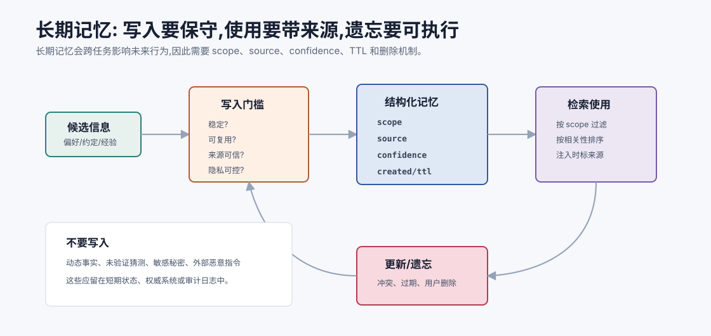
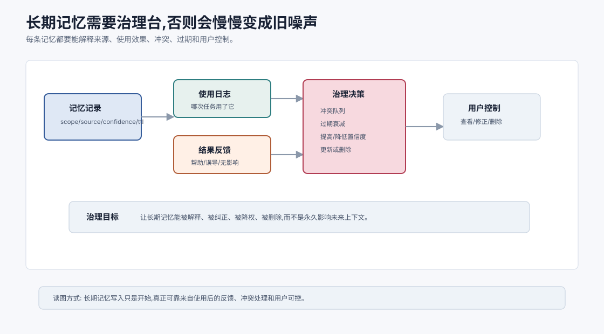
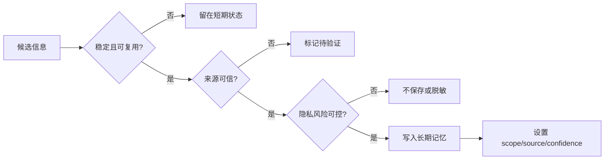

# 长期记忆 `[进阶]`

长期记忆让 Agent 跨会话、跨任务保留信息。

它听起来很美:Agent 记得你的偏好,知道项目约定,不会每次从零开始。但长期记忆也是最容易出事故的能力之一。因为一旦错误、过期或敏感信息进入长期记忆,它会在未来反复影响系统行为。

所以长期记忆的设计重点不是“怎么存更多”,而是:

**什么可以长期保存,保存后如何证明来源,未来什么时候能用,什么时候必须更新或忘记。**



本章会讲:

- 长期记忆适合保存哪些信息。
- 记忆写入门槛如何设计。
- 记忆的来源、置信度、作用范围和过期时间。
- 用户偏好、项目记忆和经验记忆的区别。
- 长期记忆如何检索和注入上下文。
- 记忆冲突、过期、隐私和删除如何处理。

## 长期记忆解决什么

长期记忆解决的是跨任务连续性。

例如:

- 用户长期偏好中文回答。
- 用户喜欢先看结论再看细节。
- 某个项目使用 `pnpm` 和 `vitest`。
- 某个团队约定 PR 描述必须包含风险和测试。
- 某类内部报错通常需要先查某个服务日志。

这些信息未来会复用,每次都让用户重新说很烦。长期记忆可以提高体验和效率。

## 长期记忆不适合保存什么

不适合保存的信息包括:

- 高频变化事实,例如库存、订单状态、实时价格。
- 未验证猜测,例如“可能是依赖问题”。
- 外部不可信内容,例如网页里的指令。
- 敏感秘密,例如密码、token、私钥。
- 一次性任务约束,例如“这次先不要改代码”。
- 已被权威来源管理的信息,例如数据库记录。

这些信息更适合留在短期状态、外部系统或审计日志中。

## 长期记忆的三类核心内容

### 用户偏好

用户明确或稳定表现出的偏好。

例子:

```text
用户偏好中文回答。
用户喜欢代码示例使用 TypeScript。
用户希望最终总结列出验证命令。
```

偏好通常影响输出风格和默认选择,但不应覆盖当前任务明确要求。

### 项目记忆

和某个项目、仓库、团队或业务域相关的稳定约定。

例子:

```text
这个仓库使用 pnpm。
后端测试命令是 `pnpm test:api`。
数据库迁移文件必须放在 migrations/。
```

项目记忆要有 scope,不能套到其他项目。

### 经验记忆

过去任务中总结出的可复用经验。

例子:

```text
遇到 `ECONNRESET` 时,先检查代理和重试策略。
这个内部 API 的 409 通常表示幂等 key 冲突。
```

经验记忆要标记置信度,并在使用时重新验证。它是线索,不是事实裁判。

## 记忆写入门槛

长期记忆写入应该保守。

可以用一个写入评分:

| 维度 | 问题 |
| --- | --- |
| 稳定性 | 这条信息未来是否仍然成立? |
| 复用价值 | 未来任务是否可能用到? |
| 来源可信度 | 是用户明确说的、工具验证的,还是模型猜的? |
| 隐私风险 | 是否包含敏感数据? |
| 作用范围 | 是用户级、项目级还是组织级? |
| 可更新性 | 将来如何修正或删除? |

只有稳定、可复用、来源可信、风险可控的信息才适合写入。

## 显式记忆和隐式记忆

长期记忆可以来自两种方式。

### 显式记忆

用户明确要求:

```text
以后回答我都用中文。
记住这个项目用 pnpm。
```

这类记忆置信度高,但仍要尊重作用范围。

### 隐式记忆

系统从多次行为中推断:

```text
用户连续多次要求 TypeScript 示例。
```

隐式记忆要更谨慎。最好让用户确认,或者以较低置信度保存。

例如:

```text
我注意到你多次偏好 TypeScript 示例,是否以后默认使用 TypeScript?
```

不要偷偷把所有行为都变成长期偏好。

## 记忆记录结构

一条长期记忆建议包含:

```json
{
  "id": "mem_123",
  "type": "project_convention",
  "scope": {
    "kind": "project",
    "id": "AIAgentHandbook"
  },
  "content": "This project writes chapters in Chinese Markdown and uses concept-first, code-light explanations.",
  "source": {
    "kind": "user_explicit",
    "reference": "conversation_turn_42"
  },
  "confidence": 0.95,
  "created_at": "2026-07-06T09:30:00+08:00",
  "updated_at": "2026-07-06T09:30:00+08:00",
  "expires_at": null,
  "sensitivity": "normal"
}
```

这些字段不是形式主义。它们让未来检索、冲突处理和删除成为可能。

## Scope:防止记忆串线

长期记忆必须有作用范围。

如果用户在一个项目中说“用 pnpm”,不能影响另一个使用 npm 的项目。

如果用户个人偏好“简洁回答”,不能变成整个组织所有用户的偏好。

常见 scope:

- `user`:个人偏好。
- `project`:项目约定。
- `workspace`:当前工作区。
- `organization`:组织通用规则。
- `task_type`:某类任务经验。

检索时先按 scope 过滤,再做相关性排序。这比全库向量检索更安全。

## 记忆检索

长期记忆检索通常结合:

- 元数据过滤。
- 关键词匹配。
- 向量相似度。
- 时间衰减。
- 置信度排序。
- 当前任务类型。

例如当前任务是修改某项目代码,检索顺序可以是:

1. 当前 project scope 的约定。
2. 当前 user 的输出偏好。
3. 相关 task_type 的经验记忆。
4. 组织级安全规则。

不要在所有记忆里无差别向量搜索。相似度高但 scope 错的记忆很危险。

## 记忆注入上下文

检索到记忆后,还要决定是否注入。

注入时应标明:

- 这是长期记忆,不是当前观察。
- 来源和更新时间。
- 置信度或是否用户明确确认。
- 如果和当前输入冲突,当前输入优先。

示例:

```text
Relevant long-term memory:
- [project_convention, confidence=0.95, source=user_explicit]
  This project uses pnpm for package commands.

Instruction: Treat memory as a helpful prior. If current files contradict it, prefer current files.
```

这能防止模型把记忆当成绝对真理。

## 记忆更新

长期记忆会过期或被修正。

例如项目从 npm 迁移到 pnpm,旧记忆必须更新。

更新策略包括:

- 用户显式更正时更新。
- 当前权威工具观察和记忆冲突时标记待确认。
- 低置信度记忆多次被验证后提高置信度。
- 长时间未使用或过期的信息降低权重。

不要简单追加新记忆,否则冲突会越来越多。

## 长期记忆的治理闭环

长期记忆不是写进去就结束。成熟系统会给每条记忆建立治理闭环:



```text
写入 -> 使用 -> 观察效果 -> 冲突/过期检测 -> 更新、降权或删除
```

这意味着系统要记录“记忆是否真的帮到了任务”。例如某条项目记忆被注入上下文后,Agent 仍然运行了错误测试命令,就说明记忆可能太弱、过期或上下文优先级不够。反过来,一条低置信经验记忆多次被工具结果验证,可以提高置信度。

治理闭环至少应包含:

- 使用日志:哪次任务用了哪条记忆。
- 结果反馈:使用后是否改善结果或造成错误。
- 冲突队列:当前观察与旧记忆矛盾时标记待处理。
- 衰减机制:长期不用或接近过期的记忆降低权重。
- 用户控制:用户能查看、修正、删除重要记忆。

没有治理闭环的长期记忆会慢慢变成“未来上下文里的旧噪声”。

治理闭环还有一个产品意义:用户应该能理解系统为什么记住某件事,并能纠正它。否则长期记忆会从便利功能变成不可见的行为偏置。

## 记忆冲突

冲突例子:

```text
记忆 A: 用户喜欢简洁回答。
当前请求: 请详细解释每一步。
```

处理原则:

- 当前明确请求优先于长期偏好。
- 系统规则优先于用户偏好。
- 权威工具观察优先于旧经验记忆。
- 冲突不确定时请求澄清。

冲突不要交给模型在一大堆文本里自行猜。系统可以在上下文中显式说明优先级。

## 遗忘和删除

长期记忆必须支持遗忘。

遗忘原因包括:

- 用户要求删除。
- 信息过期。
- 记忆被证明错误。
- 作用范围结束。
- 隐私或合规要求。

删除不仅是从向量库删一条文本。还要考虑:

- 元数据记录。
- embedding 索引。
- 缓存。
- 下游摘要。
- 备份和审计策略。

如果系统不能删除记忆,就不要轻易承诺“我会记住”。

## 隐私和安全

长期记忆有几个敏感点。

### 数据最小化

只保存需要保存的信息。例如记住“用户喜欢中文回答”,不需要保存完整原始对话。

### 明示和控制

用户应该知道系统会记住什么,并能查看和删除。

### 租户隔离

企业系统中,不同用户、团队和客户的数据必须隔离。

### 敏感信息过滤

密码、密钥、身份证号、支付信息等不应进入普通长期记忆。

### 注入风险

外部文档中的恶意指令不能被写入长期记忆成为未来系统指令。

## 长期记忆和微调的区别

长期记忆不改变模型参数。它是在调用时检索相关信息放入上下文。

微调改变模型行为倾向。长期记忆更适合用户偏好、项目约定和可更新事实。

| 需求 | 更适合 |
| --- | --- |
| 用户偏好可查看可删除 | 长期记忆 |
| 项目约定会变化 | 长期记忆/RAG |
| 固定格式长期稳定 | 微调或提示模板 |
| 大量业务事实 | 数据库/RAG |
| 工具调用行为稳定优化 | SFT/LoRA + 工具校验 |

不要用微调记用户个人偏好,也不要用长期记忆弥补基础能力不足。

## 一个长期记忆写入流程



这个流程的重点是:写入是决策,不是自动保存。

## 评估长期记忆

长期记忆评估可以设计几类测试。

### 应该记住

用户明确说“以后用中文”,下一次任务是否遵守?

### 不该记住

用户说“一会儿先不要改文件”,下次新任务是否不会误用?

### 冲突处理

长期偏好“简洁”,当前请求“详细解释”,是否以当前请求为准?

### 过期处理

项目命令从 npm 改成 pnpm,系统是否更新?

### 隐私边界

A 用户的记忆是否不会影响 B 用户?

### 负迁移

项目 A 的约定是否不会错误影响项目 B?用户长期偏好是否不会覆盖当前明确指令?

这些测试比“能不能检索出相似文本”更重要。

## 常见误解

### 误解一:长期记忆越多越个性化

记忆太多会干扰和泄露。个性化来自高质量、可控、可更新的记忆,不是无差别保存。

### 误解二:模型推断的偏好可以直接记住

不应直接高置信保存。隐式偏好最好确认,或低置信并可撤销。

### 误解三:长期记忆可以保存动态事实

动态事实更适合数据库和工具查询。长期记忆可以保存“去哪里查”,不一定保存事实本身。

### 误解四:删除一条文本就完成遗忘

还要考虑向量索引、摘要、缓存、备份和审计要求。

### 误解五:长期记忆只是向量检索

长期记忆需要 scope、source、confidence、TTL、隐私和冲突处理。向量检索只是其中一个检索手段。

## 本章小结

长期记忆让 Agent 跨任务保留用户偏好、项目约定和可复用经验,但必须谨慎治理。长期记忆应有明确写入门槛、结构化元数据、作用范围、来源、置信度、更新时间和删除机制。它不适合保存动态事实、未验证猜测或敏感秘密。使用长期记忆时,要把它视为有来源和置信度的线索,而不是绝对真理。可靠的长期记忆系统,核心不是记得多,而是记得准、用得对、改得掉、删得净。

下一章会讲 RAG 与向量检索。长期记忆关注跨任务复用信息,RAG 则关注如何从外部知识库中按需找回证据。
