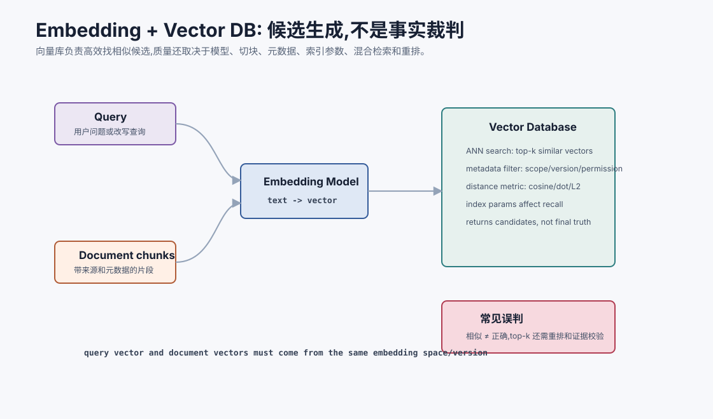
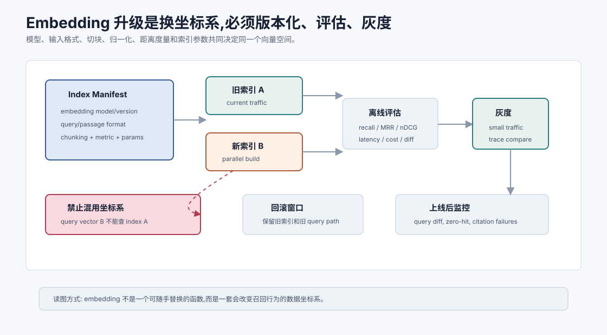

# 嵌入与向量数据库 `[进阶]`

RAG 的底层常常离不开 embedding 和向量数据库。

Embedding 把文本变成向量,向量数据库负责存储和近似搜索这些向量。

但这里有一个常见误解:

```text
只要用了向量数据库,就有了语义检索。
```

不完全对。向量数据库只是基础设施。检索质量还取决于 embedding 模型、文本切块、元数据、索引参数、混合检索、重排和评估。



本章会讲:

- Embedding 模型到底输出什么。
- 查询向量和文档向量如何匹配。
- 向量数据库负责什么,不负责什么。
- 相似度、ANN、索引、元数据过滤的作用。
- 如何选择 embedding 模型。
- 向量检索的常见失败和评估方法。

## Embedding 是什么

Embedding 是把文本映射成一个固定维度向量。

例如:

```text
"如何降低 LLM 推理延迟?" -> [0.02, -0.13, ..., 0.08]
```

这个向量的目标是让语义相关的文本在向量空间中更接近。

例如:

```text
查询: 如何降低 LLM 推理延迟?
文档: KV Cache、批处理和投机解码可以改善生成延迟。
```

它们字面不完全一样,但语义相关,embedding 应该让它们相似。

## Embedding 模型不是 LLM 输出层

Embedding 模型通常专门训练用于检索、相似度、聚类或分类。它和聊天 LLM 不一定是同一个模型。

训练目标常见有:

- 对比学习:相关 query/doc 拉近,不相关推远。
- 双塔检索:查询和文档分别编码。
- 指令化 embedding:根据任务类型生成不同表示。
- 多语言对齐:不同语言语义相同也靠近。

选择 embedding 模型时,要看它是否适合你的语言、领域和任务。

## 查询和文档的表示可能不同

有些 embedding 模型要求给查询和文档加不同前缀。

例如:

```text
query: 如何申请退款?
passage: 用户可在订单延迟超过 3 天后申请退款...
```

这样模型知道一个是问题,一个是候选答案。

如果模型训练时使用了这种格式,你推理时不按格式输入,检索质量可能下降。

所以 embedding 模型不是黑盒工具,要阅读它的使用说明和评估表现。

## 相似度如何计算

常见相似度有:

### Cosine similarity

看向量方向是否接近:

$$
\cos(q,d)=\frac{q \cdot d}{\|q\|\|d\|}
$$

### Dot product

直接点积:

$$
q \cdot d
$$

如果向量已归一化,点积和余弦相似度等价。

### L2 distance

看欧氏距离:

$$
\|q-d\|_2
$$

不同向量库和模型推荐的度量可能不同。不要随便混用。

## 相似度分数不是全局真理

向量检索返回的分数很容易让人误解。

例如看到 `score=0.82`,很多人会觉得“这条很相关”。但分数是否高,取决于 embedding 模型、向量是否归一化、距离度量、索引实现、查询长度、领域数据和候选集合。不同模型、不同索引、不同集合里的分数不能直接比较。

更稳的做法是:

- 在同一索引和同一任务上校准阈值。
- 用标注集观察分数分布。
- 不只看绝对分数,也看 top-k 内相对差距。
- 对低置信候选交给 reranker 或拒绝回答。
- 不把“相似”当作“支持结论”。

向量分数只是候选排序信号,不是证据可信度。

## 向量数据库负责什么

向量数据库通常负责:

- 存储向量。
- 存储文本和元数据。
- 快速近似最近邻搜索。
- 元数据过滤。
- 增删改索引。
- 返回 top-k 候选。

它不负责:

- 判断文档是否真实。
- 自动清洗脏数据。
- 决定如何切块。
- 保证召回片段能回答问题。
- 防止模型误读证据。
- 替你设计权限和评估。

向量库是检索基础设施,不是 RAG 的全部大脑。

## ANN:为什么是近似搜索

如果文档有几千万块,每次查询都和所有向量算相似度会很慢。

向量数据库通常使用 ANN,Approximate Nearest Neighbor,近似最近邻。

它用索引结构换速度:

- 搜索更快。
- 内存或磁盘成本可控。
- 但可能漏掉真正最近的向量。

这意味着向量库参数会影响 recall。为了更快而把搜索参数调得太激进,可能让正确证据根本进不了候选。

## 常见索引概念

不同向量库实现不同,但常见概念包括:

- HNSW:图结构近似搜索。
- IVF:先聚类再在部分簇里搜索。
- PQ:压缩向量以节省内存。
- ef_search / nprobe:控制搜索深度。
- top_k:返回候选数量。

你不需要一开始掌握所有底层细节,但要知道:索引参数不是纯运维配置,它会影响召回质量。

## 元数据过滤

元数据过滤和向量相似同样重要。

常见元数据:

- 文档类型。
- 来源系统。
- 创建时间。
- 版本。
- 权限范围。
- 项目 ID。
- 语言。
- 是否废弃。

例如企业政策问答,应该过滤:

```text
doc_type = policy
status = published
department = finance
permission <= current_user
```

再做向量相似搜索。

如果不做过滤,模型可能引用旧文档、草稿或用户无权访问的资料。

## Embedding 模型如何选择

选择 embedding 模型时,可以看这些维度。

| 维度 | 问题 |
| --- | --- |
| 语言 | 中文、多语言、英文表现如何? |
| 领域 | 是否懂代码、法律、医学、金融等术语? |
| 任务 | 适合问答检索、相似度还是分类? |
| 上下文长度 | 单条文本最长能编码多少 token? |
| 维度 | 向量维度影响存储和速度 |
| 成本 | 批量建索引和在线查询成本 |
| 延迟 | 是否满足线上请求 |
| 更新 | 模型版本变化是否会影响旧索引? |

不要只看通用榜单。最好用自己的 query-doc 对评估。

## 维度越高越好吗

不一定。

高维向量可能表达更多信息,但也会带来:

- 存储成本更高。
- 检索计算更重。
- 索引内存更大。
- 高维噪声可能增加。

低维向量更轻,但可能表达能力不足。

实际选择要看任务质量、成本和延迟。

## Embedding 版本管理

换 embedding 模型会改变向量空间。



这意味着旧索引通常不能和新查询向量随便混用。

如果你把文档用模型 A 编码,查询用模型 B 编码,相似度可能失效。

更准确地说,embedding 索引是一个版本化坐标系。坐标系由这些因素共同决定:

- embedding 模型和版本。
- query / passage 输入格式。
- 文本清洗和切块版本。
- 向量归一化方式。
- 距离度量,如 cosine、dot product 或 L2。
- 索引类型和搜索参数。

只要其中一个关键因素变化,召回结果就可能变化。因此不要把“向量库表名”当成索引身份,而要把上面这些信息写成 index manifest。

所以要记录:

- embedding model name。
- model version。
- encoding format。
- distance metric。
- index build time。
- chunking strategy version。

升级 embedding 模型通常需要重建索引,并做回归评估。

一个最小 index manifest 可以长这样:

```json
{
  "index_id": "policy_knowledge_v2026_07_e5_m3",
  "embedding_model": "example-embed-v3",
  "input_format": "query:/passage:",
  "chunking_version": "policy_structured_v4",
  "metric": "cosine",
  "normalized": true,
  "metadata_schema": "rag_meta_v2",
  "built_at": "2026-07-07T10:00:00Z"
}
```

这个 manifest 后面会进入 trace。否则线上一次检索失败后,你很难知道它到底查的是哪套向量空间。

## Embedding 升级要灰度

Embedding 模型升级不像换一个普通依赖。它会改变整个向量空间,进而改变召回结果。

比较稳的升级流程是:

1. 用新模型并行构建新索引。
2. 在固定评估集上比较 recall@k、MRR、nDCG、延迟和成本。
3. 抽查高风险 query 的证据质量。
4. 小流量灰度新索引,记录失败差异。
5. 保留旧索引回滚窗口。

不要在生产中直接把查询换成新 embedding,却继续查旧索引。那相当于用一把新尺子去量旧坐标系。

## 多向量表示

一个文档块不一定只有一个向量。

可以为不同字段建向量:

- 标题向量。
- 正文向量。
- 摘要向量。
- 代码注释向量。
- 表格说明向量。

也可以为同一文档生成多个问题向量,用于更好匹配用户查询。

多向量能提升召回,但也增加索引复杂度和去重难度。

## Hybrid search

混合检索结合向量和关键词。

常见方式:

```text
vector top 50 + BM25 top 50 -> merge -> rerank top 10
```

合并候选时不要简单拼接后按原始分数排序。向量分数、BM25 分数和业务规则分数不在同一个尺度上。常见做法是按排名融合,例如 Reciprocal Rank Fusion:

$$
score(d)=\sum_{s \in S}\frac{1}{k + rank_s(d)}
$$

其中 $S$ 是不同检索器,如 vector、BM25、title match。$k$ 用来降低高排名之外候选的影响。RRF 的好处是不用强行比较不同检索器的原始分数,更适合先合并候选再交给 reranker。

为什么有效?

- 向量检索擅长语义相似。
- 关键词检索擅长精确符号。
- Reranker 擅长细粒度判断。

对代码、法律、客服、技术文档来说,混合检索通常比单纯向量更稳。

混合检索也要可诊断。trace 里最好记录每个候选来自哪些通道、原始排名、融合排名和 reranker 排名。否则你只知道“召回错了”,不知道是关键词漏了、向量偏了,还是融合策略把正确候选压下去了。

## Hard negatives 和领域适配

Embedding 的难点通常不是区分明显无关的文本,而是区分“看起来很像但答案不同”的文本。

例如:

```text
Query: 高铁一等座能报销吗?
Positive: 一等座需部门负责人事前审批。
Hard negative: 二等座可直接报销。
```

如果评估集里只有容易负样本,系统分数会很好看,上线后却会在相近条款、相近产品、相近错误码上犯错。

领域适配的第一步不是立刻微调 embedding,而是先收集 hard negatives,观察现有模型到底错在哪些边界上。只有当错误稳定集中在领域术语、同义表达或细粒度条件时,再考虑微调、蒸馏或换模型。

## 向量检索的常见失败

### 1. 语义相似但答案无关

用户问退款政策,召回了很多“退款体验优化”的产品文档。

解决:元数据过滤 + rerank。

### 2. 精确符号召回失败

错误码、函数名、订单号没被召回。

解决:混合关键词检索。

### 3. 切块破坏语义

关键定义和条件被切到不同块。

解决:按结构切块 + 邻接块扩展。

### 4. 查询太短或省略

用户问“这个怎么办”,向量无法知道“这个”指什么。

解决:query rewriting,引入对话上下文。

### 5. 旧版本文档干扰

废弃文档相似度高。

解决:版本和状态元数据过滤。

## 评估 embedding 和向量库

你需要一组 query-doc 标注集。

每条样本包含:

```text
query
relevant document/chunk ids
hard negatives
metadata constraints
```

常用指标:

- recall@k:正确片段是否在 top-k。
- MRR:第一个正确片段排第几。
- nDCG:排序整体质量。
- latency:检索延迟。
- cost:索引和查询成本。

还要看失败样本。平均指标高,不代表关键高风险问题不会错。

## 向量库和权限

权限过滤必须严肃处理。

常见设计:

1. 每个 chunk 存权限元数据。
2. 查询时带用户身份和租户。
3. 先过滤可见范围,再检索或检索后强过滤。
4. 进入上下文前再次检查。

不要让模型看到无权文档后“承诺不泄露”。那不是安全边界。

## 向量库更新

文档会变化。向量索引也要更新。

需要考虑:

- 增量索引。
- 删除废弃块。
- 文档版本切换。
- embedding 模型升级。
- 索引构建失败回滚。
- 查询时避免读到半更新状态。

RAG 不是一次建库就结束,而是持续数据工程。

## 常见误解

### 误解一:向量相似就是语义正确

不等于。相似只是候选相关,还需要重排、证据检查和生成约束。

### 误解二:向量数据库会自动理解权限和版本

不会。权限、版本、状态是你必须设计的元数据和过滤逻辑。

### 误解三:换更大的 embedding 模型一定更好

不一定。领域适配、延迟、成本和评估结果更重要。

### 误解四:top-k 调大就能解决召回

可能带来更多噪声。召回问题还可能来自切块、query、模型或索引参数。

### 误解五:建好索引后就不用管了

文档、权限、版本和模型都会变化。向量索引需要持续维护和回归评估。

### 误解六:embedding 分数可以直接当置信度

不可以。分数只表示在当前索引、当前度量、当前候选集合里的相对相似度。置信度还要结合来源、版本、权限、rerank、证据充分性和引用校验。

### 误解七:混合检索就是向量和关键词各查一次

不够。还要处理候选融合、去重、重排、元数据过滤和 trace。否则混合检索只是两套噪声叠加。

## 本章小结

Embedding 把文本映射到向量空间,向量数据库负责高效存储和搜索这些向量。但检索质量不只取决于向量库,还取决于 embedding 模型、输入格式、切块、元数据过滤、索引参数、混合检索、候选融合和重排。向量相似只是候选生成,不是事实正确。可靠 RAG 需要把向量检索当成可评估、可版本管理、可灰度、可回滚、可权限控制的数据系统。

下一章会讲切块策略与检索质量。切块是 RAG 中最容易被低估的环节,它直接决定知识能不能被正确召回和使用。
