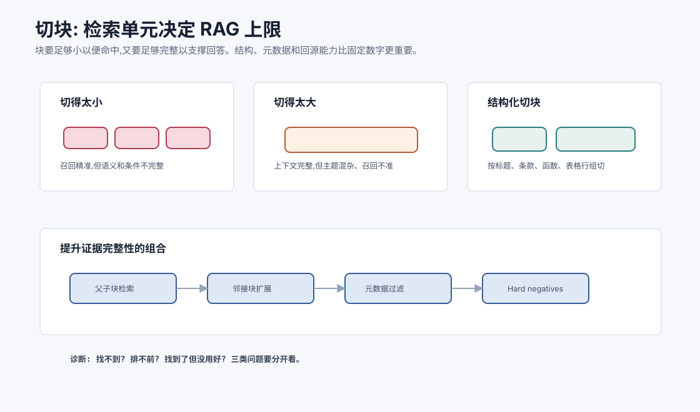

# 切块策略与检索质量 `[进阶]`

RAG 系统里,切块是最容易被低估的一环。

很多团队会随手设置:

```text
chunk_size = 500 tokens
overlap = 50 tokens
```

然后把文档切成一堆片段,存进向量库。如果效果不好,就开始换 embedding 模型、调 top-k、换向量库。可问题常常不是向量模型,而是知识在切块时已经被切坏了。

切块的核心问题是:

**检索单元应该既足够小,能被精准召回;又足够完整,能支撑回答。**



本章会讲:

- 为什么切块会决定 RAG 上限。
- 固定长度切块、结构化切块、语义切块的取舍。
- chunk size 和 overlap 如何影响召回与噪声。
- 父子块、邻接扩展和上下文窗口如何配合。
- 表格、代码、PDF、网页如何特殊处理。
- 如何诊断检索质量问题。

## 为什么切块重要

Embedding 模型会为每个 chunk 生成一个向量。这个向量代表 chunk 的整体语义。

如果一个 chunk 包含多个主题,向量会变得混杂。

如果一个 chunk 只包含半句话,语义又不完整。

例如政策文档:

```text
高铁二等座可直接报销。一等座需部门负责人事前审批。若因紧急公务需要,可补充说明后报销。
```

如果切块把“一等座需审批”和“紧急公务例外”切开,模型可能只召回一半规则,回答就会错。

## 好 chunk 的标准

一个好 chunk 应该满足:

- 语义相对完整。
- 主题相对单一。
- 有足够上下文理解代词和条件。
- 保留标题、来源和层级。
- 长度适合 embedding 模型。
- 能被用户 query 命中。
- 放进 prompt 后不会太占空间。

这是一组取舍,不是一个固定数字。

## 从问题反推切块

切块不应该只从文档出发,还要从用户会怎么问出发。

同一份政策文档,用户可能这样问:

- “高铁一等座能报吗?”
- “需要谁审批?”
- “紧急公务有没有例外?”
- “2026 年新版和旧版有什么不同?”

如果 chunk 只保存一段正文,没有标题、版本、审批主体和例外条件,这些问题就很难稳定命中。好的切块会让“用户问题里的实体、动作、条件、限制”都能在 chunk 文本或元数据中找到对应信号。

可以反问三个问题:

1. 用户最可能用什么词问到这条知识?
2. 回答这类问题需要哪些上下文条件?
3. 哪些相似片段会成为 hard negative?

切块的本质是让知识以可检索、可引用、可判断的单元存在。

## 固定长度切块

固定长度切块按 token 数切。

优点:

- 简单。
- 实现快。
- 适合结构差的纯文本。

缺点:

- 可能切断段落、表格、代码块。
- 不理解标题层级。
- 容易把多个主题混在一起。

固定切块适合快速原型,但生产 RAG 通常需要更懂文档结构的切块。

## Overlap 的作用

Overlap 是相邻 chunk 之间重叠一些 token。

它能缓解边界切断问题。

例如:

```text
chunk 1: ... 一等座需部门负责人事前审批。
chunk 2: 部门负责人事前审批。若因紧急公务需要,可补充说明后报销。
```

重叠让关键条件有机会出现在两个 chunk 中。

但 overlap 也有成本:

- 索引变大。
- 重复召回增加。
- 证据包可能冗余。
- 模型可能看到重复信息。

Overlap 是止血带,不是万能药。根本还是要按结构切。

## 结构化切块

结构化切块利用文档结构。

### Markdown/HTML

按标题层级、段落、列表、代码块切。

保留 heading path:

```text
差旅政策 > 交通 > 高铁 > 一等座
```

### PDF

需要处理页眉页脚、分栏、脚注、表格、页码。

### 代码

按函数、类、模块、注释块切。不要随便在函数中间切断。

### 法律/政策

按章、节、条、款切。条件和例外要尽量放在同一块或可邻接召回。

结构化切块通常比固定长度更可靠。

## 语义切块

语义切块尝试根据主题变化切分。

方法可以是:

- 段落 embedding 相似度变化。
- LLM 判断边界。
- 主题模型。
- 标题和语义结合。

优点是更贴近语义。缺点是成本高、实现复杂、稳定性要评估。

语义切块适合长文档、主题变化明显的资料,但不一定适合代码和严格结构化政策。

## 父子块 Parent-child retrieval

一个常见问题是:小 chunk 容易精准召回,但上下文不够;大 chunk 上下文够,但召回不准。

父子块策略可以兼顾。

做法:

- 子块用于 embedding 检索。
- 命中子块后,返回更大的父块给模型。

例如:

```text
子块: 一段具体条款
父块: 该条款所在小节
```

这样 query 更容易命中具体内容,生成时又能看到完整条件。

## 邻接扩展

命中某个 chunk 后,可以把前后相邻 chunk 一起加入证据包。

适合:

- 条款上下文。
- 代码函数附近注释。
- 文档段落连续解释。

但邻接扩展也会增加噪声。最好只在需要上下文时使用,并控制窗口。

## 元数据比你想的更重要

每个 chunk 应保存元数据:

```json
{
  "doc_id": "travel_policy_2026",
  "chunk_id": "travel_policy_2026#4.2.1",
  "title_path": ["差旅政策", "交通", "高铁"],
  "version": "2026.3",
  "status": "published",
  "page": 12,
  "section": "4.2.1",
  "permissions": ["employee"],
  "prev_chunk": "...",
  "next_chunk": "..."
}
```

没有元数据,你很难过滤、引用、扩展上下文、处理版本冲突。

## 表格如何切

表格是 RAG 难点。

直接把表格转成纯文本可能丢失行列关系。

处理方式:

- 保留表头。
- 每行转成带字段名的记录。
- 大表按行组切。
- 重要表格可同时保存 Markdown 表格和行级文本。

例如:

```text
报销标准表 | 交通类型=高铁 | 座位=一等座 | 是否可报销=需审批 | 备注=紧急公务可补充说明
```

这比只保存 `高铁 一等座 需审批` 更容易被模型理解。

## 代码如何切

代码切块应尊重语法结构。

好的切块单位:

- 函数。
- 类。
- 模块导出。
- 测试用例。
- 配置段。

还要保存:

- 文件路径。
- 符号名。
- import/export。
- 所属类或命名空间。
- 行号。

代码检索常需要混合关键词和结构信息。函数名、错误栈、文件路径比语义向量更重要。

## PDF 和网页清洗

PDF/网页常有噪声:

- 页眉页脚重复。
- 导航栏。
- 版权声明。
- 侧边栏。
- 广告。
- 表格断裂。
- OCR 错字。

如果这些进入 chunk,检索会被污染。

清洗不是小事。很多 RAG 失败不是检索算法问题,而是索引里充满噪声。

## Chunk size 怎么选

没有通用答案,但可以按任务调。

| 场景 | 倾向 |
| --- | --- |
| FAQ/问答对 | 小块,每条 Q/A 一个 chunk |
| 政策条款 | 按条款,保留上下文和例外 |
| 长教程 | 按小节切,保留 heading path |
| 代码 | 按函数/类/测试用例 |
| 表格 | 按行组或记录切,保留表头 |
| 研究论文 | 摘要、方法、实验、结论分节 |

经验数字只能作为起点。最终要看检索评估。

## 检索质量的三种问题

### 1. 找不到

正确证据没进 top-k。

可能原因:

- 文档没入库。
- 切块切坏。
- query 改写错。
- embedding 不适合领域。
- 索引参数召回低。
- 权限过滤过严。

### 2. 找到了但排后面

正确证据在候选里,但排名低。

可能需要 reranker、混合检索或更好 query。

### 3. 找到了但没用好

正确证据进了 prompt,模型仍回答错。

可能是证据包组织差、冲突未说明、prompt 约束弱或答案校验缺失。

这三类问题要分别诊断。

## Hard negatives

评估检索时,要准备 hard negatives。也就是看起来相关但不能回答问题的片段。

例如用户问“一等座能否报销”,hard negative 可能是“二等座报销规则”。

它们词汇很像,但答案不同。

如果检索系统不能区分 hard negatives,模型很容易被误导。

## 检索评估集怎么做

一个检索评估样本可以包含:

```json
{
  "query": "高铁一等座能报销吗?",
  "relevant_chunks": ["travel_policy#4.2.1"],
  "hard_negative_chunks": ["travel_policy#4.2.0"],
  "required_metadata": {"status": "published"}
}
```

评估时看:

- 正确 chunk 是否被召回。
- 是否排在前面。
- hard negative 是否被压下去。
- 元数据过滤是否正确。

## Chunk 可观测性

切块策略需要可观测,否则很难调。

实用系统通常要有一个 chunk viewer,能按文档查看:

- 原文和清洗后文本的差异。
- chunk 边界在哪里。
- heading path、页码、版本、权限等元数据。
- prev/next chunk 是否正确。
- 某个 query 命中了哪些 chunk,为什么排前。
- 被压缩进证据包后丢了哪些内容。

没有 chunk viewer 时,团队很容易只盯着 embedding 分数和 prompt。可很多错误在进入向量库之前已经发生了。

## 上下文压缩和检索质量

召回很多片段后,还要压缩成证据包。

压缩可能丢信息。尤其是政策中的例外条件、代码中的边界分支、表格中的列名。

压缩时要保留:

- 条件。
- 例外。
- 数字和阈值。
- 来源和版本。
- 不确定性。

不要把“需审批后可报销”压缩成“可报销”。

## 常见误解

### 误解一:切块只是预处理小事

不是。切块决定检索单元,直接影响 RAG 上限。

### 误解二:固定 500 token + overlap 就够了

只能作为原型。生产场景应根据文档结构和任务调切块。

### 误解三:chunk 越大越完整

大 chunk 上下文多,但主题混杂,召回不精准,成本高。

### 误解四:chunk 越小越精准

小 chunk 容易缺上下文,无法支撑回答。

### 误解五:检索失败一定是 embedding 模型差

也可能是文档没清洗、切块差、query 差、元数据过滤错或索引参数问题。

## 本章小结

切块决定 RAG 的检索单元,是检索质量的上限之一。好的 chunk 应语义完整、主题单一、保留结构和来源,同时长度适合检索和上下文。固定长度切块简单但脆弱,结构化切块更适合政策、代码、网页和表格。父子块、邻接扩展、元数据过滤和 hard negative 评估能显著改善质量。诊断 RAG 时,要区分找不到、排不前和用不好三类问题。

下一章会讲工具使用进阶。RAG 让 Agent 找资料,工具使用进阶则让 Agent 更可靠地操作外部系统和组合多步能力。
