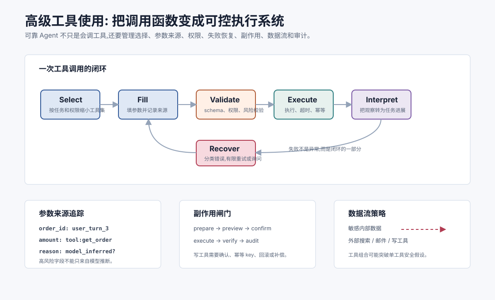
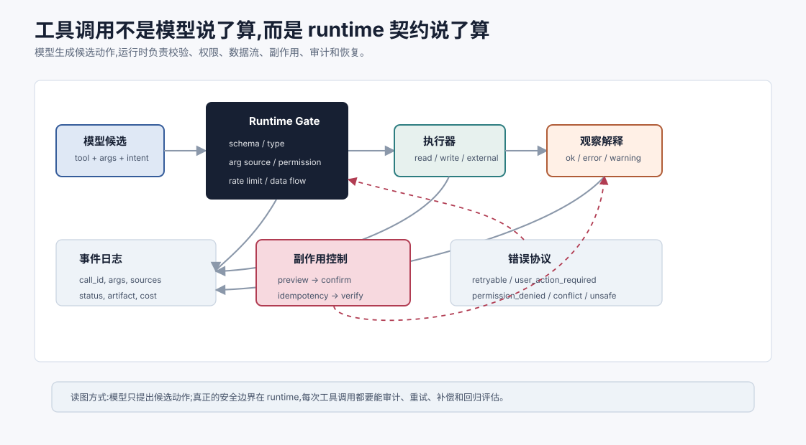
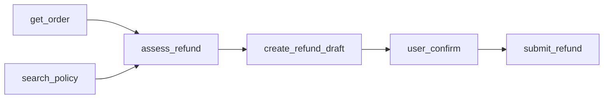
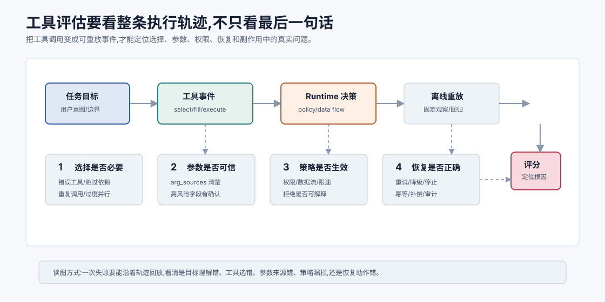

# 工具使用进阶 `[进阶]`

Part 2 已经讲过 Function Calling 和 ACI。那时我们关注的是单个工具如何被安全、结构化地调用。

到了能力构建阶段,问题会更复杂:

**Agent 如何组合多个工具,处理工具失败,管理副作用,并把工具观察转化为可靠任务进展?**

工具使用进阶不是多给模型几个 API。工具越多,系统越容易混乱。真正进阶的是让工具使用变成一个可计划、可验证、可恢复、可审计的执行系统。

换句话说,高级工具使用不是“模型会调用函数”,而是“系统能把模型的候选动作转成受控执行”。模型可以提出工具和参数,但 runtime 必须拥有最终裁决权:是否允许、是否需要确认、是否会泄露数据、是否可重试、是否可回滚、是否应该写入审计日志。





本章会讲:

- 多工具任务为什么难。
- 工具选择、参数生成、执行、观察和恢复如何闭环。
- 工具组合中的依赖、并行和事务问题。
- 如何处理工具失败和不确定返回。
- 写工具的副作用、确认和回滚。
- 如何评估工具使用质量。

## 从单工具到工具链

单工具调用例子:

```text
查询订单状态。
```

多工具任务例子:

```text
判断订单是否可退款,如果可以生成退款申请草稿。
```

这可能需要:

1. 查询订单状态。
2. 查询物流轨迹。
3. 检索退款政策。
4. 判断是否符合条件。
5. 创建退款草稿。
6. 请求用户确认。

难点不在于会不会调用某个函数,而在于如何组织调用顺序和使用结果。

## 工具使用的五阶段

每次工具使用都可以拆成五阶段。

| 阶段 | 问题 |
| --- | --- |
| Select | 当前最该用哪个工具? |
| Fill | 参数从哪里来,是否可信? |
| Validate | 参数、权限、风险是否通过? |
| Execute | 工具是否成功执行? |
| Interpret | 返回结果如何影响下一步? |

很多系统只关注 Fill 和 Execute,忽略 Select、Validate 和 Interpret。结果就是工具能跑,但任务不稳。

这五阶段最好由不同机制共同完成。

| 阶段 | 模型擅长 | Runtime 应负责 |
| --- | --- | --- |
| Select | 理解当前目标,提出候选工具 | 按权限、状态、风险缩小工具集 |
| Fill | 从上下文提取或推断参数 | 校验类型、来源、必填项和冲突 |
| Validate | 解释为什么需要调用 | 执行 schema、policy、data flow 和确认门 |
| Execute | 理解执行结果 | 超时、重试、幂等、隔离副作用 |
| Interpret | 将观察转成下一步计划 | 记录事件、更新状态、触发评估或补偿 |

把这些责任都交给模型,系统就会脆弱;把这些责任都写死成规则,Agent 又会失去灵活性。好的工具系统是模型和 runtime 分工。

## 工具调用也是事件日志

高级工具系统应该把每次调用记录成可审计事件,而不是只把返回文本塞给模型。

一条工具事件至少包含:

```json
{
  "tool": "create_refund_draft",
  "call_id": "toolcall_17",
  "args": {"order_id": "HK-2026-00018"},
  "arg_sources": {"order_id": "user_turn_3"},
  "policy_decision": "allowed_preview_only",
  "status": "ok",
  "observation_summary": "Refund draft created, not submitted.",
  "side_effect": "draft_created",
  "artifact": "tool-result://17"
}
```

这样做有三个好处:模型能知道任务进展,系统能审计副作用,失败时能从事件恢复状态。没有事件日志的多工具 Agent,一旦跑偏就很难判断到底是哪次调用引入了错误。

事件日志还应该支持**重放**和**回归评估**。

例如一个退款 Agent 出错后,你应该能在离线环境中重放同样的工具返回和策略决策,验证修复后的版本是否还会犯同样错误。如果工具事件只存在模型上下文里,没有结构化保存,线上失败就很难变成可靠测试样本。

## 工具选择:不要让模型在噪声工具箱里找针

工具越多,选择越难。

好的策略是先缩小工具集:

- 根据任务类型加载工具组。
- 根据用户权限过滤工具。
- 根据当前状态隐藏无关工具。
- 高风险工具只在确认阶段暴露。

例如当前只是“诊断问题”,就不应该暴露 `delete_file`、`submit_refund` 这类写工具。

工具选择不是模型单独负责,而是模型和 runtime 共同完成。

## 参数来源追踪

工具参数应该能追溯来源。

例如:

```json
{
  "order_id": {
    "value": "HK-2026-00018",
    "source": "user_message_turn_3"
  }
}
```

这样可以区分:

- 用户明确提供。
- 工具结果返回。
- 系统上下文注入。
- 模型推断。

高风险参数不应该来自纯模型推断。比如退款金额、收件人邮箱、删除对象 ID,最好来自工具或用户明确输入。

可以按风险给参数来源分级。

| 来源 | 可信度 | 适合场景 |
| --- | --- | --- |
| 用户明确输入 | 中高,但需校验格式 | 普通查询、用户确认字段 |
| 权威工具返回 | 高 | 金额、订单状态、权限、库存 |
| 系统状态 | 中高,取决于更新时间 | 当前任务上下文、已确认约束 |
| OCR/网页/搜索结果 | 中低 | 需要附带置信度和来源 |
| 模型推断 | 低 | 只能用于低风险默认值或候选建议 |

参数风险越高,越应该要求高可信来源或用户确认。

## 工具依赖图

多工具任务可以形成依赖图。



依赖图能防止 Agent 跳步。例如没有订单状态和政策证据时,不应该直接创建退款草稿。

在复杂任务中,可以把工具依赖写进计划或 workflow。

## 并行工具调用

如果多个只读工具相互独立,可以并行。

例如研究任务中同时查询三个资料源。

并行适合:

- 无副作用。
- 子任务独立。
- 结果可合并。
- 成本可接受。

不适合:

- 后一步依赖前一步。
- 多个写操作可能冲突。
- 需要顺序审批。

并行不是越多越好。它降低等待时间,但增加总成本和合并复杂度。

## 工具失败处理

工具失败不是异常情况,而是常态。

失败处理要根据错误类型。

| 错误 | 处理 |
| --- | --- |
| 参数缺失 | 请求用户或从状态补充 |
| 参数格式错 | 修正后重试 |
| 对象不存在 | 检查 ID 来源,必要时询问 |
| 权限不足 | 停止或请求授权 |
| 超时 | 有限重试,降级或报告 |
| 结果为空 | 改写查询或换工具 |
| 状态冲突 | 重新读取最新状态 |

不要把所有错误都简单重试。重复错误会浪费预算,也可能造成副作用。

工具错误最好有稳定的错误协议。不要只返回一段自然语言错误。

```json
{
  "ok": false,
  "error": {
    "code": "PERMISSION_DENIED",
    "retryable": false,
    "user_action_required": true,
    "safe_to_retry": false,
    "message": "User must confirm before submitting refund."
  }
}
```

有了错误协议,Agent 才能区分“修参数后重试”“请求用户授权”“换工具”“停止并报告”。否则模型只能猜错误含义。

## 工具返回的不确定性

工具返回不总是确定答案。

搜索工具可能返回低相关结果。OCR 可能识别错。数据库可能有延迟。第三方 API 可能返回过期状态。

工具结果应包含置信度或状态:

```json
{
  "ok": true,
  "data": [...],
  "confidence": 0.72,
  "warnings": ["OCR quality is low on page 2"]
}
```

模型使用工具结果时,要把 warnings 传递到最终判断中。

## 写工具:草稿优先

写工具有副作用。

常见安全模式是:

```text
prepare -> preview -> confirm -> execute -> verify
```

例如发送邮件:

1. `create_email_draft`。
2. 展示收件人、主题、正文、附件。
3. 用户确认。
4. `send_email`。
5. 返回 message_id 和发送状态。

直接 `send_email` 风险太高。

草稿优先还有一个好处:它把模型生成和真实副作用隔离开。模型可以生成草稿,但提交动作必须经过用户或策略确认。这让系统可以在执行前检查收件人、金额、附件、权限、数据流和幂等 key。

对高风险写工具,建议至少提供两个接口:

- `prepare_*` 或 `create_*_draft`: 只产生可检查草稿。
- `commit_*` 或 `submit_*`: 执行真实副作用,要求确认令牌或审批状态。

不要把预览和提交合在一个工具里用布尔参数控制,例如 `send_email(draft=false)`。这种接口太容易被模型填错。

## 回滚和补偿

有些动作不能真正回滚,只能补偿。

例如已经发送邮件,不能“取消发送”,只能再发更正邮件。

工具设计要说明:

- 是否可回滚。
- 回滚工具是什么。
- 如果不可回滚,补偿动作是什么。
- 谁可以执行补偿。

Agent 在执行前也要知道这些信息,否则无法正确评估风险。

可以把写操作按恢复能力分级。

| 类型 | 示例 | 策略 |
| --- | --- | --- |
| 可撤销 | 创建草稿、临时标签 | 允许自动执行,记录 undo id |
| 可补偿 | 发送通知、提交申请 | 需要确认,提供补偿动作 |
| 不可逆 | 删除数据、转账、外部发布 | 强审批、多重确认、最小权限 |

风险等级应该进入工具 schema,让 runtime 能自动套用确认和审批策略。

## 幂等性

写工具要支持幂等 key。

例如:

```json
{
  "draft_id": "draft_123",
  "idempotency_key": "send-draft_123-20260706"
}
```

如果网络超时后重试,系统能避免重复发送。

没有幂等性,Agent 重试机制会变危险。

## Tool memory

Agent 应该记住工具使用结果。

短期内:

- 哪些工具已调用。
- 参数是什么。
- 返回了什么。
- 是否成功。

长期看:

- 某些工具的稳定使用经验。
- 常见错误的处理方式。
- 某个项目的常用命令。

但不要把一次工具结果当长期事实。例如订单状态要下次重新查询。

## 工具组合中的安全边界

单个工具看似安全,组合起来可能危险。

例如:

```text
read_customer -> search_web -> send_email
```

如果没有数据流控制,Agent 可能把客户信息发到外部。

所以要考虑工具间的数据流策略:

- 敏感数据能否传给外部工具?
- 搜索结果能否触发写工具?
- 文件读取内容能否发送邮件?
- 不可信网页内容能否影响高风险动作?

这类约束必须由系统执行。

数据流策略可以写成简单矩阵。

| 数据来源 | 可传给内部只读 | 可传给外部搜索 | 可传给邮件/写工具 |
| --- | --- | --- | --- |
| 公开文档 | 可以 | 可以 | 需任务相关 |
| 内部普通文档 | 可以 | 通常不可以 | 需权限和确认 |
| PII/客户数据 | 最小必要 | 不可以 | 强确认和审计 |
| 不可信网页内容 | 可作为证据 | 不适用 | 不能直接触发写操作 |

这类策略不能只靠 prompt。模型可以帮助解释,但 runtime 必须拦截非法数据流。

## 策略必须由 runtime 执行

模型可以解释风险,但不能成为唯一安全边界。

例如系统可以让模型判断“这次是否像退款场景”,但最终是否允许 `submit_refund` 必须由 runtime 根据权限、金额、用户确认、幂等 key 和数据流策略决定。

可以把工具调用分成两层:

| 层 | 负责什么 |
| --- | --- |
| 模型 | 选择候选工具、生成参数、解释意图、理解观察 |
| Runtime | 校验 schema、权限、速率限制、数据流、副作用、确认、审计 |

如果安全策略只写在 prompt 里,它就是建议,不是边界。可靠工具系统要让 runtime 拥有最终裁决权。

一个实用原则是:模型只能请求动作,不能授予自己权限。

也就是说,模型输出 `submit_refund` 只是一个候选 intent。runtime 要重新检查用户身份、订单归属、金额、确认状态、幂等 key、速率限制和数据流策略。只有全部通过,动作才执行。

这也是 Harness Engineering 的核心思想:把模型放在受控执行边界内,让系统承担不可协商的安全约束。

## 工具使用评估

评估工具使用要看过程。

指标包括:

- 工具选择准确率。
- 参数语义正确率。
- 无效调用率。
- 重复调用率。
- 错误恢复率。
- 写操作确认率。
- 副作用事故率。
- 端到端任务完成率。
- 每任务平均成本和延迟。

还要做轨迹评审:同样完成任务,一个 Agent 调用了 3 次工具,另一个调用了 18 次,质量并不一样。

轨迹评审最好不要只看“最终答案对不对”。它应该把一轮任务拆成可检查的事件序列:当时有什么目标、模型选择了什么工具、参数从哪里来、runtime 为什么允许或拒绝、工具返回什么、Agent 如何解释观察、最后是否产生副作用。这样才能判断失败到底来自计划错误、参数来源错误、工具协议错误、策略拦截不足,还是结果解释错误。



一个可复用的工具轨迹评估通常包含四层:

| 层 | 评估问题 | 常见证据 |
| --- | --- | --- |
| 任务层 | 是否完成用户目标,有没有越界? | 任务说明、最终状态、用户确认 |
| 选择层 | 工具选择是否必要且顺序正确? | 工具事件、依赖图、无效调用率 |
| 参数层 | 参数是否来自可信来源? | arg_sources、schema 校验、确认记录 |
| 执行层 | 错误恢复和副作用是否受控? | 错误码、重试记录、幂等 key、审计日志 |

如果只保存最终回答,这些问题都无法复盘。高级工具系统必须把“过程”变成评估对象。

工具评估还应包含 failure drill。

也就是故意让工具返回错误,观察 Agent 是否能正确处理:

- `INVALID_ARGUMENT`: 是否修参数,而不是重复提交。
- `PERMISSION_DENIED`: 是否停止或请求授权。
- `TIMEOUT`: 是否有限重试并保留幂等 key。
- `CONFLICT`: 是否重新读取最新状态。
- `UNSAFE_DATA_FLOW`: 是否拒绝把敏感数据传给外部工具。

只在工具都成功时评估,会高估 Agent 的真实可靠性。

## 常见误解

### 误解一:工具越多 Agent 越强

工具越多,选择和安全越难。高质量工具集比大而杂的工具集更重要。

### 误解二:工具成功返回就代表任务成功

不一定。工具成功只是动作成功,还要看是否推进目标。

### 误解三:只读工具都安全

不一定。读取敏感数据也可能造成泄露,尤其当后续还有外部写工具。

### 误解四:重试能解决大多数工具失败

重试只适合临时错误。参数错、权限错、对象不存在,重试无意义。

### 误解五:Agent 可以自己判断副作用风险

模型可以辅助判断,但最终风险分级和权限必须由系统控制。

### 误解六:工具 schema 写清楚就够了

不够。schema 描述接口,但权限、数据流、副作用、幂等和补偿需要 runtime 执行。

### 误解七:工具失败时多试几次总会好

不一定。只有临时错误适合重试。权限、参数、状态冲突和安全拦截需要不同处理。

### 误解八:只要工具是内部系统就安全

不一定。内部工具也可能读取敏感数据、触发写操作或组合出越权数据流。

## 本章小结

高级工具使用关注的不只是调用函数,而是工具选择、参数来源、权限校验、执行结果、错误恢复、依赖关系、并行策略、副作用和审计。多工具 Agent 应把工具链看成可计划、可验证、可恢复的执行系统。只读工具也要考虑权限和数据流,写工具必须支持预览、确认、幂等性和回滚或补偿。可靠工具使用的关键是让每次调用都能推进任务,并且让系统而不是模型承担安全边界。

下一章会讲反思与自我修正。工具提供外部反馈,反思机制则帮助 Agent 从反馈中发现错误、调整策略并改进输出。
