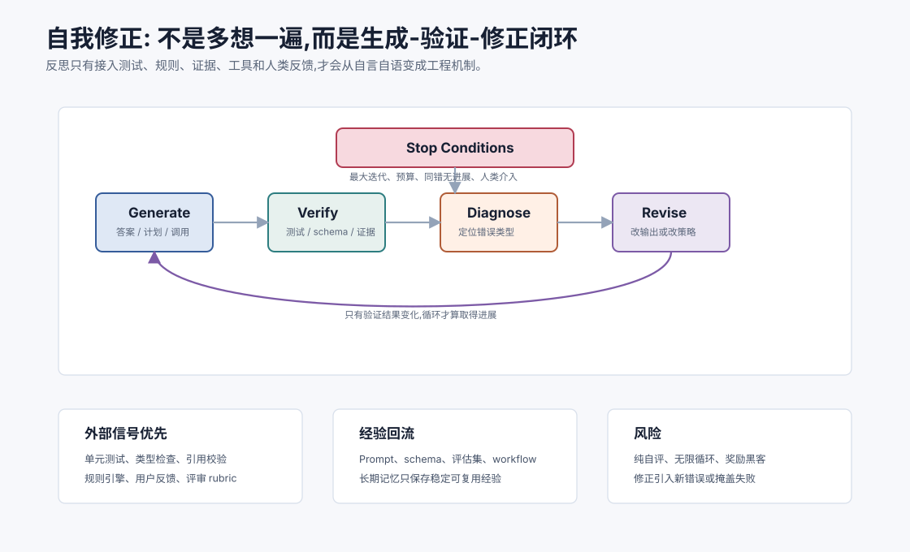
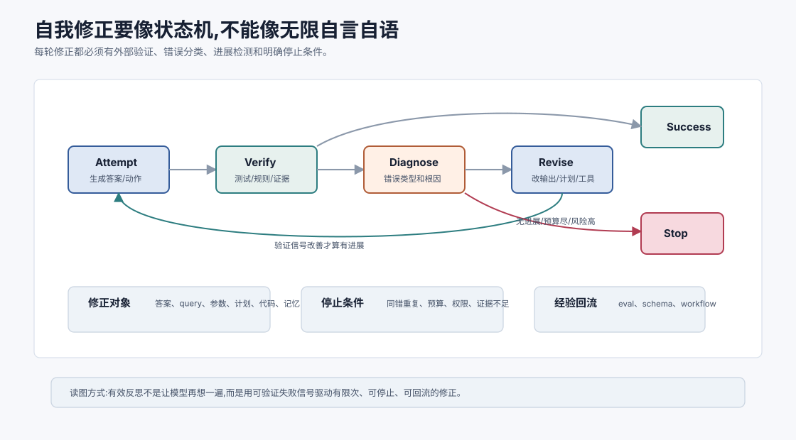
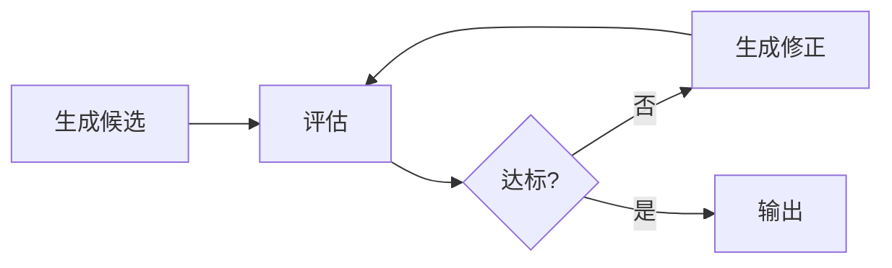
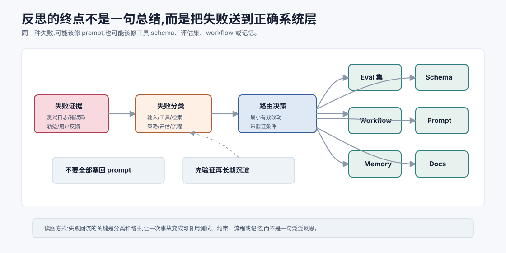

# 反思与自我修正 `[进阶]`

Agent 不可能每一步都做对。

工具会失败,检索会漏,模型会误判,计划会过时。关键不是追求零错误,而是让系统能发现错误、解释错误、修正错误,并在必要时停止。

这就是反思与自我修正要解决的问题。

但“反思”也容易被神秘化。很多教程会让模型在回答后再说一段“我哪里可以改进”,然后期待质量提升。生产系统不能只靠这种自言自语。有效自我修正必须依赖外部信号、明确标准和可执行改进。

更工程化地说,反思不是一种“思考风格”,而是一套控制回路。它需要输入失败证据,选择修正动作,再次验证,并决定继续、成功、停止还是升级人工。如果没有状态、预算和停止条件,反思很容易变成无限循环或自我安慰。





本章会讲:

- 反思和自我修正到底是什么。
- 为什么纯模型自评不可靠。
- 外部验证、测试、规则、用户反馈如何驱动修正。
- Reflexion、Critique、Evaluator-Optimizer 等模式的区别。
- 如何避免无限修正和奖励黑客。
- 如何把失败经验回流到系统。

## 什么是自我修正

自我修正可以抽象成:

```text
生成结果 -> 检查结果 -> 发现问题 -> 修改策略或输出 -> 再检查
```

它可以发生在不同层面:

- 修正最终答案。
- 修正工具调用参数。
- 修正计划。
- 修正检索 query。
- 修正代码补丁。
- 修正长期记忆。

关键是“检查结果”必须有标准。没有标准的反思只是再生成一段话。

一次有效修正至少包含四个对象:

- attempt: 当前尝试的输出、工具调用、补丁或计划。
- verifier: 测试、schema、规则、检索证据、Judge 或人工反馈。
- diagnosis: 失败类型和最可能根因。
- revision: 针对根因的最小修改。

如果 revision 不能明确对应 diagnosis,它就可能只是随机改写。

## 自我修正的三个层级

自我修正可以发生在三个层级。

| 层级 | 修正对象 | 例子 |
| --- | --- | --- |
| 输出层 | 最终答案或格式 | 补引用、修正 JSON、删掉无证据断言 |
| 过程层 | 检索、工具、计划 | 改写 query、换工具、重排步骤 |
| 系统层 | Prompt、schema、评估集、workflow | 给工具参数加说明、补失败样本、增加确认节点 |

很多教程只停在输出层,让模型把答案改得更好看。真正有价值的修正常在过程层和系统层:发现为什么会错,并减少同类错误再次出现。

可以用一个判断区分三层修正:

> 这次修改只让当前答案变好,还是让下一次类似任务也更不容易错?

输出层修正通常只改善当前结果。过程层修正改善当前任务路径。系统层修正会改变工具 schema、workflow、评估集或上下文构建,从根上减少复发。生产系统最应该沉淀的是系统层修正。

## 纯自评的问题

让模型评价自己的答案有时有用,但不能完全依赖。

原因包括:

- 模型可能看不出自己的事实错误。
- 模型会偏好流畅、完整但不一定正确的答案。
- 同一个错误前提下,反思也可能继续错。
- 模型可能为了满足“要改进”而做无意义修改。
- 没有外部证据时,自评只是概率性判断。

所以自我修正最好接入外部验证。

## 外部验证优先级

不同任务有不同验证方式。

| 任务 | 更可靠验证 |
| --- | --- |
| 代码修改 | 单元测试、类型检查、lint |
| JSON 输出 | schema validation |
| 数学计算 | 计算器、符号工具 |
| 事实问答 | 检索证据、引用校验 |
| 业务操作 | 规则引擎、权限系统 |
| 写作质量 | 人类反馈、rubric、LLM judge |

能用确定性验证时,优先用确定性验证。LLM-as-a-Judge 更适合风格、完整性、相关性等难以规则化的维度。

## 修正输入必须包含失败证据

让模型“请反思并改进”太宽泛。更好的做法是把失败证据结构化给它。

例如代码修复:

```text
Attempt #2 failed.
Command: pnpm test UserService
Failure: expected active to be true, received undefined
Changed files: src/user-service.ts
Constraint: do not modify test expectations
Question: identify the smallest next change or stop if evidence is insufficient.
```

反思输入越接近真实错误,修正越可能有效。没有失败证据的反思,常常只是重新包装原答案。

失败证据最好包含:

- 失败发生在哪一层:输出、检索、工具、状态、策略或计划。
- 验证器返回了什么:错误码、测试日志、引用校验结果。
- 当前尝试改了什么:文件、参数、query、上下文。
- 不允许做什么:不能改测试、不能越权、不能扩大副作用。
- 下一步目标:最小修正、请求用户、重新检索、停止上报。

越是复杂任务,越要把这些信息结构化,不要让模型从长日志里自己猜重点。

## Critique 模式

Critique 模式是让一个评审器检查输出。

流程:

```text
Generator 生成 -> Critic 评审 -> Generator 修改
```

Critic 可以是同一个模型、另一个模型、规则或工具。

评审应该有 rubric,例如:

```text
检查:
1. 是否回答了用户问题。
2. 是否只使用给定证据。
3. 是否包含引用。
4. 是否说明不确定性。
5. 是否违反安全规则。
```

没有 rubric 的 Critic 容易泛泛而谈。

## Evaluator-Optimizer 模式

Evaluator-Optimizer 更强调可迭代优化。



这个模式适合有明确检查标准的任务。

例如代码:

```text
生成补丁 -> 运行测试 -> 失败则读取错误 -> 修改补丁 -> 再测试
```

测试结果比模型自评可靠得多。

这个模式要加一个关键组件:**进展检测**。

如果每轮测试失败信息完全一样,说明修正没有推进。继续循环通常只会浪费预算。如果失败从 10 个测试变成 1 个测试,说明有进展,可以继续。进展检测可以看:

- 失败数量是否减少。
- 错误类型是否变化。
- 关键断言是否更接近预期。
- 引用校验是否覆盖更多结论。
- 工具错误是否从参数错变成权限等待。

没有进展检测,Evaluator-Optimizer 很容易变成“失败 -> 改一点 -> 还是失败”的循环。

## Reflexion 思路

Reflexion 类方法会把失败经验写成反思记忆,用于后续尝试。

例如:

```text
上一次失败原因: 只修了实现,没有更新测试期望。下次修改前先读取测试和实现两边。
```

这种反思记忆可以帮助多轮任务。但要注意:

- 反思必须基于真实失败。
- 反思不能变成未经验证的长期事实。
- 反思要有作用范围。
- 过期或错误反思要能删除。

反思记忆是经验线索,不是系统规则。

反思记忆还需要生命周期。

一条反思最好带上:

- 触发场景。
- 失败证据。
- 适用范围。
- 验证结果。
- 过期条件。

例如“这个项目的测试命令是 `pnpm test`”可能长期有用;“上次 UserService active 字段缺失”只适用于某次 bug,不应该长期影响所有任务。错误反思如果长期保留,会变成新的噪声。

## 修正工具调用

自我修正不只用于文本答案。

例如工具调用失败:

```json
{
  "ok": false,
  "error": {
    "code": "INVALID_ARGUMENT",
    "message": "order_id is required"
  }
}
```

Agent 应该修正参数来源:

1. 检查用户消息是否有订单号。
2. 如果没有,调用 `find_orders_by_customer` 或询问用户。
3. 不要编造 `order_id`。

这就是工具层面的自我修正。

工具修正要遵守一个原则:不要用猜测补高风险参数。

如果 `order_id` 缺失,可以先查用户最近订单或询问用户;不能随便生成一个看起来像订单号的字符串。如果 `amount` 缺失,应该读取订单和政策计算;不能根据用户描述估算。自我修正不是让模型更大胆,而是让它更会找证据。

## 修正检索

RAG 中常见修正:

- 检索无结果 -> 改写 query。
- 结果太宽 -> 加实体或限定词。
- 结果冲突 -> 查版本和来源。
- 引用不支持答案 -> 重新检索或拒答。

例如:

```text
原 query: 这个能报吗
修正 query: 高铁 一等座 差旅 报销 政策 审批
```

检索修正比让模型继续猜答案更可靠。

## 修正计划

计划也需要修正。

触发条件:

- 工具不可用。
- 观察推翻假设。
- 用户改变目标。
- 预算不足。
- 发现高风险动作。

修正计划时,应保留:

- 已完成步骤。
- 已否定假设。
- 新约束。
- 新计划和完成标准。

不要每次失败都从零开始。

计划修正可以分成三种。

| 修正类型 | 什么时候用 | 例子 |
| --- | --- | --- |
| 局部替换 | 某一步失败,目标仍然有效 | 换检索 query、换只读工具 |
| 重新排序 | 依赖关系判断错 | 先查权限,再执行写操作 |
| 目标降级 | 预算或权限不足 | 从自动提交改为生成草稿 |

这比“重新规划全部步骤”更可控。长任务里,保留已验证进展非常重要。

## 防止无限修正

自我修正可能无限循环。

必须设置:

- 最大迭代次数。
- 最大成本。
- 无进展检测。
- 错误类型终止条件。
- 人类介入条件。

例如代码修复最多尝试 3 次。如果同一测试仍失败且错误没有变化,就报告阻塞,而不是继续乱改。

停止不等于失败。很多时候,正确行为就是停止并说明需要什么信息。

例如:

- 权限不足:请求授权,不要绕过。
- 证据冲突:说明冲突,不要强行选择。
- 连续无进展:报告已尝试路径和剩余假设。
- 高风险副作用:请求人工确认。

可靠 Agent 的标志不是永远继续,而是知道何时停。

## 防止奖励黑客

如果评估器有漏洞,模型可能学会迎合评估器而不是解决问题。

例如:

- LLM judge 偏好长回答,模型变得啰嗦。
- 测试覆盖不足,模型写死测试样例。
- schema 校验只看字段存在,模型填无意义值。

解决方式:

- 多种评估信号。
- 隐藏测试或保留集。
- 人工抽检。
- 评估器本身持续改进。
- 不只看分数,也看轨迹。

## 失败经验如何回流

一次失败可以回流到多个地方。

| 回流位置 | 例子 |
| --- | --- |
| Prompt | 增加“不要编造 order_id” |
| 工具 schema | 参数描述更明确 |
| 评估集 | 加入失败样本 |
| 记忆 | 项目测试命令经验 |
| Workflow | 增加确认或校验节点 |
| 文档 | 补充工具使用说明 |

成熟系统会把失败变成资产。失败如果只停留在日志里,下次还会发生。



回流也要分级。

| 失败类型 | 最合适回流 |
| --- | --- |
| 一次性输入缺失 | 对话策略或用户澄清模板 |
| 工具参数经常错 | 工具 schema、参数来源校验 |
| 检索反复漏证据 | query rewriting、chunking、评估样本 |
| 安全策略绕过 | runtime guardrail、红队样本 |
| 代码任务常见命令 | 项目级记忆或开发文档 |
| Judge 误判 | rubric、gold set、disagreement set |

不是所有失败都应该写进 prompt。Prompt 是最容易改的地方,但不一定是最该改的地方。

## 自我修正的评估

评估自我修正要看:

- 初始错误是否被发现。
- 修正是否真正改善结果。
- 修正成本是否可接受。
- 是否引入新错误。
- 是否能在无解时停止。
- 是否依赖真实外部信号。
- 是否把失败样本回流。

不要只看“修正后答案更顺眼”。要看任务指标是否变好。

还要评估“修正增益”。

| 指标 | 问题 |
| --- | --- |
| detection rate | 初始错误有多少被发现? |
| repair rate | 被发现的问题有多少被修好? |
| regression rate | 修正是否引入新错误? |
| cost per repair | 每次成功修正花多少 token、时间和工具调用? |
| stop quality | 无法修正时是否清楚停止并给出证据? |
| recurrence rate | 同类错误是否减少? |

好的自我修正应该降低同类失败复发,而不是只把单次输出润色得更好看。

## 常见误解

### 误解一:让模型反思就一定更准

不一定。没有外部信号的反思可能只是更自信地重复错误。

### 误解二:自我修正越多越好

修正有成本,也可能引入新错误。需要预算和停止条件。

### 误解三:Critic 模型一定比 Generator 更可靠

不一定。Critic 也会错。最好结合规则、工具、测试和人工反馈。

### 误解四:测试通过就代表完全正确

测试只覆盖一部分行为。还要看边界、风险和未测试场景。

### 误解五:失败经验都应该写入长期记忆

不是。只有稳定、可复用、来源明确的经验才适合长期保存。

### 误解六:反思越详细越好

不一定。反思要可执行、可验证、和失败证据对应。冗长但不可执行的反思只是噪声。

### 误解七:修正失败说明模型不够强

不一定。可能是验证信号不足、工具错误协议不清、状态没保存、或停止条件缺失。

### 误解八:停止就是放弃

不是。面对权限不足、证据冲突、高风险副作用或连续无进展,停止并请求帮助是正确行为。

## 本章小结

反思与自我修正的核心不是让模型多想一遍,而是建立“生成-验证-修正”的闭环。有效修正依赖外部信号:测试、schema、规则、检索证据、用户反馈或评审 rubric。自我修正可以用于答案、工具调用、检索 query、计划和代码补丁,但必须有预算、停止条件和失败回流机制。可靠 Agent 不是不犯错,而是能发现错误、修正错误,并在无法修正时清楚地停下来。

下一章会讲上下文工程。记忆、RAG、工具结果、反思和用户目标最终都要进入上下文,上下文工程决定模型能不能在正确时间看到正确信息。
