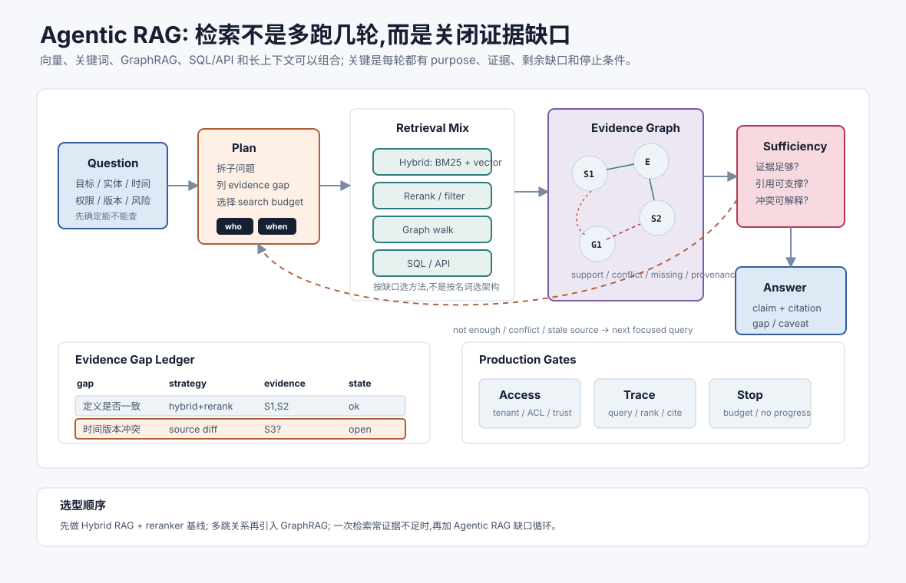

# Agentic RAG 与知识图谱 `[进阶]` ★

上一章讲过 RAG 的基础:清洗、切块、embedding、召回、重排、证据包和引用校验。

但真实问题经常不是一次检索能解决的。用户可能问一个跨文档、跨版本、跨实体关系的问题。系统需要先理解缺什么证据,再多轮检索、对比、验证和停下。

这就是 Agentic RAG 的核心:

**把检索从一次相似度查询,变成围绕证据缺口推进的受控循环。**



知识图谱、GraphRAG、结构化查询、混合检索都可以成为这个循环的一部分。关键不是名字,而是每一步是否减少了回答问题所需的不确定性。

## 为什么普通 RAG 不够

普通 RAG 常见流程是:

```text
用户问题 -> 检索 top-k -> 塞进上下文 -> 生成答案
```

它适合单点事实问题,例如“差旅政策第 4.2 条怎么写”。

但它不擅长这类问题:

- 比较新旧政策差异。
- 综合多个部门规则。
- 找出某个实体的上下游关系。
- 回答“为什么”而不是“是什么”。
- 在证据冲突时判断权威来源。
- 从大量文档中归纳主题和社区结构。

这些问题需要系统主动拆解。

## Agentic RAG 的基本循环

Agentic RAG 可以抽象成五步:

1. **理解问题**:识别实体、时间、范围、权限和答案类型。
2. **提出证据缺口**:判断要回答还缺哪些信息。
3. **选择检索策略**:向量、关键词、图谱、SQL、API 或网页。
4. **评估证据充分性**:支持、反驳、冲突、缺失。
5. **决定下一步**:继续检索、对比、验证、拒答或生成。

和普通 RAG 最大的区别是,每轮检索都有目的。

```json
{
  "round": 2,
  "purpose": "查旧版本政策,用于比较新旧审批要求",
  "query": "travel approval policy 2025 Hong Kong first class rail",
  "evidence_gap_before": "缺少旧版本基线",
  "result": "命中 2025 差旅政策第 4.2 条",
  "next_action": "compare"
}
```

如果一轮检索没有减少缺口,下一轮就应该改策略或停止,而不是机械多搜。

## GraphRAG 解决什么

GraphRAG 的核心思想是:把文本里的实体、关系、主题或社区结构抽取出来,形成图结构,再用图来辅助检索和归纳。

它适合回答:

- 某个实体和哪些概念有关?
- 多个文档围绕哪些主题聚集?
- 事件、人物、组织、产品之间有什么关系?
- 某个结论被哪些来源共同支持?
- 哪些证据属于同一社区或同一时间线?

普通向量检索看的是语义相似。图谱检索看的是关系路径。

两者互补。

## 图谱不是万能知识库

GraphRAG 常被误解成“把文档变成知识图谱,就能可靠回答”。

实际没这么简单。图谱质量取决于抽取质量、实体消歧、关系类型、来源元数据和更新机制。

常见问题包括:

- 同一实体有多个名字。
- 模型抽取出不存在的关系。
- 关系缺少时间和版本。
- 图谱边没有原文出处。
- 图谱过期但仍被检索使用。
- 社区摘要把少数证据概括过头。

所以图谱节点和边必须可回源。不能只保存 `A -> affects -> B`,还要保存这条关系来自哪个文档、哪段原文、什么时候抽取、置信度多少。

## 混合检索策略

Agentic RAG 不应该押注单一检索方式。

| 策略 | 擅长 | 不擅长 |
| --- | --- | --- |
| 向量检索 | 语义相近、表达不同 | 精确编号、实体消歧 |
| BM25/关键词 | 错误码、条款号、名字 | 近义表达和隐含关系 |
| Reranker | 精细排序 | 候选之外无法补救 |
| 图谱遍历 | 实体关系、社区、路径 | 抽取错误和过期关系 |
| SQL/API | 结构化事实、实时状态 | 非结构化语义理解 |
| 网页/外部搜索 | 最新公开信息 | 权限、安全和可信度 |

好系统会根据证据缺口选择策略。

例如“找政策条文”先 BM25 和向量;“比较新旧版本”需要版本元数据;“找某产品关联风险”可能要图谱遍历;“确认当前库存”必须查 API 或数据库。

## 查询分解

复杂问题通常要拆成子查询。

用户问:

```text
新报销政策对香港团队的一等座高铁审批有什么变化?
```

可以分解为:

1. 当前新政策中一等座高铁审批规则是什么?
2. 旧政策中对应规则是什么?
3. 香港团队是否有地区补充规则?
4. 新政策生效日期是什么?
5. 哪些变化需要用户特别注意?

分解后,每个子问题都对应一个证据缺口。这样检索不再是“搜相关内容”,而是“补齐回答所需字段”。

## 证据图谱

Agentic RAG 可以维护一个临时 evidence graph。

节点包括:

- 用户问题。
- 子问题。
- 实体。
- 文档片段。
- claim。
- 工具观察。
- 冲突或缺口。

边包括:

- supports。
- contradicts。
- refines。
- depends_on。
- newer_than。
- same_entity_as。

这个临时图谱不一定要进入长期知识库。它可以只服务于当前任务,帮助系统知道哪些 claim 已有支持、哪些还缺证据、哪些来源冲突。

## 证据充分性检查

Agentic RAG 的关键节点是 sufficiency check。

它不问“有没有相关片段”,而问“这些证据是否足以回答”。

可以检查:

- 每个主要 claim 是否有来源支持。
- 限制条件和例外是否覆盖。
- 时间、版本、地域和权限是否明确。
- 冲突证据是否解释。
- 证据是否来自可信来源。
- 是否存在必须拒答的缺口。

示例:

```json
{
  "can_answer": false,
  "supported_claims": ["当前政策要求事前审批"],
  "missing": ["旧政策对应条款", "香港团队地区补充规则"],
  "next_action": "retrieve_old_policy_and_local_addendum"
}
```

这一步能防止模型把“看起来相关”误判成“足够回答”。

## 停止条件

多轮检索必须有停止条件。

常见停止条件:

- 主要 claim 都有引用支持。
- 冲突来源已解释并有权威排序。
- 关键缺口连续多轮无法补齐。
- 检索空间已经覆盖授权来源。
- 预算耗尽。
- 需要用户澄清。
- 任务风险要求人工确认。

停止不是失败。清楚地说“缺少旧版本政策,无法比较变化”比编造变化更可靠。

## 与长期记忆的关系

Agentic RAG 产生的中间信息不一定都值得写入长期记忆。

应该写入的可能是:

- 用户明确确认的偏好。
- 可复用的检索策略。
- 高质量的领域实体别名。
- 经验证的知识库缺口。

不应该写入的通常是:

- 未验证假设。
- 一次任务里的临时候选。
- 过期网页摘要。
- 未经用户许可的敏感内容。

把每轮 RAG 中间结果都塞进记忆,会制造长期污染。

## 与长上下文的关系

长上下文能容纳更多证据,但不能替代证据选择。

Agentic RAG 负责决定哪些证据值得进入上下文、哪些只保留 artifact 引用、哪些需要图谱关系辅助。

一个实用策略是:

- 原文大对象保存在 artifact。
- 关键证据进入 evidence pack。
- 实体关系进入临时图谱。
- 答案只引用已进入证据包或可回源节点。

这样既能利用长上下文,又不让上下文变成杂物堆。

## 安全问题

Agentic RAG 因为会多轮检索,风险比普通 RAG 更高。

需要控制:

- 每轮检索继承用户权限。
- 外部网页内容不得变成系统指令。
- query rewriting 不得泄露敏感信息到外部搜索。
- 图谱抽取要保留来源和数据分类。
- 证据包压缩不能丢掉安全限制。
- 多轮失败时要停止,不能无限扩大搜索范围。

尤其在企业场景,不要让 Agent 因为“证据不足”就自动去公开互联网搜索内部问题。

## 评估 Agentic RAG

评估不能只看最终答案。还要看检索过程。

| 维度 | 问题 |
| --- | --- |
| 分解质量 | 子问题是否覆盖关键缺口? |
| 策略选择 | 是否选对向量、关键词、图谱或 API? |
| 证据推进 | 每轮是否减少缺口? |
| 停止质量 | 是否在足够时回答、不足时拒答? |
| 引用忠实 | claim 是否被证据支持? |
| 成本 | 多轮检索是否值得? |
| 安全 | 权限、来源和外部搜索是否受控? |

好的评估样本应包含多跳、冲突、缺证据和权限限制案例。只用简单问答评估,会高估 Agentic RAG。

## 一个最小实现

```python
def agentic_rag(question, user_scope):
    state = init_state(question, user_scope)

    for round_id in range(MAX_ROUNDS):
        gaps = assess_evidence_gaps(state)
        if gaps.can_answer:
            return generate_answer(state.evidence_pack)

        if gaps.needs_user:
            return ask_clarification(gaps)

        plan = choose_retrieval_plan(gaps, state)
        results = retrieve(plan, user_scope)
        state = update_evidence_graph(state, results)

        if no_information_gain(state):
            return refuse_with_gaps(state)

    return stop_with_budget_report(state)
```

这里的关键函数不是 `retrieve`,而是 `assess_evidence_gaps` 和 `no_information_gain`。它们决定系统是在补证据,还是在空转。

## 常见误解

### 误解一:Agentic RAG 就是多搜几次

不是。多轮检索必须围绕证据缺口,并有停止条件。否则只是放大噪声。

### 误解二:GraphRAG 一定比向量检索高级

不一定。图谱适合关系和社区问题,但抽取、消歧和更新成本更高。很多问题混合检索更实用。

### 误解三:图谱里的关系就是事实

不是。关系也可能由模型抽取错误或过期。每条边都应可回源、可验证。

### 误解四:长上下文来了就不需要 Agentic RAG

不对。长上下文解决容量,Agentic RAG 解决选择、验证和证据缺口管理。

### 误解五:证据不足时继续搜总会有答案

不一定。授权知识源里可能没有答案。可靠系统要能拒答或请求补充资料。

### 误解六:把所有检索过程写入长期记忆会让系统更聪明

通常会污染记忆。只有经验证、可复用、符合隐私和 scope 的信息才值得写入。

## 本章小结

Agentic RAG 把检索变成围绕证据缺口推进的循环。它会按问题拆解、选择检索策略、维护证据图谱、检查证据充分性,并在足够、受阻或预算耗尽时停止。GraphRAG 和知识图谱能增强实体关系、多跳和全局归纳能力,但必须可回源、可更新、可评估。可靠 Agentic RAG 的核心不是“更多检索”,而是“每轮检索都能解释为什么做、补了什么证据、还缺什么”。
