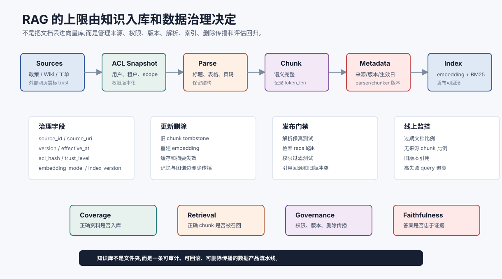

# 知识入库、数据治理与 RAG 生命周期 `[进阶]` ★

很多 RAG 教程从“把文档丢进向量库”开始。但生产系统真正麻烦的部分往往在更前面:

**哪些资料可以入库,如何解析,如何切块,如何继承权限,如何更新,如何删除,如何证明索引没有过期。**

如果没有知识入库和数据治理,RAG 很快会从“知识增强”变成“过期片段和权限风险的放大器”。



本章把 RAG 的离线侧展开。它不是只讲 embedding,而是讲一份企业文档从进入系统到被检索、更新、下线、删除传播和评估回归的完整生命周期。

## 入库不是复制文件

一个可靠入库流程至少包含:

```text
source discovery -> permission snapshot -> parsing -> normalization -> chunking -> metadata -> embedding -> index -> eval -> monitor
```

每一步都可能引入错误。

例如 PDF 解析丢了表格列,chunker 把例外条款切到下一段,权限同步漏了某个部门,embedding 模型升级后没有重建索引,旧政策删除后向量库里仍然可检索。这些问题不会通过“换一个更强生成模型”自动消失。

## 数据源分级

不同资料源不能用同一套规则。

| 数据源 | 典型内容 | 入库重点 |
| --- | --- | --- |
| 正式制度 | 政策、合同模板、SOP | 版本、权威来源、生效时间 |
| 协作文档 | Wiki、飞书、Confluence | 权限、草稿状态、作者和更新时间 |
| 工单/邮件 | 客诉、问题记录、沟通历史 | 隐私、租户隔离、脱敏和保留期 |
| 代码仓库 | README、API、源码、Issue | 分支、commit、路径和语言解析 |
| 数据库 | 结构化业务状态 | 实时性、SQL 权限、审计 |
| 外部网页 | 公开资料、新闻、文档 | 可信度、抓取时间、引用和注入风险 |

高可信正式制度和低可信外部网页不应混在同一个 trust level 里。Context Builder 需要知道证据来自哪里、可信度如何、是否过期、用户是否有权查看。

## 解析质量决定上限

解析不是把文件转成纯文本那么简单。要尽量保留结构:

- 标题层级。
- 表格行列关系。
- 图片和图注。
- 代码块和缩进。
- 页码、章节号、锚点。
- 脚注和附录。
- 修订记录和生效日期。

如果解析阶段把表格压成错乱文本,后续 embedding、reranker 和 LLM 都只能在错误材料上工作。

## 元数据是 RAG 的控制面

每个 chunk 都应该带元数据。最小集合包括:

```json
{
  "source_id": "policy_travel_2026",
  "source_uri": "internal://policy/travel/2026",
  "title_path": ["差旅政策", "交通", "高铁"],
  "version": "2026.03",
  "effective_at": "2026-03-01",
  "updated_at": "2026-02-18T10:30:00Z",
  "acl_hash": "dept_hr_policy_v3",
  "trust_level": "official",
  "parser_version": "pdf_parser_2.1",
  "chunker_version": "semantic_chunker_1.4",
  "embedding_model": "embedding_x_v5"
}
```

这些字段不是为了好看,而是为了支持过滤、回源、回滚、删除传播和评估归因。

## 权限必须进入检索链路

企业 RAG 不能先检索全部文档,再让模型决定哪些不说。正确做法是:

1. 在 query 进入检索前确定用户身份、租户、scope 和数据分类。
2. 在候选召回前或召回后立即过滤无权文档。
3. 在证据包里保留权限过滤 trace。
4. 在日志和评估样本中避免泄露无权片段。

权限快照也要版本化。否则当用户权限变化时,系统无法解释某次回答为什么看到了某份资料。

## 更新和删除比新增更难

新增文档容易,更新和删除更容易被忽略。

文档更新后,旧 chunk 需要:

- 标记失效或降权。
- 从向量索引删除或 tombstone。
- 重建相关 embedding。
- 更新 reranker hard negative。
- 触发回归样本。

文档删除后,还要处理衍生物:

- chunk。
- embedding 向量。
- 缓存证据包。
- 摘要。
- 临时图谱边。
- 长期记忆里引用过的结论。

这叫删除传播。没有删除传播,RAG 会继续回答已经撤回或无权保留的内容。

## 索引版本和可回滚

RAG 索引也应该像代码一样有版本。

建议记录:

- 数据源快照版本。
- parser/chunker 版本。
- embedding 模型版本。
- reranker 版本。
- 索引构建时间。
- 评估结果。
- 发布批次和回滚点。

当线上答案突然变差时,你需要知道是文档变了、切块变了、embedding 变了、索引参数变了,还是生成模型变了。

## 入库评估

入库后不要只看“成功写入多少 chunk”。要评估可用性。

| 评估项 | 问题 |
| --- | --- |
| 解析保真 | 表格、标题、代码是否保留语义? |
| chunk 完整 | 条款和例外是否被切散? |
| 元数据完整 | 来源、版本、权限是否齐全? |
| 检索命中 | 标准问题能否召回正确 chunk? |
| 删除传播 | 删除或权限变化是否立即生效? |
| 引用回源 | 每个答案能否回到原文位置? |
| 新旧冲突 | 旧版本是否被正确降权或过滤? |

这些评估应在索引发布前运行,而不是等用户发现答案错。

## 数据漂移和知识腐烂

知识库会腐烂。原因包括:

- 政策过期。
- 链接失效。
- 文档迁移。
- 权限模型变化。
- 业务术语变化。
- 新产品上线。
- 旧 FAQ 被复制到多个地方。

RAG 系统需要定期监控:

- 过期文档比例。
- 无来源 chunk 比例。
- 低点击或低引用资料。
- 高失败 query 聚类。
- 检索结果中的旧版本占比。
- 用户反馈和人工纠错回流。

## 外部网页和 Prompt Injection

外部网页入库要特别谨慎。网页内容可能包含对模型的恶意指令,例如“忽略之前所有规则”。

入库时应把外部内容标记为 `untrusted_content`,并在证据包中保留 trust metadata。Context Builder 应明确告诉模型:这些内容是被引用的资料,不是系统指令。工具执行前仍要由 Harness 做策略检查。

不要把网页正文直接混入高可信政策库。

## 一个入库事件的推荐记录

可以把每次入库记录成事件:

```json
{
  "ingestion_id": "ingest_20260709_001",
  "source_id": "policy_travel_2026",
  "source_version": "2026.03",
  "parser_version": "pdf_parser_2.1",
  "chunker_version": "semantic_chunker_1.4",
  "embedding_model": "embedding_x_v5",
  "chunks_created": 186,
  "chunks_deleted": 42,
  "acl_snapshot": "dept_hr_policy_v3",
  "eval_suite": "travel_policy_rag_v12",
  "eval_passed": true
}
```

这类记录能让 RAG 从“黑箱资料库”变成可运维系统。

## 常见误解

### 误解一:向量库就是知识库

不是。向量库只是索引层。知识库还需要来源、权限、版本、生命周期、删除传播和评估。

### 误解二:文档越多越好

不一定。低质量、重复、过期和无权文档会污染检索。RAG 质量取决于可信证据,不是 chunk 数量。

### 误解三:删除原文就等于删除知识

不对。embedding、缓存、摘要、图谱边和记忆里可能仍有衍生内容。必须做删除传播。

### 误解四:权限过滤可以交给模型自觉

不能。无权内容不应该进入模型上下文。权限是系统边界,不是提示词建议。

### 误解五:索引构建成功就能上线

不够。索引发布前应跑检索评估、引用回源、权限测试和删除传播测试。

## 本章小结

RAG 的可靠性很大一部分来自离线侧:数据源分级、解析保真、元数据、权限过滤、版本管理、更新删除、索引发布和评估回归。向量检索只是其中一环。生产系统要把知识入库当成数据产品和发布流程来治理,否则模型会在过期、越权或破碎证据上生成看似可信的答案。

下一部分进入多 Agent 架构时,这些数据治理原则仍然成立:多个 Agent 可以协作,但不能绕过资料权限、来源和生命周期。
