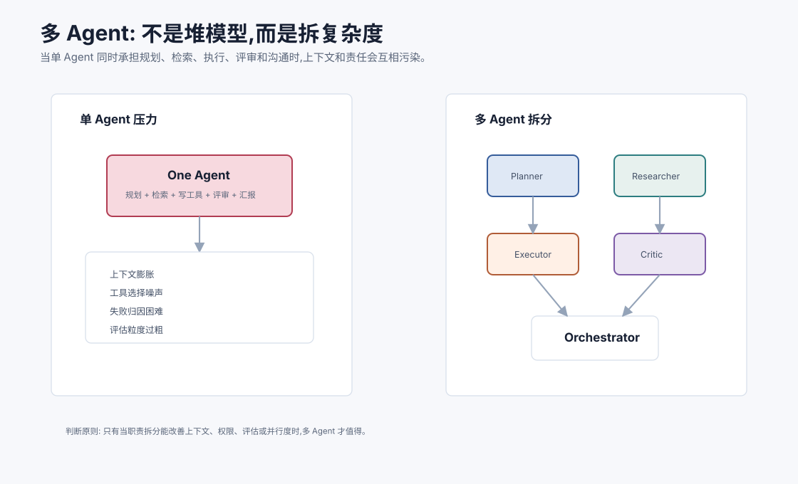
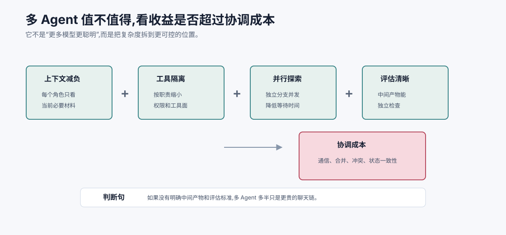
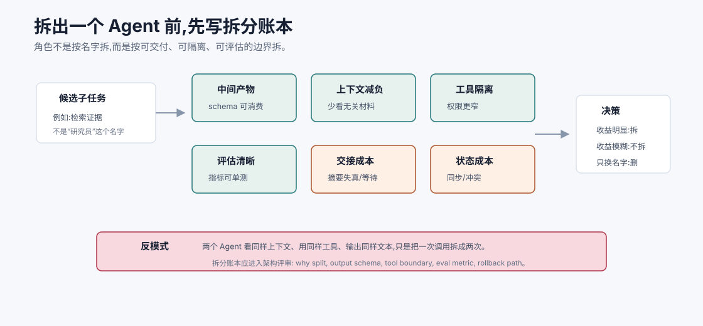
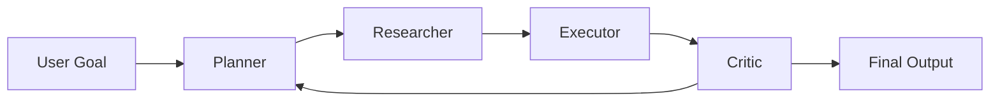
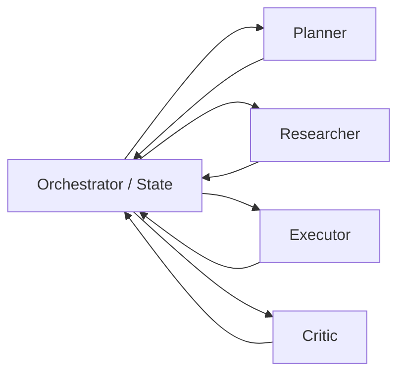
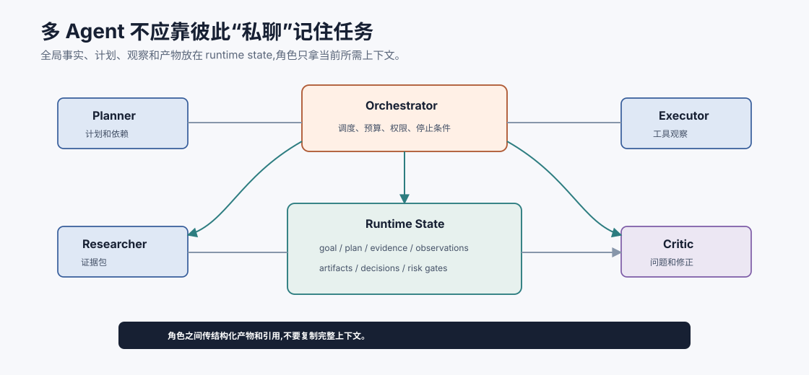
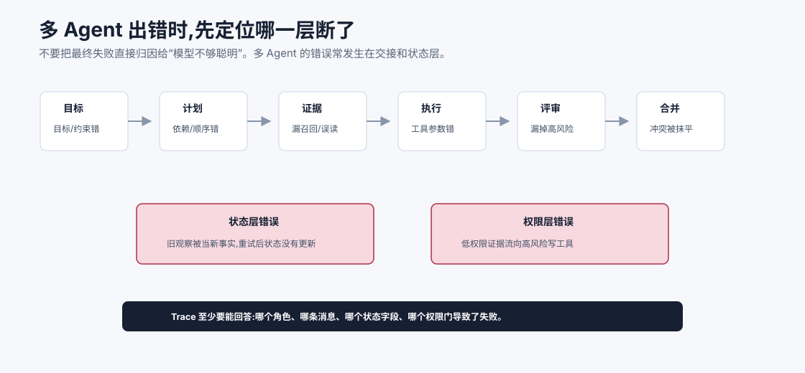

# 为什么需要多 Agent `[主线]`

前面几篇一直在讲单个 Agent 如何具备能力:循环、工具、规划、记忆、RAG、反思和上下文工程。

读到这里,很自然会出现一个问题:

**既然一个 Agent 已经能规划、检索、调用工具和自我修正,为什么还需要多 Agent?**

答案不是“多 Agent 更高级”。多 Agent 的本质不是堆更多模型,而是把一个复杂任务拆成多个职责清晰、上下文更小、权限更窄、评估更明确的协作单元。



本章会讲:

- 单 Agent 在复杂任务中会遇到哪些瓶颈。
- 多 Agent 真正解决的是哪些工程问题。
- 多 Agent 不适合什么场景。
- 如何判断一个任务该用单 Agent、workflow 还是多 Agent。
- 多 Agent 会引入哪些新复杂度。
- 一个实用的选型检查表。

## 单 Agent 的上限

单 Agent 的优势是简单。

它有一个上下文、一个状态、一个工具集、一个决策循环。对于很多任务,这已经足够:

- 查询一个政策并回答。
- 修复一个小 bug。
- 总结一份文档。
- 根据用户输入生成一个结构化草稿。
- 执行一个短工作流。

但任务变长、变复杂后,单 Agent 会面临几类压力。

## 上下文压力

复杂任务需要很多信息同时存在:

- 用户目标和限制。
- 项目背景。
- 检索证据。
- 工具结果。
- 当前计划。
- 失败历史。
- 评审标准。
- 输出格式。

如果都塞给一个 Agent,上下文会膨胀。上下文一长,问题不只是 token 成本变高,还包括:

- 关键信息被噪声淹没。
- 工具说明干扰主要任务。
- 旧假设污染新判断。
- 证据、指令和记忆层级混乱。
- 模型很难稳定关注当前步骤。

多 Agent 的一个价值是把上下文局部化。例如 Researcher 只看检索任务所需材料,Critic 只看候选答案和评审标准,Executor 只看执行所需状态和工具契约。

## 工具压力

单 Agent 如果同时拥有很多工具,工具选择会变难。

例如一个企业助手可能有:

- 搜索文档。
- 查数据库。
- 发邮件。
- 改工单。
- 创建退款草稿。
- 调用代码仓库。
- 运行测试。
- 发布公告。

工具越多,误选和误用概率越高。即使每个工具单独设计得很好,组合起来也可能带来数据流风险。

多 Agent 可以按职责限制工具面:

| 角色 | 工具面 |
| --- | --- |
| Researcher | 只读搜索、文档、数据库查询 |
| Planner | 无写工具,只产出计划 |
| Executor | 只访问任务相关写工具 |
| Critic | 只读证据和轨迹,不执行副作用 |
| Coordinator | 调度和合并,不直接访问高风险工具 |

工具权限变窄后,系统更容易做权限控制、审计和故障隔离。

## 职责压力

单 Agent 常常被要求同时扮演多个角色:

```text
你负责理解需求、拆解任务、查资料、写代码、运行测试、评审质量、向用户汇报。
```

这在简单任务里可行,但复杂任务中容易出现角色冲突:

- 生成者不愿意否定自己的方案。
- 执行者为了完成任务忽略风险。
- 检索者带着计划偏见只找支持材料。
- 评审标准在执行过程中被遗忘。

多 Agent 可以把职责拆开,让不同角色拥有不同目标和评估标准。

例如:

- Planner 目标:产出可执行计划和风险点。
- Researcher 目标:找证据,不急着下结论。
- Executor 目标:按计划完成动作并记录观察。
- Critic 目标:检查证据、边界和失败模式。

这不是为了模拟人类组织,而是为了降低同一个上下文里目标互相干扰。

## 并行压力

有些任务天然可以并行。

例如调研一个技术方案:

- 一个 Agent 查官方文档。
- 一个 Agent 查社区实践。
- 一个 Agent 查竞品或论文。
- 一个 Agent 做风险评审。

如果单 Agent 顺序执行,等待时间会变长。多 Agent 可以并发探索不同分支,最后由汇总者合并。

但并行不是免费午餐。它会增加成本、合并难度和一致性问题。适合并行的任务通常满足:

- 子任务相对独立。
- 结果可以结构化合并。
- 有明确去重和冲突处理。
- 并发成本低于等待成本。

## 评估压力

单 Agent 端到端完成任务后,如果结果错了,很难判断错在哪里。

是计划错、检索错、工具参数错、证据误读、还是最终表达错?

多 Agent 把任务拆成角色后,评估粒度会更细:

| 环节 | 可评估问题 |
| --- | --- |
| Planner | 计划是否覆盖目标、风险和依赖? |
| Researcher | 是否找到了正确证据,有没有遗漏反证? |
| Executor | 工具调用是否正确、幂等、可恢复? |
| Critic | 是否发现了关键错误和不确定性? |
| Summarizer | 是否忠实整合各方产物? |

这对生产系统非常重要。可评估性往往比模型“看起来聪明”更关键。

## 多 Agent 解决的不是智商问题

多 Agent 最容易被误解成:

```text
一个模型不够聪明,那就让几个模型一起想。
```

这有时有效,但不是核心。

多 Agent 真正解决的是系统设计问题:

- 降低单次上下文复杂度。
- 缩小工具权限面。
- 分离冲突职责。
- 支持并行探索。
- 让中间产物可评估。
- 让失败更容易归因。
- 让高风险动作有独立评审。

如果这些问题不存在,多 Agent 可能只是增加复杂度。

## 什么时候不需要多 Agent

以下情况通常不需要多 Agent:

- 任务很短,一次或几次调用就能完成。
- 路径确定,workflow 更简单可靠。
- 工具少且风险低。
- 输出只有一个简单结果。
- 不需要并行探索。
- 没有明确的角色评估标准。
- 团队还没有做好单 Agent 的状态、工具和评估。

多 Agent 不能替代基础工程。单 Agent 的上下文、工具、评估都没做好时,拆成多个 Agent 往往只会把混乱复制多份。

## Workflow、单 Agent、多 Agent

可以用下面表格做初步判断。

| 场景 | 更适合 |
| --- | --- |
| 步骤固定、规则明确、高风险 | Workflow |
| 步骤不完全确定,但任务范围较小 | 单 Agent |
| 需要探索、检索、执行、评审分离 | 多 Agent |
| 多个独立子问题可并行 | 多 Agent |
| 每一步都可程序化判断 | Workflow |
| 高风险动作需要人类确认 | Workflow + Human |
| 复杂任务中局部需要自主探索 | Workflow + Agent 或多 Agent |

不要把多 Agent 当成 workflow 的替代品。很多可靠系统是混合架构:

```text
Workflow 控制主流程和安全边界,Agent 在局部处理不确定任务。
```

例如报销系统可以是:

- Workflow 管审批、权限、提交和审计。
- Research Agent 查政策和历史案例。
- Draft Agent 生成说明草稿。
- Critic Agent 检查证据和风险。

最终提交仍由 workflow 和用户确认控制。

## 一个判断公式

可以用一个粗略公式理解多 Agent 是否值得:

$$
value = context\_relief + tool\_isolation + parallelism + eval\_clarity - coordination\_cost
$$

含义是:

- `context_relief`:拆分后上下文是否更清楚。
- `tool_isolation`:工具权限是否更安全。
- `parallelism`:是否显著降低等待时间。
- `eval_clarity`:中间产物是否更容易评估。
- `coordination_cost`:通信、合并、冲突和调度成本。

如果前四项不明显,但协调成本很高,就不要上多 Agent。



这张图把“要不要多 Agent”从审美问题变成工程算账。多 Agent 的收益主要来自四件事:上下文减负、工具隔离、并行探索和评估清晰。只要其中一项不成立,就要警惕是不是在为复杂而复杂。比如两个 Agent 看到同样上下文、拿同样工具、输出同样格式,那它们没有减少复杂度,只是把一次模型调用拆成两次。

协调成本也不能低估。多 Agent 每多一层交接,就多一次摘要失真、状态不同步、冲突仲裁和预算消耗。真正值得拆的子任务,应该能产出一个下游可消费、系统可校验、失败可归因的中间产物。

## 拆分账本:每拆一个角色,都要说明收益

多 Agent 最危险的起点是“我们需要一个 Planner、一个 Researcher、一个 Critic”。这些名字听起来合理,但它们不能证明系统应该拆。更好的做法是为每个候选角色写一张拆分账本。



拆分账本至少回答五个问题:

| 问题 | 说明 | 不成立时的信号 |
| --- | --- | --- |
| 中间产物是什么 | 下游能否消费这个角色的输出 | 只输出一段泛泛建议 |
| 上下文是否减负 | 角色是否少看了无关信息 | 每个角色仍拿全量上下文 |
| 工具是否隔离 | 权限面是否真的变窄 | 所有角色都能调用所有工具 |
| 是否可独立评估 | 能否给该产物设计指标或测试 | 只能凭最终答案判断好坏 |
| 协调成本多大 | 交接、合并、冲突和等待是否可控 | 多次转述后限制条件丢失 |

例如“Researcher”值得拆,不是因为这个名字专业,而是因为它可以产出 `evidence_pack.v1`:包含 claim、source、version、confidence 和 gap。这个产物能被 Critic 评审,能被 Synthesizer 引用,也能被 RAG 评估集复用。反过来,如果一个“Advisor Agent”只是把同样的上下文再读一遍,输出一段没有 schema 的建议,它就没有架构价值。

拆分账本也应该记录不拆的决定。很多系统后期混乱,是因为早期为了显得“智能”创建了太多角色。保留“为什么没有拆”的记录,能帮助团队在复杂度上保持克制:当上下文压力、权限压力或评估压力真的出现时再拆,而不是先拆再找理由。

## 拆分单位:中间产物,不是角色名

判断是否该拆 Agent,还有一个很实用的问题:

```text
这个子任务能否产出一个可被下游消费、可被独立评估的中间产物?
```

如果答案是否定的,拆出来的 Agent 往往只是多一次聊天。

好的拆分单位通常有明确产物:

| 子任务 | 中间产物 |
| --- | --- |
| 资料检索 | 带来源和缺口的 evidence pack |
| 任务规划 | 带依赖、风险和完成标准的 plan |
| 工具执行 | 带参数来源、状态和 artifact 的 observation |
| 质量评审 | 带 severity、依据和修改要求的 critique |
| 最终汇总 | 带引用、不确定性和下一步的 final answer |

如果一个 Agent 的输出无法被 schema 校验、无法被下游明确使用、无法判断好坏,它就不是架构上的角色,只是一个额外模型调用。

## 多 Agent 的新问题

多 Agent 会引入新的复杂度。

### 1. 通信失真

一个 Agent 的输出会成为另一个 Agent 的输入。中间如果摘要丢失条件、证据编号错、置信度没传递,错误会被放大。

### 2. 责任不清

如果每个 Agent 都“负责解决问题”,最后没人真正负责结果。角色必须有边界。

### 3. 成本上升

多个 Agent 意味着更多模型调用、更多上下文、更多工具调用和更多评审节点。

### 4. 冲突处理

不同 Agent 可能给出不同结论。系统需要规则决定如何合并、仲裁或升级。

### 5. 状态一致性

多个 Agent 同时读写状态,可能出现过期观察、重复执行或写冲突。

### 6. 安全边界复杂

一个低权限 Agent 的信息可能通过消息传给高权限 Agent,导致数据流策略失效。

所以多 Agent 的关键不是“多”,而是协议、编排、状态和权限。

## 最小多 Agent 架构

一个常见的最小架构是三角色:



但真实系统通常会让 Orchestrator 持有全局状态:



这种结构更容易审计和恢复。Agent 之间不直接私下传递全部上下文,而是通过状态和消息协议交换必要信息。



多 Agent 系统最容易失控的形态,是角色之间互相转发长篇自然语言,每个角色都维护一份自己理解的“事实”。几轮之后,谁看过什么、哪个结论被采纳、哪个假设已废弃,都会变得模糊。更可靠的方式是让 Orchestrator 或 runtime 持有权威状态,角色只通过结构化消息写回计划、证据、观察、评审和 artifact 引用。

这样做有一个直接好处:失败可以回放。你可以看到 Researcher 写入了哪些证据,Executor 基于哪个计划调用了什么工具,Critic 阻止了哪个风险动作。没有共享权威状态,多 Agent 很难从实验走向生产。

## 失败归因:不要把所有错都怪最终回答

多 Agent 系统的一个好处是失败可拆解,但前提是系统真的保存了中间产物和状态变化。否则多个 Agent 只会让错误更难定位:看起来大家都做了事,最后却不知道是哪一步把任务带偏。



一次多 Agent 失败至少可以沿着八层排查:

| 层 | 典型问题 | 应看什么 trace |
| --- | --- | --- |
| 目标 | 用户目标或完成标准被误解 | 原始任务、目标重写记录 |
| 计划 | 步骤依赖、风险控制或停止条件错 | plan schema、depends_on、done_when |
| 证据 | Researcher 漏召回、误读或没标注来源 | evidence_pack、query、source version |
| 执行 | Executor 参数错、工具失败或副作用未知 | tool_call、observation、idempotency key |
| 评审 | Critic 没按 rubric 发现问题 | critique、rubric、blocked_reason |
| 合并 | Synthesizer 抹平冲突或隐藏不确定性 | final claims 到 evidence 的映射 |
| 状态 | 旧观察覆盖新事实,重试后状态没更新 | state diff、event log |
| 权限 | 低权限信息流向高风险工具 | data_classification、allowed_tools |

这张漏斗能让多 Agent 的“复杂”变成“可归因”。例如最终答案错说“可以退款”,不一定是 Synthesizer 的错。可能是 Researcher 没找到地区例外,也可能是 Critic 看到了例外但没有阻塞,还可能是合并阶段删掉了“不足以判断”的说明。每一层的修法不同:缺证据要修检索,工具参数错要修执行契约,状态错要修 runtime,权限错要修消息流策略。

所以多 Agent 的 trace 不应该只保存对话文本。它应该保存 `message_id`、`role`、`input_context_pack_id`、`output_schema_version`、`state_diff`、`artifact_refs`、`permission_decision` 和 `eval_result`。当这些字段齐全时,多 Agent 才真的比单 Agent 更容易治理。

## 设计检查表

在决定使用多 Agent 前,可以问:

- 是否存在清晰可分的职责?
- 每个角色是否有独立输入、输出和成功标准?
- 是否能减少单个 Agent 的上下文噪声?
- 是否能缩小工具权限面?
- 是否有需要并行探索的子任务?
- 是否有明确的合并和冲突处理规则?
- 是否能保存完整 trace?
- 成本和延迟是否可接受?
- 失败时能否定位到具体角色或环节?
- 高风险动作是否仍由 runtime、workflow 或人类确认控制?

如果这些问题答不上来,先不要急着拆 Agent。

## 常见误解

### 误解一:多 Agent 一定比单 Agent 强

不一定。对于短任务,多 Agent 可能更慢、更贵、更不稳定。

### 误解二:多 Agent 就是让几个模型聊天

不是。生产多 Agent 需要角色契约、消息协议、状态管理、权限和评估。

### 误解三:角色越多越专业

角色过多会带来通信成本和责任稀释。角色数量应由任务结构决定。

### 误解四:Critic Agent 能自动保证质量

Critic 也会错。它需要明确 rubric、证据、测试或规则支持。

### 误解五:多 Agent 可以绕过工具安全设计

不能。每个 Agent 的工具权限和数据流边界都要由 runtime 控制。

## 本章小结

多 Agent 的价值不是堆更多模型,而是拆复杂度。它适合上下文压力大、工具权限需要隔离、职责容易冲突、子任务可并行、评估需要拆解的复杂任务。多 Agent 同时会带来通信、协调、成本、状态一致性和安全边界问题。判断是否使用多 Agent,要看它是否真正提升上下文清晰度、工具隔离、并行度和评估粒度,而不是看它听起来是否更高级。

下一章会讲角色分工与职责设计。多 Agent 能否可靠,首先取决于每个角色是否有清晰边界和可验证的交付物。
