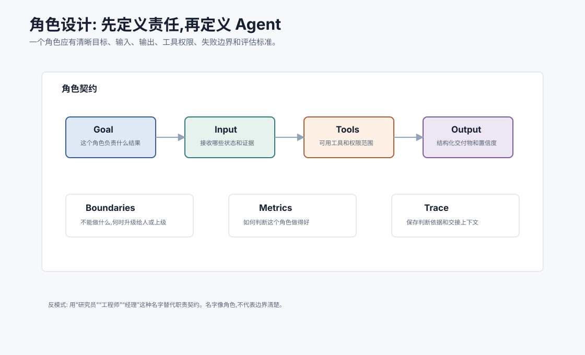
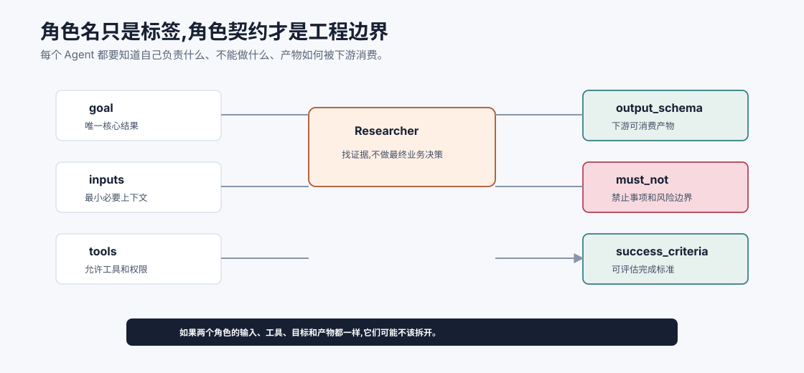
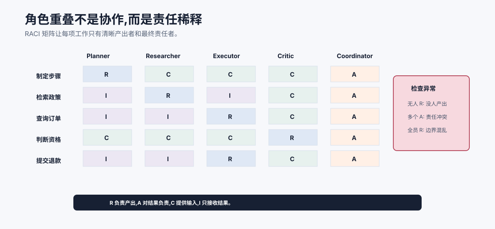

# 角色分工与职责设计 `[进阶]`

多 Agent 系统最常见的失败,不是模型不会回答,而是角色边界混乱。

很多系统会定义一些听起来很自然的角色:

```text
产品经理 Agent、架构师 Agent、工程师 Agent、测试 Agent、评审 Agent
```

这些名字有启发性,但还不够。真正重要的是每个角色的**职责契约**:

**它负责什么结果,接收什么输入,能用什么工具,输出什么结构,不能做什么,如何评估。**



本章会讲:

- 为什么角色名不等于角色设计。
- 一个 Agent 角色契约应该包含哪些字段。
- 如何划分 Planner、Researcher、Executor、Critic 等常见角色。
- 角色边界如何和工具权限、上下文工程、评估绑定。
- 常见反模式和设计检查表。

## 角色不是人格,而是责任边界

在多 Agent 系统里,“角色”不是为了让模型像某类人一样说话。

角色的工程含义是:

```text
在某个任务阶段,一个具备特定输入、工具、目标和输出契约的决策单元。
```

这句话里有几个关键词:

- 特定阶段:角色不一定参与全部流程。
- 特定输入:不是所有上下文都给它。
- 特定工具:权限按职责最小化。
- 特定目标:不要让它同时追求冲突目标。
- 输出契约:交付物必须能被下游使用和评估。

如果一个角色没有这些边界,它只是一个换了名字的通用 Agent。

## 角色契约

一个实用角色契约可以写成:

```json
{
  "role": "Researcher",
  "goal": "Find evidence relevant to the current question, including conflicting evidence.",
  "inputs": ["task_goal", "query_context", "allowed_sources"],
  "tools": ["search_docs", "read_document"],
  "output_schema": {
    "claims": "array",
    "evidence": "array",
    "gaps": "array",
    "confidence": "number"
  },
  "must_not": ["make final business decision", "call write tools"],
  "success_criteria": ["relevant evidence found", "sources cited", "uncertainty stated"]
}
```

这比一句“你是研究员”强得多。



这张图说明角色设计的关键不是角色名,而是契约字段。`Researcher` 这个名字只是一种提示,真正决定系统行为的是它的输入范围、可用工具、输出 schema、禁止事项和成功标准。没有这些字段,角色就会退化成“另一个通用 Agent”。

角色契约还决定了上下文工程。Planner 不需要完整工具返回日志,Researcher 不需要写工具,Executor 不需要看到全部评审 rubric,Critic 不需要拿到提交权限。把信息和权限按契约裁剪,比在 prompt 里反复提醒“请谨慎”更可靠。

## 常见角色

下面是多 Agent 系统中常见角色,但不要机械照搬。

| 角色 | 主要职责 | 不应负责 |
| --- | --- | --- |
| Planner | 拆任务、识别依赖、设定完成标准 | 直接执行高风险工具 |
| Researcher | 检索资料、整理证据、指出缺口 | 做最终决策或编造证据 |
| Executor | 按计划调用工具、记录观察 | 自行扩大目标或跳过确认 |
| Critic | 根据 rubric 检查输出和过程 | 无标准地泛泛挑错 |
| Synthesizer | 合并多方结果、生成最终表达 | 隐藏冲突或不确定性 |
| Coordinator | 调度角色、维护状态、处理冲突 | 代替所有角色做细节任务 |

角色不是越多越好。每增加一个角色,就增加一次通信、一次状态同步和一次失败可能。

## 用责任矩阵防止角色重叠

角色一多,最容易出现“每个人都参与,但没人负责”的情况。可以借鉴 RACI 思路定义责任矩阵:

| 标记 | 含义 |
| --- | --- |
| R Responsible | 具体产出者 |
| A Accountable | 对最终结果负责者 |
| C Consulted | 提供输入或评审意见 |
| I Informed | 只需要被告知结果 |

例如退款判断任务:

| 工作项 | Planner | Researcher | Executor | Critic | Coordinator |
| --- | --- | --- | --- | --- | --- |
| 制定步骤 | R | C | C | C | A |
| 检索政策 | I | R | I | C | A |
| 查询订单 | I | I | R | C | A |
| 判断资格 | C | C | C | R | A |
| 提交退款 | I | I | R | C | A |

这张表能暴露两个问题:是否有多个角色同时对同一结果负责,是否有某个关键工作无人负责。多 Agent 的混乱常常不是推理问题,而是责任矩阵没画出来。



RACI 矩阵的价值在于暴露“看起来协作,实际没人负责”的地方。每个工作项至少要有一个 Responsible,并且最终责任 Accountable 最好清晰集中。如果多个角色都对最终判断负责,冲突时就容易互相覆盖;如果所有角色都 Responsible,说明边界没有设计出来。

在 Agent 系统里,RACI 还可以和权限绑定。负责执行写工具的 Executor 可以有草稿创建权限,但不一定有提交权限;负责评审的 Critic 可以阻塞高风险动作,但不应该直接执行动作。责任边界、工具边界和评估边界最好一起设计。

## Planner:计划者

Planner 的目标不是写一份漂亮计划,而是降低执行的不确定性。

好的 Planner 输出应包含:

- 任务拆解。
- 步骤依赖。
- 所需证据。
- 所需工具。
- 风险点。
- 完成标准。
- 需要用户确认的节点。

示例输出:

```json
{
  "objective": "Determine whether the order can be refunded and prepare a draft if eligible.",
  "steps": [
    {"id": "s1", "owner": "Researcher", "task": "Retrieve refund policy", "done_when": "policy evidence with version is found"},
    {"id": "s2", "owner": "Executor", "task": "Read order and shipment status", "done_when": "order status is verified"},
    {"id": "s3", "owner": "Critic", "task": "Check eligibility decision", "depends_on": ["s1", "s2"]}
  ],
  "risk_controls": ["No refund submission before user confirmation"]
}
```

Planner 不应拥有所有写工具。否则它很容易一边计划一边执行,边界就消失了。

## Researcher:研究者

Researcher 负责找证据,不是负责让答案成立。

它应该主动寻找:

- 支持证据。
- 反证。
- 版本信息。
- 来源可信度。
- 证据缺口。

好的 Researcher 输出不是一段总结,而是证据包:

```json
{
  "claim_candidates": [
    {
      "claim": "High-speed rail first-class seats require prior department approval.",
      "evidence_ids": ["S1"],
      "confidence": 0.87
    }
  ],
  "evidence": [
    {"id": "S1", "source": "travel_policy_2026#4.2", "status": "published", "quote": "..."}
  ],
  "gaps": ["No policy found for post-approval exception."],
  "conflicts": []
}
```

如果 Researcher 直接输出“可以报销”,下游很难知道依据是什么。

## Executor:执行者

Executor 负责和外部系统交互。

它的重点是:

- 按计划调用工具。
- 校验参数来源。
- 尊重权限和确认。
- 记录事件日志。
- 处理错误和重试。
- 返回可验证观察。

Executor 输出应区分“工具观察”和“模型推断”。

```json
{
  "action": "get_order",
  "status": "ok",
  "observation": {
    "order_id": "HK-2026-00018",
    "shipping_status": "delayed_5_days"
  },
  "inference": "The delay may satisfy the refund condition, pending policy check.",
  "artifact": "tool-result://42"
}
```

Executor 不应为了完成任务而自行绕过风险控制。高风险动作仍要交给 workflow、runtime 或用户确认。

## Critic:评审者

Critic 的价值来自标准,不是来自“再问一个模型”。

一个有效 Critic 应该有 rubric:

```text
检查:
1. 结论是否由证据支持。
2. 是否遗漏关键限制条件。
3. 是否使用了过期或无权限资料。
4. 是否存在未确认的副作用动作。
5. 是否说明不确定性和下一步。
```

Critic 输出也应结构化:

```json
{
  "verdict": "revise_required",
  "issues": [
    {"severity": "high", "finding": "The draft says refund is allowed, but evidence only says draft can be created after approval.", "evidence": ["S1"]}
  ],
  "required_changes": ["Change final decision to pending approval"]
}
```

没有 rubric 的 Critic 容易变成“挑一些看起来像问题的问题”。

## Synthesizer:汇总者

Synthesizer 负责把多个角色的产物合成最终输出。

它不能简单平均意见。它要保留:

- 主要结论。
- 支持证据。
- 冲突证据。
- 不确定性。
- 已执行动作。
- 未完成项。
- 用户下一步需要做什么。

当 Researcher 和 Critic 冲突时,Synthesizer 应说明冲突,而不是选择更顺耳的答案。

## Coordinator:协调者

Coordinator 维护全局状态和调度。

它关注:

- 当前目标。
- 每个角色的任务状态。
- 消息路由。
- 预算和超时。
- 冲突仲裁。
- 何时停止。
- 何时请求用户。

Coordinator 不一定是 LLM。很多时候它是 deterministic runtime 或 workflow。

这很重要:多 Agent 系统不应该所有控制权都交给模型。状态、权限、预算和停止条件最好由 runtime 管。

## 按信息边界划分角色

一种实用划分方式是看信息边界。

不同角色需要看的信息不同:

| 信息 | Planner | Researcher | Executor | Critic |
| --- | --- | --- | --- | --- |
| 用户目标 | 需要 | 需要 | 需要摘要 | 需要 |
| 全部工具 schema | 不需要 | 不需要 | 只需相关工具 | 不需要 |
| 检索证据 | 需要摘要 | 需要详细 | 需要引用 | 需要详细 |
| 写工具权限 | 不需要 | 不需要 | 需要 | 不需要 |
| 评审 rubric | 需要摘要 | 可选 | 可选 | 需要详细 |
| 原始日志 | 需要摘要 | 可选 | 需要 | 需要可回源 |

如果两个角色需要完全相同的上下文、工具和目标,它们可能不该分开。

## 按权限边界划分角色

权限是划分角色的另一个强信号。

例如:

- 只读 Agent 可以访问文档和数据库查询。
- 写入 Agent 只能执行草稿创建,不能提交。
- 发布 Agent 需要用户确认和高权限 token。
- Critic Agent 没有写权限。

这样即使 Researcher 被外部文档注入诱导,它也没有写工具可以造成副作用。

## 按评估边界划分角色

如果一个子任务能被独立评估,它适合拆成角色。

例如:

- 检索证据可以用 recall 和引用质量评估。
- 计划可以用覆盖率、依赖和风险识别评估。
- 执行可以用工具成功率、参数正确率和副作用事故率评估。
- 评审可以用问题发现率和误报率评估。

如果无法定义某个角色的成功标准,就很难知道它是否有价值。

## 角色交接

角色之间不应该只传一段自然语言。

交接内容至少包括:

- 当前任务目标。
- 本角色完成了什么。
- 关键证据或观察。
- 不确定性和缺口。
- 下游需要注意的约束。
- artifact 或 trace 引用。
- 输出结构版本。

例如 Researcher 交给 Critic:

```json
{
  "handoff_type": "evidence_pack",
  "task_id": "refund_eligibility_17",
  "claims": [...],
  "evidence": [...],
  "gaps": ["No approval record found"],
  "constraints": ["Do not submit refund"],
  "trace": "trace://research_17"
}
```

结构化交接可以减少失真。

## 角色数量如何控制

角色数量要从复杂度中推导。

可以从单 Agent 开始,当出现以下问题时再拆:

- 上下文里混入大量与当前步骤无关的信息。
- 工具权限面过大。
- 生成和评审互相干扰。
- 某个子任务需要独立评估。
- 子任务可以并行。
- 失败归因总是模糊。

不要一开始就创建十几个角色。角色越多,通信越复杂。

## 常见反模式

### 1. 角色名很丰富,契约很空

例如“战略家”“执行官”“顾问”,但没有输入输出和工具边界。

### 2. 所有角色都能调用所有工具

这会让权限拆分失去意义。

### 3. Critic 没有标准

Critic 只会泛泛说“可以更详细”“需要更准确”,不能提供可执行修正。

### 4. Planner 输出不可执行

计划很宏大,但没有依赖、完成标准和风险控制。

### 5. 交接靠长篇自然语言

下游需要重新解析,容易丢证据和限制条件。

### 6. 角色互相覆盖

两个角色都负责最终判断,冲突时没有仲裁规则。

## 角色设计检查表

为每个角色回答:

- 它负责的唯一核心结果是什么?
- 它需要哪些输入,哪些不该看到?
- 它能使用哪些工具,哪些工具禁止?
- 它输出什么 schema?
- 下游如何消费它的输出?
- 它什么时候应该停止或升级?
- 它如何记录 trace?
- 它的成功指标是什么?
- 它和其他角色的边界在哪里?
- 如果它输出错误,系统如何发现?

回答不清楚的角色,先不要实现。

## 常见误解

### 误解一:角色应该像公司岗位一样划分

不一定。Agent 角色应按信息、权限、评估和任务边界划分,不是照搬组织结构。

### 误解二:给模型一个角色名就够了

不够。需要输入、工具、输出、边界和评估契约。

### 误解三:评审角色可以弥补所有前面错误

不能。评审也依赖证据、rubric 和上下文。前面证据缺失时,评审只能指出不足。

### 误解四:角色之间应该自由聊天

自由聊天适合实验,生产系统更需要结构化消息和状态管理。

### 误解五:Coordinator 必须是 LLM

不一定。很多协调逻辑更适合 deterministic runtime 或 workflow。

## 本章小结

多 Agent 的角色不是人格设定,而是责任边界。一个角色应有明确目标、输入、工具权限、输出 schema、禁止事项、停止条件和评估指标。常见角色包括 Planner、Researcher、Executor、Critic、Synthesizer 和 Coordinator,但是否拆分要看信息边界、权限边界和评估边界。角色设计越清楚,多 Agent 系统越容易调试、评估和治理。

下一章会讲编排模式。角色定义清楚之后,还要决定谁调度谁、状态放在哪里、冲突如何处理、失败如何恢复。
