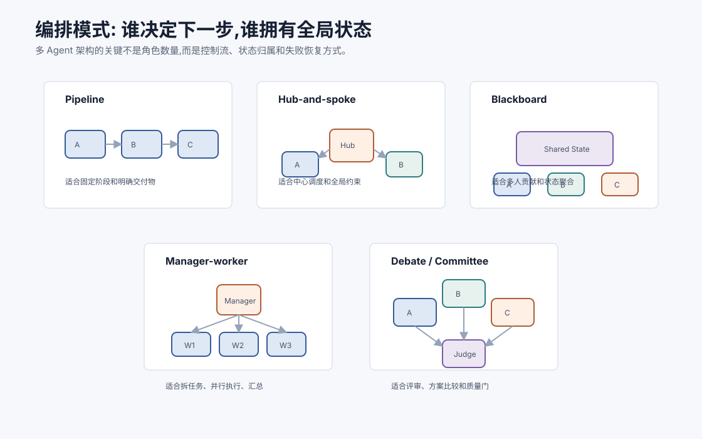
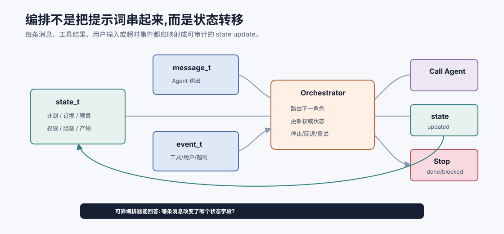
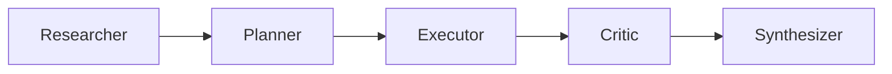
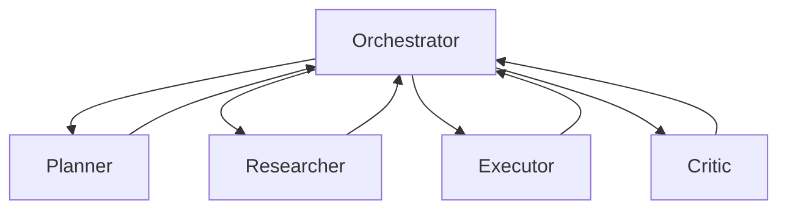
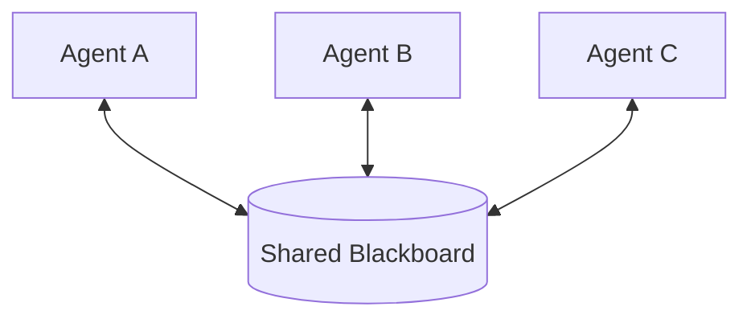
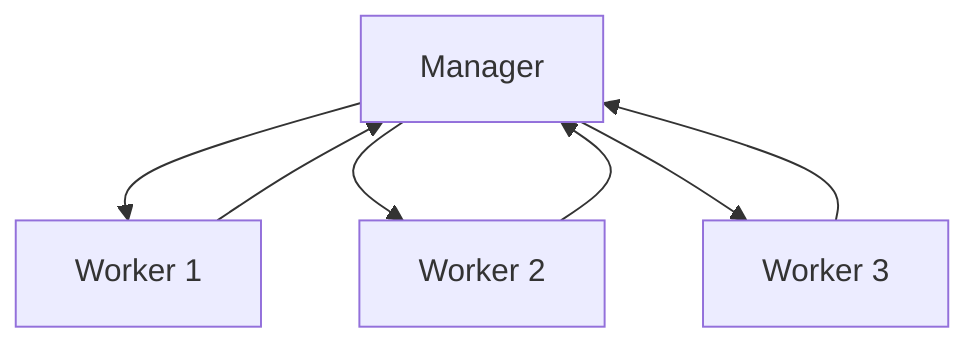
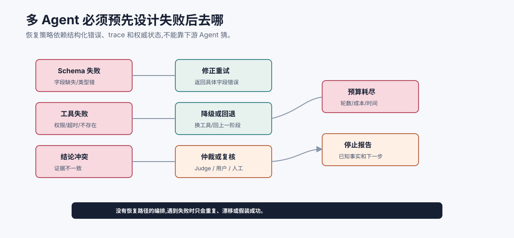

# 编排模式 `[进阶]`

定义了多个 Agent 角色之后,下一个问题是:

**谁决定下一步做什么? 谁保存全局状态? 角色之间如何交接? 失败时谁负责恢复?**

这就是编排要解决的问题。

多 Agent 编排不是把几个 Agent 连上线那么简单。它决定控制流、状态归属、消息路由、并行策略、冲突处理和停止条件。



本章会讲:

- 编排模式的核心变量。
- Pipeline、Hub-and-spoke、Blackboard、Manager-worker、Debate 等常见模式。
- 每种模式适合什么任务,有什么失败模式。
- 状态应该放在 Agent 内部还是外部 runtime。
- 如何设计恢复、预算、超时和停止条件。

## 编排的三个问题

多 Agent 编排可以先问三个问题。

## 编排是状态转移,不是提示词串联

一个可靠编排器应该把多 Agent 过程看成状态转移:

$$
state_{t+1}=orchestrate(state_t,message_t,event_t)
$$

这里的 $message_t$ 是 Agent 输出,$event_t$ 是工具结果、用户输入、超时或错误。编排器根据当前 state 决定下一步调用谁、给什么上下文、是否停止、是否回退。

如果系统只是把 Agent A 的文本拼给 Agent B,再拼给 Agent C,就很难做到恢复和审计。真正的编排需要明确:

- 哪条消息改变了状态。
- 哪个字段被更新。
- 哪个条件触发下一步。
- 哪个错误会回退或停止。
- 哪些产物被最终答案引用。

这也是为什么生产系统通常让 runtime 持有结构化状态,而不是让多个 Agent 靠聊天历史互相记忆。



这张图把编排器看成状态转移函数。Agent 输出只是 `message_t`,工具结果、用户输入、超时和错误是 `event_t`,它们都要经过编排器更新 `state_t`。下一步调用谁、给它什么 context pack、是否重试、是否停止,都应该由状态和策略共同决定。

如果没有这层状态转移,编排就会退化成“把 A 的话拼给 B”。这种做法在 demo 里能跑,但很难审计:你不知道哪条消息改变了计划,哪次工具失败被忽略,哪个中间产物进入了最终答案。可靠编排首先要让状态变化可见。

### 1. 控制权在哪里

下一步由谁决定?

- 固定 workflow 决定。
- 中心 Orchestrator 决定。
- 某个 Manager Agent 决定。
- 多个 Agent 竞争或投票决定。
- 共享状态触发某个 Agent 参与。

控制权越分散,系统越灵活,也越难预测。

### 2. 状态在哪里

全局任务状态保存在哪里?

- 保存在单个 Agent 的上下文里。
- 保存在 Orchestrator 的结构化 state 中。
- 保存在共享 blackboard 中。
- 分散在多个 Agent 的局部记忆中。

生产系统通常更适合外部结构化状态。让每个 Agent 都凭自己的聊天历史记状态,很容易不一致。

### 3. 交接如何发生

Agent 之间如何传递信息?

- 自然语言消息。
- 结构化 JSON。
- 事件日志。
- 共享 artifact 引用。
- 任务队列。

越复杂的系统,越需要结构化交接和 trace。

## 模式一:Pipeline 流水线

Pipeline 把任务按固定阶段顺序流动。



适合:

- 阶段明确。
- 依赖关系稳定。
- 每阶段都有结构化产物。
- 失败能回退到上一阶段。

例如报告生成:

```text
收集资料 -> 提取要点 -> 起草 -> 事实校验 -> 润色
```

Pipeline 的优点是简单、可控、容易评估。

缺点是灵活性有限。如果中途发现任务目标变了,需要额外机制回到前面阶段。

## Pipeline 的设计要点

每个阶段要定义:

- 输入 schema。
- 输出 schema。
- 完成标准。
- 失败输出。
- 是否允许跳过。
- 是否允许回退。

例如 Critic 阶段如果发现证据不足,不能只输出“有问题”,而应输出:

```json
{
  "verdict": "needs_more_research",
  "missing_evidence": ["refund approval exception policy"],
  "return_to": "Researcher"
}
```

这样编排器才能恢复流程。

## 模式二:Hub-and-spoke 中心调度

Hub-and-spoke 有一个中心 Orchestrator,其他 Agent 都和中心通信。



适合:

- 需要全局状态。
- 需要权限和预算控制。
- 角色之间不能自由传递敏感信息。
- 需要统一 trace。
- 任务流程有一定动态性。

Orchestrator 可以是规则程序、workflow 引擎、LLM Manager,或三者混合。

生产系统中,常见做法是:

- deterministic runtime 管状态、权限、预算。
- LLM 只在需要判断下一步策略时参与。

这比让 LLM Manager 完全自由调度更稳定。

## Hub-and-spoke 的优缺点

优点:

- 全局状态一致。
- 权限控制集中。
- trace 容易保存。
- 失败恢复更可控。
- 角色上下文可以按需构建。

缺点:

- 中心组件复杂。
- Orchestrator 可能成为瓶颈。
- 过度集中会降低角色之间的灵活协作。

如果系统需要审计和安全,这个模式通常是默认起点。

## 模式三:Blackboard 黑板协作

Blackboard 模式让多个 Agent 读写共享工作区。



共享黑板可以保存:

- 当前目标。
- 子任务列表。
- 证据。
- 假设。
- 冲突。
- 中间产物。
- 已完成动作。

适合:

- 多个角色共同逐步构建答案。
- 需要异步贡献。
- 任务结构一开始不完全清楚。
- 需要累积公共知识。

例如复杂调查任务中,不同 Researcher 可以把证据和假设写到黑板,Critic 检查矛盾,Planner 根据黑板更新计划。

## Blackboard 的风险

黑板模式的主要风险是状态污染。

如果没有写入规则,黑板会变成上下文垃圾桶:

- 重复证据。
- 未验证假设。
- 过期计划。
- 冲突结论。
- 无来源摘要。

所以黑板需要数据结构和写入协议:

```json
{
  "item_type": "hypothesis",
  "content": "Refund eligibility depends on shipment delay exceeding 3 days.",
  "status": "unverified",
  "evidence_ids": ["S2"],
  "owner": "Researcher-A",
  "created_at": "...",
  "superseded_by": null
}
```

共享不等于随便写。

## 模式四:Manager-worker

Manager-worker 模式由一个 Manager 拆任务,多个 Worker 并行执行。



适合:

- 子任务可并行。
- 子任务输出格式一致。
- Manager 能判断结果质量。
- 需要速度或广度探索。

例如:

- 同时分析多个日志源。
- 同时调研多个方案。
- 同时让多个候选解法竞争。
- 批量处理多个文档。

Manager-worker 的关键是任务切分。切分不好,Worker 会重复工作或输出不可合并结果。

## Worker 输出契约

Manager 分发任务时,必须给 Worker 明确输出契约。

例如:

```json
{
  "task": "Evaluate framework A for our use case",
  "criteria": ["latency", "ecosystem", "deployment", "risk"],
  "must_include": ["official source", "known limitations"],
  "output_schema": {
    "summary": "string",
    "pros": "array",
    "cons": "array",
    "evidence": "array",
    "recommendation": "string"
  }
}
```

否则 Manager 最后会收到一堆风格不同、粒度不同、证据不同的文本,合并成本很高。

## 模式五:Debate / Committee

Debate 或 Committee 模式让多个 Agent 产生不同观点,再由 Judge 或规则选择。

适合:

- 方案比较。
- 高风险答案评审。
- 需要发现盲点。
- 单一模型容易过早收敛。

例子:

```text
Agent A: 支持方案 X。
Agent B: 支持方案 Y。
Agent C: 专门找风险。
Judge: 根据 rubric 综合。
```

但 Debate 不应该变成无边界争论。每个参与者应有不同视角或不同证据来源,Judge 要有明确标准。

## Debate 的陷阱

Debate 常见问题:

- 多个 Agent 使用同一证据,只是在重复表达。
- Judge 偏好更长、更自信的回答。
- 争论没有外部验证。
- 成本高但收益小。
- 少数正确观点被多数错误观点压掉。

因此 Debate 更适合配合证据和 rubric,而不是纯语言投票。

## 模式六:市场式竞标

一些系统会让多个 Agent 对任务“投标”:谁最适合做、成本多少、预计成功率多少。

适合:

- 工具或专家很多。
- 任务类型多变。
- 需要动态路由。

例如:

```text
任务: 分析一次生产故障。
日志 Agent: 我需要读取日志,预计 2 分钟。
代码 Agent: 我需要搜索最近变更,预计 3 分钟。
监控 Agent: 我能检查指标,预计 1 分钟。
```

Orchestrator 根据报价、权限、预算和依赖选择。

这种模式灵活,但实现复杂。多数团队可以先从固定路由或中心调度开始。

## 状态归属

无论哪种模式,都要认真设计状态归属。

### Agent 内部状态

优点是简单。缺点是不可见、不可控、难恢复。

### Orchestrator state

优点是可审计、可恢复、可测试。缺点是需要设计数据结构。

### Shared blackboard

适合多人协作,但需要严格写入规则和版本管理。

生产系统通常采用:

```text
Agent 局部上下文只保存当前任务需要的信息。
全局事实、计划、观察和产物保存在 runtime state 或 artifact store。
```

这样 Agent 可以无状态或弱状态,系统更容易重试和回放。

## 调度策略

Orchestrator 需要决定什么时候调用哪个 Agent。

常见策略:

| 策略 | 适合 |
| --- | --- |
| 固定顺序 | 稳定流程 |
| 条件分支 | 根据状态选择下一步 |
| 事件触发 | 新证据或失败触发角色 |
| 优先队列 | 多任务并发 |
| LLM 路由 | 任务类型模糊时 |
| 人类确认 | 高风险或低置信 |

不要让 LLM 路由承担所有控制。确定性条件能解决的,用代码更可靠。

## 失败恢复

多 Agent 系统必须设计恢复。

常见失败:

- 某个 Agent 输出不符合 schema。
- 工具调用失败。
- Worker 超时。
- 两个角色结论冲突。
- Critic 要求返工。
- 预算耗尽。
- 用户目标改变。

恢复策略包括:

- 重试同一角色。
- 降级为更简单模型或规则。
- 回退到前一阶段。
- 请求另一个角色复核。
- 请求用户澄清。
- 停止并报告已知状态。

恢复必须依赖 trace 和状态。如果所有上下文只在 Agent 对话里,恢复会非常困难。



多 Agent 的失败不应该只有“再试一次”。Schema 失败适合返回字段级错误并重试;工具失败要区分权限、超时、对象不存在和副作用状态;角色结论冲突需要证据仲裁或人工复核;预算耗尽时应该停止并报告已知事实,而不是让下一个 Agent 继续猜。

恢复路径越明确,系统越不容易在失败后漂移。每个 Agent 输出都应该能被编排器分类:可重试、需回退、需复核、需用户、或不可恢复。这个分类比“回答是否流畅”更接近生产可靠性。

## 预算和超时

多 Agent 很容易成本失控。

需要给每个任务设置:

- 最大模型调用次数。
- 最大工具调用次数。
- 最大并行 worker 数。
- 每个角色 token 预算。
- 总成本上限。
- 每个阶段超时。
- 无进展停止条件。

预算不是为了省钱而已,也是为了防止系统陷入无意义循环。

## 冲突处理

多 Agent 结论冲突很常见。

冲突处理可以按优先级:

1. 权威工具观察优先于模型判断。
2. 新版本证据优先于旧版本。
3. 高置信证据优先于无来源摘要。
4. Critic 发现高风险问题时阻塞写操作。
5. 无法仲裁时请求用户或人工审核。

不要简单用投票。三个 Agent 同时错并不罕见。

## 可观测性

多 Agent trace 至少要记录:

- 每个角色的输入 context pack。
- 输出和 schema 校验结果。
- 工具调用事件。
- 状态变更。
- 消息传递。
- 预算消耗。
- 冲突和仲裁。
- 最终结果引用了哪些中间产物。

没有 trace 的多 Agent 系统很难调试。你只会看到最终错了,但不知道哪个角色、哪条消息、哪个状态更新错了。

## 如何选编排模式

| 需求 | 推荐起点 |
| --- | --- |
| 阶段固定 | Pipeline |
| 需要审计和权限控制 | Hub-and-spoke |
| 多角色共同维护假设和证据 | Blackboard |
| 大量可并行子任务 | Manager-worker |
| 高风险方案比较 | Debate + Judge |
| 动态专家选择 | 市场式竞标 |

很多系统会混合使用。例如主流程是 Hub-and-spoke,某个调研步骤内部用 Manager-worker 并行,最终用 Critic 做质量门。

## 常见误解

### 误解一:让 Agent 互相发消息就是编排

不是。编排还包括状态、权限、预算、失败恢复和停止条件。

### 误解二:Orchestrator 一定要是 LLM

不一定。确定性 workflow 更适合稳定控制,LLM 适合处理模糊路由和策略判断。

### 误解三:共享黑板越开放越协作

开放写入会造成状态污染。黑板需要 schema、来源、状态和版本。

### 误解四:并行越多越快

并行增加合并成本和总成本。只有子任务独立且可合并时才划算。

### 误解五:投票能解决冲突

投票不能替代证据、权限、版本和 rubric。

## 本章小结

多 Agent 编排决定控制权、状态归属、消息路由、失败恢复和停止条件。Pipeline 简单可控,Hub-and-spoke 适合审计和权限,Blackboard 适合共享证据和假设,Manager-worker 适合并行子任务,Debate 适合方案评审但必须配合 rubric。生产系统应优先把全局状态放在 runtime 中,让 Agent 通过结构化消息和 artifact 交接。多 Agent 的可靠性来自清晰编排,不是来自 Agent 之间自由聊天。

下一章会讲通信协议与消息传递。编排模式定义了谁和谁交互,通信协议决定这些交互是否能被正确理解、校验和复盘。
