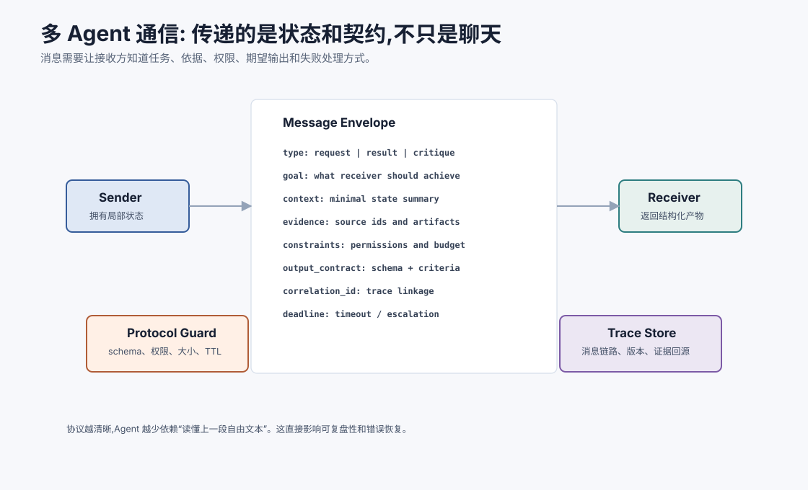
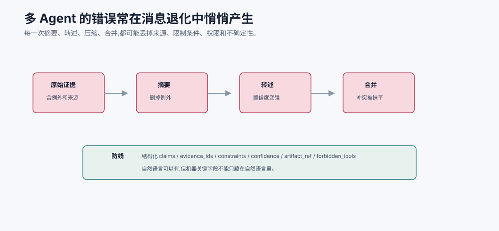
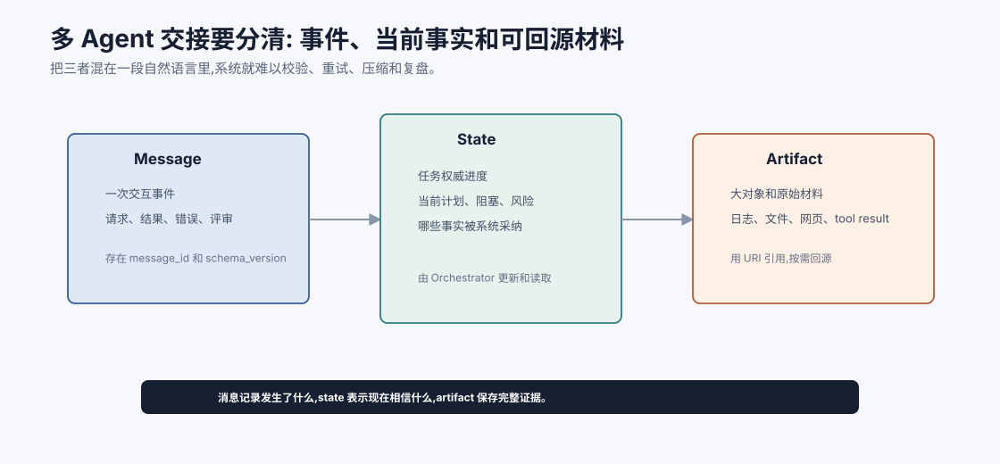
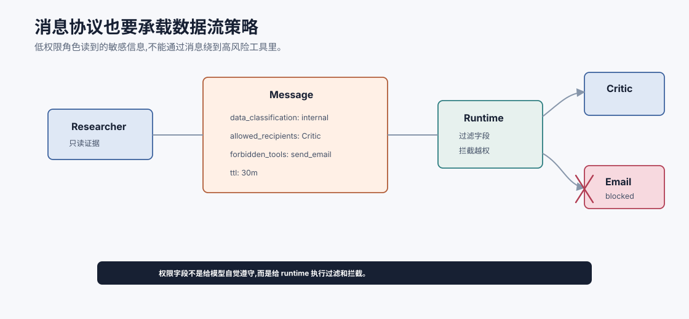
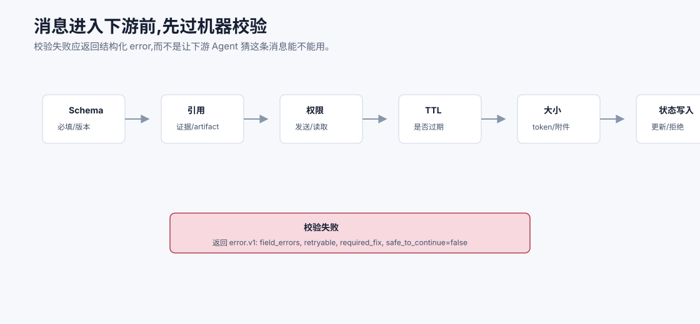

# 通信协议与消息传递 `[进阶]`

多 Agent 系统里,一个 Agent 的输出常常会成为另一个 Agent 的输入。

如果输出只是自然语言:

```text
我查了一下,大概可以退款,但最好再确认一下。
```

下游 Agent 很难知道:

- “大概”是多少置信度?
- 查了哪些来源?
- 哪些条件还没确认?
- 能不能执行写工具?
- 这条消息对应哪个任务?
- 如果失败应该回到哪里?

所以多 Agent 通信不是聊天,而是状态和契约的传递。



本章会讲:

- 为什么自由文本通信容易失真。
- Agent 消息 envelope 应包含哪些字段。
- 请求、结果、观察、评审、错误等消息类型如何设计。
- 如何传递证据、权限、置信度和 artifact。
- 消息协议如何支持 trace、恢复和安全。

## 通信失真是多 Agent 的核心风险

单 Agent 的错误通常发生在一个上下文内。多 Agent 的错误可能在交接中产生。

常见失真包括:

- 摘要丢掉限制条件。
- 证据来源丢失。
- 把假设写成事实。
- 把工具失败写成任务失败。
- 把“草稿已创建”误读为“已提交”。
- 置信度没有传递。
- 权限和用户确认状态丢失。

这些错误很隐蔽。下游 Agent 看起来是在合理推理,但它收到的输入已经变形。

## 消息 envelope

一个 Agent 消息至少要有 envelope,说明这条消息的身份。

示例:

```json
{
  "message_id": "msg_1024",
  "correlation_id": "task_refund_17",
  "from": "Researcher",
  "to": "Critic",
  "type": "evidence_pack",
  "created_at": "2026-07-06T10:20:00+08:00",
  "schema_version": "evidence_pack.v1",
  "payload": {}
}
```

这些字段让系统能追踪消息链路、做 schema 校验、处理重试和兼容版本。

## 消息退化:每次转述都会损失语义

多 Agent 通信最隐蔽的风险不是“完全没传消息”,而是消息在多次摘要、转述、压缩和合并后悄悄退化。限制条件可能被省略,不确定性可能被写成事实,低置信证据可能被合并成高置信结论。



典型退化链路是:

```text
原始证据: 政策允许报销,但香港团队需要额外审批。
Researcher 摘要: 政策允许报销,需注意审批。
Planner 转述: 可以报销,后续检查审批。
Synthesizer 合并: 该订单可以报销。
```

每一步看起来都合理,但“香港团队”和“额外审批”这两个关键条件被逐渐削弱,最终结论就错了。避免退化,不能只靠提醒 Agent “请准确传递”。协议必须把关键语义放进结构化字段:

| 字段 | 保护什么 |
| --- | --- |
| `claims` | 不让结论和证据混在一段话里 |
| `evidence_ids` | 保留来源和版本 |
| `constraints` | 保留限制条件、例外和禁止动作 |
| `confidence` | 防止不确定性被升级 |
| `gaps` | 防止“没查到”变成“不存在” |
| `artifact_ref` | 需要时能回到原文或工具输出 |
| `forbidden_tools` | 防止数据流向高风险动作 |

自然语言仍然有用,但它应该是解释层,不是唯一事实载体。机器需要消费的字段必须结构化、可校验、可回源。这样下游 Agent 即使重写 summary,也不能轻易丢掉关键约束。

## 消息、状态、artifact 要分开

多 Agent 系统里有三类东西容易混淆。

| 类型 | 保存什么 | 典型位置 |
| --- | --- | --- |
| Message | 某次交互的请求、结果或错误 | 消息队列 / trace |
| State | 当前任务的权威进度和决策字段 | Orchestrator state |
| Artifact | 大对象或可回源材料 | 文件、日志、工具结果存储 |

例如测试失败后:

```text
Message: Executor 报告 run_tests failed。
State: 当前步骤 status=blocked, hypothesis=active default missing。
Artifact: 完整 stdout 保存在 tool-result://17。
```

不要把完整 artifact 都塞进 message,也不要把 message 当成权威 state。消息是事件,state 是当前事实视图,artifact 是可回源材料。三者分开,系统才容易重试、压缩上下文和复盘错误。



这张图是多 Agent 通信里最重要的心智模型之一。Message 记录“发生了一次交互”,State 表示“系统当前采纳的事实和进度”,Artifact 保存“可回源的大对象”。如果三者混在一段自然语言里,下游 Agent 可能把一次临时消息当成权威状态,也可能因为长日志被压缩而丢掉关键证据。

例如测试失败时,Executor 的消息可以说 `run_tests` 失败,State 可以更新为 `current_step=blocked` 和 `failure_summary=...`,完整 stdout 则保存到 artifact。下一轮模型只需要失败摘要和 artifact 引用,需要细节时再回源。这能同时降低 token 成本和审计风险。

## 常见消息类型

多 Agent 系统可以定义几类消息。

| 类型 | 用途 |
| --- | --- |
| `task_request` | 请求某角色完成子任务 |
| `plan` | 输出任务拆解和依赖 |
| `evidence_pack` | 传递检索证据 |
| `tool_observation` | 传递工具执行结果 |
| `critique` | 传递评审问题和修改要求 |
| `decision` | 传递带依据的决策 |
| `handoff` | 阶段交接 |
| `error` | 报告失败和恢复建议 |
| `needs_user` | 请求用户澄清或确认 |

消息类型越清晰,下游越少猜测。

## task_request

请求消息应该告诉接收方“要做什么”和“做到什么算完成”。

```json
{
  "type": "task_request",
  "goal": "Find whether first-class high-speed rail is reimbursable under current policy.",
  "context": {
    "user_question": "高铁一等座能报吗?",
    "known_entities": ["高铁", "一等座", "差旅报销"]
  },
  "constraints": ["Use only published policy documents", "Return source IDs"],
  "allowed_tools": ["search_policy", "read_document"],
  "done_when": "At least one current policy source is found or evidence gap is stated",
  "output_contract": "evidence_pack.v1"
}
```

没有 `done_when`,Agent 容易输出“我查了一些资料”这种无法判断是否完成的结果。

## evidence_pack

证据消息要保留来源和状态。

```json
{
  "type": "evidence_pack",
  "claims": [
    {
      "claim": "First-class high-speed rail requires prior department approval.",
      "support": ["S1"],
      "confidence": 0.9
    }
  ],
  "sources": [
    {
      "id": "S1",
      "uri": "internal://policy/travel#4.2",
      "title": "Travel Policy 2026",
      "status": "published",
      "updated_at": "2026-03-12",
      "quote": "..."
    }
  ],
  "gaps": ["No source found for retroactive approval."],
  "conflicts": []
}
```

下游 Critic 或 Synthesizer 可以基于 evidence id 做引用校验。

## tool_observation

工具观察要区分执行状态、原始结果和模型解释。

```json
{
  "type": "tool_observation",
  "tool": "get_order",
  "call_id": "toolcall_42",
  "status": "ok",
  "args": {"order_id": "HK-2026-00018"},
  "arg_sources": {"order_id": "user_turn_3"},
  "observation": {
    "shipping_status": "delayed_5_days",
    "refund_status": "not_requested"
  },
  "artifact": "tool-result://42",
  "warnings": []
}
```

不要把工具观察直接改写成结论。例如“物流延迟 5 天”不是自动等于“可退款”,还需要政策证据。

## critique

评审消息要可执行。

```json
{
  "type": "critique",
  "verdict": "revise_required",
  "rubric": "refund_decision.v2",
  "findings": [
    {
      "severity": "high",
      "issue": "Decision says refund can be submitted, but user confirmation is missing.",
      "evidence": ["toolcall_42", "S1"],
      "required_change": "Change next action to create draft and request confirmation."
    }
  ]
}
```

“写得更严谨一点”不是好 critique。好 critique 应指出问题、依据和可执行修改。

## error

错误消息要帮助编排器恢复。

```json
{
  "type": "error",
  "where": "Executor.submit_refund",
  "error_code": "PERMISSION_DENIED",
  "recoverability": "needs_user_authorization",
  "retryable": false,
  "state_impact": "no_side_effect",
  "suggested_next": "request_user_authorization"
}
```

如果只传“失败了”,下游不知道能不能重试、是否有副作用、是否需要用户。

## 消息中的上下文最小化

不要把全部上下文复制给每个 Agent。

消息应该传递完成当前子任务需要的信息。

过多上下文会带来:

- 成本上升。
- 隐私泄露。
- 注意力分散。
- 下游误用无关信息。

可以用 artifact 引用替代大文本:

```json
{
  "summary": "Test failed because active was undefined.",
  "artifact": "tool-result://test-17"
}
```

需要细节时再回源。

## 来源和置信度

消息里要区分:

- 事实观察。
- 检索证据。
- 模型推断。
- 假设。
- 用户偏好。
- 系统规则。

可以给字段加 `kind`:

```json
{
  "kind": "hypothesis",
  "content": "The failure may be caused by missing default active value.",
  "confidence": 0.62,
  "support": ["tool-result://7"],
  "status": "unverified"
}
```

这样下游不会把假设当事实。

## 权限和数据流

消息协议也要表达权限。

例如:

```json
{
  "data_classification": "internal_sensitive",
  "allowed_recipients": ["Critic", "Coordinator"],
  "forbidden_tools": ["external_web_search", "send_email"],
  "ttl": "30m"
}
```

这不能只靠模型遵守。runtime 应根据这些字段做过滤和拦截。

多 Agent 中,数据可能通过消息跨越角色边界。没有数据流控制,低风险工具和高风险工具组合起来也会泄露信息。



多 Agent 的权限问题不只发生在工具调用时,也发生在消息流动时。一个只读 Researcher 可能读到了内部敏感资料;如果它把完整内容发给拥有外发邮件工具的角色,数据就绕过了原本的工具权限边界。因此消息协议需要携带 `data_classification`、`allowed_recipients`、`forbidden_tools`、`ttl` 等字段。

这些字段不是写给模型“自觉遵守”的,而是写给 runtime 执行过滤、脱敏、拦截和过期处理的。多 Agent 安全必须同时控制工具边界和消息边界,否则低权限角色和高权限工具组合起来仍可能造成高风险行为。

## 幂等和重试

消息系统要支持重试。

如果 Orchestrator 没收到 Worker 响应,可能会重发任务。此时需要:

- `message_id`。
- `correlation_id`。
- `idempotency_key`。
- 任务状态检查。
- 重复响应去重。

否则可能出现重复执行写工具、重复创建草稿、重复发送通知等问题。

## 版本管理

消息 schema 会变化。

要记录:

- `schema_version`。
- 生产者版本。
- 消费者兼容范围。
- 废弃字段。
- 默认值。

多 Agent 系统中,不同角色可能由不同版本 prompt、模型或代码驱动。没有 schema 版本,升级会很痛苦。

## Trace 和可观测性

每条消息都应进入 trace。

trace 要能回答:

- 这个最终结论来自哪些消息?
- 哪个 Agent 生成了关键证据?
- 哪个 Critic 阻止了副作用?
- 哪条消息丢失了限制条件?
- 哪次重试改变了状态?
- 哪个 schema 校验失败?

如果 trace 只能看到最终回答,就无法调试多 Agent。

## 自然语言还需要吗

需要。

结构化消息不代表不能有自然语言。自然语言适合表达复杂理由、摘要、解释和用户可读文本。

关键是不要只靠自然语言承载机器需要理解的字段。

可以采用混合结构:

```json
{
  "summary": "The policy supports reimbursement only after prior approval.",
  "structured_claims": [...],
  "evidence": [...]
}
```

人读 summary,系统读 structured fields。

## 消息校验

消息进入下游前应校验:

- JSON/schema 是否有效。
- 必填字段是否存在。
- 引用的 evidence id 是否存在。
- artifact 是否可访问。
- 发送方是否有权限发送该数据。
- 接收方是否有权限读取。
- TTL 是否过期。
- 消息大小是否超限。

校验失败应返回结构化错误,而不是让下游 Agent 猜。



消息校验最好发生在进入下游上下文之前。因为一旦坏消息进入模型上下文,模型会努力“理解并补全”它,这反而掩盖了上游错误。校验应该由 runtime 执行,包括:

| 校验 | 失败例子 | 处理方式 |
| --- | --- | --- |
| Schema | 缺少 `evidence_ids` | 返回字段级错误,要求上游修复 |
| 引用 | artifact 不存在或不可读 | 阻止下游执行,标记 trace |
| 权限 | 接收方无权读取该数据 | 脱敏、拒绝或改路由 |
| TTL | 消息引用的观察已过期 | 要求重新读取或降权 |
| 大小 | payload 太大,包含完整日志 | 改存 artifact,消息只放摘要和引用 |
| 状态写入 | 消息和当前 state 冲突 | 进入仲裁或返回冲突错误 |

结构化错误也要有 schema,例如:

```json
{
  "type": "error",
  "schema_version": "error.v1",
  "field_errors": [
    {"field": "evidence_ids", "reason": "missing_required"}
  ],
  "retryable": true,
  "required_fix": "Return evidence ids for every claim.",
  "safe_to_continue": false
}
```

这类错误不是“异常情况”,而是多 Agent 的正常控制流。协议越明确,系统越能在错误早期停止、返工或降级,而不是把坏消息传给更多角色。

## 一个消息协议最小集

如果从零开始,可以先定义这几个 schema:

1. `task_request.v1`
2. `evidence_pack.v1`
3. `tool_observation.v1`
4. `critique.v1`
5. `handoff.v1`
6. `error.v1`

每个 schema 都要有示例、必填字段和消费方。

## 常见误解

### 误解一:LLM 能读懂自然语言,不需要协议

LLM 能读懂,但系统难以校验、追踪和恢复。协议是给系统和下游角色共同使用的。

### 误解二:结构化消息会限制智能

结构化约束的是交接边界,不是推理能力。它让智能产物更可用。

### 误解三:消息越详细越好

不一定。消息应最小充分。过多上下文会增加噪声和泄露风险。

### 误解四:只要最终答案正确,中间消息无所谓

生产系统必须能复盘、评估和审计。中间消息是质量控制的关键。

### 误解五:协议只是工程实现细节

协议会直接影响模型看到什么、如何理解任务、如何恢复错误,因此是 Agent 架构的一部分。

## 本章小结

多 Agent 通信不是简单聊天,而是状态、证据、权限、约束和输出契约的传递。可靠消息需要 envelope、类型、schema 版本、correlation id、来源、置信度、artifact、权限和错误恢复信息。自然语言仍有价值,但机器需要消费的内容应结构化。消息协议越清楚,系统越容易校验、追踪、恢复和评估。

下一章会讲 MCP 模型上下文协议。通信协议是多 Agent 内部协作的基础,MCP 则是模型应用接入外部工具、资源和上下文的一种标准化方式。
