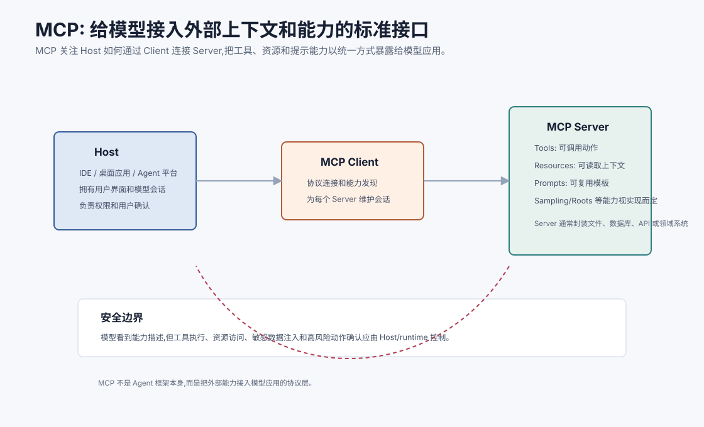
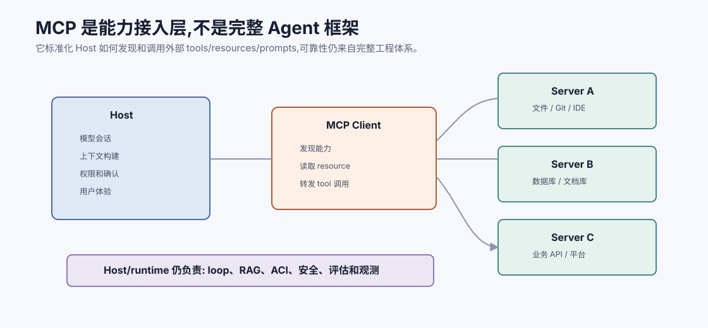
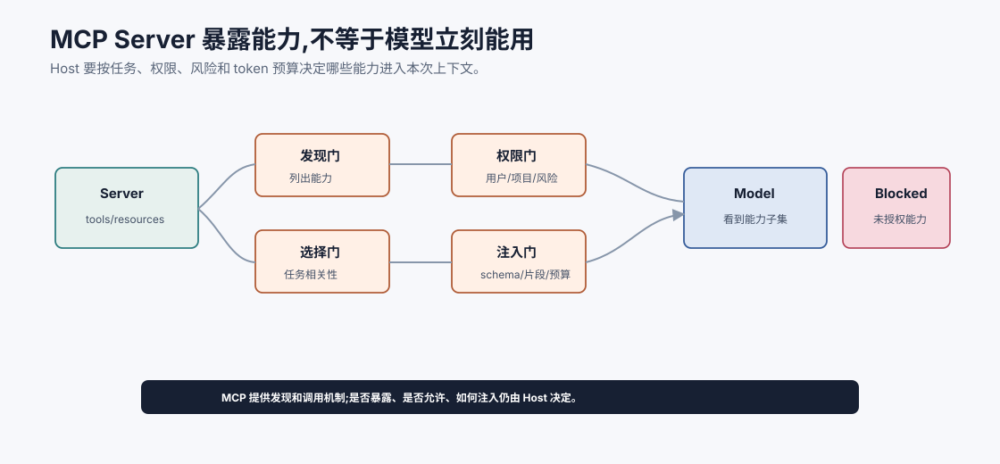
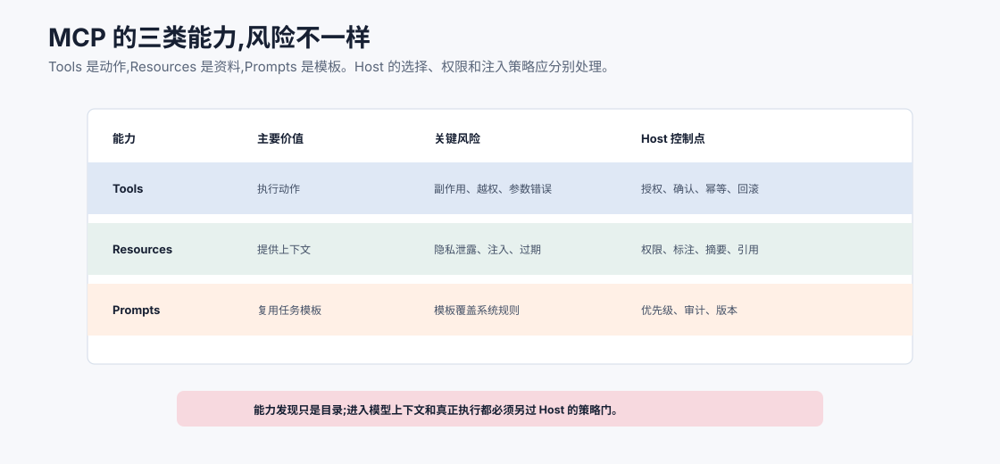
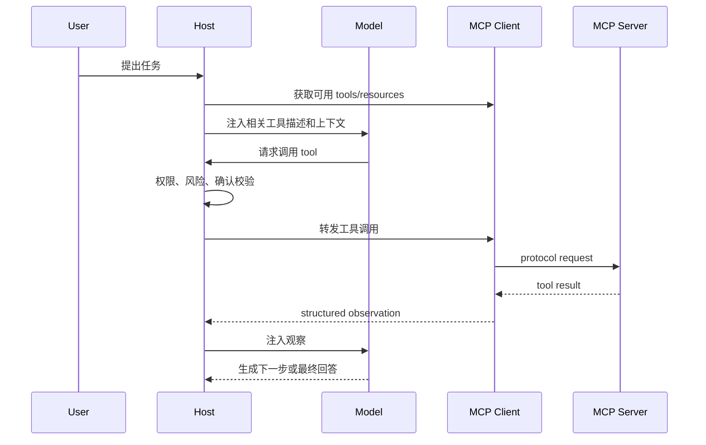
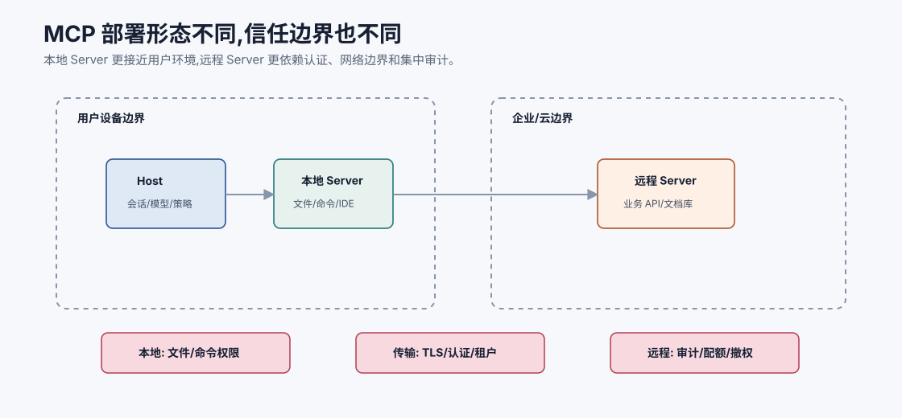

# MCP 模型上下文协议 `[主线]` ★

Agent 要真正有用,就必须连接外部世界。

它要读文件、查数据库、搜索文档、调用业务 API、访问项目上下文、执行工具、获取用户环境中的资源。问题是,如果每个应用、每个工具、每个数据源都用一套私有接入方式,Agent 系统会很快变成一堆胶水代码。

MCP,Model Context Protocol,模型上下文协议,就是为了解决这个接入层问题而出现的一类标准化协议思路。

> **规范快照**:本章按 **MCP `2025-11-25`** 规范复核。MCP 使用 JSON-RPC 2.0 消息;除了 Server 侧的 Prompts、Resources、Tools,还包含 Client 侧的 Roots、Sampling、Elicitation 等能力。实现时应以双方协商的协议版本和官方 schema 为准,不要把本章示意对象当作完整线协议。

它的核心不是“让模型更聪明”,而是:

**用统一协议把外部工具、资源和提示能力暴露给模型应用,让 Host 能发现、调用和管理这些能力。**



本章会讲:

- MCP 解决什么问题。
- Host、Client、Server 分别是什么。
- Tools、Resources、Prompts 的区别。
- MCP 和 Function Calling、RAG、ACI、多 Agent 的关系。
- MCP 的安全边界和常见误解。
- 设计 MCP Server 时要注意什么。

## 为什么需要 MCP

没有标准协议时,每接一个外部能力都要写定制集成。

例如一个 IDE Agent 需要:

- 读取当前仓库文件。
- 搜索符号。
- 运行测试。
- 查询 issue 系统。
- 读取设计文档。
- 调用部署平台。

如果每种能力都直接写进 Agent 应用,问题会很多:

- 集成成本高。
- 工具描述格式不统一。
- 权限和确认逻辑分散。
- 不同 Host 之间难复用。
- 工具升级会影响 Agent 主程序。
- 数据源和模型应用强耦合。

MCP 的思路是把能力提供方封装成 Server,Host 通过 Client 按协议发现和使用这些能力。



这张图把 MCP 放回正确层次:它是模型应用和外部能力之间的接入协议层。MCP 可以让 Host 更统一地发现工具、读取资源、获取提示模板和调用 Server,但它不替代 Agent loop、上下文工程、RAG、ACI、安全策略、评估和可观测性。

理解这一点很重要。一个混乱的数据库 API 包成 MCP Tool 后,仍然是混乱工具;一个没有引用校验的 RAG 系统接入 MCP 文档资源后,仍然可能答错;一个没有权限门的 Host 即使使用 MCP,也可能把不该暴露的工具给模型。MCP 解决的是接入标准化,不是自动解决可靠性。

## MCP 的基本结构

MCP 通常包含三个角色。

| 角色 | 作用 |
| --- | --- |
| Host | 模型应用本体,例如 IDE、桌面助手、Agent 平台 |
| Client | Host 内部用于连接某个 MCP Server 的协议客户端 |
| Server | 暴露工具、资源、提示模板等能力的外部能力提供者 |

可以简单理解为:

```text
Host 管用户体验和模型会话。
Client 管协议连接。
Server 管某个外部系统的能力暴露。
```

一个 Host 可以连接多个 Server。每个 Server 可以封装一个数据源、一组工具或一个领域系统。

## 协议能力是双向的

初学者最容易只看到 Server 暴露的 Prompts、Resources 和 Tools。但完整协议并非单向“Server 给模型工具”。Client 还可能向 Server 提供 Roots、Sampling 和 Elicitation:Roots 声明工作区边界;Sampling 允许 Server 请求 Host 代表它进行模型采样;Elicitation 允许 Server 请求 Host 向用户收集信息或确认。

这些能力会反转调用方向,因此要单独授权。Sampling 可能引入额外成本和数据流,Elicitation 不能绕过 Host 的敏感字段策略,Roots 也不是操作系统级沙箱。能力协商表示“双方支持什么”,本地策略仍决定“本次允许什么”。

## 从能力发现到上下文注入的四道门

MCP Server 声明能力之后,这些能力不应该自动进入模型上下文。Host 至少要经过四道门:

| 闸门 | 问题 |
| --- | --- |
| 发现门 | Server 暴露了哪些 tools/resources/prompts? |
| 选择门 | 当前任务真的需要哪些能力? |
| 权限门 | 当前用户、项目、角色是否允许使用? |
| 注入门 | 哪些描述、schema 或资源片段应该进入本次上下文? |

这四道门可以防止两个常见问题:一是把所有工具都暴露给模型,导致选择噪声和风险上升;二是把所有可读资源都塞进上下文,导致隐私和 token 问题。

MCP 提供能力发现和调用机制,但“是否给模型看、是否允许调用、结果如何进入上下文”仍是 Host 的责任。



这张图解释了为什么“Server 暴露能力”不等于“模型可以直接使用能力”。Host 至少要经过发现、选择、权限和注入四道门。发现门知道 Server 有什么;选择门判断当前任务需不需要;权限门判断当前用户、项目和风险是否允许;注入门决定哪些 tool schema、resource 片段或 prompt 模板进入本次上下文。

四道门是防止 MCP 误用的关键。没有选择门,模型会被过多工具干扰;没有权限门,能力发现会变成越权入口;没有注入门,资源读取会变成 token 和隐私问题。MCP 给 Host 材料,Host 仍要负责上下文和安全的最终装配。

## Host

Host 是用户直接使用的模型应用。

例如:

- IDE 中的编码助手。
- 桌面 Agent。
- 企业知识助手。
- 自研 Agent 平台。
- 多 Agent 编排系统。

Host 负责:

- 管理用户会话。
- 调用模型。
- 构建上下文。
- 展示工具调用和结果。
- 做用户确认。
- 管理 MCP Client 连接。
- 执行权限和安全策略。

MCP Server 暴露能力,但 Host 决定如何把这些能力放进模型上下文、何时允许调用、如何展示给用户。

## Client

Client 是 Host 和某个 Server 之间的协议连接。

它负责:

- 初始化连接。
- 发现 Server 提供的能力。
- 发送工具调用请求。
- 读取资源。
- 获取提示模板。
- 处理协议消息。
- 管理连接生命周期。

通常一个 Host 会为每个 Server 建立一个 Client 会话。

## Server

Server 是能力提供方。

它可以封装:

- 文件系统。
- Git 仓库。
- 数据库。
- 搜索服务。
- 文档库。
- 业务 API。
- 内部平台。
- 专用计算工具。

Server 的职责不是替模型思考,而是把外部能力以协议能理解的方式描述和执行。

一个好的 Server 应该提供清晰的能力描述、输入 schema、输出结构、错误类型和安全约束。

## Tools

Tools 是模型应用可以请求执行的动作。

例如:

- `search_docs(query)`
- `read_file(path)`
- `run_tests(target)`
- `create_ticket(title, body)`
- `query_database(sql)`

Tool 通常有:

- 名称。
- 描述。
- 输入 schema。
- 输出结果。
- 错误返回。
- 权限要求。

这和 Part 2 的 Function Calling 很像。区别在于 Function Calling 更偏模型 API 层的工具调用格式,MCP 更偏模型应用连接外部能力的协议层。

## Resources

Resources 是可读取的上下文或数据。

例如:

- 文件内容。
- 文档页面。
- 数据库 schema。
- 当前项目配置。
- 日志片段。
- 业务对象详情。

Resources 更像“可取回的资料”,不一定是动作。

例如一个文件系统 Server 可以暴露:

```text
resource: file:///workspace/README.md
resource: file:///workspace/src/app.ts
```

Host 可以读取这些 resource,再决定是否放入模型上下文。

## Prompts

Prompts 是 Server 提供的可复用提示模板或工作流入口。

例如:

- “总结这个仓库”。
- “根据错误日志生成排查计划”。
- “用团队模板创建 PR 描述”。

Prompts 的价值是让领域系统提供自己知道的上下文组织方式。

但 Prompt 不是最高优先级指令。Host 仍要维护系统规则、用户目标和安全边界。

## Tools、Resources、Prompts 的区别

可以这样理解:

| 能力 | 问题 | 例子 |
| --- | --- | --- |
| Tool | 要执行什么动作? | 运行测试、查询数据库、创建工单 |
| Resource | 要读取什么上下文? | 文件、文档、schema、日志 |
| Prompt | 要使用什么任务模板? | 生成 PR 描述、排查故障 |

这三者共同服务于上下文工程和工具使用。

## 能力风险矩阵:Tools、Resources、Prompts 不能一视同仁

MCP 把不同能力放进统一协议里,但统一协议不代表统一风险。Host 在能力选择、上下文注入和执行授权时,应该区分 Tools、Resources、Prompts 的风险模型。



三类能力的控制点不同:

| 能力 | 主要风险 | Host 应做什么 |
| --- | --- | --- |
| Tools | 有副作用、越权调用、参数错误 | 调用前权限检查、风险分级、用户确认、幂等和回滚 |
| Resources | 隐私泄露、过期资料、Prompt Injection | 读取前 ACL、注入前标注来源和信任级别、必要时摘要脱敏 |
| Prompts | 模板覆盖系统规则、旧模板误导任务 | 明确优先级、版本化、审计、只作为任务模板而非最高指令 |

例如 `delete_file` 是 Tool,核心风险是副作用;`file:///workspace/secrets.env` 是 Resource,核心风险是敏感数据;“帮我部署到生产”的 Prompt 是模板,核心风险是把领域流程误当成授权。它们都可以通过 MCP 暴露,但进入模型上下文和真正执行之前,Host 的策略门完全不同。

这也是 MCP 章节最容易误解的地方:Server 声明能力只是“目录”。目录里的能力能否给模型看、是否允许模型请求、请求后是否执行、结果如何注入上下文,都仍然由 Host、runtime 和安全策略决定。

## MCP 和 Function Calling

Function Calling 解决的是模型如何结构化表达工具调用。

MCP 解决的是模型应用如何发现和连接外部工具/资源。

二者关系可以是:

```text
MCP Server 暴露 tool schema
Host 把相关 tool schema 提供给模型
模型通过 function/tool call 请求调用
Host/Client 转发到 MCP Server 执行
Server 返回结构化结果
Host 决定如何注入上下文
```

也就是说,MCP 不是替代 Function Calling,而是可以成为工具能力的来源和传输层。

## MCP 和 ACI

ACI,Agent-Computer Interface,强调工具面要适合 Agent 使用。

MCP 提供连接协议,但不会自动让工具变好用。

一个 MCP Tool 仍然需要满足 ACI 原则:

- 名称清晰。
- 参数少而明确。
- schema 可验证。
- 返回结构化。
- 错误可恢复。
- 副作用明确。
- 高风险动作需要确认。
- 权限最小化。

如果把一个混乱 API 原样包成 MCP Tool,它仍然混乱。MCP 标准化的是接入方式,不是自动优化工具设计。

## MCP 和 RAG

MCP Server 可以暴露文档资源或搜索工具,从而成为 RAG 的数据入口。

例如:

- 文档库 Server 提供 `search_docs` tool。
- 文件系统 Server 提供文档 resource。
- 数据库 Server 提供 schema 和查询 tool。

但 MCP 不等于 RAG。RAG 还需要:

- 文档清洗。
- 切块。
- embedding。
- 索引。
- 重排。
- 证据包。
- 引用校验。

MCP 可以提供取数和工具接口,RAG 系统负责证据链质量。

## MCP 和上下文工程

MCP 扩大了 Host 可访问的上下文来源。

但“能访问”不等于“都要放进 prompt”。

Host 的 context builder 仍要决定:

- 哪些 Server 与当前任务相关。
- 哪些 Tools 暴露给模型。
- 哪些 Resources 读取。
- 读取结果如何摘要和标注来源。
- 不可信内容如何隔离。
- token 预算如何控制。
- 权限和敏感数据如何处理。

MCP 给上下文工程提供材料,不是替代上下文工程。

## MCP 和多 Agent

多 Agent 系统可以让不同角色访问不同 MCP Server 或不同能力子集。

例如:

| Agent | MCP 能力 |
| --- | --- |
| Researcher | 文档搜索、只读资源 |
| Code Agent | 文件读取、符号搜索、测试运行 |
| Ops Agent | 日志查询、监控指标 |
| Critic | trace 读取、证据读取 |
| Publisher | 发布工具,需要用户确认 |

这可以帮助实现工具权限隔离。

但要注意:不同 Agent 通过消息传递数据时,仍要遵守数据流策略。不能因为工具来自 MCP 就忽略权限边界。

## MCP 的安全边界

MCP 本身不是完整安全系统。

安全仍需要 Host、runtime 和 Server 共同承担。

关键点包括:

### 1. 能力发现不等于允许调用

Server 可以声明自己有某个 tool,但 Host 可以决定不暴露给模型,或只在用户确认后调用。

### 2. 模型请求不等于执行授权

模型生成工具调用后,runtime 仍应检查权限、参数、风险和确认状态。

### 3. Resource 内容不是指令

资源可能包含不可信文本。Host 应标明其为外部资料,不能让它覆盖系统规则。

### 4. Server 不应过度授权

Server 应遵守最小权限,不要因为方便就暴露过大的文件系统、数据库或管理 API 权限。

### 5. 敏感数据要最小化

Host 不应把无关敏感 resource 读入上下文。Server 也应做访问控制和审计。

## 一个 MCP 调用链

可以把一次工具调用理解成:



注意中间的 Host 校验步骤。不要把模型请求直接等同于 Server 执行。

## 设计 MCP Server 的原则

如果你要设计一个 MCP Server,可以遵循这些原则。

### 1. 能力要窄

宁可提供几个清晰工具,也不要提供一个万能 `execute(command)`。

### 2. schema 要严

输入参数要有类型、描述、枚举、默认值和限制。

### 3. 输出要结构化

返回状态、数据、警告、artifact 和错误码,不要只返回一段文本。

### 4. 错误要可恢复

区分参数错误、权限错误、对象不存在、超时、状态冲突。

### 5. 副作用要显式

写工具要说明会改变什么,最好支持 preview、confirm、idempotency 和 verify。

### 6. 权限要最小化

Server 自身应限制可访问范围,不要只依赖 Host。

### 7. 资源要可追溯

Resource 应有 URI、版本、更新时间、来源和权限元数据。

## 好 Tool 和坏 Tool

坏工具:

```text
tool: run_any_sql
description: Run SQL.
input: string
output: string
```

问题:

- 权限太大。
- 参数无结构。
- 副作用不清。
- 错误不可分类。
- 难以审计。

更好的工具:

```json
{
  "name": "get_customer_orders",
  "description": "Read-only lookup of orders for a customer within an authorized tenant.",
  "input_schema": {
    "customer_id": "string",
    "date_range": {"from": "date", "to": "date"},
    "status": "optional enum"
  },
  "side_effect": "none",
  "requires_user_confirmation": false
}
```

工具越贴近任务语义,Agent 越容易正确使用。

## 传输和部署

MCP 可以运行在不同传输方式和部署形态上,具体取决于实现和生态。

传输只解决消息如何到达,不代表信任级别。`stdio` 常用于本地进程,Streamable HTTP 常用于远程连接;无论哪种传输,都要验证对端身份、协议版本、能力集合、消息大小、超时和取消语义。不要因为进程在本机就默认可信,也不要把网络 TLS 误当成工具授权。

常见思路包括:

- 本地进程:Host 启动本地 Server,适合 IDE、文件系统、命令行工具。
- 远程服务:Server 运行在网络服务中,适合企业系统和共享能力。
- HTTP/流式连接:适合远程通信和长连接场景。

选择时要考虑:

- 延迟。
- 认证。
- 网络边界。
- 用户确认体验。
- 日志审计。
- 部署和升级方式。

本地 Server 更容易访问用户环境,也更要控制权限。远程 Server 更容易集中治理,但需要严肃处理认证和数据传输。



部署形态会改变信任边界。

本地 Server 常见于 IDE、桌面助手和命令行场景。它的优势是低延迟、能访问用户本地环境、交互体验自然;风险是它可能接触文件系统、shell、凭据、浏览器状态等高敏感资源。因此本地 Server 需要明确工作区范围、命令白名单、用户确认、最小文件权限和本地日志策略。

远程 Server 常见于企业文档、业务 API、监控平台和共享工具。它的优势是集中部署、统一认证、统一审计和多 Host 复用;风险是网络边界、租户隔离、token 传递、数据出境和服务端授权。如果远程 Server 只相信 Host 转发来的自然语言身份,而不做独立认证和授权,就很容易变成越权通道。

可以用下面的表做部署评审:

| 问题 | 本地 Server | 远程 Server |
| --- | --- | --- |
| 谁启动 | Host 或用户环境 | 平台或服务端 |
| 主要资产 | 文件、命令、IDE 状态 | 数据库、业务 API、文档库 |
| 关键控制 | 工作区限制、命令确认 | OAuth/凭证、租户隔离、服务端 ACL |
| 审计重点 | 本地工具调用和文件访问 | 用户身份、资源访问、跨租户访问 |
| 失败影响 | 用户机器或项目受影响 | 企业系统或共享数据受影响 |

无论本地还是远程,都不要把 MCP Client 当成安全边界本身。安全边界应在 Host 的策略层、Server 的授权层和底层资源系统中共同实现。Client 负责协议连接,不应该成为唯一的权限判断点。

## MCP 不是万能标准

MCP 解决接入标准化问题,但还有很多事情要你自己设计:

- Agent 循环。
- 任务规划。
- RAG 检索质量。
- 工具 ACI。
- 权限策略。
- 用户确认。
- 多 Agent 编排。
- 评估和观测。
- 成本和延迟控制。

把系统接上 MCP,不等于系统就可靠了。它只是让外部能力接入更统一。

## 什么时候适合用 MCP

适合:

- 一个能力要被多个 Host 或 Agent 复用。
- 外部系统复杂,需要封装成标准工具和资源。
- 希望工具发现、调用和资源读取有统一协议。
- 希望把集成逻辑从 Agent 主程序中解耦。
- 需要给不同 Agent 暴露不同能力子集。

不一定需要:

- 只有一个非常简单的内部函数。
- 原型阶段只需快速验证。
- 工具不会复用,也不需要标准发现。
- 现有 SDK 集成已经足够简单。

## MCP 评估

评估 MCP Server,可以看:

- 能力描述是否清晰。
- Tool schema 是否能让模型正确填参。
- Resource 是否有来源和权限元数据。
- 错误是否可分类、可恢复。
- 权限是否最小化。
- 高风险工具是否需要确认。
- 调用 trace 是否完整。
- Host 是否能按任务动态选择能力。
- Server 升级是否向后兼容。
- 是否通过实际任务评估改善效果。

不要只评估“能不能调用成功”。要评估 Agent 是否能安全、准确、低成本地使用这些能力。

## 常见误解

### 误解一:MCP 是 Agent 框架

不是。MCP 是能力接入协议。Agent 框架还要负责循环、状态、规划、评估和编排。

### 误解二:有了 MCP 就不用 Function Calling

不对。MCP 可以提供工具来源,Function Calling 仍常用于模型表达工具调用。

### 误解三:MCP Server 暴露的工具都应该给模型

不一定。Host 应按任务、权限和风险动态暴露工具。

### 误解四:MCP 能自动解决安全

不能。权限、确认、数据流、资源隔离和审计仍要设计。

### 误解五:把任意 API 包成 MCP Tool 就够了

不够。工具还要符合 ACI,让 Agent 易懂、可校验、可恢复、可审计。

## 本章小结

MCP 的价值在于标准化模型应用和外部能力之间的连接。Host 管用户体验、模型会话和安全边界,Client 管协议连接,Server 暴露 Tools、Resources 和 Prompts。MCP 可以和 Function Calling、RAG、上下文工程、多 Agent 编排配合,但不替代它们。设计 MCP Server 时,关键是窄工具、严 schema、结构化输出、清晰错误、最小权限、可追溯资源和副作用控制。MCP 让能力接入更统一,可靠性仍来自完整的 Agent 工程体系。

规范会继续演进。生产接入还应固定协议版本与 schema 哈希,记录能力协商结果,对新增能力默认拒绝,并在升级前重跑工具、资源、授权和提示注入回归集。

下一章会讲 Agent 互操作与 A2A。MCP 解决 Host 如何连接工具和资源,A2A 这类协议则进一步处理 Agent 与 Agent 如何跨系统发现、委托、协作和交付结果。
