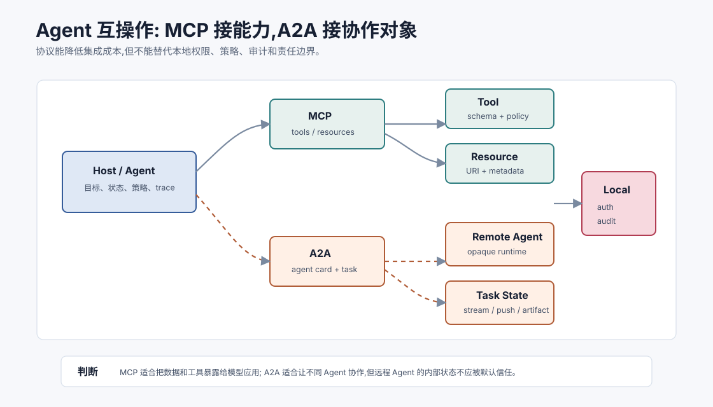
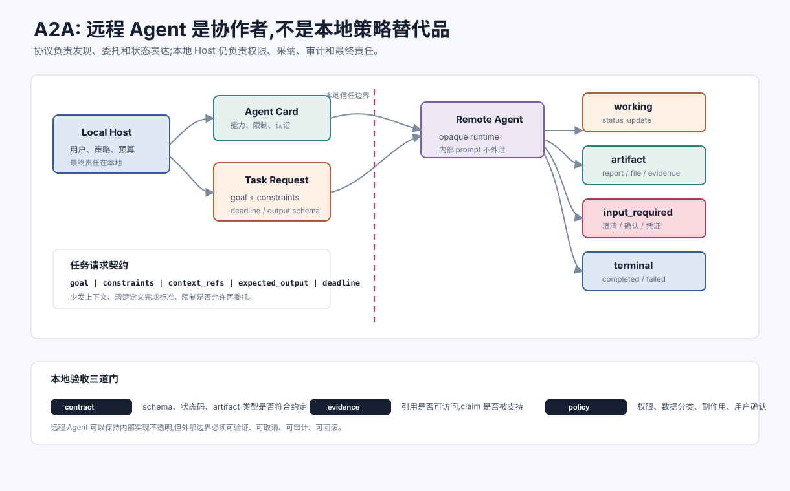

# Agent 互操作与 A2A `[进阶]` ★

MCP 让模型应用更容易接入工具、资源和提示模板。它解决的是“模型应用如何接能力”的问题。

但多 Agent 生态还有另一个问题:

> 如果两个 Agent 来自不同团队、不同框架、不同服务器,它们如何发现彼此、协作完成任务,同时不暴露内部实现?

这就是 Agent 互操作协议要解决的空间。A2A,Agent2Agent Protocol,就是这个方向的代表之一。





本章重点不是追某个协议细节,而是理解 Agent 互操作的工程边界。

## MCP 和 A2A 的边界不同

可以先用一句话区分:

- **MCP**:模型应用连接外部工具和资源。
- **A2A**:Agent 与 Agent 之间协作。

MCP server 通常暴露的是能力:读文件、查数据库、调用 API、提供资源。

A2A server 暴露的是一个远程 Agent:它有自己的任务处理逻辑、状态、工具和策略,外部只通过协议提交任务、接收状态和结果。

这两者可以互补。一个本地 Agent 可以通过 MCP 调工具,也可以通过 A2A 委托另一个远程 Agent 完成专业子任务。

## 为什么不能只把远程 Agent 当工具

工具通常有明确输入输出。比如 `search_policy(query)` 返回文档片段。

Agent 则更复杂。它可能:

- 需要多轮澄清。
- 长时间运行。
- 产生中间状态。
- 返回 artifact。
- 支持流式进展。
- 根据自身策略拒绝任务。
- 不愿暴露内部 prompt、记忆或工具。

如果把远程 Agent 硬包装成一个普通函数,会丢掉这些任务生命周期信息。

Agent 互操作协议更像“任务协作协议”,而不是“函数调用协议”。

## 互操作需要哪些能力

一个 Agent 互操作协议至少要处理这些问题。

### 能力发现

调用方需要知道远程 Agent 能做什么、支持哪些输入输出、需要什么认证、有什么限制。

A2A 里常见的思想是 Agent Card:远程 Agent 用一个描述文件公开能力、端点、交互方式和元数据。

### 任务提交

调用方提交任务,包括目标、上下文、约束、期望输出和可接受交互方式。

### 任务生命周期

长任务需要状态:

- submitted。
- working。
- input_required。
- completed。
- failed。
- canceled。

只返回一次文本结果不够。

任务生命周期至少应该能表达四类事件:

| 事件 | 含义 | 调用方应做什么 |
| --- | --- | --- |
| `status_update` | 远程 Agent 正在排队、工作、等待输入或即将完成 | 更新本地任务状态和预算 |
| `artifact_created` | 产生文件、证据包、报告、补丁或结构化结果 | 记录 artifact 引用,不要默认采纳 |
| `input_required` | 远程 Agent 需要澄清、凭证、确认或额外材料 | 由本地 Host 决定是否询问用户 |
| `terminal` | completed、failed、canceled、expired | 进入本地验收或失败处理 |

这也是 A2A 和普通工具调用最不同的地方。工具调用通常是短事务;远程 Agent 协作更像异步任务,需要进度、取消、超时、artifact、交互和最终验收。

### 多模态和结构化内容

Agent 之间可能传递文本、表单、文件、图片、JSON、artifact 引用和流式事件。

### 安全和认证

远程 Agent 不应默认可信。协议要支持认证、授权、审计和最小必要上下文。

### 不暴露内部实现

互操作不是共享所有内部状态。远程 Agent 可以保持内部 prompt、记忆、工具和策略不透明,只暴露协作边界。

## Agent Card 应该包含什么

一个实用的能力描述可以包含:

```json
{
  "name": "Policy Research Agent",
  "description": "Finds current internal policy evidence with citations.",
  "endpoint": "https://example.com/a2a/policy",
  "capabilities": ["policy_search", "evidence_pack", "citation_check"],
  "input_modes": ["text", "json"],
  "output_modes": ["json", "artifact"],
  "auth": {"type": "oauth2"},
  "limits": {"max_task_minutes": 10},
  "data_policy": "internal_only"
}
```

Agent Card 不是广告页。它是调用方做路由、权限判断和用户期望管理的依据。

## 任务消息要保留契约

调用远程 Agent 时,不要只发一句自然语言。

更好的任务请求包括:

```json
{
  "task_id": "task_2026_017",
  "goal": "Compare the current and previous travel approval policy for Hong Kong team.",
  "constraints": [
    "Use only sources visible to the requesting user",
    "Return claim-level citations",
    "State missing evidence explicitly"
  ],
  "context_refs": ["artifact://question_context_17"],
  "expected_output": "evidence_comparison.v1",
  "deadline": "2026-07-08T12:00:00+08:00"
}
```

这样远程 Agent 才知道完成标准,本地系统也能校验结果。

## 远程 Agent 的结果不能默认采纳

远程 Agent 返回结果后,本地 Host 仍要做校验。

至少检查:

- schema 是否有效。
- 引用是否可访问。
- 数据分类是否允许进入当前上下文。
- 结果是否符合用户权限。
- 是否存在未声明副作用。
- 是否需要人工确认。

协议负责互操作,本地 Host 负责信任边界。

这点很关键。不要因为对方是“Agent”就把它当成权威。远程 Agent 只是一个外部协作者,不是本地策略的替代品。

本地验收可以拆成三层:

| 验收层 | 检查什么 | 失败处理 |
| --- | --- | --- |
| Contract check | 输出 schema、状态码、artifact 类型是否符合约定 | 要求远程修复或标记失败 |
| Evidence check | 引用、证据、工具结果是否可访问且支持 claim | 降低置信度、补检索或拒绝采纳 |
| Policy check | 数据分类、权限、副作用、用户确认是否满足本地策略 | 阻止执行、脱敏、请求确认或人工接管 |

这三层应由本地 Host 或本地 verifier 执行,不能完全交给远程 Agent 自我声明。远程 Agent 可以说“我已验证”,本地系统仍要能检查“验证依据在哪里”。

## A2A 和多 Agent 编排

A2A 类协议适合这些场景:

- 一个主 Agent 委托专业 Agent 做研究、代码、数据分析或客服。
- 企业内不同团队的 Agent 跨系统协作。
- SaaS 产品把自己的 Agent 能力暴露给外部生态。
- 多框架 Agent 通过统一协议参与同一工作流。

它不适合所有场景。

如果远程能力只是一个确定性 API,用普通工具调用或 MCP 可能更简单。如果你完全控制所有子 Agent,内部消息协议可能比外部互操作协议更轻。

## 互操作的风险

### 能力描述过度承诺

Agent Card 说“能处理合同审查”,但没有说明适用范围、权限、失败模式和输出契约,调用方就容易误用。

### 任务状态不透明

远程 Agent 长时间运行,但只返回“working”,调用方无法判断是否卡住、是否需要取消或是否在消耗预算。

### 数据越界

本地上下文发给远程 Agent 后,数据离开原系统边界。必须先做最小化、脱敏和授权。

### 责任不清

如果远程 Agent 给出错误建议,本地系统是否可以直接执行?谁负责审计和回滚?这些要在产品和组织层明确。

### 协议版本漂移

不同 Agent 支持不同 schema、事件和状态。没有版本协商,集成会变脆。

### 预算和责任漂移

远程 Agent 可能把任务继续拆给更多下游 Agent,导致成本、延迟、数据流和责任边界变得不透明。调用方应在任务请求里限制是否允许再委托、最大任务时间、最大 token/工具预算、可访问数据范围和最终责任归属。

### Artifact 不可回源

远程 Agent 返回一个报告或文件,但没有来源、版本、生成过程和证据引用。本地系统无法复核,也无法在用户质疑时解释结果。跨 Agent 协作中,artifact 的 provenance 和 trace 比自然语言总结更重要。

## 本地策略永远不能外包

不管使用 MCP、A2A 还是其他协议,本地系统都要保留控制权:

- 用户身份和租户边界。
- 工具权限和副作用策略。
- 数据分类和脱敏。
- 审计日志和 trace。
- 成本预算。
- 高风险动作确认。
- 结果采纳和回滚规则。

协议让能力更容易连接,但不会自动让连接变安全。

## 与消息协议章节的关系

上一章讲的是多 Agent 内部通信的消息契约。A2A 类协议则把这种契约扩展到跨系统边界。

内部消息可以更贴近你的状态模型。外部互操作协议需要更稳定、更保守、更少暴露内部细节。

可以这样分层:

| 层 | 主要问题 |
| --- | --- |
| 内部消息协议 | 角色之间如何交接状态、证据和错误 |
| MCP | Host 如何接入工具、资源和上下文 |
| A2A | Agent 如何发现、委托和协作 |
| 本地策略 | 哪些数据和动作被允许 |

这些层不是互相替代,而是分别守住不同边界。

## 设计检查清单

接入远程 Agent 前,可以问:

1. 它暴露的是工具能力,还是完整 Agent?
2. 是否有清晰能力描述和限制?
3. 任务生命周期是否可观察?
4. 输出 schema 是否可校验?
5. 引用和 artifact 是否可回源?
6. 本地数据是否最小化后再发送?
7. 认证、授权和审计如何做?
8. 失败、取消、超时和重试如何处理?
9. 远程结果是否需要本地 verifier?
10. 谁对最终用户结果负责?

如果这些问题答不上来,先不要把远程 Agent 接到高风险流程里。

## 常见误解

### 误解一:A2A 会替代 MCP

不会。它们解决的边界不同。MCP 更偏工具和资源接入,A2A 更偏 Agent 间协作。

### 误解二:Agent 互操作就是让 Agent 互相聊天

不是。可靠互操作需要能力发现、任务状态、结构化内容、认证、错误协议和审计。

### 误解三:远程 Agent 能力越强,本地校验越不重要

相反。远程能力越强,越要明确本地采纳规则和安全边界。

### 误解四:协议统一后多 Agent 就可靠了

协议只解决连接和表达。可靠性仍依赖任务设计、权限、评估、trace、停止条件和人工接管。

### 误解五:不透明 Agent 一定不安全

不一定。不透明可以保护内部实现,但外部边界必须足够清楚:能力、限制、输出、审计和责任都要可检查。

## 本章小结

Agent 互操作协议让不同框架、不同服务器、不同组织的 Agent 能以更标准的方式发现彼此并协作。MCP 主要连接工具和资源,A2A 主要连接远程 Agent。二者互补,但都不能替代本地策略。可靠互操作要把能力发现、任务生命周期、结构化输出、认证授权、trace 和结果校验放在协议边界上,同时坚持最小必要上下文和本地责任控制。

到这里,Part 4 完成了架构进阶主线:为什么需要多 Agent、如何设计角色、如何编排、如何通信,以及如何用 MCP 和 A2A 这类标准化协议连接工具、资源与远程 Agent。下一篇 Part 5 会进入工程实践:可观测、评估、成本、延迟、安全、护栏、Prompt Injection 防御和发布运行治理。
