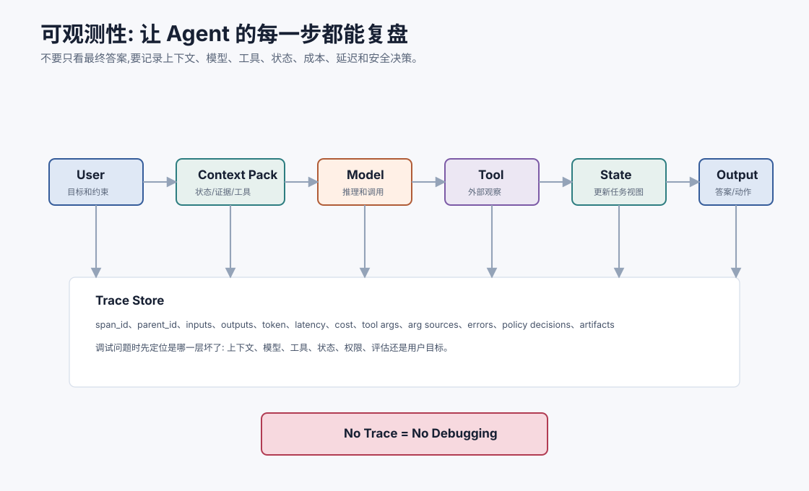
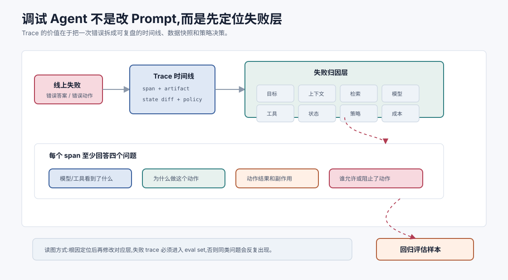
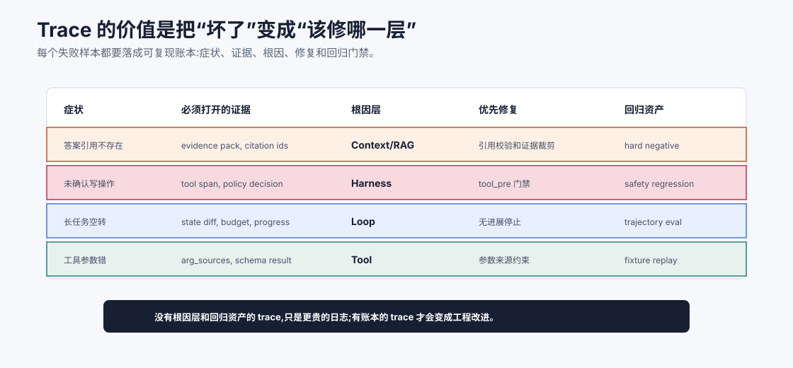
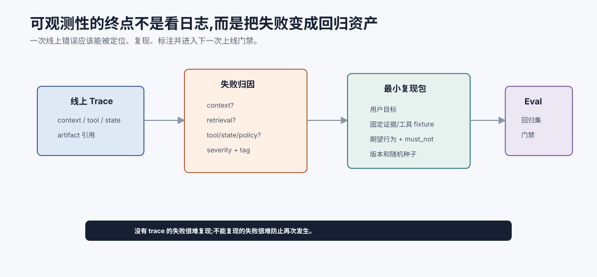

# 可观测性与调试 `[主线]`

Agent 上线后,最怕的不是它偶尔答错,而是你不知道它为什么答错。

用户看到的是最终答案,但 Agent 背后发生了很多事:

- 构建上下文。
- 检索记忆和文档。
- 调用模型。
- 选择工具。
- 填参数。
- 执行工具。
- 更新状态。
- 触发护栏。
- 生成最终输出。

任何一层出错,最终结果都可能错。没有可观测性,你只能反复改 prompt,像在黑盒上敲门。





本章会讲:

- Agent 可观测性和普通日志有什么不同。
- Trace、span、artifact、state diff 应记录什么。
- 如何定位错误发生在上下文、模型、工具、状态还是策略。
- 如何调试长任务、多工具和多 Agent。
- 如何用可观测数据支撑评估和回归。

## 为什么普通日志不够

传统服务日志常记录:

```text
request_id, endpoint, status_code, latency, error
```

这对普通 API 有用,但对 Agent 不够。

因为 Agent 的结果不是单个函数决定的,而是多个概率决策和外部动作共同产生。

你需要知道:

- 模型看到了什么上下文。
- 它为什么选择这个工具。
- 工具参数从哪里来。
- 工具返回了什么。
- 哪些证据进入了最终回答。
- 哪个护栏允许或拦截了动作。
- 状态在每一步如何变化。

没有这些,你无法判断是模型错、检索错、工具错、状态错,还是系统规则没有生效。

普通日志回答的是“服务有没有报错”。Agent 可观测性要回答的是“系统为什么相信自己应该这么做”。

这两者差别很大。一个 Agent 可能 HTTP 200、工具调用成功、最终答案格式也合法,但仍然犯了严重业务错误:它可能用了过期证据,把用户问题理解错,绕过了人工确认,或把不可信网页内容当成系统指令。传统日志会显示一切正常,trace 才能暴露决策链路。

## Trace 是 Agent 的时间线

Trace 是一次任务从开始到结束的完整时间线。

一个 trace 可以包含多个 span:

```text
trace: refund_task_17
  span: build_context
  span: model_call_plan
  span: tool_call_get_order
  span: retrieve_policy
  span: model_call_decide
  span: guardrail_check
  span: final_response
```

每个 span 记录一个可观察步骤。

Trace 的目标是让你能复盘:

```text
当时系统看到什么,做了什么,为什么这么做,结果是什么。
```

一个可用的 trace 至少要满足三个条件。

第一,它能串起完整因果链。每个 span 要有 `span_id`、`parent_id` 和时间戳,否则并行工具、多 Agent 交接和重试很难复盘。

第二,它能把输入、输出和状态变化联系起来。只知道模型输出了一个 tool call 还不够,还要知道这个参数来自哪个证据、哪个状态字段或哪段用户输入。

第三,它能连接到可复现材料。长文件、网页、截图、测试日志不要只留摘要,要保留 artifact 引用,让工程师能回源确认。

可以把 trace 想成 Agent 的“黑匣子”。没有它,事故复盘只能靠猜。

## Span 应记录什么

不同 span 记录内容不同。

### 模型调用 span

应记录:

- model name 和版本。
- prompt/context pack 的引用或脱敏快照。
- 输入 token、输出 token。
- temperature、top_p 等参数。
- 输出文本或结构化 tool call。
- latency 和 cost。
- 解析或 schema 校验结果。

### 工具调用 span

应记录:

- tool name。
- call id。
- 参数。
- 参数来源。
- 权限决策。
- 执行状态。
- 错误码。
- 原始 artifact。
- 副作用类型。
- 幂等 key。

工具 span 里最关键的是**参数来源**和**副作用边界**。

例如 `submit_refund(order_id, amount)` 里的 `amount` 是用户说的、系统订单查到的、模型推断的,还是 OCR 识别的?如果 trace 没有记录来源,一旦金额错了,你很难判断该修 OCR、检索、模型还是工具 schema。

副作用边界同样重要。读工具、写工具、外部通知、资金操作、权限变更应该有不同级别的记录和确认策略。把所有工具都当成普通函数,是 Agent 上线很危险的信号。

### 检索 span

应记录:

- query 原文和改写结果。
- 检索源。
- top-k 候选。
- 分数和元数据。
- rerank 后排名。
- 最终证据包。

### 状态更新 span

应记录:

- state diff。
- 哪个事件触发更新。
- 哪些假设被确认或否定。
- 哪些约束新增、覆盖或废弃。

## Artifact:大对象不要塞进日志

工具输出、文件内容、长网页、测试日志可能很大。

不要把它们全部塞进 trace 主体。更好的做法是保存 artifact 引用:

```json
{
  "summary": "UserService test failed: active expected true, got undefined.",
  "artifact": "tool-result://test-17"
}
```

Trace 保存摘要和引用。需要复查时再打开 artifact。

这样既控制日志体积,也保留回源能力。

## Context pack 可观测

上下文工程如果不可观测,就很难调试。

每次模型调用前,最好保存 context pack 的结构:

```json
{
  "system_rules_tokens": 420,
  "state_summary_tokens": 310,
  "memory_ids": ["M12", "M19"],
  "evidence_ids": ["S1", "S3"],
  "tool_names": ["search_policy", "get_order"],
  "redactions": ["customer_email"],
  "total_tokens": 3900
}
```

这能回答很多问题:

- 关键证据是否进入上下文?
- 工具 schema 是否过多?
- 是否注入了过期记忆?
- 输出格式要求是否被长证据淹没?
- 敏感数据是否被脱敏?

## State diff 比最终 state 更重要

只保存最终状态还不够。要保存每步 state diff。

例如:

```json
{
  "before": {"status": "running", "current_step": "retrieve_policy"},
  "event": "evidence_pack_received",
  "after": {"status": "running", "current_step": "check_eligibility"}
}
```

当 Agent 走错路时,state diff 能告诉你哪一步把状态更新错了。

很多“模型忘记了”其实是状态没有正确更新,或 context builder 没把状态放进去。

状态 diff 还应该区分三类变化:

- confirmed: 已由工具或用户确认的事实。
- inferred: 模型推断但未验证的假设。
- obsolete: 被新证据覆盖或不再适用的信息。

如果系统把 inferred 当成 confirmed,Agent 会过早执行动作。如果 obsolete 信息没有清理,模型会被旧上下文误导。状态不是越多越好,而是要有来源、置信度和生命周期。

## Trace 数据模型示例

一个生产 trace 不一定复杂,但字段要稳定。

```json
{
  "trace_id": "task_2026_0712_00017",
  "span_id": "tool.submit_refund.3",
  "parent_span_id": "model.decide_action.2",
  "type": "tool_call",
  "input_ref": "artifact://tool_args_3",
  "output_ref": "artifact://tool_result_3",
  "arg_sources": {
    "order_id": "tool.get_order#result.order_id",
    "amount": "policy_calc#eligible_amount"
  },
  "policy_decision": {
    "allowed": false,
    "reason": "missing_user_confirmation"
  },
  "latency_ms": 184,
  "cost_usd": 0.0,
  "state_diff_ref": "artifact://state_diff_3"
}
```

字段不一定照抄,但设计原则要明确:trace 主体放索引、摘要和元数据,大对象放 artifact,敏感内容按权限读取。

## 调试的分层方法

当一个 Agent 答错,不要先改 prompt。按层排查。

### 1. 目标层

用户目标和约束是否被正确解析?

### 2. 上下文层

模型是否看到了必要信息? 是否看到太多噪声?

### 3. 检索层

正确证据是否存在、召回、排前、进入证据包?

### 4. 模型层

模型是否误读证据、格式错误、错误调用工具?

### 5. 工具层

参数是否正确? 工具是否成功? 返回是否可信?

### 6. 状态层

观察是否正确写入 state? 旧假设是否被清除?

### 7. 策略层

权限、护栏、确认和数据流策略是否生效?

这种分层能避免把所有问题都归因于“模型不行”。

分层排查最好和修复动作一一对应。

| 失败层 | 典型症状 | 优先修复 |
| --- | --- | --- |
| 目标层 | 回答了错误问题,忽略用户约束 | 意图解析、任务确认、用户目标 schema |
| 上下文层 | 证据存在但没进入模型 | context builder、摘要、优先级、截断策略 |
| 检索层 | 正确文档没召回或排太后 | query 改写、embedding、reranker、chunking |
| 模型层 | 证据在上下文里但误读 | prompt、模型选择、结构化输出、few-shot |
| 工具层 | 参数错、超时、重试混乱 | tool schema、参数校验、错误协议、幂等 |
| 状态层 | 旧假设污染后续步骤 | state diff、生命周期、确认/推断分离 |
| 策略层 | 未确认写操作被执行 | runtime policy、权限门、人工确认 |

这张表的价值在于克制“先改 prompt”的冲动。很多线上事故应该修 runtime,不是修话术。

## 根因定位账本

分层调试最好落成一份根因定位账本。否则 trace 很容易变成“信息很多,但没人知道下一步该修哪里”的大日志。



这份账本把一次失败压成五列。

第一列是症状,例如引用不存在、工具参数错、长任务空转、未确认写操作。症状要用用户或系统能观察到的语言描述,不要一开始就写根因。

第二列是必须打开的证据。不同症状需要不同证据:引用错误看 evidence pack,工具错误看 arg sources 和 schema result,安全事故看 policy decision,长任务空转看 state diff、progress marker 和 budget ledger。证据列能防止复盘只靠印象。

第三列是根因层。根因层应该落到 Prompt、Context、Retrieval、Tool、State、Harness、Loop 或 Product boundary 之一。复杂事故可以有多个层,但必须标出主责层。

第四列是优先修复。Context 问题修 context builder,工具问题修 schema 和参数来源,安全问题修 runtime policy,循环问题修停止条件。把症状和修复动作解耦,能减少“所有问题都改 prompt”的惯性。

第五列是回归资产。每次线上失败都应该留下一个 smoke、regression、safety、hard negative 或 trajectory eval 样本。没有回归资产,同类事故只会在下一次模型、prompt 或工具版本变化时回来。

这份账本的价值不是让复盘更正式,而是让每次失败都能进入工程系统:有证据、有归因、有修复、有门禁。可观测性到这里才真正闭环。

## 一个调试案例

用户问:

```text
这个订单能不能退款?
```

Agent 回答:

```text
可以退款,我已经提交了退款申请。
```

但实际系统要求用户确认后才能提交。

Trace 排查:

1. 目标层:用户只问能不能退款,没有要求提交。
2. 检索层:政策证据只支持“可创建退款草稿”。
3. 工具层:Agent 调用了 `submit_refund`,不是 `create_refund_draft`。
4. 策略层:runtime 没有阻止缺少确认的写工具。

根因不是单纯回答错误,而是工具权限和确认策略缺失。修复应该在 runtime 加策略门,不是只在 prompt 里写“提交前要确认”。

## 可观测性指标

Agent 指标可以分几类。

| 类别 | 指标 |
| --- | --- |
| 质量 | 任务成功率、引用准确率、工具参数正确率 |
| 成本 | tokens/task、cost/task、model calls/task |
| 延迟 | P50/P95 总延迟、工具等待时间、首 token 时间 |
| 稳定性 | schema 失败率、重试率、超时率 |
| 安全 | 被拦截动作数、未确认写操作数、数据流违规数 |
| 检索 | recall@k、rerank 命中率、无证据回答率 |
| 记忆 | 记忆命中率、过期记忆使用率、冲突处理率 |

指标要能连接到 trace。只有数字没有样本,很难改进。

还要避免只看全局平均值。Agent 问题常常集中在某些 tag 上:

- 长上下文任务成本突然升高。
- 某个工具 schema 更新后参数失败率升高。
- 某类安全样本被新模型绕过。
- 某个租户的数据源召回质量下降。
- 某个语言或地区的用户满意度下降。

所以指标应该支持按任务类型、用户群、模型版本、工具版本、Prompt 版本、数据源和风险等级切片。没有切片,平均值会把关键退化藏起来。

## 多 Agent 可观测性

多 Agent 还要记录:

- 每个 Agent 的输入和输出。
- 消息 envelope。
- 角色间交接。
- Orchestrator 状态更新。
- 并行任务的 parent/child span。
- 冲突和仲裁。
- 哪个角色的产物进入最终答案。

多 Agent 没有 trace,就像看一场会议的最终纪要,却不知道谁说了什么、谁做了决定、依据是什么。

## 日志脱敏和隐私

可观测性会收集大量敏感信息。

必须设计:

- PII 脱敏。
- 密钥和 token 过滤。
- artifact 访问权限。
- 日志保留期限。
- 租户隔离。
- 用户删除请求处理。

不要为了调试把所有 prompt、工具结果和用户数据永久明文保存。

一个实用原则是:默认保存结构,按需打开内容。

也就是说,trace 可以默认保存 token 数、证据 ID、工具名、字段名、脱敏摘要、hash、artifact 引用和策略结果。只有具备权限的工程师在事故排查时,才能打开原始 artifact。

还要注意采样策略。高风险动作、失败请求、安全拦截、工具错误应该高采样甚至全量保存;普通成功请求可以采样保存,以控制成本和隐私风险。

## 从 trace 到评估样本

可观测性不只是排查线上问题,也是评估数据来源。

失败 trace 可以回流成:

- 回归测试样本。
- hard negative。
- 工具使用错误样本。
- prompt injection 样本。
- 成本延迟异常样本。
- 人工标注任务。

成熟系统会把线上失败变成离线评估资产。

回流时不要只保存用户输入和最终答案。应该保存最小可复现包:

- 用户目标和必要上下文。
- 相关证据或 artifact 引用。
- 工具模拟结果或固定 fixture。
- 当时的模型、Prompt、工具 schema 和策略版本。
- 期望行为和 must-not 行为。
- 失败层标签和严重程度。

这样评估样本才不会因为外部数据变化而无法复现。



这条回流链路的关键是“先归因,再固化”。线上 trace 里通常有大量噪声:用户长对话、临时工具返回、环境状态、重试记录、无关 span。直接把完整 trace 扔进 eval set,评估会变慢、变贵、不可读。更好的做法是先做失败 triage,判断根因发生在 context、retrieval、tool、state、policy 还是 generation,再抽取足以复现该失败的最小材料。

最小可复现包应该能回答两个问题:旧版本为什么失败,新版本怎样才算真的修好。它不是“事故截图”,而是一条可回归的工程契约。比如一次未确认退款事故,样本里必须固定用户原话、订单工具 fixture、退款政策证据、当时的 tool schema、策略版本和期望行为:只能创建草稿或请求确认,不得提交退款。这样下一次改 prompt、换模型或改 harness 时,门禁才能稳定拦住同类回归。

## 常见误解

### 误解一:有日志就有可观测性

不够。需要结构化 trace、span、artifact、state diff 和策略决策。

### 误解二:只看最终答案就能调试

不能。最终答案错可能来自上下文、检索、工具、状态或安全策略。

### 误解三:保存完整 prompt 最安全

不一定。完整 prompt 可能包含敏感数据。要脱敏、分层和控制访问。

### 误解四:指标越多越好

指标要能指导行动。没有 trace 支撑的指标很难定位问题。

### 误解五:可观测性是上线后的事

不是。没有 trace,开发阶段也很难迭代 Agent。

### 误解六:trace 越完整越好

不一定。完整明文保存会带来隐私、成本和访问控制风险。更好的做法是结构化元数据 + artifact 引用 + 权限控制。

### 误解七:有了 trace 就自动知道根因

不会。trace 提供证据,还需要失败分层、指标切片和评估回流机制。

### 误解八:模型输出解释就是可观测性

不是。模型解释可能不可靠。可观测性要记录真实输入、工具结果、状态 diff 和 runtime 策略决策。

## 本章小结

Agent 可观测性要记录任务从用户目标到最终输出的完整过程:上下文、模型调用、检索、工具、状态更新、护栏、成本和延迟。Trace、span、artifact 和 state diff 是调试的基础。调试时应分层定位问题,不要把所有错误都归因于 prompt 或模型。可观测数据还应回流到评估集,让线上失败变成可回归的改进资产。

下一章会讲评估 Evaluation。可观测性告诉我们系统做了什么,评估则告诉我们这些行为是否真的更好。
