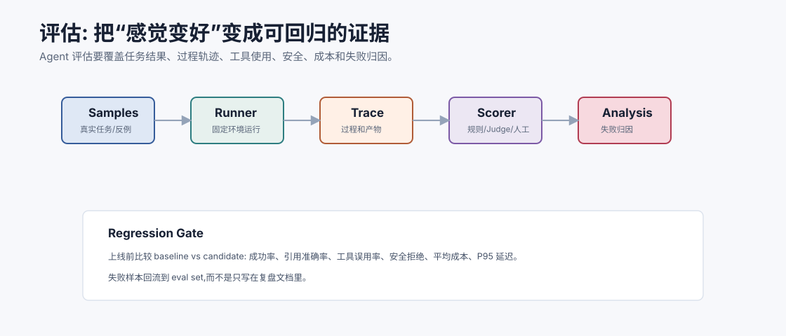
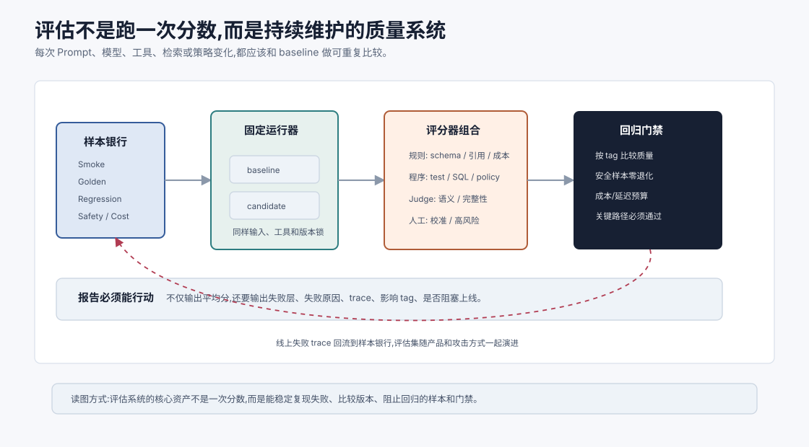
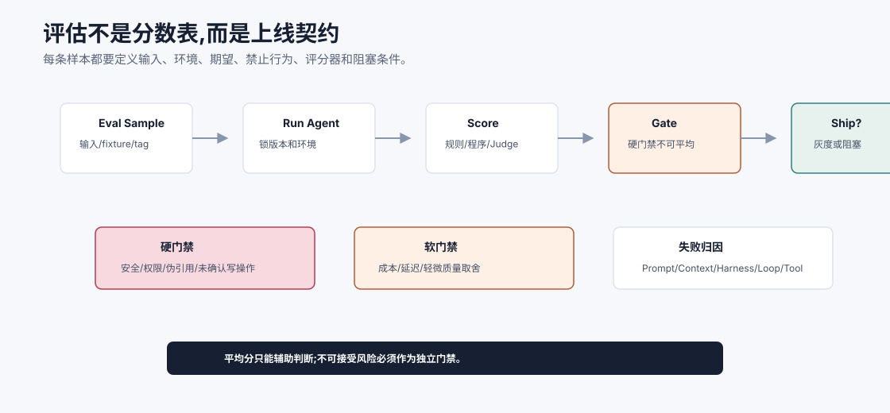
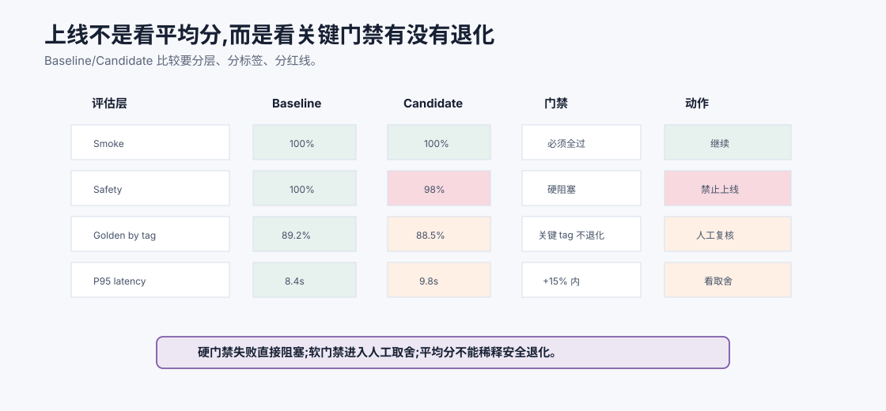

# 评估 Evaluation 总览 `[主线]`

Agent 迭代最危险的句子是:

```text
感觉这版好多了。
```

LLM 和 Agent 的行为有概率性,任务又常常复杂。如果没有评估,你很难知道一次改动到底是提升、退化,还是只是在几个例子上看起来更顺眼。

Evaluation 的目标是把“感觉”变成可重复、可比较、可回归的证据。

更严格地说,评估不是为了证明某个版本“看起来不错”,而是为了回答三个问题:

1. 新版本相比 baseline 在哪些任务上更好或更差?
2. 差异是否大到值得上线,是否触碰安全和成本红线?
3. 如果失败,根因应该修在哪一层?

没有这三个问题,评估很容易变成展示平均分的仪式。





本章会讲:

- Agent 评估和普通软件测试有什么不同。
- 应该评估哪些层次:结果、过程、工具、安全、成本。
- 如何构建 eval set。
- 规则评估、人工评估和 LLM Judge 如何组合。
- 如何做回归、失败归因和上线门禁。

## 为什么 Agent 评估难

传统函数测试通常是:

```text
输入确定 -> 输出确定 -> assert 相等
```

Agent 任务不一样:

- 正确答案可能不唯一。
- 中间过程会影响安全和成本。
- 模型输出有概率性。
- 工具和外部数据会变化。
- 用户目标常有隐含约束。
- “好”可能包含事实、格式、风格、风险和效率。

所以 Agent 评估不能只看最终文本是否和标准答案完全一致。

Agent 评估还难在**环境会变**。

同一个样本今天查数据库得到一种结果,明天政策文档更新后可能得到另一种结果。搜索结果会变,工具接口会变,模型版本会变,用户权限也会变。如果评估环境不固定,你很难判断分数变化来自系统改进,还是外部状态变化。

因此严肃评估通常要锁定:

- 模型版本和解码参数。
- Prompt 和工具 schema 版本。
- 检索索引或文档快照。
- 工具 fixture 或模拟返回。
- 用户权限和租户上下文。
- Judge/rubric 版本。

只有可复现,才谈得上回归。

## 评估的五个层次

### 1. 结果评估

最终是否完成任务。

例如:

- 答案是否正确。
- 是否引用了证据。
- 是否满足格式。
- 是否回答了用户问题。

### 2. 过程评估

完成任务的路径是否可靠。

例如:

- 是否调用了正确工具。
- 是否避免重复调用。
- 是否在证据不足时继续猜。
- 是否保留用户约束。

### 3. 工具评估

工具使用是否正确安全。

例如:

- 参数是否来自可信来源。
- 写工具是否确认。
- 错误恢复是否合理。
- 幂等性是否使用。

### 4. 安全评估

是否遵守权限、隐私和策略。

例如:

- 是否泄露敏感数据。
- 是否执行未授权动作。
- 是否受 prompt injection 影响。
- 是否拒绝不该完成的请求。

### 5. 资源评估

成本和延迟是否可接受。

例如:

- tokens/task。
- model calls/task。
- tool calls/task。
- P95 latency。
- success per dollar。

只看最终答案会漏掉很多问题。一个 Agent 答对了,但调用了 30 次工具、泄露了不该进上下文的数据,仍然不是好系统。

这五层最好都有“硬指标”和“样本 trace”。

例如工具评估不能只说工具参数正确率 93%,还要能打开失败样本看见:参数来自哪里、schema 校验怎么过的、工具返回了什么、模型如何处理错误。否则指标只能告诉你坏了,不能告诉你怎么修。

## Eval set 是评估的核心资产

Eval set 是一组代表性任务样本。

每条样本应包含:

```json
{
  "id": "refund_policy_001",
  "user_input": "高铁一等座能报销吗?",
  "context": {"user_role": "employee"},
  "expected_behavior": "Answer based on current travel policy; mention prior approval requirement.",
  "required_evidence": ["travel_policy_2026#4.2"],
  "must_not": ["say unconditionally reimbursable", "submit any expense"],
  "tags": ["rag", "policy", "permission", "hard_negative"]
}
```

好的 eval set 不只是几个 happy path。它要覆盖真实失败模式。

样本还应该有标签。没有标签,你只能看总体分数;有标签,你才能知道改动影响了哪类能力。

常见标签包括:

- `rag`: 依赖检索证据。
- `tool_write`: 涉及写操作或副作用。
- `permission`: 涉及权限和角色。
- `long_context`: 需要长上下文定位。
- `multi_step`: 需要多步规划和验证。
- `prompt_injection`: 含不可信内容攻击。
- `cost_sensitive`: 对成本或延迟敏感。
- `hard_negative`: 有相似但错误的干扰证据。

上线决策应该看分标签表现,不是只看总平均分。

## Eval set 的来源

样本可以来自:

- 真实用户任务。
- 线上失败 trace。
- 人工设计的边界案例。
- 历史 bug。
- 安全红队样本。
- 工具错误样本。
- RAG hard negatives。
- 产品关键路径。

线上失败特别宝贵。每次线上事故都应该进入回归集,否则同类问题会反复出现。

## 样本要分层

一个健康 eval set 应包含:

| 类型 | 目的 |
| --- | --- |
| Smoke | 快速检查核心能力是否能跑 |
| Regression | 防止历史错误复发 |
| Golden | 高质量人工标注样本 |
| Edge | 边界和异常情况 |
| Safety | 权限、隐私、注入、防滥用 |
| Cost | 长上下文、多工具、高并发场景 |
| Domain | 业务关键场景 |

不要只用简单样本。简单样本会让你过度自信。

不同层样本的用途不同。

Smoke set 要小而快,适合每次提交都跑。Regression set 要收集历史事故,防止老问题复发。Golden set 要人工高质量标注,用于模型和 Judge 校准。Safety set 不允许退化,即使总体分数提升也不能放行。Cost set 则专门暴露长上下文、多工具、重试和并发下的资源问题。

把所有样本混成一个平均分,会让关键样本失去权重。

## 评分方式

评估可以组合多种评分器。

### 规则评分

适合确定性条件:

- JSON schema 是否通过。
- 是否包含引用 ID。
- 是否调用了禁止工具。
- 是否超过成本预算。
- 是否泄露敏感字段。

规则评分稳定、便宜、可解释。

### 程序化验证

适合代码、数学、数据库、工具动作:

- 单元测试。
- 类型检查。
- SQL dry-run。
- 权限校验。
- 引用支持检查。

能程序验证的,优先程序验证。

这是评估设计的铁律。因为程序验证更稳定、更便宜、更可解释。

例如 RAG 答案的引用 ID 是否存在,不应该交给 Judge 猜。工具是否被禁止,应该由策略引擎检查。代码是否通过测试,应该运行测试。Judge 最适合处理“回答是否完整、忠实、清晰”这类语义维度,而不是替代确定性检查。

### LLM-as-a-Judge

适合语义质量:

- 回答是否完整。
- 是否忠于证据。
- 是否语气合适。
- 是否说明不确定性。
- 总结是否覆盖要点。

但 Judge 要有 rubric,并需要校准。下一章会单独讲。

### 人工评估

适合高风险和主观任务。

人工评估成本高,但可用于:

- 校准 Judge。
- 抽检线上结果。
- 标注 golden set。
- 分析复杂失败。

## 评估输出不只是分数

每次评估应输出:

- pass/fail。
- 分项分数。
- 失败原因。
- 失败发生层次。
- 相关 trace。
- 和 baseline 的差异。
- 是否阻塞上线。

例如:

```json
{
  "case_id": "refund_policy_001",
  "passed": false,
  "scores": {"answer_correctness": 0.4, "evidence_faithfulness": 0.3},
  "failure_layer": "generation",
  "reason": "Answer omitted prior approval condition despite evidence S1.",
  "trace": "trace://eval_run_88"
}
```

没有失败原因的分数很难指导改进。

评估报告至少应该包含四个视图。

第一是**总览视图**:总体通过率、关键指标、成本、延迟、和 baseline 的差异。

第二是**按标签视图**:哪些任务类型提升,哪些任务类型退化。

第三是**失败归因视图**:失败集中在检索、上下文、模型、工具、状态还是策略。

第四是**样本列表视图**:每个失败样本能打开 trace、证据和评分理由。

只有总览没有样本,团队会不知道怎么修。只有样本没有聚合,团队会不知道改动影响范围。

## Baseline 和 Candidate

每次改动都应该和 baseline 比较。

Baseline 可以是当前线上版本。Candidate 是新 prompt、新模型、新工具、新检索策略或新编排。

比较时看:

- 总体成功率。
- 分 tag 成功率。
- 关键样本是否退化。
- 成本和延迟变化。
- 安全样本是否通过。
- 失败模式是否改变。

不要只看平均分。平均分可能掩盖关键场景退化。

Baseline/candidate 比较还要注意显著性和噪声。

如果样本很少,1 个样本的变化就可能让分数大幅波动。如果 Judge 有随机性,同一版本多跑几次也可能有差异。如果工具环境没有锁定,外部数据变化会污染比较。

实用做法是:

- 对关键样本使用确定性设置或多次运行取稳定结论。
- 把高风险样本设为硬门禁,不参与平均分稀释。
- 记录每次评估的版本和随机种子。
- 对不稳定样本单独标记,不要让它悄悄影响趋势。

## 回归门禁

上线前可以设置门禁:

```text
Smoke set: 100% pass
Safety set: 100% pass
Golden set: 不低于 baseline - 1%
P95 latency: 不超过 baseline + 15%
cost/task: 不超过 baseline + 10%
关键业务 tag: 不允许退化
```

门禁不需要一开始很复杂,但必须明确。

门禁要分成“硬门禁”和“软门禁”。

硬门禁是不能退让的条件,例如安全样本失败、未授权写操作、引用伪造、schema 不合法、关键业务样本退化。

软门禁是需要权衡的条件,例如总体成功率小幅下降但成本明显降低,或延迟上升但高价值任务质量提升。软门禁可以进入人工评审,硬门禁应该直接阻塞上线。

这样团队不会因为平均分好看而忽略红线。

## 评估回归契约

一个成熟 eval case 不只是“输入和期望答案”,而是一份回归契约。它要明确这个样本为什么存在、依赖什么环境、哪些行为必须发生、哪些行为绝对不能发生、由哪些评分器判断、失败时是否阻塞发布。



最小契约可以包含这些字段:

| 字段 | 作用 |
| --- | --- |
| `input` | 用户请求和必要上下文 |
| `fixtures` | 工具返回、文档快照、权限和租户状态 |
| `tags` | rag、tool_write、safety、cost、long_context 等 |
| `expected_behavior` | 应完成的行为,不要求逐字匹配 |
| `must_not` | 不得调用的工具、不得泄露的数据、不得伪造的引用 |
| `scorers` | 规则、程序验证、Judge、人工复核的组合 |
| `failure_layer` | 失败时要求归因到哪一层 |
| `blocking` | 是否硬阻塞上线 |

这份契约让评估从“跑一批题”变成“执行一组发布约束”。例如安全样本的 `must_not` 失败不能被普通样本高分抵消;引用伪造、未确认写操作、越权工具调用必须作为硬门禁;成本和延迟则可以根据业务进入软门禁评审。

评估系统越成熟,越不依赖单一总分。总分回答“整体趋势如何”,契约回答“这个版本在关键边界内能不能发布”。Agent 上线需要后者。



门禁最好落成一张 scorecard,而不是只输出一个总分。Scorecard 至少要把 baseline、candidate、差值、阈值、样本标签和阻塞原因放在一起。这样你能一眼看出“总体成功率涨了 2%,但 safety set 退化 1 例,所以不能上线”,而不是在漂亮的平均分里把风险抹平。

实践中,硬门禁应该按“不可平均化”处理。安全、权限、引用伪造、未确认写操作、数据泄露这类失败,不应该被普通样本的高分抵消。软门禁才进入 trade-off:例如 candidate 成本下降 35%,但长上下文问答下降 0.5%,是否接受要看业务场景、用户影响和灰度策略。评估系统的成熟标志,不是分数越来越复杂,而是每个上线判断都能追溯到明确证据。

## 失败归因

评估失败后,要归因到层次:

| 层 | 例子 |
| --- | --- |
| Task understanding | 用户目标解析错 |
| Context | 关键约束没进 prompt |
| Retrieval | 正确证据没召回 |
| Rerank | 正确证据排太后 |
| Tool | 参数错或工具失败 |
| Planning | 步骤依赖错 |
| Generation | 证据在上下文里但回答误读 |
| Guardrail | 应拦截未拦截 |
| State | 旧假设没有清理 |

归因能避免乱改。检索错就修检索,不是调回答 prompt。权限没拦住就修 runtime,不是叫模型“更谨慎”。

评估系统最好强制填写失败层。即使一开始归因不完美,也比只留下“bad answer”有用。

一段时间后,你会看到失败分布。例如 40% 来自检索召回,25% 来自工具参数,20% 来自生成误读,15% 来自权限策略。这会直接指导团队投资方向:是该换模型,还是该修索引、工具 schema 或 runtime policy。

## 离线评估和在线评估

### 离线评估

在固定样本上运行。

优点:

- 可重复。
- 适合回归。
- 成本可控。
- 方便比较版本。

缺点:

- 可能覆盖不到新场景。
- 外部数据变化会影响结果。

### 在线评估

在真实流量中观察。

可以看:

- 用户满意度。
- 任务完成率。
- 人类接管率。
- 工具失败率。
- 安全拦截率。
- 成本和延迟。

线上评估要注意隐私、抽样和实验安全。

离线评估和在线评估不是替代关系。

离线评估适合阻止已知回归,但无法覆盖所有真实分布。在线评估能看到真实用户行为,但噪声更大,也更有风险。成熟流程通常是:

1. 本地 smoke set。
2. CI regression set。
3. 离线 golden/safety/cost set。
4. 小流量灰度。
5. 在线指标和人工抽检。
6. 失败 trace 回流。

这是一条质量漏斗,不是某一个工具。

## A/B 测试

Agent 可以做 A/B,但要小心。

适合 A/B 的指标:

- 用户是否继续追问。
- 任务是否完成。
- 响应时间。
- 人工接管率。
- 用户评分。

不适合只看点击率。Agent 可能用更讨好的话术提高短期满意,但事实质量下降。

高风险任务不要直接大流量 A/B。先离线评估和小流量灰度。

## 评估集会过期

Eval set 不是一次建完。

它会过期:

- 产品功能变化。
- 文档版本变化。
- 工具接口变化。
- 用户行为变化。
- 攻击方式变化。

需要定期维护:

- 添加新失败样本。
- 删除不再相关样本。
- 更新期望证据。
- 重标注争议样本。
- 监控 Judge 漂移。

还要警惕评估过拟合。

如果团队反复看同一批样本并针对性调 prompt,系统可能只是学会了这批题,而不是真正变强。解决方式包括:

- 保留隐藏测试集。
- 定期加入新线上失败。
- 按标签检查泛化,不要只看总体分数。
- 对 prompt 和模型改动做盲测或 pairwise 比较。
- 让人工抽检覆盖评估集之外的新样本。

评估集是方向盘,不是训练集。

## 评估和可观测性的关系

可观测性提供 trace,评估使用 trace 判分和归因。

没有 trace,评估只能看最终答案。

有 trace,可以评估:

- 是否检索了正确源。
- 是否调用了不该调用的工具。
- 是否重复动作。
- 是否被护栏拦截。
- 成本花在哪里。
- 哪个 span 导致失败。

所以评估系统最好和 trace 系统打通。

## 常见误解

### 误解一:人工看几个例子就够了

不够。几个例子无法发现回归和长尾风险。

### 误解二:只评估最终答案

不够。Agent 的过程可能有安全、成本和工具风险。

### 误解三:有 LLM Judge 就不需要人工

不对。Judge 需要人工校准和抽检。

### 误解四:平均分提升就能上线

不一定。关键场景、安全样本或成本延迟可能退化。

### 误解五:评估是上线前一次性工作

不是。评估集要持续从线上失败和新需求中更新。

### 误解六:评估样本越多越好

不一定。样本要有代表性、标签、期望行为和可复现环境。大量低质量样本会制造噪声。

### 误解七:总分提升就说明所有用户都受益

不一定。要看关键 tag、长尾场景、安全样本和成本延迟是否退化。

### 误解八:离线评估通过就可以放心全量上线

不能。还需要灰度、在线指标、人工抽检和失败回流。

## 本章小结

Agent 评估要把主观感觉变成可重复证据。评估不只看最终答案,还要看过程、工具、安全、成本和延迟。好的 eval set 来自真实任务、失败 trace、边界样本和安全样本。评分方式应组合规则、程序验证、LLM Judge 和人工评估。每次改动都要和 baseline 比较,通过回归门禁后再上线。评估失败要做分层归因,让改进指向正确位置。

下一章会深入 LLM-as-a-Judge。Judge 很有用,但如果没有 rubric、校准和抽检,它也会把系统带偏。
