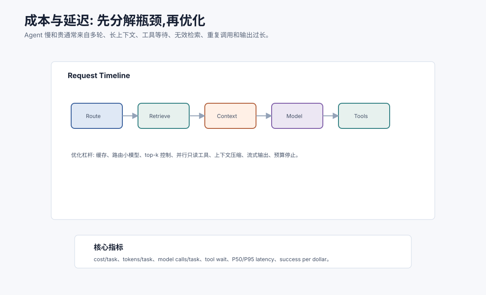
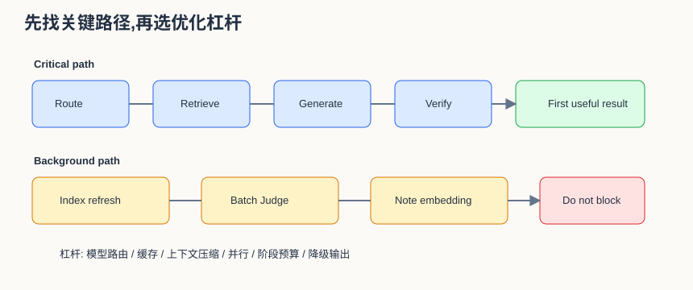
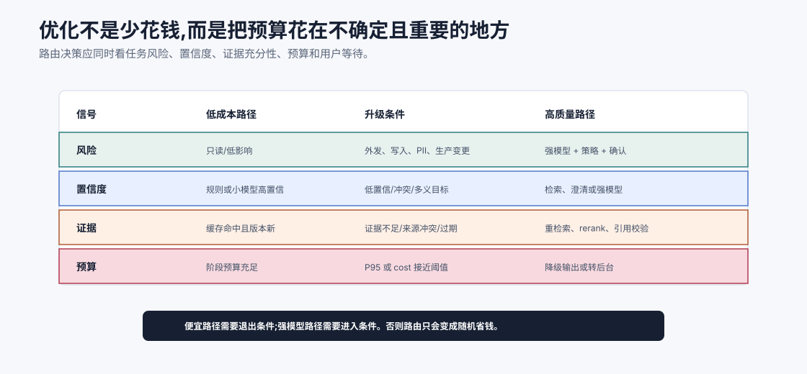
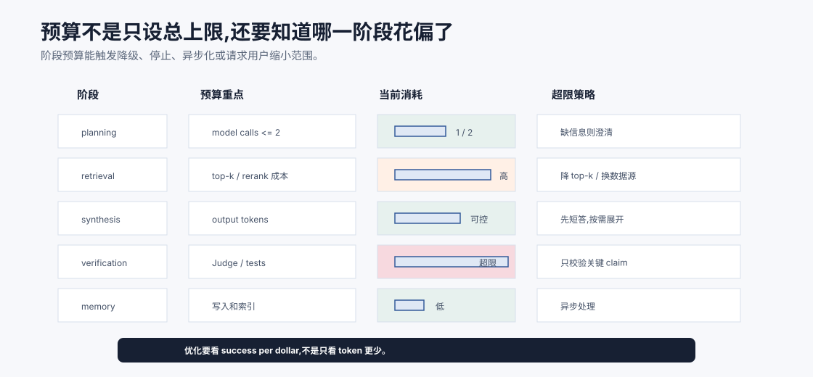

# 成本与延迟优化 `[主线]`

Agent 能力越强,越容易变慢、变贵。

它可能多轮调用模型、检索大量资料、注入长上下文、调用多个工具、让 Critic 反复检查,最后用户等了很久,账单也很难看。

成本与延迟优化不是简单地“少用大模型”。真正的优化要先分解请求链路,看钱和时间花在哪里。





本章会讲:

- Agent 成本和延迟来自哪些环节。
- 如何用 trace 分解瓶颈。
- 模型路由、缓存、上下文压缩、并行、流式输出如何取舍。
- 如何避免无效工具调用和无效检索。
- 如何定义预算和停止条件。
- 如何用指标衡量优化是否真的有效。

## 成本结构

Agent 成本通常来自:

- 输入 token。
- 输出 token。
- 模型调用次数。
- embedding 调用。
- reranker 调用。
- 工具/API 调用。
- 向量数据库查询。
- 存储和日志。
- 人工审核。

其中最容易失控的是模型调用次数、长上下文和重复工具调用。

## 先分清三种成本

Agent 的成本不只有账单。至少要分三类看。

| 成本 | 例子 | 为什么重要 |
| --- | --- | --- |
| 直接成本 | token、embedding、rerank、第三方 API | 影响毛利和预算 |
| 等待成本 | 用户等待、队列堆积、超时重试 | 影响体验和吞吐 |
| 失败成本 | 返工、人工接管、错误副作用、回滚 | 低价方案可能反而更贵 |

很多“优化”只降低直接成本,却提高失败成本。例如把复杂推理全部切到小模型,单次调用便宜了,但引用错误率上升,人工复核增加,最终总成本可能更高。正确做法是用任务成功率、人工接管率和回归样本一起看。

## 延迟结构

延迟通常来自:

- 路由和权限检查。
- 检索和重排。
- 上下文构建。
- 模型首 token 时间。
- 模型生成时间。
- 工具等待。
- 多轮自我修正。
- 串行 Agent 调用。
- 输出后校验。

要优化延迟,先看时间线。不要凭感觉猜。

## 用 trace 分解

每次任务记录:

```json
{
  "total_latency_ms": 8200,
  "model_calls": 4,
  "input_tokens": 15400,
  "output_tokens": 2200,
  "retrieval_ms": 430,
  "tool_wait_ms": 3100,
  "judge_ms": 1200,
  "cost_usd": 0.18
}
```

然后问:

- 哪个 span 最慢?
- 哪个 span 最贵?
- 哪些调用没有改变结果?
- 哪些上下文没有被使用?
- 哪些工具调用可以并行?
- 哪些步骤可以缓存?

优化要从最大瓶颈开始。

Trace 还要区分 **critical path** 和 **background path**。

```text
critical path: 用户必须等它完成,才能看到可信结果
background path: 可以异步执行,不阻塞首个可用反馈
```

例如研究助手中,检索、证据包和引用校验通常在 critical path;生成长期笔记索引、批量 embedding、离线 Judge 复查可以放到 background path。只优化总耗时不够,要优化用户实际等待的关键路径。

## 指标不要只看平均值

平均延迟会掩盖长尾。

需要看:

- P50 latency。
- P95 latency。
- P99 latency。
- cost/task。
- tokens/task。
- model calls/task。
- tool calls/task。
- success per dollar。
- timeout rate。

一个系统平均 3 秒,但 P95 30 秒,用户体验仍然很差。

## 模型路由

不是所有步骤都需要最强模型。

可以按任务路由:

| 任务 | 可用模型策略 |
| --- | --- |
| 意图分类 | 小模型或规则 |
| JSON 修复 | 小模型 |
| 简单摘要 | 中等模型 |
| 复杂推理 | 强模型 |
| 高风险评审 | 强模型 + 规则 |
| 批量标签 | 小模型批处理 |

模型路由的关键是评估。不能因为小模型便宜就盲目替换,要看质量是否保持。

一个稳妥的模型路由表应包含“升级条件”,而不只是“哪个任务用哪个模型”。

| 场景 | 默认 | 升级条件 |
| --- | --- | --- |
| 意图分类 | 规则/小模型 | 低置信、涉及高风险动作 |
| Query rewrite | 小模型 | 多轮无结果、专业术语密集 |
| Evidence extraction | 中模型 | 引文冲突、长文档、多语言 |
| Final answer | 中/强模型 | 高价值报告、复杂取舍、用户要求严谨 |
| Safety review | 规则 + 强模型 | 外部发送、敏感数据、写工具 |

这样系统不会在简单任务上浪费强模型,也不会在复杂任务上死守便宜路径。

## 成本质量路由账本

模型路由如果只写成“简单任务用小模型,复杂任务用大模型”,很快就会失效。真实系统需要一份路由账本,把每次选择便宜路径、强模型路径、缓存路径、后台路径或人工路径的理由记下来。



路由至少要看四类信号。

第一是风险。只读、低影响、可撤销的任务可以优先低成本路径;外部发送、写入、PII、生产变更和合规结论则应该触发强模型、策略检查、确认或人工路径。

第二是置信度。规则或小模型高置信时可以快速通过;一旦出现低置信、用户目标多义、证据冲突或 schema 修复失败,就应升级,而不是让小模型继续猜。

第三是证据充分性。缓存命中且来源版本新,可以省掉检索和重排;证据不足、来源冲突、索引过期或关键 claim 没有引用,就要把预算花在重新检索、rerank 和校验上。

第四是预算和等待。预算接近阈值时,系统不应该硬跑到超时,而是按阶段降级:先给可验证结论、把低优先级检查转后台、请求用户缩小范围,或把高成本任务排队处理。

每次路由都应写入 trace:选择了哪个路径、为什么没有升级、触发了哪些退出条件、节省了多少成本、是否影响质量。这样成本优化才不是“随机省钱”,而是可评估的策略。

## 级联策略

级联策略是先用便宜方法,不够再升级。

例如:

```text
规则能回答 -> 直接返回
小模型能高置信回答 -> 返回
低置信 -> 强模型
仍低置信 -> 检索或请求用户
```

级联适合大量简单任务混合少量复杂任务的场景。

## 缓存

缓存可以显著降成本和延迟。

可缓存内容:

- 文档 embedding。
- 检索结果。
- rerank 结果。
- 工具只读查询。
- prompt 模板编译。
- 常见问题答案。
- Judge 评估结果。

但缓存要注意:

- 权限范围。
- 数据版本。
- 用户个性化。
- 过期时间。
- 敏感数据。

不要把 A 用户的检索结果缓存后给 B 用户使用。

缓存键至少要包含权限和版本维度:

```json
{
  "query_hash": "...",
  "user_scope": "user:123",
  "source_version": "docs-2026-07-07",
  "policy_version": "rag-access-v3",
  "model_or_embedder": "embed-v2"
}
```

如果缺少这些维度,缓存会把旧事实、越权资料或不同模型生成的不可比结果混在一起。缓存命中率高不是唯一目标,安全和新鲜度同样重要。

## 上下文压缩

输入 token 常常是大头。

压缩方式:

- 只注入相关工具 schema。
- RAG 证据去重。
- 长工具结果提取关键字段。
- 对话历史结构化摘要。
- 长文档先索引再按需读取。
- 删除过期计划和被否定假设。

压缩不能丢关键条件。要用评估检查压缩前后质量。

## 输出长度控制

输出 token 既影响成本,也影响延迟。

可以通过输出契约控制:

```text
用 5 条以内 bullet 回答。
只输出 JSON。
先给结论,细节不超过 200 字。
```

但不要盲目要求简短。复杂任务需要足够解释。目标是匹配用户需求,不是越短越好。

## 并行化

只读、独立的任务可以并行。

例如:

- 同时检索多个数据源。
- 同时让多个 Worker 分析不同文件。
- 同时运行互不依赖的检查。

并行降低墙钟时间,但可能增加总成本。

不适合并行:

- 有依赖的步骤。
- 写工具。
- 需要共享锁的资源。
- 结果合并成本高的任务。

并行优化要看 P95 延迟和成本变化。

并行化要警惕“扇出爆炸”。一个 Agent 每轮并行调用 5 个工具,再让每个工具触发 3 个检索,三轮之后就可能产生几十个 span。可以设置 fanout budget:

```json
{
  "max_parallel_tools": 3,
  "max_total_child_spans": 12,
  "max_background_tasks": 5
}
```

并行是降低墙钟时间的手段,不是让系统无限展开。

## 减少无效工具调用

工具调用慢且可能有副作用。

无效调用常见原因:

- 工具集太大。
- 参数缺失仍调用。
- 已有观察重复查询。
- 低置信计划直接执行。
- 错误类型不区分,盲目重试。

优化方法:

- 按任务动态加载工具。
- 调用前参数校验。
- actions_taken 去重。
- 错误分类。
- 只读工具可缓存。
- 写工具 require preview/confirm。

## 减少无效检索

RAG 也会浪费。

无效检索包括:

- 用户问题不需要外部知识仍检索。
- query 改写太宽。
- top-k 过大。
- 召回重复片段。
- 低质量文档源。

优化方法:

- 先判断是否需要检索。
- 按任务选择知识源。
- 使用 metadata 过滤。
- top-k + rerank。
- 证据去重。
- 对常见 query 缓存。

## 自我修正的预算

反思和修正会增加调用次数。

需要设置:

- 最大修正轮数。
- 每轮必须有新证据或新错误。
- 同一错误不变时停止。
- 成本上限。
- 低风险任务减少 Critic。
- 高风险任务保留 Critic。

自我修正不是越多越好。没有外部信号的反复反思通常只是浪费。

## 流式输出

流式输出不能减少总计算,但能改善感知延迟。

适合:

- 长回答。
- 写作任务。
- 用户愿意边看边等。

不适合:

- 最终答案需要完整安全校验。
- 输出必须是完整 JSON。
- 需要先调用工具确认事实。

可以先流式展示“正在检索/正在运行测试”的状态,而不是流式输出未经验证的答案。

## 预取和后台任务

有些信息可以提前准备:

- 常用文档索引。
- 用户项目结构摘要。
- 最近文件 embedding。
- 常见工具 schema。
- 历史失败样本。

预取能降低在线延迟,但要避免过度计算和过期。

## 批处理

批量任务可以合并:

- embedding 批量生成。
- 多样本评估批量运行。
- 多文档摘要批处理。
- Judge 批量评分。

批处理提高吞吐,但可能增加单个任务等待时间。适合离线和后台评估。

## 成本预算

每个任务可以有预算对象:

```json
{
  "max_model_calls": 6,
  "max_tool_calls": 10,
  "max_input_tokens": 30000,
  "max_cost_usd": 0.50,
  "max_latency_ms": 20000
}
```

Agent 每一步都检查预算。预算不足时,应降级、请求用户或停止并报告当前进展。

预算也可以按阶段拆分:

| 阶段 | 预算重点 | 超限策略 |
| --- | --- | --- |
| planning | 少量模型调用 | 要求澄清或缩小范围 |
| retrieval | 检索次数和 rerank 成本 | 降低 top-k,切换资料源 |
| synthesis | 输出 token 和强模型调用 | 先给短答案或结构化草稿 |
| verification | Judge 和校验调用 | 只校验关键 claim |
| memory | 写入和索引 | 异步处理或等待确认 |

总预算只能告诉你“不能再花了”,阶段预算能告诉你“哪里花偏了”。



阶段预算最好像账本一样随 trace 更新。每个 span 消耗多少 token、工具次数、等待时间和金额,都应记到对应阶段。这样当一次任务超预算时,系统能知道问题是 planning 反复改写、retrieval top-k 过大、synthesis 输出太长,还是 verification 调用了过多 Judge。没有阶段账本,预算只会在最后一刻告诉你“已经花完了”,却无法指导降级。

降级策略也要按阶段不同而不同。检索阶段超限可以降低 top-k 或切换只读摘要;生成阶段超限可以先输出结论和待验证项;验证阶段超限可以只检查高风险 claim;记忆阶段超限可以异步写入或要求用户确认。预算不是为了粗暴截断 Agent,而是让 Agent 在资源有限时仍能给出诚实、可用、风险受控的结果。

## 质量和成本的 Pareto 曲线

优化不是只追求最低成本。

要画出质量-成本曲线:

| 方案 | 成功率 | 成本 | P95 延迟 |
| --- | --- | --- | --- |
| 强模型全流程 | 92% | 高 | 高 |
| 小模型路由 + 强模型兜底 | 90% | 中 | 中 |
| 小模型全流程 | 78% | 低 | 低 |

选择取决于业务场景。客服 FAQ 和财务审批能接受的风险不同。

## 优化实验怎么做

每次优化都应该像一次小实验。

| 步骤 | 内容 |
| --- | --- |
| 建 baseline | 固定样本、模型、prompt、资料版本和成本统计 |
| 提假设 | 例如“压缩工具结果可降低 25% input tokens,不降低 citation accuracy” |
| 改一处 | 一次只改路由、缓存、上下文或并行中的一个关键点 |
| 跑回归 | 看质量、成本、P95、失败类型 |
| 记录取舍 | 写明省了什么、牺牲了什么、适用范围是什么 |

成本优化最怕“看起来省了钱,但不知道坏了什么”。没有 eval 的成本优化,常常只是把风险藏到用户和人工审核那里。

## 常见误解

### 误解一:换小模型就是优化

不一定。如果失败率上升,返工和人工接管成本可能更高。

### 误解二:减少 token 一定更好

过度压缩会丢证据,导致质量下降。要评估。

### 误解三:并行一定更快更好

并行降低等待时间,但增加总成本和合并复杂度。

### 误解四:缓存没有风险

缓存可能造成权限泄露、过期事实和个性化污染。

### 误解五:只优化模型调用就够了

Agent 延迟常常来自工具等待、检索、重排、评审和多轮流程。

## 本章小结

成本与延迟优化要从 trace 分解开始,看模型、上下文、检索、工具、评审和状态更新分别消耗多少。常见优化包括模型路由、级联、缓存、上下文压缩、输出长度控制、并行化、减少无效工具和检索、设置自我修正预算、流式输出和批处理。优化必须同时看质量、成本和延迟,不能只压低 token 或调用次数。最好的指标不是单次最便宜,而是单位成本下的稳定任务成功率。

下一章会讲安全与对齐。优化让系统更可用,安全决定系统能否在真实环境里被信任。
