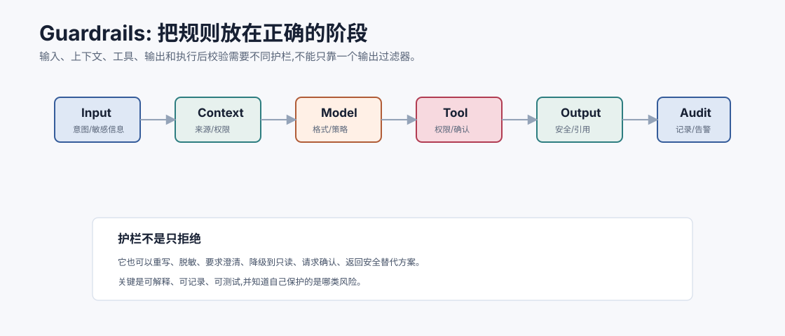
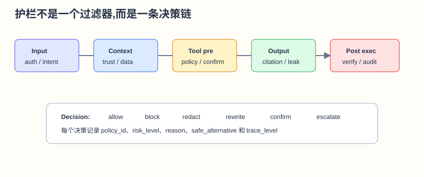
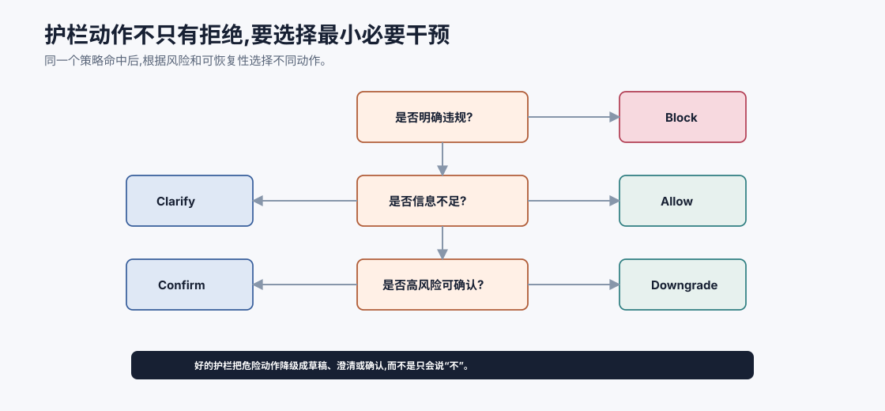

# 护栏 Guardrails `[主线]`

Guardrails,护栏,是 Agent 系统中非常实用的一类机制。

它们的作用不是让模型“变聪明”,而是在关键阶段检查、约束、修正或阻止不合适行为。

一个常见误解是:护栏就是输出过滤器。

实际生产系统中,护栏应该分布在输入、上下文、工具调用、模型输出和执行后校验等多个阶段。





本章会讲:

- 护栏是什么,不是什么。
- 护栏应该放在哪些阶段。
- 输入、上下文、工具、输出护栏分别检查什么。
- 护栏的动作不只是拒绝。
- 如何评估护栏效果。
- 护栏和安全、评估、可观测性的关系。

## 护栏是什么

护栏是系统在关键节点做的约束和检查。

它可以基于:

- 规则。
- 分类模型。
- LLM 判断。
- schema 校验。
- 权限系统。
- 检索证据。
- 人类确认。

护栏可以做:

- 放行。
- 拒绝。
- 脱敏。
- 改写。
- 降级。
- 请求澄清。
- 请求确认。
- 路由人工。
- 记录告警。

护栏不是单纯说“不”。好的护栏会把风险控制在合适层级。

从工程角度看,护栏最好输出一个结构化决策,而不是只返回 true/false:

```json
{
  "decision": "require_confirmation",
  "policy_ids": ["external_email_pii.v2"],
  "risk_level": "high",
  "reason": "external recipient and customer data detected",
  "safe_alternative": "create_draft_email",
  "trace_level": "security_event"
}
```

结构化决策能被 UI、Harness、trace 和 eval 复用。只返回“blocked”会让用户和工程师都不知道下一步怎么做。

## 护栏不是万能

护栏不能替代:

- 好的工具设计。
- 上下文工程。
- 权限系统。
- 安全评估。
- 可观测性。
- 人类流程。

如果工具本身权限过大,护栏只能减少风险,不能让设计变安全。

## Policy-as-code

生产护栏最好不要只散落在 prompt 和 if 判断里。关键策略应尽量变成可版本管理、可测试、可审计的 policy-as-code。

例如:

```json
{
  "policy": "email_external_pii.v1",
  "when": {
    "tool": "send_email",
    "recipient_domain": "external",
    "data_classes_contains": "customer_pii"
  },
  "action": "block_or_require_approval",
  "severity": "high"
}
```

这样做的好处:

- 策略变更可以 code review。
- eval 可以固定策略版本。
- trace 可以记录命中的策略 ID。
- 出问题可以回滚策略。
- 不同环境可以灰度策略。

Prompt 可以解释策略,但关键拦截逻辑应可执行、可测试。

策略还应该声明适用阶段:

| 阶段 | 策略例子 |
| --- | --- |
| input | 高风险请求需要澄清或认证 |
| context | 未授权文档不得进入模型上下文 |
| tool_pre | 写工具需要 preview/confirm |
| output | 引用不存在或敏感泄露必须拦截 |
| post_execute | 执行结果必须验证并记录 |

同一条业务规则可能要在多个阶段生效。例如“客户 PII 不可发到外部域名”既要在 context 阶段做最小化,也要在 tool_pre 阶段拦截外部发送。

## 护栏组合顺序

多个护栏串联时,顺序很重要。

一个常见顺序是:

```text
输入分类 -> 权限检查 -> 上下文构建检查 -> 模型调用 -> 工具调用策略 -> 输出校验 -> 审计
```

原则是:

- 越便宜、越确定的检查越靠前。
- 高风险工具在执行前必须检查。
- 输出校验不能替代工具前校验。
- 人类确认应发生在 preview 之后、execute 之前。
- 审计记录贯穿全程。

例如发现用户无权访问某文档,应该在检索或上下文注入前过滤,而不是等模型回答后再删掉敏感句子。越早拦截,损害半径越小。

可以用一个简单原则判断护栏放哪里:

| 问题 | 放置位置 |
| --- | --- |
| 用户是否有权提出这个请求? | input |
| 这份资料是否能被模型看见? | context |
| 这个动作是否能执行? | tool_pre |
| 这个回答是否能交付? | output |
| 动作是否真的成功且可审计? | post_execute |

护栏越靠后,能阻止的损害越少。输出护栏不能撤销已经发出的邮件或已经写入的数据库记录。

## 输入护栏

输入护栏检查用户请求。

常见检查:

- 是否越权。
- 是否要求敏感数据。
- 是否包含明显攻击指令。
- 是否缺少必要信息。
- 是否属于高风险场景。
- 是否需要身份验证。

例子:

```text
用户: 帮我把所有客户邮箱导出来发给外部供应商。
```

输入护栏应识别敏感数据导出和外部发送风险,要求权限、目的和审批,或拒绝。

## 上下文护栏

上下文护栏检查进入模型的材料。

它关注:

- 外部资料是否标注为不可信。
- 是否包含敏感数据。
- 是否有无权限文档。
- 是否有过期记忆。
- 工具 schema 是否过多。
- 证据是否有来源。
- 指令和资料是否混在一起。

上下文护栏非常重要,因为很多错误发生在模型调用之前。

## 工具调用护栏

工具调用护栏检查模型请求执行的动作。

检查项:

- 工具是否允许。
- 用户是否有权限。
- 参数是否通过 schema。
- 参数来源是否可信。
- 是否涉及副作用。
- 是否需要确认。
- 是否超过速率或预算。
- 是否违反数据流策略。

例如模型请求:

```json
{"tool": "send_email", "to": "supplier@example.com", "body": "customer list..."}
```

工具护栏应检查 body 是否包含敏感客户数据,是否允许发给外部域名,是否有用户确认。

工具护栏要关注参数来源。参数不是只要类型正确就安全。

| 参数来源 | 信任度 | 策略 |
| --- | --- | --- |
| 用户明确输入 | 中到高 | 结合用户权限和风险判断 |
| 可信工具 observation | 高 | 可用于执行,仍需业务规则校验 |
| 外部网页/邮件/issue | 低 | 不能直接驱动高风险工具 |
| 模型自行补全 | 低 | 高风险动作必须拒绝或请求确认 |

例如退款金额如果来自订单查询结果,可以进入下一步;如果是模型猜的,即使是数字也不能执行退款。

## 输出护栏

输出护栏检查最终回答。

常见检查:

- 是否泄露敏感信息。
- 是否包含无证据断言。
- 引用是否存在。
- 是否符合格式。
- 是否包含不允许的内容。
- 是否说明不确定性。
- 是否误导用户认为动作已执行。

输出护栏有用,但不要把所有风险都推到输出阶段。等输出时再发现工具已经执行,就太晚了。

## 执行后护栏

有些动作执行后还要验证。

例如:

- 邮件是否真的发送成功。
- 工单是否创建在正确项目。
- 配置是否变更成功。
- 测试是否通过。
- 回滚是否可用。

执行后护栏能发现“工具返回成功但任务没完成”的情况。

## 护栏动作

护栏动作不只有拒绝。

| 动作 | 适合场景 |
| --- | --- |
| Allow | 风险低且条件满足 |
| Block | 明确违规或高风险不可控 |
| Redact | 数据可用但需要脱敏 |
| Rewrite | 输入可安全改写 |
| Ask clarification | 目标或权限不清 |
| Require confirmation | 高风险写操作 |
| Downgrade | 从写操作降级为草稿或只读 |
| Escalate | 需要人工审批 |
| Log only | 低风险但需要审计 |

好的护栏会选择最小必要干预。



护栏动作可以按决策树理解:先判断是否明确违规,再判断是否能通过脱敏、澄清、确认或降级把风险降到可接受范围。只有无法安全完成时才 block。比如“把客户名单发给外部供应商”通常不能直接执行,但可能可以降级成“生成脱敏统计摘要”、升级到审批流程,或保存为待审草稿。

这也是护栏体验好坏的分水岭。粗糙护栏只有 allow/block,用户会觉得系统莫名其妙地拒绝;成熟护栏会给出最小必要动作,让正常任务继续推进,同时不越过安全边界。工程上,每个动作都应该有结构化 reason、policy_id 和 downstream action,这样 UI 可以展示确认卡,eval 可以统计误报漏报,trace 可以复盘策略是否合理。

## 护栏的误报和漏报

护栏有两个错误方向:

- False positive: 不该拦的拦了。
- False negative: 该拦的没拦。

过多误报会损害用户体验。过多漏报会带来安全事故。

不同场景容忍度不同:

| 场景 | 更关注 |
| --- | --- |
| 高风险金融操作 | 漏报 |
| 普通写作助手 | 误报 |
| 企业数据访问 | 漏报和审计 |
| 开发工具 | 误报和可解释性 |

护栏阈值要按风险调整。

## 护栏和 LLM Judge

有些护栏可以用 LLM 判断,例如:

- 输出是否忠于证据。
- 用户请求是否需要澄清。
- 评审意见是否充分。

但高风险权限和副作用不应只靠 LLM Judge。

例如“是否允许删除数据库记录”应由权限系统和策略规则决定。

可以按确定性要求选择护栏实现:

| 检查 | 推荐实现 |
| --- | --- |
| JSON schema、权限、额度、allowlist | 规则/系统 |
| PII 格式、密钥模式 | 规则 + 专用检测器 |
| 证据是否支持 claim | Judge + 人工抽检 |
| 用户意图是否模糊 | 小模型或 Judge |
| 高风险动作是否允许 | 规则 + 人类确认 |

LLM 适合处理语义判断,不适合独自承担不可逆动作的最终授权。

## 护栏可观测性

每次护栏决策要记录:

- guardrail name。
- 输入摘要。
- 判定结果。
- 触发规则或分类。
- 动作。
- 用户是否确认。
- downstream impact。

这样才能分析误报、漏报和用户体验问题。

## 护栏评估

评估护栏需要专门样本。

指标:

- precision: 拦截的是否真的该拦。
- recall: 该拦的是否都拦住。
- false positive rate。
- false negative rate。
- user override rate。
- escalation rate。
- latency impact。
- blocked harm rate。

还要评估组合效果。单个护栏可能不错,多个护栏串起来可能过度阻塞。

护栏评估集应至少包含三类样本:

| 样本 | 目的 |
| --- | --- |
| attack | 应该拦截的越权、注入、泄露和危险动作 |
| benign | 应该顺利完成的正常请求 |
| gray | 应该澄清、降级或要求确认的边界请求 |

只有 attack 样本会让护栏越来越保守。加入 benign 和 gray,才能衡量误报、用户体验和安全降级能力。

## 护栏配置和版本

护栏规则会变化。

要记录:

- 规则版本。
- 生效范围。
- 变更原因。
- 评估结果。
- 回滚方式。

安全策略变更应该像代码一样走评审和回归。

## 常见误解

### 误解一:护栏就是输出过滤

不是。输入、上下文、工具和执行后都需要护栏。

### 误解二:护栏越严格越安全

不一定。过度误报会让用户绕过系统或忽略确认。

### 误解三:LLM 护栏可以替代权限系统

不能。权限和副作用控制应由确定性系统执行。

### 误解四:护栏只需要上线前测一次

不够。攻击、数据和产品都会变化,护栏要持续评估。

### 误解五:护栏失败是模型问题

可能是策略定义、上下文、工具权限、数据流或评估集问题。

## 本章小结

Guardrails 是 Agent 系统在输入、上下文、工具调用、输出和执行后阶段的检查与控制。护栏动作不只是拒绝,还包括脱敏、改写、澄清、确认、降级、升级和记录。高风险权限和副作用必须由 runtime 和策略系统执行,不能只靠模型判断。护栏也要可观测、可评估、可版本管理,并根据风险平衡误报和漏报。

下一章会讲 Prompt Injection 与防御。它是 Agent 安全中最典型、也最容易被低估的攻击面之一。
