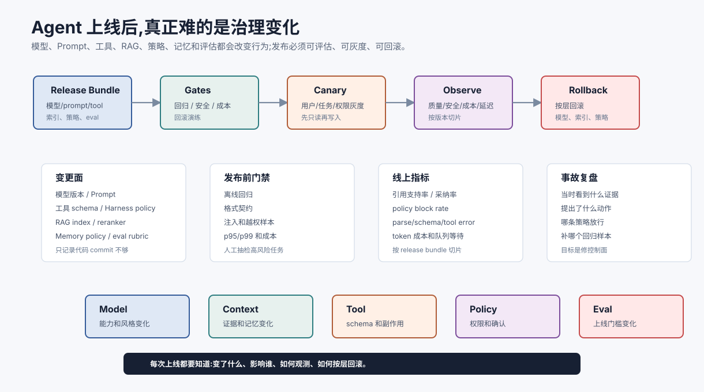
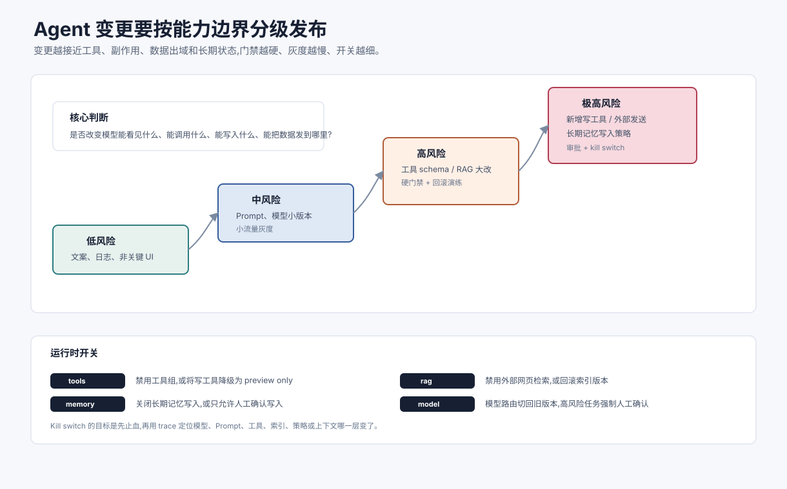

# 发布、运行治理与变更管理 `[主线]` ★

Agent 系统上线后,真正的风险往往来自变化:模型升级、Prompt 调整、工具 schema 改动、RAG 索引重建、权限策略更新、评估集扩展、业务流程变化。

发布治理要解决的问题是:

**如何让 Agent 的每次变化都可评估、可灰度、可观测、可回滚、可复盘。**





没有这层治理,团队会陷入一种很熟悉的状态:demo 很亮眼,线上一改就抖,出错后说不清到底是谁变了。

## Agent 的变更面更宽

传统软件发布主要关注代码。Agent 系统至少有这些变更面:

| 变更对象 | 可能影响 |
| --- | --- |
| 模型版本 | 推理风格、工具调用、拒答、安全边界 |
| Prompt / system message | 任务理解、输出格式、风险偏好 |
| Tool schema | 参数生成、错误恢复、权限判断 |
| Harness policy | 哪些动作能执行、是否需要确认 |
| RAG 索引 | 事实依据、引用、权限过滤 |
| Embedding / reranker | 召回和排序质量 |
| Memory policy | 写入、遗忘、个性化和隐私 |
| Eval rubric | 质量判断和上线门槛 |
| UI / 产品流程 | 用户输入分布和确认行为 |

这些变更会相互影响。只记录代码 commit 不足以解释 Agent 行为。

## 变更风险分级

不是所有变更都需要同样重的发布流程。关键是看它会不会改变能力边界、数据边界或副作用边界。

| 风险级别 | 例子 | 发布动作 |
| --- | --- | --- |
| 低 | 文案微调、非关键 UI 展示、日志字段增加 | 常规评审 + 快速回归 |
| 中 | Prompt 改写、模型小版本切换、RAG chunking 调整 | 离线 eval + 小流量灰度 + 指标切片 |
| 高 | 工具 schema 变化、权限策略变化、reranker/索引大改 | 安全样本硬门禁 + 回滚演练 + 人工抽检 |
| 极高 | 新增写工具、外部发送、生产变更、长期记忆写入策略 | 明确 owner + 审批 + 分阶段开放 + kill switch |

这个分级能避免两个极端:所有变更都走重流程会拖慢迭代;所有变更都当“小 prompt 改动”又会把风险悄悄带到线上。Agent 的风险通常不在改动文本长短,而在它是否改变了模型能看见什么、能调用什么、能写入什么、能把数据发到哪里。

## 发布单元

建议把一次 Agent 发布定义成一个 release bundle,至少包含:

```json
{
  "release_id": "agent_research_assistant_2026_07_09",
  "model_versions": {"planner": "model-a-2026-06", "writer": "model-b-2026-07"},
  "prompt_versions": {"planner": "planner_prompt_v18"},
  "tool_schema_versions": {"search_docs": "v4", "write_note": "v2"},
  "rag_index_version": "policy_index_20260709_01",
  "policy_version": "harness_policy_v12",
  "eval_suite": "research_assistant_eval_v23",
  "rollback_to": "agent_research_assistant_2026_06_28"
}
```

这个 bundle 是复盘和回滚的锚点。

## 发布前门禁

上线前至少过几道门:

| 门禁 | 检查内容 |
| --- | --- |
| 离线回归 | 核心任务、边界样本、高风险样本是否退化 |
| 格式契约 | 结构化输出、工具参数、引用格式是否稳定 |
| 安全样本 | Prompt Injection、越权检索、敏感数据流 |
| 成本延迟 | p50/p95/p99、token 成本、工具耗时 |
| 人工抽检 | 高价值任务和新能力人工复核 |
| 回滚演练 | 是否能切回旧模型、旧 prompt、旧索引 |

门禁不是追求零风险,而是让风险被看见、被记录、能回退。

## 灰度发布

Agent 很适合灰度,因为同一系统里的任务风险差异很大。

灰度可以按这些维度切分:

- 用户群:内部团队、白名单客户、全量用户。
- 任务类型:只读问答、写入草稿、真实执行。
- 数据范围:公开资料、低敏内部资料、高敏资料。
- 工具权限:无工具、只读工具、需确认写工具。
- 模型路由:小流量走新模型,失败回退旧模型。

一个稳健策略是先放开低风险只读任务,观察质量和成本,再逐步开放写入和自动执行。

## 线上观测指标

上线后要看业务成功,也要看系统健康。

| 类别 | 指标 |
| --- | --- |
| 质量 | 任务成功率、人工采纳率、引用支持率、拒答准确率 |
| 安全 | policy block rate、越权拦截、注入命中、人工确认比例 |
| 成本 | 输入/输出 token、工具调用次数、缓存命中、单任务成本 |
| 延迟 | TTFT、总响应时间、工具耗时、队列等待 |
| 稳定性 | parse failure、schema failure、tool error、loop no-progress |
| 数据 | RAG 命中率、旧版本引用、无来源证据比例 |

指标必须能按 release bundle、模型版本、prompt 版本、工具版本和索引版本切分。否则看到错误率上升也不知道该回滚哪一层。

## 回滚不是只回滚代码

Agent 回滚可能需要回滚多个对象:

- 模型版本。
- Prompt 版本。
- 工具 schema。
- Harness policy。
- RAG 索引。
- embedding/reranker。
- memory 写入策略。
- UI 开关。

如果新 RAG 索引引入错误,回滚模型没有意义。如果新工具 schema 导致参数错误,回滚 prompt 可能只是掩盖问题。发布系统要能按层回滚。

## 运行时开关和 Kill Switch

高风险能力应该有独立开关,而不是和整个应用绑在一起。

常见开关包括:

- 禁用某个工具或工具组。
- 把写工具降级成 preview only。
- 关闭长期记忆写入。
- 禁止外部网页检索。
- 将新模型路由切回旧模型。
- 将 Agentic RAG 降级为单轮 RAG。
- 强制所有高风险动作进入人工确认。

Kill switch 的价值是缩小事故半径。当注入攻击、越权检索、工具误写或成本异常出现时,团队应该能先止血,再定位根因。没有运行时开关,回滚就会变成“大开大关”,要么全停,要么硬扛。

## 事故复盘

Agent 事故复盘建议围绕 trace 展开。

最小问题清单:

1. 用户目标是什么?
2. 当时的 release bundle 是什么?
3. 模型看到了哪些上下文、证据和工具结果?
4. 模型提出了什么结构化动作?
5. Harness 哪条策略放行或拦截?
6. 工具执行产生了什么副作用?
7. 状态和记忆写入了什么?
8. 哪个评估样本没有覆盖这类风险?
9. 修复动作和回归样本是什么?

事故复盘的目标不是证明模型“想错了”,而是找出哪个控制面没有把错误拦住。

## 变更冻结和高风险窗口

某些业务时期不适合频繁改 Agent:

- 财务关账。
- 大促活动。
- 安全事件响应。
- 法务审批窗口。
- 关键客户上线。

此时应冻结高风险变更,只允许安全修复或明确审批的灰度。Agent 系统的随机性和依赖面更宽,更需要变更日历。

## 人在回路里的运行治理

Human-in-the-loop 不是简单加一个确认按钮。要明确:

- 哪些动作必须人工确认。
- 确认人需要看到哪些证据和 diff。
- 确认是否会被记录进 trace。
- 人工修改是否会进入训练或评估数据。
- 紧急情况下如何暂停自动化。

好的确认卡片应该展示动作、来源、风险、影响范围、回滚方式和拒绝选项,而不是只问“是否继续”。

## 常见误解

### 误解一:Agent 发布就是改 Prompt

不是。模型、Prompt、工具、RAG、策略、记忆和评估都可能改变行为。

### 误解二:评估通过就可以全量

不一定。离线评估覆盖有限,仍需灰度、观测和回滚。

### 误解三:出了问题先换回旧模型

不一定。问题可能来自索引、工具 schema、权限策略或上下文构造。要按 trace 定位。

### 误解四:人工确认会解决安全问题

不自动解决。确认界面如果没有证据、风险和 diff,人也可能机械点通过。

### 误解五:只记录最终回答就够了

不够。复盘需要输入、上下文、证据、模型版本、工具调用、策略决策、状态写入和成本延迟。

## 本章小结

Agent 的生产治理要覆盖比传统软件更宽的变更面。可靠发布需要 release bundle、变更风险分级、离线回归、灰度、线上观测、运行时开关、按层回滚、事故复盘和人工确认治理。上线不是终点,而是持续控制模型、上下文、工具、数据和策略变化的开始。

下一篇实战项目会把这些原则落到一个个人研究助手里:先做小,但从第一版就保留状态、trace、评估和发布门禁的位置。
