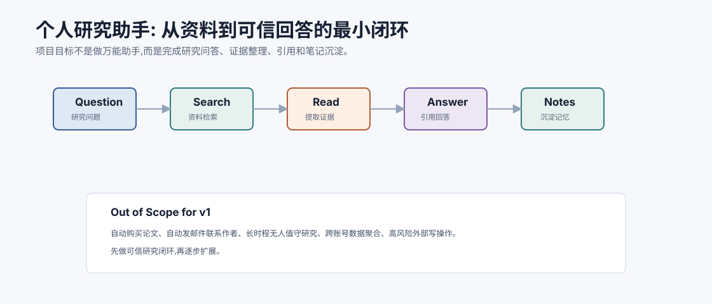
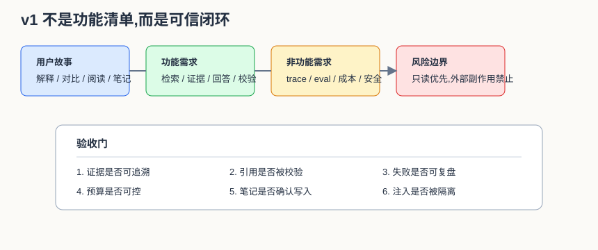
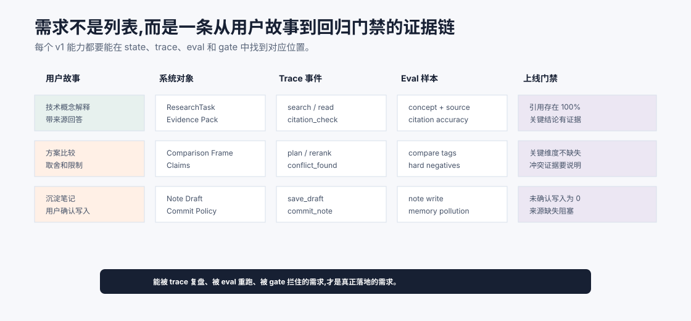

# 项目总览与需求分析 `[主线]`

前面五个 Part 讲了很多机制:Agent 循环、工具、规划、记忆、RAG、多 Agent、可观测、评估和安全。

这一篇开始,我们把这些机制组装成一个实战项目:

**个人研究助手。**

它的目标不是做一个万能 Agent,而是做一个足够清晰、可扩展、可评估的研究工作流助手:用户提出研究问题,系统检索资料、阅读证据、生成带引用的回答,并把有价值的研究沉淀成笔记。





本章会讲:

- 为什么选择个人研究助手作为实战项目。
- v1 版本做什么,不做什么。
- 用户故事和关键流程。
- 功能需求与非功能需求。
- 成功标准和评估指标。
- 项目边界如何控制。

## 为什么选这个项目

个人研究助手很适合作为从 0 到 1 的 Agent 项目。

原因有四个。

### 1. 它需要外部知识

研究问题通常不能只靠模型参数回答。需要 RAG、搜索、文档读取和证据引用。

### 2. 它需要多步任务

一个研究问题往往要拆成子问题,检索、阅读、比较、总结和校验。

### 3. 它有明确质量标准

好的研究回答应该有来源、有引用、有不确定性,不能凭空编造。

### 4. 它风险可控

v1 不做自动发邮件、自动购买资料、自动发布内容等高风险写操作。这样可以专注于核心 Agent 能力。

## v1 的目标

v1 的目标是完成一个最小可信闭环:

```text
用户问题 -> 规划检索 -> 找资料 -> 提取证据 -> 生成带引用回答 -> 校验引用 -> 沉淀笔记
```

它应该能回答这类问题:

```text
Flash Attention 为什么能降低显存占用? 请给我一个技术解释和参考来源。
```

或者:

```text
帮我比较 RAG 和微调在企业知识问答中的适用场景。
```

更具体地说,v1 不是“能生成一段看起来不错的回答”,而是要把一次研究任务拆成可以验收的工程事件:

| 阶段 | 必须产出 | 可验收证据 |
| --- | --- | --- |
| 理解问题 | `ResearchTask` 和完成标准 | task state 中有 goal、constraints、output_type |
| 规划检索 | 子问题和 query 列表 | trace 中能看到 query 从何而来 |
| 获取证据 | evidence pack | 每条 evidence 有 source、quote、trust、retrieved_at |
| 生成回答 | 带引用的 answer | 关键 claim 引用 evidence id |
| 校验引用 | citation report | 不存在或不支持的引用被拦截 |
| 沉淀笔记 | note draft 或 confirmed note | 写入动作有用户确认或明确策略 |

这张表很重要。它把“研究助手”从一个聊天体验变成一个可观察、可评估、可回归的系统。



需求分析最容易犯的错误,是只写“支持检索”“支持引用”“支持保存笔记”这样的功能清单。对 Agent 项目来说,更可靠的写法是建立需求可追踪矩阵:每个用户故事都要映射到系统对象、trace 事件、eval 样本和上线门禁。否则功能看起来做了,但出了错很难定位,也无法证明后续改动没有破坏它。

例如“沉淀笔记”不能只对应一个保存按钮。它至少要对应 `NoteDraft`、`commit_note` 工具、用户确认事件、note write eval、安全门禁和删除机制。这样一来,验收标准就不再是“能保存”,而是“未确认写入为 0、来源缺失会阻塞、写入 trace 可复盘、删除后不再被检索到”。这类矩阵会把需求从产品愿望变成工程契约。

## v1 不做什么

明确不做的事情同样重要。

v1 不做:

- 长时程无人值守研究。
- 自动联系作者或发送邮件。
- 自动购买论文或访问付费资源。
- 自动修改外部知识库。
- 多用户权限系统。
- 团队级协作。
- 浏览器自动操作复杂网站。
- 对事实高风险领域做最终决策。

这些可以作为后续扩展。v1 先把可信研究闭环做稳。

## 用户故事

### 用户故事一:快速解释

```text
作为开发者,我想让助手解释一个技术概念,并给出可靠来源,这样我可以快速建立理解。
```

验收标准:

- 回答清楚。
- 至少引用 2 个来源。
- 明确哪些部分是推断。
- 不编造引用。

### 用户故事二:方案比较

```text
作为工程负责人,我想比较两个技术方案的取舍,并看到证据来源。
```

验收标准:

- 有比较维度。
- 每个关键结论有证据。
- 说明适用场景。
- 给出不确定性和后续验证建议。

### 用户故事三:阅读资料

```text
作为学习者,我想让助手阅读一篇文章或论文,提取核心观点、前提和限制。
```

验收标准:

- 保留原文观点。
- 不把作者观点和助手推断混淆。
- 输出结构清晰。
- 关键段落可回源。

### 用户故事四:沉淀笔记

```text
作为长期学习者,我想把确认有价值的研究结论保存为笔记,以后可以检索使用。
```

验收标准:

- 只有用户确认或高置信内容写入。
- 笔记有来源和时间。
- 可更新、可删除。

## 功能需求

v1 功能可以分成六类。

### 1. 问题理解

- 识别用户研究目标。
- 提取主题、约束、输出形式。
- 判断是否需要澄清。
- 生成初始研究计划。

### 2. 资料检索

- 支持本地资料库检索。
- 支持用户提供 URL 或文本。
- 支持关键词和向量混合检索。
- 返回带来源的候选资料。

### 3. 资料阅读

- 读取文档片段。
- 提取观点、事实、定义和限制条件。
- 标注来源。
- 识别证据缺口。

### 4. 回答生成

- 生成带引用回答。
- 区分证据、推断和不确定性。
- 支持不同输出格式:摘要、对比表、解释、行动建议。

### 5. 引用校验

- 检查引用 ID 是否存在。
- 检查关键结论是否被证据支持。
- 证据不足时要求修正或拒答。

### 6. 笔记沉淀

- 用户确认后保存研究笔记。
- 笔记包含主题、内容、来源、时间、标签。
- 笔记可被后续检索。

## 需求优先级

v1 不应该平均用力。建议用 MoSCoW 方法切一刀:

| 优先级 | 需求 | 为什么 |
| --- | --- | --- |
| Must | 证据检索、evidence pack、引用校验、trace、预算 | 没有这些就不是可信研究助手 |
| Should | query rewriting、笔记草稿、简单 Judge、失败归因 | 直接提升质量和迭代速度 |
| Could | 多资料源、GUI 导入、复杂可视化、主动提醒 | 有价值,但会扩大范围 |
| Won't v1 | 自动发布、无人值守长任务、团队权限、外部写操作 | 风险和复杂度超出 v1 |

很多项目失败不是因为少做功能,而是 v1 想做太多。对研究助手来说,最小闭环必须围绕“证据可信”和“失败可复盘”组织。

## 非功能需求

### 可观测

每次任务保存 trace:

- 用户问题。
- 研究计划。
- 检索 query。
- 候选资料。
- 证据包。
- 模型调用。
- 引用校验结果。
- 最终回答。

### 可评估

要有 eval set,覆盖:

- 简单解释。
- 方案比较。
- 证据不足。
- 冲突证据。
- 引用错误。
- Prompt injection。

### 安全

- 外部资料标注为不可信。
- 不执行高风险写操作。
- 不保存敏感信息为长期记忆。
- 笔记写入需要用户确认或明确规则。

### 成本可控

- 限制最大检索次数。
- 限制最大模型调用次数。
- 上下文压缩。
- 只在必要时调用强模型或 Judge。

### 可扩展

- 工具可插拔。
- 知识源可扩展。
- 记忆和 RAG 分离。
- trace 和 eval 可持续使用。

## 风险分级

即使 v1 风险相对可控,也要提前给动作分级。后续扩展工具时,这张表可以直接变成 Harness 策略。

| 风险 | 动作 | v1 策略 |
| --- | --- | --- |
| L0 文本生成 | 草稿、摘要、解释 | 可自动执行,保存 trace |
| L1 只读检索 | 搜索本地资料、读取用户提供文本 | 校验权限和来源,标注 trust |
| L2 派生产物 | 生成 evidence pack、note draft | 可生成,但不能自动长期写入 |
| L3 本地写入 | 保存用户确认笔记 | 需要确认、来源和可删除机制 |
| L4 外部副作用 | 发邮件、发布、购买、改外部知识库 | v1 禁止 |

这能防止一个常见滑坡:一开始只是“帮我总结”,后来顺手变成“帮我保存、转发、同步、通知所有人”。动作越靠近外部世界,Harness 越要强。

## 领域模型

核心对象包括:

| 对象 | 含义 |
| --- | --- |
| `ResearchTask` | 一次研究任务 |
| `ResearchPlan` | 子问题、检索策略、完成标准 |
| `Source` | 文档、网页、论文、笔记等资料源 |
| `Chunk` | 可检索资料片段 |
| `Evidence` | 支持某个 claim 的引用片段 |
| `Claim` | 回答中的关键结论 |
| `Answer` | 最终输出 |
| `Note` | 用户确认沉淀的长期笔记 |
| `Trace` | 一次任务的过程记录 |

这些对象会贯穿后续架构和实现。

## 成功标准

v1 成功不是“看起来像助手”。成功标准应具体。

### 质量指标

- 关键结论引用准确率。
- 证据不足时拒答率。
- 冲突证据说明率。
- 用户问题覆盖率。

### 过程指标

- 正确检索命中率。
- 无效工具调用率。
- 重复检索率。
- 引用校验通过率。

### 资源指标

- 平均成本。
- P95 延迟。
- 平均模型调用次数。
- 平均检索次数。

### 安全指标

- Prompt injection 拦截率。
- 无来源结论率。
- 未确认笔记写入率。

## 最小验收样例集

v1 完成时,至少应该用下面 8 类样例验收,每类 2-3 条即可起步。

| 样例 | 应验证什么 |
| --- | --- |
| 有充分证据的概念解释 | 能否给出清楚解释和正确引用 |
| 方案对比 | 是否按维度比较,而不是写泛泛综述 |
| 证据不足 | 是否明确拒答或输出缺口 |
| 冲突证据 | 是否展示冲突,而不是强行合并 |
| 过期资料 | 是否标注时间和不确定性 |
| 引用伪造 | citation checker 是否拦截不存在 ID |
| 外部资料注入 | 是否把资料当数据而非指令 |
| 笔记写入 | 是否需要用户确认,是否保留来源 |

这组样例比随便问几个热门问题更有价值,因为它覆盖了研究助手最容易出事故的边界。

## 一个最小任务样例

用户输入:

```text
请解释 RAG 为什么不能完全消除幻觉,并给出工程上的防护方式。
```

理想流程:

1. 识别主题:RAG、幻觉、工程防护。
2. 生成检索 query。
3. 检索 RAG 相关资料。
4. 提取证据:检索失败、证据不完整、模型误读、引用校验。
5. 生成回答:先解释原因,再给防护表。
6. 引用校验:每个关键结论有来源。
7. 询问是否保存为笔记。

## 项目原则

本项目遵循几条原则:

- 先做可靠闭环,再扩展能力。
- 外部资料只作为证据,不是指令。
- 每个关键结论尽量有来源。
- 记忆写入保守。
- 工具返回和模型推断分开。
- trace 优先,否则无法调试。
- eval 优先,否则无法判断改进。

## 常见误解

### 误解一:研究助手就是搜索 + 总结

不够。还要有证据包、引用校验、状态管理、笔记沉淀和评估。

### 误解二:v1 应该接入所有资料源

不需要。先选少量可控资料源,把闭环做稳。

### 误解三:只要回答流畅就成功

研究助手更看重证据忠实、引用准确和不确定性表达。

### 误解四:笔记应该自动保存所有结论

不应。长期记忆和笔记需要写入门槛和来源。

### 误解五:实战项目必须大量代码

代码重要,但更关键的是架构边界、状态对象、工具契约和评估闭环。

## 本章小结

个人研究助手的 v1 目标是做一个可信研究闭环:理解问题、检索资料、提取证据、生成带引用回答、校验引用并沉淀笔记。项目要明确边界,暂不做高风险外部写操作和长时程无人值守任务。成功标准应覆盖质量、过程、成本和安全,并落实到最小验收样例集。接下来我们会进入架构设计,把这些需求映射成模块、数据流和运行时边界。
