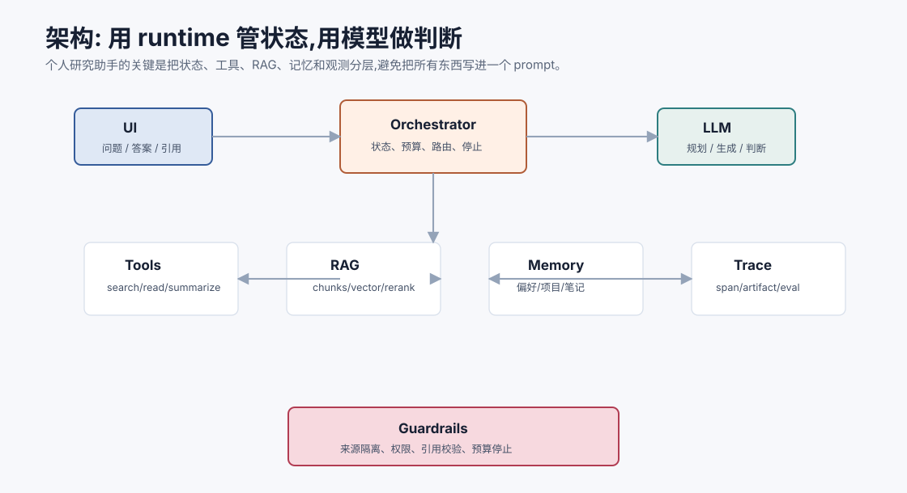
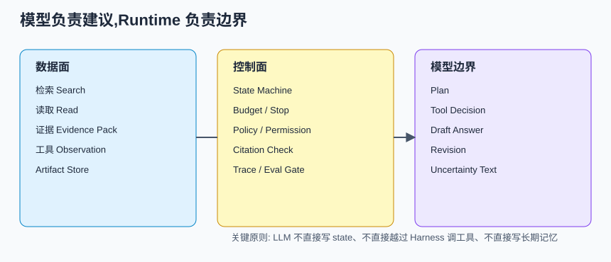
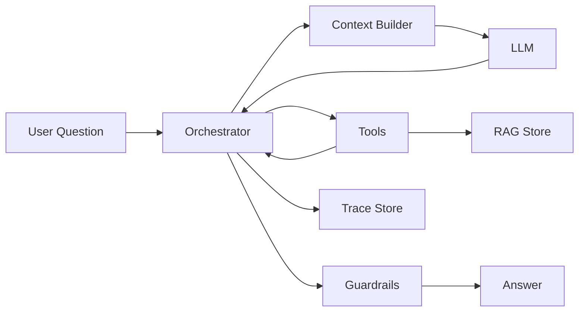
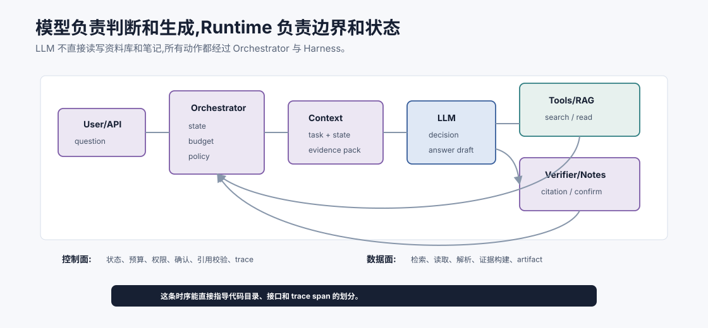
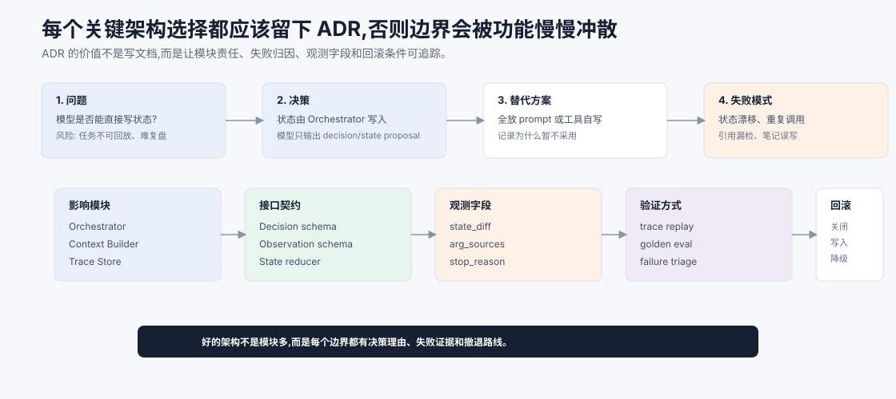
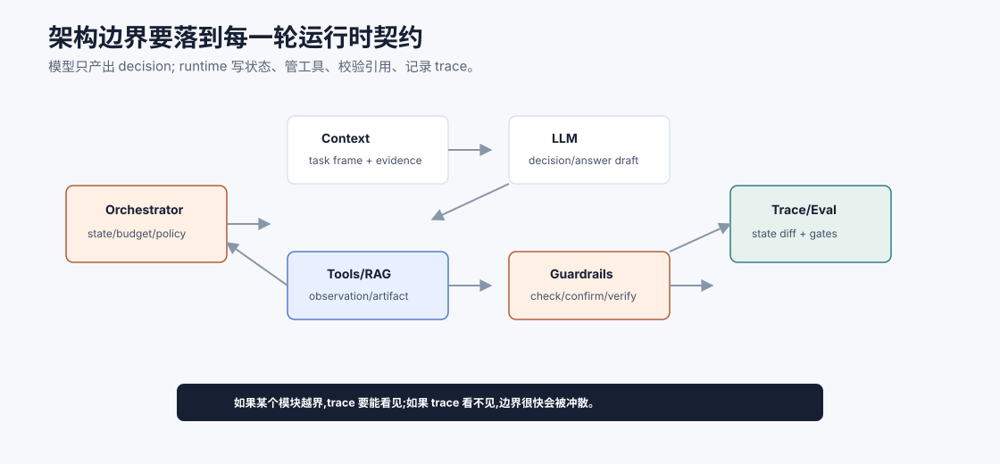

# 架构设计 `[主线]`

项目需求确定后,下一步不是马上写 prompt,而是设计架构边界。

个人研究助手至少要处理七类事情:

- 用户输入和输出。
- 任务状态。
- 模型调用。
- 工具调用。
- RAG 检索。
- 记忆和笔记。
- 可观测和评估。

如果把这些全部写进一个函数或一个 prompt,很快会失控。





本章会讲:

- 项目模块如何划分。
- Orchestrator、Context Builder、Tool Layer、RAG、Memory 的职责。
- 核心数据流。
- 关键数据结构。
- 为什么 runtime 要管理状态和安全边界。

## 总体架构

v1 可以采用单 Agent + runtime orchestration 的架构。

模块包括:

| 模块 | 责任 |
| --- | --- |
| UI/API | 接收问题,展示回答、引用和确认 |
| Orchestrator | 管理任务状态、步骤、预算、停止条件 |
| Context Builder | 构造模型输入 |
| LLM Adapter | 封装模型调用 |
| Tool Layer | 搜索、读取、解析、校验工具 |
| RAG Store | 文档切块、向量检索、元数据 |
| Memory/Notes | 用户偏好和确认笔记 |
| Guardrails | 权限、来源隔离、引用校验 |
| Trace Store | 保存过程记录 |
| Eval Runner | 离线评估和回归 |

这个架构的重点是:模型不拥有全部控制权。Orchestrator 和 runtime 管状态、预算、工具权限和安全策略。

## 数据流

一次研究任务的数据流:



注意这里 LLM 不直接访问 RAG Store 或 Memory。它通过工具和上下文间接使用这些能力。

## 控制面和数据面

这个项目最好从一开始就把控制面和数据面分开。

| 平面 | 负责什么 | 不应该做什么 |
| --- | --- | --- |
| 数据面 | 检索、读取、生成 evidence pack、传递 Observation | 决定高风险动作是否允许 |
| 控制面 | 权限、预算、状态机、确认、引用校验、写入门 | 直接生成长篇自然语言回答 |

例如 `search_corpus` 属于数据面,它返回候选资料。`Orchestrator` 和 `Guardrails` 属于控制面,它们决定这些资料是否能进入 context、是否满足权限、是否需要继续检索。把二者混在一起,后续会很难解释一次失败到底是检索问题、权限问题还是模型生成问题。



把架构画成时序图后,模块边界会更清楚。用户请求先进入 Orchestrator,它创建任务状态、检查预算和策略,再让 Context Builder 组装当前决策所需的工作视图。LLM 只返回 decision 或 answer draft,不直接读写 RAG、Memory 或 Notes。工具调用、引用校验、笔记提交都回到 Orchestrator,由 runtime 写 state diff 和 trace。

这个时序能直接指导代码结构。控制面适合放在 `orchestrator/`、`harness/`、`guardrails/` 和 `trace/`;数据面适合放在 `tools/`、`rag/`、`ingestion/` 和 `artifacts/`;模型适配层单独封装。这样后续新增浏览器资料源、论文库或团队知识库时,不会把权限逻辑散落到每个 loader 里。

## 架构决策记录

架构设计不能只停留在“画出模块”。Agent 系统的模块会随着工具、资料源、记忆和评估不断增长,如果没有决策记录,半年后很难回答一个朴素问题:为什么状态由 Orchestrator 写,而不是让模型或工具自己写? 为什么引用校验独立成节点,而不是放在回答 prompt 里? 这类问题一旦答不清,边界就会被新功能慢慢冲散。



建议为 v1 至少写 6 条 ADR:

| ADR | 决策 | 必须记录的工程后果 |
| --- | --- | --- |
| ADR-001 | 模型不直接写 `ResearchTask` state | 需要 reducer、state_diff、trace replay |
| ADR-002 | RAG、Memory、Notes 分开治理 | 需要不同写入门、删除策略、trust 标注 |
| ADR-003 | 工具统一走 Harness | 需要 schema、风险等级、确认、幂等、错误协议 |
| ADR-004 | Evidence Pack 是回答中心产物 | 需要 claim/evidence 映射和 citation checker |
| ADR-005 | Eval Runner 读取真实 trace | 需要保存检索、证据、校验、成本和失败原因 |
| ADR-006 | 控制面和数据面分离 | 权限、预算和策略不能散落在 loader 或工具里 |

一条好的 ADR 不只写“我们决定做 X”。它还要写替代方案、失败模式、观测字段和回滚条件。比如 ADR-003 选择统一 Harness,替代方案是“工具函数自己校验参数”。后者短期更快,但新增写工具时会导致确认、幂等、权限和审计散落到各处。因此 ADR 应明确:每个工具必须声明 `input_schema`、`output_schema`、`risk_level`、`side_effect`、`retry_policy` 和 `failure_modes`;trace 必须记录 `validation` 和 `state_diff`;写工具上线前必须有安全样本。

ADR 的另一个作用是帮你判断扩展是否真的准备好了。如果要接入浏览器、企业知识库或 MCP Server,不要只问“能不能接上”,而要问“现有 ADR 是否覆盖这个新边界”。如果新能力引入了新的副作用、权限域或资料生命周期,就先补 ADR,再写代码。

## 运行时契约

架构边界只有在每一轮运行时都被执行,才算真实存在。个人研究助手可以把每轮循环约束成一份运行时契约:模型只能产出 decision 或 answer draft;状态、工具、引用校验、笔记写入和 trace 都由 runtime 接管。



这份契约可以写成几条不可破坏的规则。

第一,`Orchestrator` 是状态权威。模型可以建议“需要继续检索”或“可以回答”,但不能直接改 `ResearchTask.status`、`evidence`、`notes` 或 `budget`。所有状态变化都要经过 reducer,并生成 `state_diff`。

第二,`Context Builder` 只提供当前决策所需的工作视图。它从 state、evidence pack、memory 和 tool contract 中选材料,但不能在构建上下文时偷偷执行检索、修改笔记或放宽权限。

第三,`Tool/RAG` 只返回 observation 和 artifact。工具不决定高风险动作是否允许,也不把外部资料提升为指令。工具的责任是结构化返回事实、错误和来源。

第四,`Guardrails` 在工具前和输出后都要生效。引用校验、笔记确认、外部资料 trust 标注、预算限制和不可信内容隔离,都不应该只写在 prompt 里。

第五,`Trace/Eval` 不是旁路日志,而是运行时契约的一部分。每个 decision、observation、state diff、policy decision 和 citation report 都要能进入 trace,否则评估无法判断失败归因。

读者实现时可以把这张图当成代码目录边界:一旦某个模块开始越权,比如工具直接改 state、Context Builder 直接读取无权限资料、模型输出被直接写入笔记,就说明架构契约正在失效。

## Orchestrator

Orchestrator 是任务控制器。

它负责:

- 创建 ResearchTask。
- 维护 state。
- 调用模型。
- 调用工具。
- 更新步骤状态。
- 检查预算。
- 调用护栏。
- 保存 trace。
- 判断是否完成或需要用户。

它不负责写长篇回答。回答由模型生成,但 Orchestrator 决定什么时候生成、给什么上下文、生成后如何校验。

Orchestrator 的输出也要结构化。每次循环结束至少产生一个 `state_diff`:

```json
{
  "turn": 4,
  "previous_status": "reading",
  "next_status": "answering",
  "new_evidence": ["S3", "S4"],
  "new_gaps": ["missing source for latency claim"],
  "budget_delta": {"model_calls": -1, "tool_calls": -2},
  "stop_reason": null
}
```

这样 trace 不只是流水账,而是能看出任务状态为什么发生变化。

## ResearchTask state

一个简化 state:

```json
{
  "task_id": "research_001",
  "goal": "Explain why RAG cannot fully eliminate hallucination.",
  "constraints": ["Answer in Chinese", "Use citations"],
  "plan": [
    {"id": "p1", "task": "search sources", "status": "done"},
    {"id": "p2", "task": "extract evidence", "status": "in_progress"}
  ],
  "queries": ["RAG hallucination retrieval failure evidence faithfulness"],
  "evidence": ["S1", "S2"],
  "claims": [],
  "open_questions": ["Need source about citation faithfulness"],
  "budget": {"model_calls": 4, "tool_calls": 6},
  "status": "running"
}
```

State 是权威任务视图。模型看到的是 state 的摘要,不是完整内部对象。

## Context Builder

Context Builder 负责把状态、证据、记忆和工具说明组织成模型输入。

它要选择:

- 当前目标。
- 当前计划。
- 相关证据。
- 可用工具。
- 相关记忆。
- 输出格式。
- 安全提醒。

它也要排除:

- 无关历史。
- 过期假设。
- 无权限资料。
- 太长工具日志。
- 不可信资料中的指令。

Context Builder 是项目质量的关键模块。

一个可用的 Context Builder 可以按四段组织输入:

| 段落 | 内容 | 目的 |
| --- | --- | --- |
| Task Frame | goal、constraints、output contract、budget | 防止目标漂移 |
| Working State | 当前计划、已知事实、缺口、冲突 | 让模型接着做,不是从头猜 |
| Evidence Pack | 经过筛选的证据和来源 | 限制事实来源 |
| Tool Contract | 当前状态允许的工具和参数 schema | 缩小动作空间 |

注意不要把完整 trace 全塞进去。模型需要的是当前决策所需的最小工作视图。

## LLM Adapter

LLM Adapter 封装模型调用。

它负责:

- 选择模型。
- 设置参数。
- 发送消息。
- 接收结构化输出。
- 处理重试。
- 记录 token、延迟、成本。
- 做输出 schema 校验。

不要让业务逻辑到处直接调用模型 API。统一 Adapter 方便替换模型和记录 trace。

## Tool Layer

v1 工具可以从少量开始。

| 工具 | 类型 | 作用 |
| --- | --- | --- |
| `search_corpus` | 只读 | 检索本地资料库 |
| `read_source` | 只读 | 读取文档或网页片段 |
| `extract_evidence` | 模型/规则 | 从片段中提取 claim 和 quote |
| `check_citations` | 校验 | 检查引用是否存在和支持结论 |
| `save_note_draft` | 草稿 | 生成待确认笔记 |
| `commit_note` | 写入 | 用户确认后保存笔记 |

写工具只有 `commit_note`,并且需要用户确认。

## RAG Store

RAG Store 管资料库。

它包括:

- 原始文档。
- 清洗文本。
- chunk。
- embedding。
- 元数据。
- 向量索引。
- 关键词索引。

每个 chunk 应有:

```json
{
  "chunk_id": "doc_123#section_4",
  "doc_id": "doc_123",
  "title": "RAG Survey",
  "source_uri": "https://...",
  "text": "...",
  "metadata": {
    "published_at": "2025-08-01",
    "source_type": "paper",
    "trust": "external",
    "license": "unknown"
  }
}
```

资料源必须可追溯。

## Memory 和 Notes

Memory 和 Notes 要分开。

### Memory

保存用户偏好和项目约定:

- 喜欢中文回答。
- 输出先结论后细节。
- 常研究 AI Agent 方向。

### Notes

保存用户确认的研究笔记:

- 某篇文章的核心观点。
- 某个技术概念的解释。
- 某个主题的对比表。

Notes 本质上也是可检索知识源,但它们有用户确认和来源。

## Guardrails

v1 护栏包括:

- 外部资料标注为 untrusted。
- 不执行外部写操作。
- 笔记写入前确认。
- 引用 ID 校验。
- 证据不足时要求说明。
- token 和调用预算。
- 不把外部内容写成系统指令。

这些护栏不复杂,但能避免很多基础事故。

Guardrails 在架构中应至少有两个位置:

1. **工具前**:检查工具是否允许、参数是否有效、是否需要确认。
2. **输出后**:检查引用、敏感信息、不确定性和写入动作。

只在输出后做护栏是不够的。研究助手虽然以只读为主,但一旦加入笔记写入、外部资料同步或团队资料源,工具前护栏就会成为关键边界。

## Trace Store

Trace Store 保存每次任务过程。

最小 trace:

- task id。
- user input。
- model calls。
- tool calls。
- retrieval results。
- evidence pack。
- final answer。
- citation check。
- cost and latency。
- errors。

Trace 是调试和 eval 的来源。

## Eval Runner

Eval Runner 用固定样本运行助手。

它输出:

- 答案正确性。
- 引用准确性。
- 证据不足处理。
- 成本和延迟。
- 失败 trace。

不要等项目做完才加 eval。v1 一开始就要有小评估集。

## 模块边界原则

### 1. 模型不直接管状态

模型可以建议更新,但 runtime 写 state。

### 2. 工具不返回无结构长文本

工具返回应有摘要、结构化字段和 artifact。

### 3. RAG 和 Memory 分开

外部资料、用户偏好、研究笔记分别治理。

### 4. 引用校验是独立节点

不要只靠生成 prompt 要求引用。

### 5. Trace 贯穿所有模块

没有 trace,后续无法评估和调试。

### 6. Harness 先于扩展

只要新增工具可能写文件、写笔记、访问远程资源或触发外部动作,就先补 Harness:工具注册、schema、风险等级、权限、确认、幂等和错误协议。不要等工具变多以后再补边界。

### 7. Eval Runner 读取真实 trace

Eval 不应只读取最终回答。它应该能读取检索结果、evidence pack、citation report、成本和失败归因。否则评估只能告诉你“错了”,不能告诉你“该修哪层”。

## 常见架构反模式

### 1. 一个超长 prompt 管所有事

很快会变得不可维护。

### 2. 模型直接决定写入记忆

容易把猜测和不可信内容写入长期存储。

### 3. 工具层没有权限和副作用标注

后续扩展写工具时风险很大。

### 4. RAG 返回片段没有来源

最终引用无法校验。

### 5. 没有 Eval Runner

每次优化都靠感觉。

### 6. Context Builder 和检索耦合

检索负责找候选,Context Builder 负责选择进入模型的工作材料。二者耦合后,很难分别优化 recall 和 faithfulness。

### 7. Trace 只记录最终 prompt

最终 prompt 不能解释工具参数来源、状态变化和引用校验。Trace 要覆盖 state/action/observation。

## 本章小结

个人研究助手的架构应把 UI、Orchestrator、Context Builder、LLM Adapter、Tool Layer、RAG Store、Memory/Notes、Guardrails、Trace Store 和 Eval Runner 分开。Orchestrator 管状态和控制流,模型负责判断和生成,工具负责外部能力,RAG 和 Memory 提供资料,Trace 和 Eval 保证可调试和可改进。好的架构让每个模块都有边界,避免把整个系统变成一个巨大 prompt。

下一章会实现核心循环和工具。我们会把架构中的 Orchestrator、state 和 tool calls 串成一个最小可运行流程。
