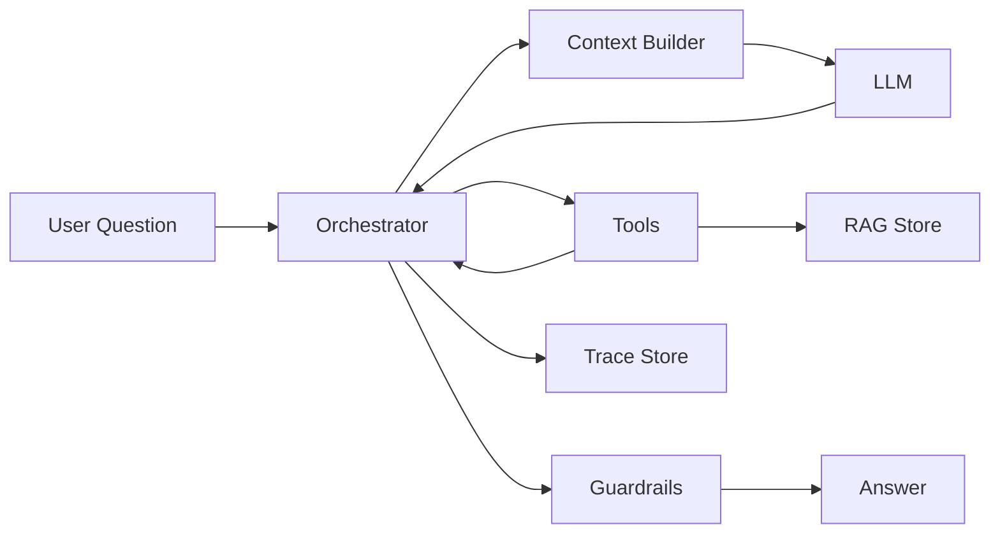

# 架构设计 `[主线]`

项目需求确定后,下一步不是马上写 prompt,而是设计架构边界。

个人研究助手至少要处理七类事情:

- 用户输入和输出。
- 任务状态。
- 模型调用。
- 工具调用。
- RAG 检索。
- 记忆和笔记。
- 可观测和评估。

如果把这些全部写进一个函数或一个 prompt,很快会失控。


本章会讲:

- 项目模块如何划分。
- Orchestrator、Context Builder、Tool Layer、RAG、Memory 的职责。
- 核心数据流。
- 关键数据结构。
- 为什么 runtime 要管理状态和安全边界。

## 总体架构

v1 可以采用单 Agent + runtime orchestration 的架构。

模块包括:

| 模块 | 责任 |
| --- | --- |
| UI/API | 接收问题,展示回答、引用和确认 |
| Orchestrator | 管理任务状态、步骤、预算、停止条件 |
| Context Builder | 构造模型输入 |
| LLM Adapter | 封装模型调用 |
| Tool Layer | 搜索、读取、解析、校验工具 |
| RAG Store | 文档切块、向量检索、元数据 |
| Memory/Notes | 用户偏好和确认笔记 |
| Guardrails | 权限、来源隔离、引用校验 |
| Trace Store | 保存过程记录 |
| Eval Runner | 离线评估和回归 |

这个架构的重点是:模型不拥有全部控制权。Orchestrator 和 runtime 管状态、预算、工具权限和安全策略。

## 数据流

一次研究任务的数据流:



注意这里 LLM 不直接访问 RAG Store 或 Memory。它通过工具和上下文间接使用这些能力。

## Orchestrator

Orchestrator 是任务控制器。

它负责:

- 创建 ResearchTask。
- 维护 state。
- 调用模型。
- 调用工具。
- 更新步骤状态。
- 检查预算。
- 调用护栏。
- 保存 trace。
- 判断是否完成或需要用户。

它不负责写长篇回答。回答由模型生成,但 Orchestrator 决定什么时候生成、给什么上下文、生成后如何校验。

## ResearchTask state

一个简化 state:

```json
{
  "task_id": "research_001",
  "goal": "Explain why RAG cannot fully eliminate hallucination.",
  "constraints": ["Answer in Chinese", "Use citations"],
  "plan": [
    {"id": "p1", "task": "search sources", "status": "done"},
    {"id": "p2", "task": "extract evidence", "status": "in_progress"}
  ],
  "queries": ["RAG hallucination retrieval failure evidence faithfulness"],
  "evidence": ["S1", "S2"],
  "claims": [],
  "open_questions": ["Need source about citation faithfulness"],
  "budget": {"model_calls": 4, "tool_calls": 6},
  "status": "running"
}
```

State 是权威任务视图。模型看到的是 state 的摘要,不是完整内部对象。

## Context Builder

Context Builder 负责把状态、证据、记忆和工具说明组织成模型输入。

它要选择:

- 当前目标。
- 当前计划。
- 相关证据。
- 可用工具。
- 相关记忆。
- 输出格式。
- 安全提醒。

它也要排除:

- 无关历史。
- 过期假设。
- 无权限资料。
- 太长工具日志。
- 不可信资料中的指令。

Context Builder 是项目质量的关键模块。

## LLM Adapter

LLM Adapter 封装模型调用。

它负责:

- 选择模型。
- 设置参数。
- 发送消息。
- 接收结构化输出。
- 处理重试。
- 记录 token、延迟、成本。
- 做输出 schema 校验。

不要让业务逻辑到处直接调用模型 API。统一 Adapter 方便替换模型和记录 trace。

## Tool Layer

v1 工具可以从少量开始。

| 工具 | 类型 | 作用 |
| --- | --- | --- |
| `search_corpus` | 只读 | 检索本地资料库 |
| `read_source` | 只读 | 读取文档或网页片段 |
| `extract_evidence` | 模型/规则 | 从片段中提取 claim 和 quote |
| `check_citations` | 校验 | 检查引用是否存在和支持结论 |
| `save_note_draft` | 草稿 | 生成待确认笔记 |
| `commit_note` | 写入 | 用户确认后保存笔记 |

写工具只有 `commit_note`,并且需要用户确认。

## RAG Store

RAG Store 管资料库。

它包括:

- 原始文档。
- 清洗文本。
- chunk。
- embedding。
- 元数据。
- 向量索引。
- 关键词索引。

每个 chunk 应有:

```json
{
  "chunk_id": "doc_123#section_4",
  "doc_id": "doc_123",
  "title": "RAG Survey",
  "source_uri": "https://...",
  "text": "...",
  "metadata": {
    "published_at": "2025-08-01",
    "source_type": "paper",
    "trust": "external",
    "license": "unknown"
  }
}
```

资料源必须可追溯。

## Memory 和 Notes

Memory 和 Notes 要分开。

### Memory

保存用户偏好和项目约定:

- 喜欢中文回答。
- 输出先结论后细节。
- 常研究 AI Agent 方向。

### Notes

保存用户确认的研究笔记:

- 某篇文章的核心观点。
- 某个技术概念的解释。
- 某个主题的对比表。

Notes 本质上也是可检索知识源,但它们有用户确认和来源。

## Guardrails

v1 护栏包括:

- 外部资料标注为 untrusted。
- 不执行外部写操作。
- 笔记写入前确认。
- 引用 ID 校验。
- 证据不足时要求说明。
- token 和调用预算。
- 不把外部内容写成系统指令。

这些护栏不复杂,但能避免很多基础事故。

## Trace Store

Trace Store 保存每次任务过程。

最小 trace:

- task id。
- user input。
- model calls。
- tool calls。
- retrieval results。
- evidence pack。
- final answer。
- citation check。
- cost and latency。
- errors。

Trace 是调试和 eval 的来源。

## Eval Runner

Eval Runner 用固定样本运行助手。

它输出:

- 答案正确性。
- 引用准确性。
- 证据不足处理。
- 成本和延迟。
- 失败 trace。

不要等项目做完才加 eval。v1 一开始就要有小评估集。

## 模块边界原则

### 1. 模型不直接管状态

模型可以建议更新,但 runtime 写 state。

### 2. 工具不返回无结构长文本

工具返回应有摘要、结构化字段和 artifact。

### 3. RAG 和 Memory 分开

外部资料、用户偏好、研究笔记分别治理。

### 4. 引用校验是独立节点

不要只靠生成 prompt 要求引用。

### 5. Trace 贯穿所有模块

没有 trace,后续无法评估和调试。

## 常见架构反模式

### 1. 一个超长 prompt 管所有事

很快会变得不可维护。

### 2. 模型直接决定写入记忆

容易把猜测和不可信内容写入长期存储。

### 3. 工具层没有权限和副作用标注

后续扩展写工具时风险很大。

### 4. RAG 返回片段没有来源

最终引用无法校验。

### 5. 没有 Eval Runner

每次优化都靠感觉。

## 本章小结

个人研究助手的架构应把 UI、Orchestrator、Context Builder、LLM Adapter、Tool Layer、RAG Store、Memory/Notes、Guardrails、Trace Store 和 Eval Runner 分开。Orchestrator 管状态和控制流,模型负责判断和生成,工具负责外部能力,RAG 和 Memory 提供资料,Trace 和 Eval 保证可调试和可改进。好的架构让每个模块都有边界,避免把整个系统变成一个巨大 prompt。

下一章会实现核心循环和工具。我们会把架构中的 Orchestrator、state 和 tool calls 串成一个最小可运行流程。

