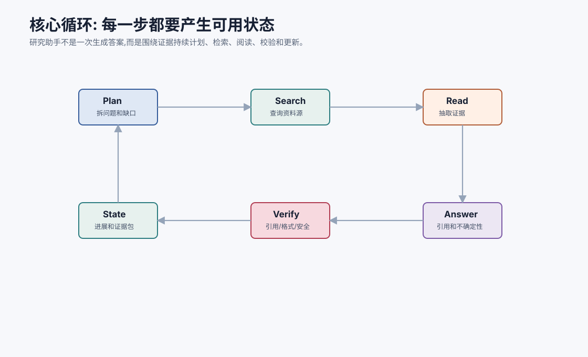
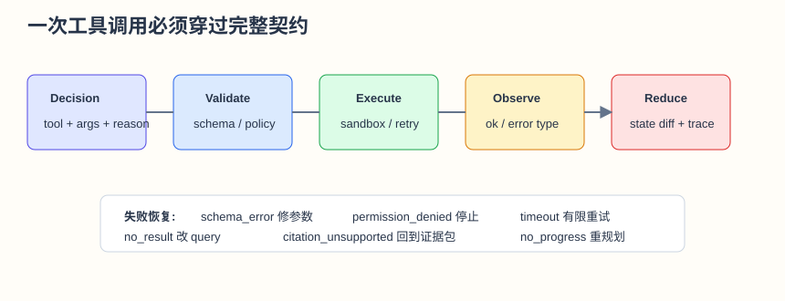
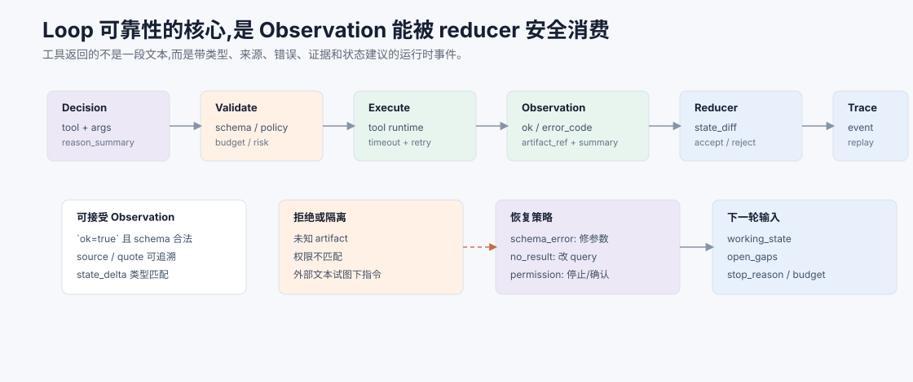
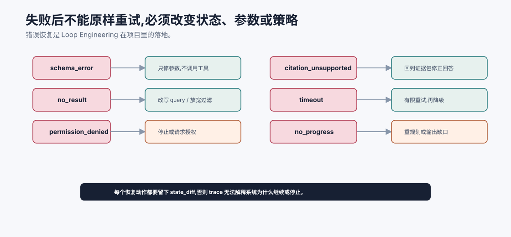

# 核心循环与工具实现 `[主线]`

架构设计确定后,我们要让研究助手跑起来。

v1 的核心不是复杂框架,而是一个清晰循环:

```text
读取状态 -> 构建上下文 -> 模型决定下一步 -> 调用工具或生成答案 -> 更新状态 -> 校验 -> 继续或结束
```

这个循环必须可观测、可恢复、可预算控制。





本章会讲:

- 核心循环如何设计。
- 研究助手需要哪些最小工具。
- 工具输入输出契约如何写。
- 如何更新 state。
- 如何处理工具失败和证据不足。
- 如何生成最终答案。

## 核心循环状态机

研究任务可以抽象成几个状态:

| 状态 | 含义 |
| --- | --- |
| `new` | 刚创建任务 |
| `planning` | 分析问题和计划检索 |
| `searching` | 检索资料 |
| `reading` | 阅读资料并提取证据 |
| `answering` | 生成回答 |
| `verifying` | 校验引用和输出 |
| `needs_user` | 需要用户澄清或确认 |
| `done` | 完成 |
| `failed` | 无法完成 |

状态机让系统知道每一步该做什么,而不是让模型每轮从零猜。

## 主循环伪代码

```python
def run_research_task(task):
    while task.status not in {"done", "failed", "needs_user"}:
        check_budget(task)
        context = build_context(task)
        decision = call_model(context)
        record_model_span(task, context, decision)

        if decision.type == "tool_call":
            result = execute_tool(decision.tool, decision.args, task)
            update_state_from_tool(task, decision, result)
        elif decision.type == "final_answer":
            verification = verify_answer(task, decision.answer)
            update_state_from_verification(task, decision, verification)
        elif decision.type == "ask_user":
            task.status = "needs_user"
        else:
            task.status = "failed"

    return task
```

这里的重点是:模型给出 decision,但 state 更新由 runtime 负责。

## Decision 类型

模型输出最好结构化。

```json
{
  "type": "tool_call",
  "tool": "search_corpus",
  "args": {"query": "RAG hallucination evidence faithfulness", "top_k": 8},
  "reason": "Need evidence about why RAG can still hallucinate."
}
```

或者:

```json
{
  "type": "final_answer",
  "answer": "...",
  "cited_evidence": ["S1", "S2"]
}
```

这样 runtime 可以校验和执行。

Decision 还应该带上少量运行时字段,便于 Harness 判断风险:

```json
{
  "type": "tool_call",
  "tool": "read_source",
  "args": {"chunk_id": "rag_survey#12"},
  "reason_summary": "Read the most relevant source before extracting evidence.",
  "risk_level": "L1",
  "expected_observation": "source text with metadata",
  "idempotency_key": "research_001:read:rag_survey#12"
}
```

`reason_summary` 不是隐藏推理链,而是可审计的短解释。`expected_observation` 能帮助系统发现工具返回不符合预期。`idempotency_key` 能避免重试时重复写入或重复创建产物。

## 最小工具集

v1 工具不需要多。

### search_corpus

检索资料库。

输入:

```json
{
  "query": "string",
  "top_k": "integer",
  "filters": {
    "source_type": "optional string",
    "language": "optional string"
  }
}
```

输出:

```json
{
  "results": [
    {
      "chunk_id": "doc1#3",
      "title": "RAG Survey",
      "snippet": "...",
      "score": 0.82,
      "source_uri": "https://...",
      "trust": "external"
    }
  ]
}
```

### read_source

读取某个资料片段或相邻上下文。

输入:

```json
{
  "chunk_id": "doc1#3",
  "include_neighbors": true
}
```

输出包含完整文本和元数据。

### extract_evidence

从资料中提取证据。

输入是问题和 source text,输出 claims/evidence。

### check_citations

检查回答中的引用。

输入:

```json
{
  "answer": "string",
  "evidence_pack": ["S1", "S2"]
}
```

输出:

```json
{
  "ok": false,
  "issues": [
    {"claim": "...", "problem": "unsupported", "suggestion": "remove or add evidence"}
  ]
}
```

### save_note_draft / commit_note

先生成笔记草稿,用户确认后写入。

## 工具契约模板

每个工具都应该有一份契约,不要只写一个函数名。

| 字段 | 示例 | 作用 |
| --- | --- | --- |
| `name` | `search_corpus` | 模型可见工具名 |
| `purpose` | 检索资料库候选 chunk | 防止工具误用 |
| `input_schema` | query、top_k、filters | 参数校验 |
| `output_schema` | results、empty_reason、trace_ref | Observation 标准化 |
| `risk_level` | L1 | Harness 策略 |
| `side_effect` | none/read/write | 决定是否确认和幂等 |
| `retry_policy` | timeout 可重试 2 次 | 防止无限重试 |
| `failure_modes` | no_result、permission_denied、timeout | 让 Loop 能恢复 |

工具契约越明确,模型越容易正确调用,Harness 越容易判断是否允许执行。

## 工具设计原则

这些工具都遵循:

- 只读工具默认安全,但仍记录来源。
- 写工具需要确认。
- 输出结构化。
- 错误可分类。
- 返回 artifact 引用。
- 不把外部资料当指令。

## search_corpus 的实现思路

检索可以先做简化版本:

```text
关键词检索 + 向量检索 -> 合并去重 -> rerank top_k
```

如果不想一开始引入完整向量库,可以先用本地文档 + 简单关键词搜索跑通流程。架构保留接口,后续替换为向量库。

不要让项目卡在基础设施。v1 的目标是闭环。

## Evidence Pack

阅读资料后,系统应形成证据包。

```json
{
  "evidence": [
    {
      "id": "S1",
      "source_uri": "https://...",
      "title": "RAG Survey",
      "quote": "Retrieval can fail to surface relevant evidence...",
      "claim_supported": "RAG can hallucinate when retrieval misses key evidence.",
      "trust": "external",
      "retrieved_at": "2026-07-06T10:00:00+08:00"
    }
  ],
  "gaps": ["Need source about citation faithfulness."],
  "conflicts": []
}
```

最终回答只能引用 evidence pack 中的 ID。

## State 更新规则

每次工具结果回来,都更新 state。

| 事件 | 更新 |
| --- | --- |
| search 返回结果 | 添加 candidate_sources |
| read 成功 | 添加 source_text artifact |
| extract 成功 | 添加 evidence |
| citation check 失败 | 添加 revision_required |
| budget 超限 | status = needs_user 或 failed |
| 用户确认笔记 | commit note |

状态更新要由程序执行,不要只让模型在对话里记住。

建议把更新规则写成 reducer,而不是散落在工具函数里:

```python
def reduce_state(state, action, observation):
    if observation.ok and action.tool == "search_corpus":
        state.candidate_sources.extend(observation.results)
    elif observation.ok and action.tool == "extract_evidence":
        state.evidence.extend(observation.evidence)
    elif not observation.ok:
        state.errors.append(observation.error)
        state.recovery_hint = observation.suggested_next
    return state
```

这样做的好处是所有状态变化都能被 trace 捕获,也方便回放一条失败路径。

## Observation 契约

很多 Agent Loop 看起来有状态机,实际仍然不稳定,根因是工具 observation 没有契约。工具返回一段自然语言,模型读完后自己决定“发生了什么”,这等于把状态更新又交回了模型。更稳的做法是:工具返回结构化 observation,由 reducer 判断这条 observation 是否能改变 state。



一个可用的 observation 至少包含这些字段:

```json
{
  "ok": true,
  "tool": "read_source",
  "action_id": "research_001:read:rag_survey#12",
  "artifact_ref": "artifact://source_text/rag_survey#12",
  "summary": "Read section about retrieval misses and hallucination.",
  "data": {
    "chunk_id": "rag_survey#12",
    "source_uri": "https://example.com/rag-survey",
    "quote_count": 3,
    "trust": "external"
  },
  "state_delta_hint": {
    "add_source_text": "artifact://source_text/rag_survey#12"
  },
  "error": null
}
```

注意 `state_delta_hint` 只是建议,不是最终状态变化。真正写入 state 的动作仍由 reducer 完成。Reducer 要检查 `action_id` 是否对应当前任务、artifact 是否存在、权限是否匹配、返回类型是否符合工具契约、外部资料是否被当作数据隔离。只有通过这些检查,observation 才能变成 `state_diff`。

失败 observation 也要结构化:

```json
{
  "ok": false,
  "tool": "search_corpus",
  "error": {
    "code": "no_result",
    "retryable": true,
    "suggested_next": "rewrite_query",
    "message": "No chunks matched filters source_type=paper language=zh."
  }
}
```

这会让错误恢复变得可控。`schema_error` 不调用真实工具,只让模型修参数;`permission_denied` 不自动重试,而是停止或请求授权;`no_result` 可以改写 query;`citation_unsupported` 回到回答修正或证据补充。Loop Engineering 的本质不是“多轮跑下去”,而是每一轮都能根据可验证的 observation 改变状态、收敛目标或明确停止。

## 处理证据不足

研究助手必须会说“不足以判断”。

如果 evidence pack 为空或只支持部分结论,回答应包含:

- 已找到什么。
- 没找到什么。
- 不能下什么结论。
- 建议下一步检索什么。

不要用模型常识补齐证据缺口。

## 处理冲突证据

如果不同来源冲突,不要强行合并。

State 中记录 conflicts:

```json
{
  "claim": "RAG reduces hallucination",
  "sources_for": ["S1"],
  "sources_against": ["S3"],
  "resolution": "unresolved"
}
```

最终回答说明冲突和可能原因:版本不同、定义不同、实验条件不同。

## Answer 生成契约

最终回答可以要求:

```text
请输出:
1. 简短结论。
2. 分点解释,每个关键结论带引用 [Sx]。
3. 不确定性和证据缺口。
4. 后续阅读建议。
```

如果是对比任务,输出对比表。

如果是阅读任务,输出观点、证据、限制和术语解释。

## 引用校验

生成后运行 check_citations。

检查:

- 引用 ID 是否存在。
- 每个关键 claim 是否有引用。
- 引用是否支持 claim。
- 是否遗漏限制条件。

校验失败时,进入修正:

```text
把校验问题和证据包交给模型,要求修正回答,最多重试 2 次。
```

## 预算控制

v1 设置简单预算:

```json
{
  "max_model_calls": 8,
  "max_search_calls": 4,
  "max_read_calls": 10,
  "max_latency_ms": 30000
}
```

预算耗尽时,不要继续乱跑。输出当前已知内容和缺口。

## 错误恢复

常见错误:

- 检索无结果 -> 改写 query。
- 读取失败 -> 换候选来源。
- 引用校验失败 -> 修正回答。
- 工具超时 -> 有限重试。
- schema 解析失败 -> 要求模型按 schema 重输。

每种错误要有最大重试次数。

错误恢复要避免“原样再试”。一个简单策略是按错误类型路由:

| 错误 | 下一步 |
| --- | --- |
| `schema_error` | 让模型按 schema 修正参数,不调用工具 |
| `no_result` | 改写 query 或放宽过滤 |
| `permission_denied` | 停止或请求授权,不要重试 |
| `citation_unsupported` | 回到 evidence pack 修正回答 |
| `timeout` | 有限重试,然后降级 |
| `no_progress` | 重规划或输出当前缺口 |

这就是 Loop Engineering 在项目里的落地:失败后必须改变状态、参数或策略。



这张路由图的核心是:错误类型决定恢复策略。`schema_error` 不应该触发真实工具调用,只需要让模型修正结构化参数;`permission_denied` 不应该自动重试,因为权限不是随机失败;`citation_unsupported` 应该回到 evidence pack 和回答生成,而不是继续检索一堆无关资料;`no_progress` 则说明循环本身需要重规划或停止。

每次恢复都要留下 `state_diff`。例如 `no_result` 后 query 从 A 改成 B,`citation_unsupported` 后删除了哪个 claim,`timeout` 后是否降级为只读摘要,这些都应该能在 trace 中看到。否则系统表面上“会重试”,实际调试时仍然不知道它为什么越跑越偏。

## Trace

每步记录:

- decision。
- tool call。
- args 和 arg_sources。
- result summary。
- state diff。
- cost 和 latency。

这样才能评估“回答错是检索问题还是生成问题”。

最小 trace event 可以这样设计:

```json
{
  "event_type": "tool_call",
  "turn": 3,
  "state_id": "research_001:v4",
  "action": {"tool": "search_corpus", "args_hash": "..."},
  "validation": {"schema_ok": true, "policy_ok": true},
  "observation": {"ok": true, "summary": "8 chunks returned"},
  "state_diff": {"candidate_sources_added": 8},
  "latency_ms": 420
}
```

记录 `args_hash` 而不是完整参数,可以在保留审计能力的同时减少敏感信息暴露。需要完整参数时,再通过受控 artifact 引用查看。

## 常见误解

### 误解一:核心循环越自主越好

不一定。v1 应该让 runtime 管状态、预算和安全。

### 误解二:工具越多越强

工具越多选择越难。先用少量高质量工具。

### 误解三:引用交给模型自己处理就行

不够。需要独立引用校验。

### 误解四:检索不到就让模型凭常识回答

研究助手应该说明证据不足,而不是编造。

### 误解五:失败重试越多越稳

重试要分类、有限,并检测是否有进展。

## 本章小结

个人研究助手的核心循环是状态驱动的:构建上下文、模型决策、工具调用、状态更新、回答生成和引用校验。v1 工具集应保持小而清晰,包括检索、读取、证据提取、引用校验和笔记草稿/提交。关键产物是 evidence pack,最终回答应基于证据并接受校验。runtime 负责状态、预算、错误恢复和 trace,模型负责判断和生成。

下一章会加入记忆与 RAG,让研究助手既能使用外部资料,也能沉淀用户确认的研究笔记。
