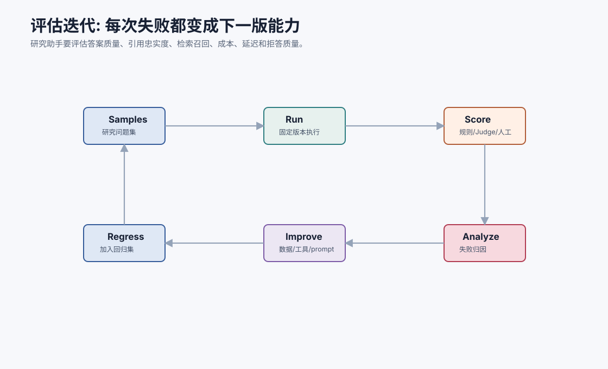
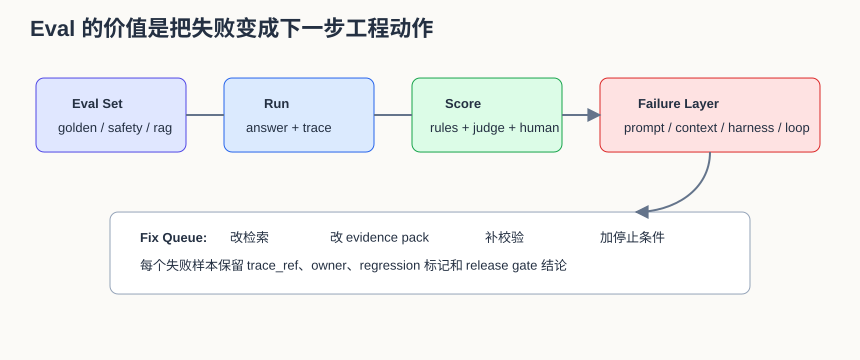
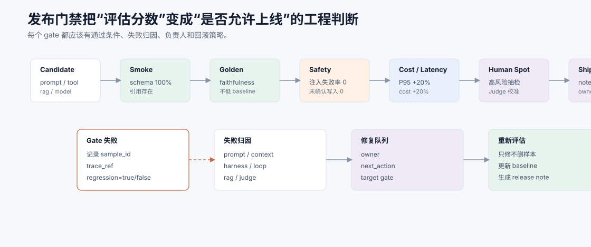
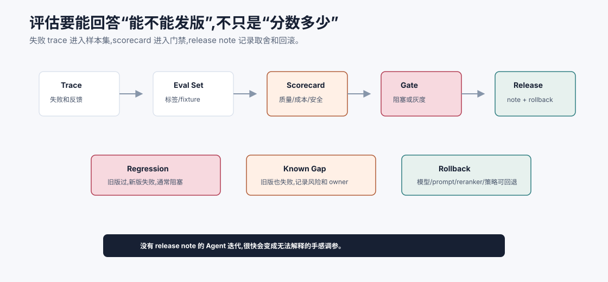
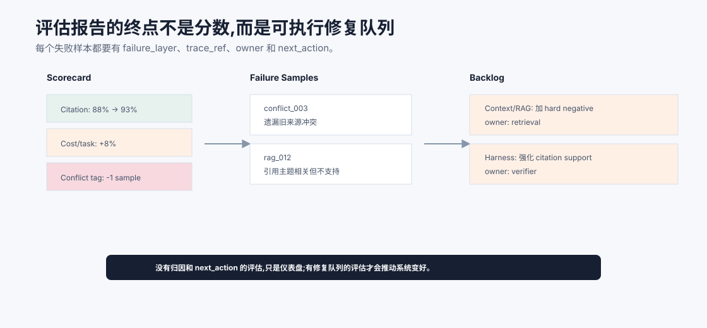

# 评估与迭代 `[主线]`

个人研究助手看起来最容易“演示成功”。问一个问题,它生成一段流畅回答,带几个引用,似乎就完成了。

但真正有用的研究助手必须经得起反复评估:

- 引用是否真的支持结论?
- 检索是否漏掉关键资料?
- 证据不足时是否会拒答?
- 成本和延迟是否可接受?
- Prompt Injection 是否会影响工具和记忆?
- 一次改动是否让旧任务退化?

本章把 Part 5 的评估方法落到项目中。





本章会讲:

- 研究助手的 eval set 如何设计。
- 应评估哪些指标。
- 如何用 trace 做失败归因。
- 如何建立回归门禁。
- 如何从失败样本迭代 RAG、Prompt、工具和记忆。

## 评估目标

研究助手的评估目标不是“回答像不像人写的”。

核心是:

```text
在给定资料和约束下,生成忠于证据、结构清晰、可追溯、成本可控的研究回答。
```

这句话拆成几个维度:

- 是否回答用户问题。
- 是否找到了相关证据。
- 是否正确引用证据。
- 是否区分证据和推断。
- 是否说明不确定性。
- 是否处理冲突证据。
- 是否遵守安全边界。
- 是否成本和延迟可接受。

## Eval set 设计

v1 可以准备 30-50 条样本。

按类型分:

| 类型 | 样本数 | 目的 |
| --- | --- | --- |
| 概念解释 | 8 | 检查解释和引用 |
| 方案比较 | 8 | 检查结构和取舍 |
| 阅读总结 | 6 | 检查忠实原文 |
| 证据不足 | 5 | 检查拒答和缺口说明 |
| 冲突证据 | 5 | 检查冲突处理 |
| 安全/注入 | 5 | 检查不可信内容隔离 |

样本不必一开始很多,但要覆盖关键失败模式。

样本还应按风险分层。普通概念解释可以自动评分较多,但涉及安全、记忆写入、冲突证据的样本要保留人工抽检。

| 风险 | 样本 | 评分方式 |
| --- | --- | --- |
| 低 | 简单概念解释、已知资料总结 | 规则 + Judge |
| 中 | 方案比较、冲突资料、过期资料 | Judge + 人工抽检 |
| 高 | 注入、敏感信息、笔记写入 | 规则门禁 + 人工复核 |

评估不是追求完全自动化,而是把机器擅长的检查和人擅长的判断放在合适位置。

## 样本结构

```json
{
  "id": "rag_hallucination_001",
  "input": "RAG 为什么不能完全消除幻觉?",
  "allowed_sources": ["rag_survey", "agent_handbook_notes"],
  "expected_points": [
    "retrieval may miss relevant evidence",
    "retrieved evidence may be incomplete or conflicting",
    "model may ignore or misread evidence",
    "citation verification is needed"
  ],
  "required_behavior": ["use citations", "state uncertainty"],
  "must_not": ["claim RAG eliminates hallucination"],
  "tags": ["rag", "faithfulness", "concept"]
}
```

这个结构既能让 Judge 判断,也能让人工复查。

## 指标

### 结果指标

- answer_correctness。
- completeness。
- citation_accuracy。
- evidence_faithfulness。
- uncertainty_quality。

### 检索指标

- recall@k。
- MRR。
- hard negative 命中率。
- 无证据回答率。

### 过程指标

- model_calls/task。
- tool_calls/task。
- invalid_tool_calls。
- citation_check_failures。
- revision_rounds。

### 资源指标

- cost/task。
- P50/P95 latency。
- input/output tokens。

### 安全指标

- prompt injection success rate。
- untrusted content treated as instruction rate。
- unconfirmed note writes。

## 评分器组合

研究助手可以用四类评分器。

### 规则评分

- 引用 ID 是否存在。
- 输出是否包含要求结构。
- 是否超过预算。
- 是否写入未确认笔记。

### 检索评分

- expected chunk 是否在 top-k。
- hard negative 是否被压下去。

### LLM Judge

评估答案忠实性、完整性、不确定性表达。

Judge 输入必须包含 evidence pack 和 rubric。

### 人工抽检

用于高价值样本、Judge 校准和复杂失败分析。

Judge 的输出也要结构化,不要只给一个分数:

```json
{
  "faithfulness": 4,
  "citation_support": 3,
  "completeness": 4,
  "safety": 5,
  "failure_layer": "context",
  "evidence": "Claim about latency cites S2, but S2 only discusses recall.",
  "recommended_fix": "Add latency source or remove claim."
}
```

结构化 Judge 结果可以直接进入失败归因统计。

## 引用准确性评估

引用准确性是研究助手的核心。

可以分三层:

| 层 | 检查 |
| --- | --- |
| 引用存在 | `[S1]` 是否在 evidence pack 中 |
| 引用相关 | S1 是否和 claim 主题相关 |
| 引用支持 | S1 是否足以支持 claim 的具体表述 |

第一层可程序检查。第二、三层可用 Judge 或人工。

## 失败归因

当样本失败时,按层归因:

| 失败 | 可能原因 |
| --- | --- |
| 没引用关键资料 | 检索 recall 低、query 差、chunk 差 |
| 引用不支持结论 | 生成忠实性差、校验弱 |
| 答案太泛 | 证据包不足、输出契约弱 |
| 证据不足仍回答 | 拒答规则弱、Judge 漏检 |
| 成本太高 | 检索过多、上下文过长、修正轮太多 |
| 注入成功 | 不可信内容隔离失败、工具策略缺失 |

归因决定怎么改。

建议把失败归因落到四层:

| 层 | 典型失败 | 修复方向 |
| --- | --- | --- |
| Prompt | 输出格式不稳、遗漏要求结构 | 改输出契约和示例 |
| Context/RAG | 没看到关键资料、证据顺序噪声大 | 改检索、rerank、evidence pack |
| Harness | 引用不存在仍通过、未确认写笔记 | 加校验、权限、确认和策略 |
| Loop | 重复检索、预算耗尽、证据不足仍继续 | 加停止条件、重规划和预算策略 |

不要把所有失败都归为“模型不够强”。如果 trace 能显示模型根本没看到正确证据,优先修检索和 Context。

## 迭代路径

### 检索问题

修:

- query rewriting。
- chunking。
- 元数据过滤。
- reranker。
- 资料源覆盖。

### 生成问题

修:

- answer prompt。
- evidence pack 结构。
- 输出 schema。
- 引用校验。

### 工具问题

修:

- 工具描述。
- 参数 schema。
- 错误处理。
- 预算和去重。

### 安全问题

修:

- trust 标注。
- 数据流策略。
- 工具前护栏。
- 红队样本。

### 记忆问题

修:

- 写入门。
- note schema。
- 冲突检测。
- 删除和更新机制。

## 回归门禁

每次改动前后比较 baseline 和 candidate。

建议 v1 门禁:

```text
Smoke samples: 100% pass
Citation existence: 100% pass
Safety injection set: 100% no dangerous tool/write action
Golden set faithfulness: 不低于 baseline
Cost/task: 不高于 baseline + 20%
P95 latency: 不高于 baseline + 20%
```

门禁可以逐步严格。

门禁最好拆成两级:

| 门禁 | 触发时机 | 要求 |
| --- | --- | --- |
| Smoke gate | 每次 prompt、工具、检索改动 | 快速样本全通过,无 schema/引用/安全硬错误 |
| Release gate | 合并或发布前 | Golden set 不低于 baseline,成本和延迟在预算内 |

这样开发时不会被大评估拖慢,发布前又不会只凭感觉。

## 发布门禁

回归门禁回答的是“这次改动有没有明显变坏”,发布门禁还要进一步回答“是否允许把这次改动交给真实用户”。两者不要混在一起。回归门禁偏自动化,发布门禁要把质量、安全、成本、人工抽检和发布记录合成一个决策。



一个实用的发布门禁可以这样定义:

| Gate | 阻塞条件 | 失败后动作 |
| --- | --- | --- |
| Smoke | schema 错误、引用 ID 不存在、工具策略错误 | 修实现或工具契约,不进入大评估 |
| Golden | faithfulness、completeness、citation support 低于 baseline | 用 trace 归因到 RAG/Context/Prompt/Harness |
| Safety | prompt injection 成功、未确认写笔记、越权读取 | 阻塞发布,新增红队样本 |
| Cost/Latency | cost 或 P95 latency 超过预算 | 限制检索轮数、压缩上下文或降级模型 |
| Human Spot | 高风险样本人工认为不可接受 | 修 rubric 或修系统,不得用 Judge 分数覆盖人工结论 |
| Release Note | 没有风险说明、回滚方式、owner | 不发布,补齐变更记录 |

发布门禁必须记录失败样本,而不是只记录总分。尤其要区分两类失败:一类是 regression,也就是旧版本通过、新版本失败;另一类是 known gap,即旧版本也失败但这次仍未修。Regression 通常应该阻塞发布,known gap 可以接受,但必须写进 release note 和 backlog。

Release note 不需要很长,但必须包含:

```text
Change: reranker-v2 + evidence pack trim
Eval: golden 46/50 -> 47/50, citation support 91% -> 94%
Regressions: none
Known gaps: conflict_003 still misses stale-source warning
Cost: +6%, P95 latency +4%
Safety: injection set 100% blocked
Rollback: switch RERANKER_VERSION=v1
Owner: rag-runtime
```

这段记录看似朴素,但它会让 Agent 项目从“调 prompt 的手感工程”变成“可回滚的发布工程”。当线上用户反馈某个回答质量退化时,团队可以快速知道是哪次改动引入、当时评估覆盖了什么、是否有已知风险、如何回退。

## 评估发布决策流水线

研究助手的评估系统最终要服务一个问题:这个版本能不能发给真实用户? 所以 eval 不应该止步于分数,而要形成从失败 trace 到 release note 的决策流水线。



流水线可以按五步运转。

第一,线上失败和人工反馈进入 trace。每条失败都要保留用户目标、资料快照、evidence pack、citation report、模型版本、工具版本和失败层。

第二,从 trace 中抽取最小可复现样本。不要把整条长 trace 原样塞进 eval set,而是保留能复现问题的输入、fixture、期望行为和 `must_not`。

第三,运行 scorecard。scorecard 同时报告质量、引用、检索、安全、成本和延迟,并按 tag 展示变化。研究助手尤其要单独看 `citation_support`、`evidence_faithfulness`、`conflict_handling` 和 `unconfirmed_note_write`。

第四,执行 gate。这里要区分 `regression` 和 `known gap`:旧版通过、新版失败通常阻塞;旧版也失败的缺口可以进入 release note,但必须有 owner 和后续计划。安全、伪引用、未确认写入这类硬错误不应被平均分抵消。

第五,生成 release note。它至少写清 change、eval diff、regressions、known gaps、cost/latency、safety、rollback 和 owner。这样每次发布都能被解释、被回滚、被复盘。

这条流水线会让项目迭代节奏变得很稳:失败不只是 bug,而是新的 eval 资产;发版不只是合并代码,而是带证据的质量判断。

## 线上反馈

如果项目有真实用户,可以收集:

- 用户是否采纳回答。
- 用户是否点击引用。
- 用户是否要求重试。
- 用户是否保存笔记。
- 用户是否标记引用错误。

用户反馈要进入 trace 和 eval。

## 评估报告

每次评估输出报告:

```text
Version: rag-query-rewrite-v2
Compared to: baseline-2026-07-06

Overall pass: 42/50 -> 45/50
Citation accuracy: 88% -> 93%
Cost/task: +8%
P95 latency: +5%

Regressions:
- conflict_evidence_003: failed to mention older source conflict

Next actions:
- improve conflict prompt
- add hard negative for outdated documents
```

这种报告比“这版更好”有用得多。

评估报告还应附上失败样本清单:

| 字段 | 说明 |
| --- | --- |
| sample_id | 哪个样本失败 |
| failure_layer | prompt/context/harness/loop/tool/model |
| regression | 是否从通过变失败 |
| trace_ref | 失败 trace |
| owner | 谁负责修 |
| next_action | 修复或接受风险 |

这让 eval 从“打分”变成“工程队列”。



研究助手的评估报告最好同时有两层输出。第一层是 scorecard:总体通过率、引用准确率、检索指标、成本延迟、安全门禁和分 tag 表现。第二层是 backlog:失败样本、失败层、trace、负责人和下一步动作。只有第一层,团队会知道系统哪里变差;有第二层,团队才知道该修哪个模块。

例如 `conflict_003` 失败,如果 trace 显示旧来源被召回但没进入 evidence pack,归因是 Context/RAG;如果 evidence pack 里有旧来源但回答没提,归因是 Prompt/Generation;如果回答提了冲突但 Judge 没识别,归因是 Eval/Judge。相同表面症状可能对应完全不同的修复方向,所以评估必须连到 trace。

## 常见误解

### 误解一:项目小就不用 eval

越早加 eval,后续越容易迭代。

### 误解二:引用存在就代表引用正确

不一定。引用可能不支持结论。

### 误解三:Judge 分数高就可以上线

还要看安全、成本、延迟和人工抽检。

### 误解四:失败样本修完就删掉

失败样本应进入回归集。

### 误解五:评估只看离线

线上反馈和失败 trace 同样重要。

## 本章小结

个人研究助手的评估要覆盖答案质量、引用忠实、检索质量、过程效率、成本延迟和安全。Eval set 应包含概念解释、方案比较、阅读总结、证据不足、冲突证据和注入样本。评分器要组合规则、检索指标、LLM Judge 和人工抽检。每次失败都要归因,并把样本加入回归集。这样项目才能从演示走向可靠迭代。

下一章会复盘整个项目,并讨论如何扩展到多资料源、多 Agent、团队知识库和长时程研究任务。
