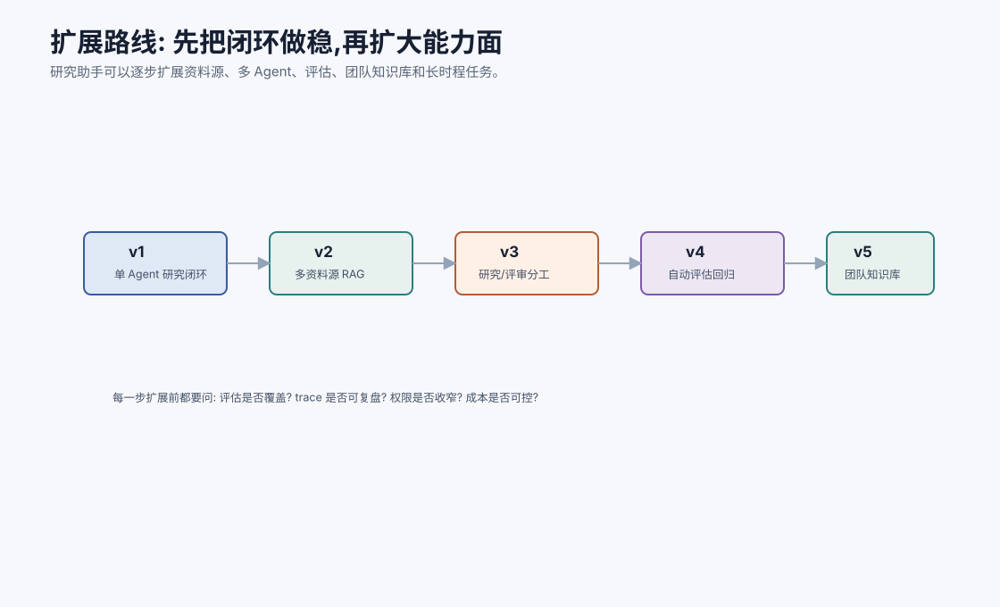
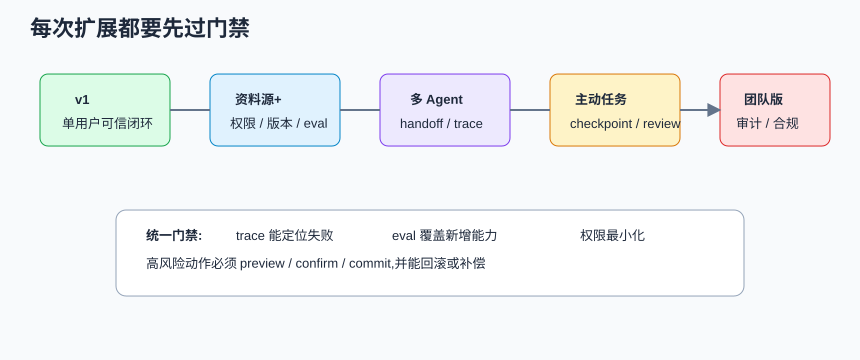
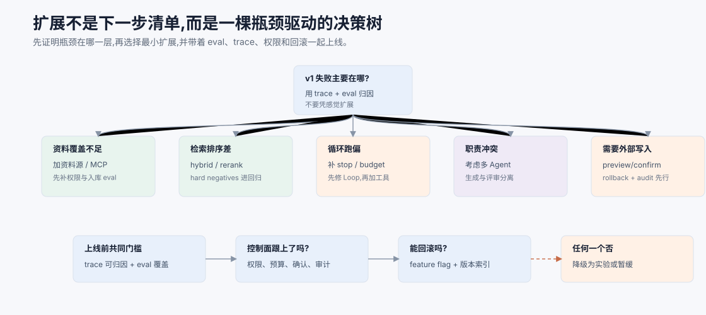
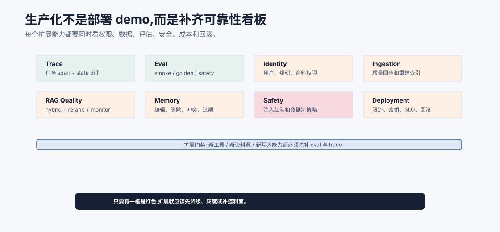

# 复盘与扩展方向 `[进阶]`

到这里,个人研究助手的 v1 已经形成完整闭环:

```text
问题 -> 计划 -> 检索 -> 阅读 -> 证据包 -> 回答 -> 引用校验 -> 笔记沉淀 -> 评估回归
```

这个项目的价值不在于功能花哨,而在于它把前面所有关键机制串起来了:Agent 循环、工具、RAG、记忆、上下文工程、护栏、可观测和评估。





本章会讲:

- v1 架构复盘。
- 哪些设计最关键。
- 后续可以如何扩展。
- 扩展前要满足哪些条件。
- 从个人助手到团队知识系统的路线。

## v1 做到了什么

v1 完成了一个可信研究助手的最小形态。

它具备:

- 研究任务状态。
- 检索工具。
- 证据提取。
- 带引用回答。
- 引用校验。
- 笔记草稿和确认写入。
- trace。
- eval set。
- 安全边界。

这已经覆盖了 Agent 工程的主干。

## 最关键的设计

### 1. 状态由 runtime 管

模型不是任务状态的唯一记忆。Orchestrator 维护 ResearchTask state,保证任务可恢复、可追踪。

### 2. 证据包是中心产物

研究助手不是直接把检索片段塞给模型,而是形成 evidence pack。最终回答围绕 evidence pack 生成和校验。

### 3. 记忆写入保守

不是所有回答都进长期记忆。用户确认后的笔记才进入 Notes,稳定偏好才进入 Memory。

### 4. 引用校验独立

引用不是 prompt 装饰,而是独立校验节点。

### 5. Trace 和 Eval 从一开始存在

没有 trace 就无法调试,没有 eval 就无法判断迭代是否变好。

## 可以扩展什么

### 扩展一:更多资料源

可以接入:

- 本地 PDF。
- 浏览器收藏。
- arXiv 或论文库。
- 企业文档。
- 代码仓库。
- 会议记录。

扩展前要确保:

- 来源可追溯。
- 权限可过滤。
- 清洗和切块可靠。
- eval 覆盖新资料源。

新增资料源时,先做一个 ingestion checklist:

| 检查 | 目的 |
| --- | --- |
| source owner | 知道资料归属和权限 |
| update cadence | 判断资料是否会过期 |
| parser quality | 避免导航、广告、脚注污染 chunk |
| permission scope | 防止用户检索到无权资料 |
| eval samples | 证明新增资料源真的提升回答 |

资料源越多,系统越像知识治理项目,不是简单多接几个 loader。

### 扩展二:多 Agent 分工

可以拆出:

- Researcher:负责检索和证据。
- Analyst:负责比较和推理。
- Critic:负责引用和逻辑评审。
- Curator:负责笔记整理。

但不要一开始就拆。只有当单 Agent 上下文过长、职责冲突或评估粒度不足时,多 Agent 才值得。

拆多 Agent 前,先确认瓶颈是哪一种:

| 瓶颈 | 是否适合多 Agent |
| --- | --- |
| 检索 recall 差 | 不适合,先修 RAG |
| 引用校验弱 | 可拆 Critic,但也要补规则校验 |
| 上下文太长 | 可能适合,用 Researcher/Analyst 分段 |
| 职责冲突 | 适合,把生成和评审分开 |
| 成本太高 | 不一定,多 Agent 可能更贵 |

多 Agent 是组织复杂度工具,不是质量自动增强器。

### 扩展三:主动研究任务

例如:

```text
持续跟踪 AI Agent 评估方向的新论文,每周生成摘要。
```

这需要:

- 任务调度。
- 新资料监控。
- 去重。
- 长期状态。
- 用户订阅和确认。
- 成本预算。

长时程任务比一次性问答复杂很多,不要在 v1 就做。

主动任务至少要新增三类机制:

| 机制 | 为什么 |
| --- | --- |
| checkpoint | 任务跨天恢复和审计 |
| review gate | 阶段性让用户确认方向和预算 |
| stale evidence policy | 防止旧资料长期污染结论 |

没有这些机制,“每周自动研究”很容易变成每周自动生成一份难以验证的文本。

### 扩展四:团队知识库

从个人到团队后,会新增:

- 多用户权限。
- 组织级资料源。
- 审批和分享。
- 笔记所有权。
- 冲突和版本。
- 审计和合规。

这时 Part 4 和 Part 5 的架构、安全、护栏会变得更重要。

### 扩展五:MCP 接入

可以把资料源和工具封装为 MCP Server。

例如:

- 本地文档 Server。
- Zotero/论文库 Server。
- GitHub issue Server。
- 内部知识库 Server。

Host 根据任务动态选择 tools/resources。

### 扩展六:自动评估平台

把 Eval Runner 做成平台:

- 管理样本集。
- 运行版本对比。
- 展示失败 trace。
- 管理 Judge rubric。
- 生成回归报告。

这会让项目从个人工具进入可持续工程系统。

## 扩展前检查表

每次扩展前问:

- 现有 trace 能否定位失败?
- eval 是否覆盖新增能力?
- 新工具权限是否最小化?
- 新资料源是否有元数据和权限?
- 成本和延迟是否可控?
- 是否有回滚方案?
- 是否会污染长期记忆?
- 是否需要用户确认?

如果扩展涉及写操作或外部副作用,还要额外问:

- 是否有 preview/confirm/commit 三段式?
- 是否有幂等键防止重复执行?
- 是否有撤销、回滚或补偿流程?
- 是否有单独的安全 eval 样本?
- 是否能在 trace 中证明谁确认了动作?

如果这些问题没有答案,扩展会把系统推向混乱。

## 扩展决策树

扩展不应该从“还可以加什么功能”开始,而应该从“当前失败主要归因在哪一层”开始。否则很容易用新能力掩盖旧问题:检索差就加多 Agent,引用校验弱就加更多资料源,循环跑偏就加更多工具。这样系统会更复杂,但不一定更可靠。



可以按下面的决策路径判断:

| 主要瓶颈 | 优先扩展 | 不应先做什么 |
| --- | --- | --- |
| 资料覆盖不足 | 新资料源、MCP Server、入库管线 | 先拆多 Agent |
| 检索排序差 | hybrid search、rerank、hard negatives | 盲目扩大上下文窗口 |
| 证据进了上下文但回答漏掉 | answer contract、Critic、citation checker | 再加更多检索轮 |
| 循环重复或预算耗尽 | stop condition、no-progress detector、budget policy | 增加工具数量 |
| 写入或外部副作用需求 | preview/confirm/commit、幂等、回滚、审计 | 让模型直接执行写操作 |
| 多用户资料边界 | 权限、所有权、审计、删除传播 | 只加共享文件夹 |

这棵树有一个朴素但很有用的规则:任何扩展都必须带着控制面一起上线。加资料源要带权限、元数据、入库版本和检索 eval;加工具要带 schema、风险等级、确认和错误协议;加多 Agent 要带 handoff contract、trace span 和跨 Agent 失败归因;加长时程任务要带 checkpoint、预算、阶段确认和取消机制。

如果控制面跟不上,就把扩展降级成实验。例如先把新资料源只用于离线 eval,不进入线上回答;先让多 Agent 只做 Critic,不让它调用写工具;先把主动研究任务做成“生成草稿 + 用户确认”,而不是无人值守发布。好的扩展不是胆小,而是让系统能力增长的同时,可解释半径也一起增长。

## 从 v1 到生产版的迁移清单

个人项目能跑,不等于生产可用。要走向生产,至少补齐这些能力:

| 方向 | v1 | 生产版需要 |
| --- | --- | --- |
| 身份权限 | 单用户 | 用户、组织、资料源权限和审计 |
| 资料入库 | 手动/少量 | 增量同步、版本、删除、重建索引 |
| RAG | 简单检索 | hybrid search、rerank、评估和监控 |
| 记忆 | 用户确认笔记 | 查看、编辑、删除、冲突和过期治理 |
| 工具 | 只读为主 | 写工具 preview/confirm/rollback |
| 安全 | 基础隔离 | prompt injection 红队、DLP、策略引擎 |
| 可观测 | 本地 trace | 集中 trace、告警、成本仪表盘 |
| 评估 | 小 eval set | 持续回归、Judge 校准、线上抽检 |
| 部署 | 本地运行 | 多租户、限流、密钥管理、SLO |

这张表的意义是提醒你:生产化不是“把 demo 部署到服务器”。生产化是把数据、权限、评估、观测、安全和运维补成闭环。



生产化看板的价值是让扩展决策可见。个人 v1 也许已经有 trace、eval 和基础 RAG,但一旦进入团队场景,身份权限、资料入库、删除同步、记忆治理、Prompt Injection 红队、密钥管理、限流和回滚都会变成硬要求。缺哪一块,扩展就应该先降级或灰度。

例如接入企业知识库不是“多一个数据源”,而是新增权限边界、资料生命周期、审计要求和安全样本。加入写工具也不是“多一个函数”,而是新增 preview/confirm/commit、幂等、回滚和事故响应。看板能提醒团队:每个新能力都要带着控制面一起上线,否则系统能力越强,不可控半径也越大。

## 版本化路线

可以按版本推进:

### v1: 单用户可信闭环

- 本地资料。
- 基础 RAG。
- 引用回答。
- 用户确认笔记。
- 小 eval set。

### v2: 检索质量增强

- hybrid search。
- reranker。
- chunk viewer。
- 检索评估集。
- hard negatives。

### v3: 工作流增强

- Researcher/Critic 分工。
- 结构化 handoff。
- 更强引用校验。
- 冲突证据处理。

### v4: 安全和生产化

- 权限系统。
- 策略护栏。
- Prompt Injection 红队。
- 集中 trace 和告警。

### v5: 团队知识系统

- 多用户笔记。
- 团队资料源。
- 共享知识库。
- 审批和审计。

每个版本都应有自己的 eval gate。不要把多个大能力一次性塞进同一版本,否则失败时无法归因。

## 从这个项目学到什么

这个项目最重要的经验是:

```text
Agent 工程不是把模型放进循环,而是围绕模型建立状态、工具、证据、记忆、评估和安全边界。
```

模型是核心推理组件,但可靠性来自系统。

更具体地说,这个项目把全书几个抽象概念落成了工程对象:

| 概念 | 项目里的对象 |
| --- | --- |
| Prompt | answer contract、tool instruction、Judge rubric |
| Context | task frame、state summary、evidence pack |
| Harness | tool schema、citation checker、note write gate |
| Loop | research state machine、budget、retry、stop reason |
| Memory | user preference、confirmed notes、deletion policy |
| Evaluation | golden set、trace replay、release gate |

读者真正掌握的标志,是能把这些对象迁移到自己的项目里。

## 后续学习路线

完成这个项目后,可以继续深入:

- 更强的 RAG:hybrid search、rerank、query decomposition。
- 更强的评估:Judge 校准、自动失败归因。
- 更强的记忆:笔记冲突、版本和遗忘。
- 多 Agent:研究、评审、整理分工。
- 安全:Prompt Injection 红队和数据流策略。
- 产品化:权限、团队协作、部署和监控。

## 常见误解

### 误解一:实战项目完成后就结束

Agent 项目是持续迭代系统。eval 和 trace 会不断带来新改进。

### 误解二:扩展资料源一定提升质量

资料源越多,噪声和权限问题越多。要先做好过滤和评估。

### 误解三:多 Agent 是自然下一步

不一定。先看单 Agent 的瓶颈是否来自职责混杂和上下文压力。

### 误解四:团队版只是多人共享

团队版涉及权限、审计、版本、所有权和合规,复杂度大幅上升。

### 误解五:项目代码比评估重要

没有评估,代码越多越难知道系统是否变好。

## 本章小结

个人研究助手 v1 把 Agent 的核心能力串成了一个可信研究闭环。它的关键设计是 runtime 管状态、证据包作为中心产物、保守记忆写入、独立引用校验、trace 和 eval 贯穿始终。后续可以扩展到更多资料源、多 Agent、主动研究、团队知识库、MCP 接入和自动评估平台。但每次扩展都要先确认评估、安全、权限、成本、回滚和运维机制是否跟得上。

至此,Part 6 实战项目完成。下一篇 Part 7 会从前沿趋势和开放问题出发,讨论 Computer Use、长时程任务、标准化、可解释性以及从 0 到 1 之后该如何继续走。
