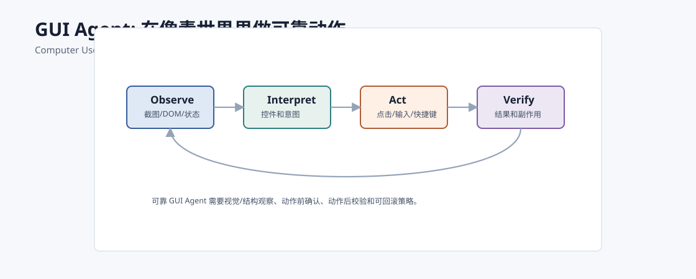
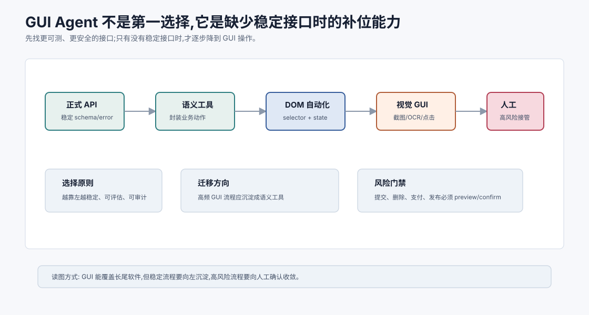
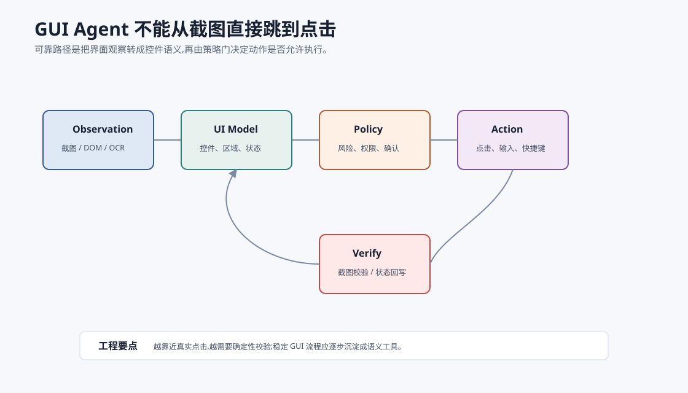
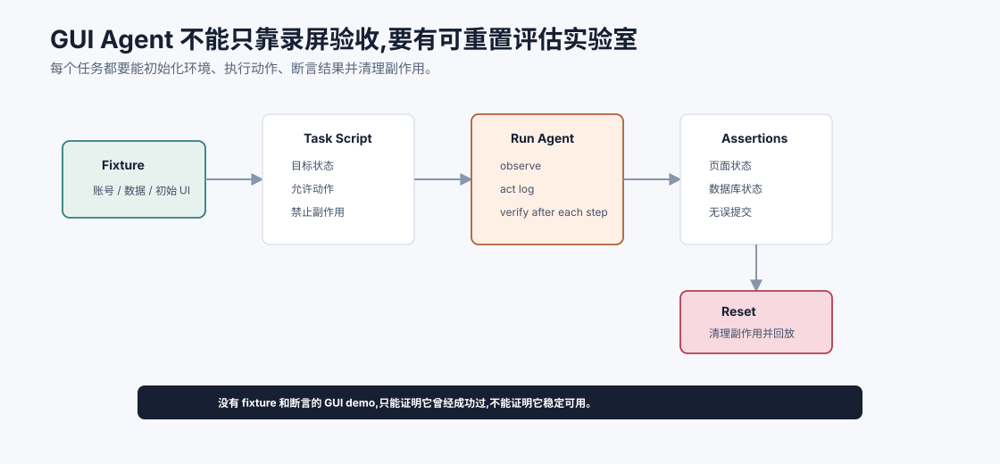
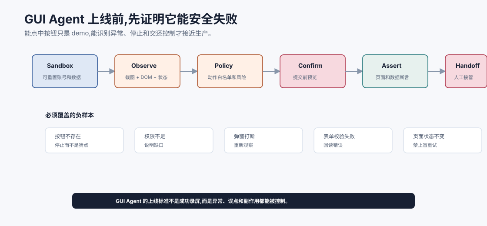
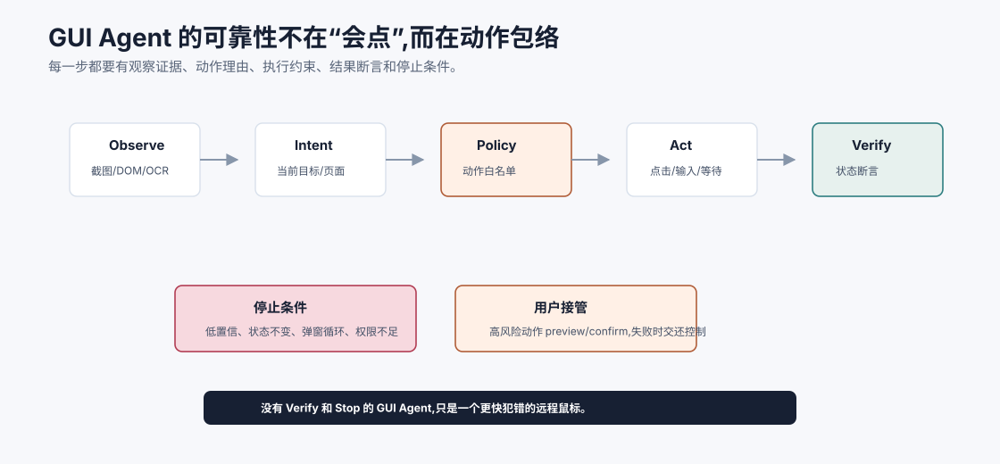

# 趋势:Computer Use 与 GUI Agent `[进阶]`

前面我们主要讨论 Agent 调用结构化工具:函数、API、数据库、检索系统。

但真实世界里,大量任务并没有干净 API。人类是在 GUI 中完成工作的:网页、桌面软件、表格、后台系统、设计工具、IDE。

Computer Use 和 GUI Agent 的目标是让模型像人一样观察屏幕、理解界面、点击、输入、等待反馈,从而操作那些没有标准 API 的软件。



本章会讲:

- GUI Agent 为什么重要。
- 它和 Function Calling 有什么不同。
- GUI 操作的核心难点。
- 安全和评估为什么更难。
- 未来可能的工程形态。

## 为什么 GUI Agent 重要

很多系统没有 API,或者 API 不开放、成本高、权限复杂。

但用户仍然希望 Agent 帮忙:

- 在网页后台填写表单。
- 从系统导出报表。
- 操作桌面软件。
- 在 IDE 中定位问题。
- 在浏览器中完成重复流程。

GUI Agent 可以把“人类可操作的软件”变成 Agent 可操作的环境。

## GUI 和 API 的区别

| 维度 | API Tool | GUI Agent |
| --- | --- | --- |
| 输入 | 结构化参数 | 屏幕、DOM、图像、文本 |
| 动作 | 函数调用 | 点击、输入、滚动、快捷键 |
| 反馈 | 结构化返回 | 视觉状态变化、提示、弹窗 |
| 稳定性 | 相对稳定 | UI 改版会影响操作 |
| 安全 | 权限可封装 | 容易误点和误提交 |
| 评估 | 看返回值 | 要看界面是否达到目标 |

GUI Agent 的难点是环境更模糊,反馈更弱。

## 先判断是否真的需要 GUI

GUI Agent 很有吸引力,因为它似乎能“操作任何软件”。但工程上应先问一个更朴素的问题:这件事有没有更稳定的接口?



可以按下面顺序选择:

| 选择 | 什么时候优先 | 为什么 |
| --- | --- | --- |
| 正式 API | 有稳定 API、权限和错误协议 | 最可测、最快、最容易控制副作用 |
| 语义工具 | 流程稳定但底层接口复杂 | 对 Agent 暴露业务动作,隐藏自动化细节 |
| Browser/DOM 自动化 | Web UI 稳定,可通过 selector 定位 | 比像素点击稳定,可记录 selector 和页面状态 |
| 视觉 GUI Agent | 没有 API,界面变化可接受,任务低到中风险 | 能覆盖长尾软件,但最难评估和治理 |
| 人类接管 | 高风险、不可逆、无测试环境 | 避免把自动化用在系统不支持的边界上 |

这不是保守,而是把 GUI Agent 放在正确位置。GUI 能补齐没有接口的世界,但不应该替代已经存在的可靠接口。

## 核心循环

GUI Agent 通常是:

```text
observe -> interpret -> plan -> act -> verify
```

### Observe

获取截图、DOM、OCR、可访问性树或应用状态。

### Interpret

识别按钮、输入框、表格、错误提示和当前页面含义。

### Plan

决定下一步操作。

### Act

执行鼠标、键盘或浏览器动作。

### Verify

检查动作是否成功,是否出现错误或副作用。

## 难点一:界面状态理解

GUI 不像 API 那样有明确 schema。

模型需要理解:

- 哪个按钮是提交。
- 哪个弹窗是警告。
- 表格里哪一行是目标对象。
- 当前是否登录。
- 页面是否加载完成。
- 操作是否成功。

视觉理解、DOM 解析和应用状态最好结合使用。只看截图容易漏隐藏状态,只看 DOM 可能漏视觉布局。

## 难点二:动作精度

点击错位置可能造成副作用。

解决方式:

- 优先使用可访问性树或 DOM selector。
- 点击前确认目标控件。
- 高风险按钮需要用户确认。
- 操作后截图校验。
- 支持撤销或回退。

GUI Agent 不应盲目连续点击。

## 分层架构

一个更可靠的 GUI Agent 不会直接从截图跳到点击。



可以分成四层:

| 层 | 作用 |
| --- | --- |
| Observation Layer | 获取截图、DOM、OCR、可访问性树、窗口状态 |
| UI Model Layer | 把界面解析成控件、区域、表格、状态和可行动作 |
| Policy Layer | 判断动作是否允许、是否需要确认、是否有副作用 |
| Action Layer | 执行点击、输入、快捷键,并记录动作结果 |

这样做的关键是把“看见什么”和“能做什么”分开。模型可以提出动作候选,但 Policy Layer 要决定是否允许执行。

例如模型说“点击提交”,系统还要检查:

- 当前页面是否真有目标按钮。
- 表单内容是否完整。
- 是否会产生外部副作用。
- 是否需要用户确认。
- 是否有回退方案。

这和工具调用里的 Validate 阶段完全一致。

## GUI Agent 的失败归因

GUI Agent 失败时,不要只说“模型没看懂”。要按层定位。

| 现象 | 更可能的层 | 典型修复 |
| --- | --- | --- |
| 看不到目标按钮 | Observation | 增加 DOM/accessibility tree,等待页面加载,滚动可见区域 |
| 认错按钮含义 | UI Model | 给控件语义、邻近标签、表单分组和禁用状态 |
| 点了不该点的按钮 | Policy | 高风险按钮 preview/confirm,动作白名单,禁止连续盲点 |
| 点了正确按钮但没成功 | Action/Verify | 检查焦点、坐标、延迟、弹窗和提交后状态 |
| 操作绕开业务规则 | Harness | 把规则放到运行时,不是放在提示词里 |

这张表背后的原则是:GUI Agent 不是“视觉模型 + 鼠标”。它是一个有观察、语义建模、策略判断和执行反馈的运行时系统。

## 从 GUI 到语义工具的迁移路径

可靠团队会把 GUI Agent 当成发现工具接口的过渡层。

第一阶段,让 Agent 使用浏览器或桌面控制完成任务,但每一步都记录截图、selector、动作和结果。

第二阶段,统计高频稳定流程。例如“登录后台 -> 选择日期 -> 导出 CSV -> 下载文件”。如果这个流程频繁出现,就不应该永远让 Agent 点击。

第三阶段,把稳定流程封装为语义工具。工具内部可以继续使用浏览器自动化,但对 Agent 暴露的是结构化接口和明确错误协议。

第四阶段,如果业务系统允许,把底层实现替换成正式 API。此时 Agent 不再关心网页布局,只关心业务动作。

所以 GUI Agent 的成熟方向不是“更会模仿人点鼠标”,而是“把 GUI 中隐含的业务能力逐步沉淀成可控工具”。

## GUI 操作应逐步工具化

GUI Agent 不应永远停留在像素点击。

如果某个 GUI 流程稳定重复,可以逐步沉淀:

```text
像素点击脚本 -> DOM selector 动作 -> 浏览器自动化函数 -> 业务语义工具
```

例如“导出最近 7 天销售报表”最开始可能由 Agent 点击网页完成。跑稳定后,应封装成:

```json
{
  "tool": "export_sales_report",
  "args": {"date_range": "last_7_days", "format": "csv"}
}
```

稳定流程工具化后,可评估性、安全和速度都会提升。GUI Agent 的长期价值之一,就是发现哪些人工流程值得产品化成工具。

## 难点三:长流程脆弱

GUI 流程可能因为弹窗、网络、布局变化而中断。

因此需要:

- 检查点。
- 超时。
- 错误识别。
- 状态恢复。
- 重新观察。
- 人类接管。

这和长时程 Agent 很像,只是反馈来自界面。

## 生产 GUI Agent 的三条红线

GUI Agent 最危险的不是失败,而是悄悄失败后继续执行。生产系统至少要守住三条红线。

第一,**不盲点**。每次点击前都要知道目标控件是什么、为什么点击、点击后预期状态是什么。如果模型只能给出“点右下角那个按钮”,但系统无法确认控件语义,就应该降级为人工确认。

第二,**不隐身执行高风险动作**。提交表单、发送消息、删除数据、支付、发布内容都应 preview/confirm。用户要能看见将要发生什么,而不是只在事后看到结果。

第三,**不无限重试**。连续点击失败、页面状态不变、错误弹窗重复出现时,系统应停止并交还控制。GUI 自动化里最糟糕的循环,往往是“没看懂 -> 又点一次”。

这三条红线可以写进 runtime,而不是只写在 prompt 里。

## 安全边界

GUI Agent 的安全尤其重要。

高风险动作包括:

- 提交表单。
- 发送消息。
- 删除数据。
- 支付或转账。
- 发布内容。
- 修改配置。

这些动作应有 preview 和确认。

不要让 Agent 在用户看不见的情况下执行不可逆操作。

## 评估

GUI Agent 评估很难。

要看:

- 是否完成任务。
- 是否点击正确控件。
- 是否避免副作用。
- 是否能处理中断。
- 是否能在无权限时停止。
- 成本和延迟。

评估环境需要可重置,否则一次误操作会污染下一次测试。



GUI Agent 的评估要像端到端测试,而不是像看演示。每条样本都应该有可初始化的账号、数据和页面状态,有明确任务脚本和禁止动作,有动作日志、截图或 DOM 快照,最后用断言检查页面状态、数据库状态和副作用。否则一次成功录屏只能说明“它曾经在那个页面上成功过”,不能说明系统稳定可用。

真正难测的是负样本。比如按钮不存在、用户无权限、弹窗打断、网络慢、表单校验失败、目标行不在当前页面。可靠 GUI Agent 必须在这些情况下停止、澄清或交还用户,而不是继续盲点。评估集如果只包含 happy path,会把最危险的失败藏起来。

## 未来形态

未来 GUI Agent 可能和 API Tool 结合:

- 有 API 的地方用 API。
- 没 API 的地方用 GUI。
- GUI 操作前后用截图校验。
- 高风险动作由用户确认。
- 常用 GUI 流程逐步封装成结构化工具。

最可靠的方向不是让 Agent 永远操作像素,而是把稳定流程沉淀成更好的工具接口。

## 何时不该用 GUI Agent

以下情况应优先避免 GUI Agent:

- 有稳定 API 可用。
- 动作高风险且无法 preview。
- UI 频繁变化且无法测试。
- 任务需要处理大量数据。
- 登录、验证码或安全策略不允许自动化。
- 无法构造可重置测试环境。

GUI Agent 是补足缺失 API 的能力,不是绕过系统边界的理由。



上图把 GUI Agent 的上线条件拆成一组门禁。第一步是可重置沙箱:账号、数据和页面状态必须能初始化,否则评估不可复现。第二步是观察融合:截图、DOM、OCR、可访问性树和页面状态最好同时进入观察层。第三步是动作策略:哪些动作允许、哪些动作需要确认、哪些动作禁止,必须由 runtime 执行。

真正的分水岭在负样本。按钮不存在、权限不足、弹窗打断、表单校验失败、页面状态不变时,系统应该停止、重新观察、请求确认或交还用户,而不是继续盲点。GUI Agent 的生产能力不是“成功点完一次流程”,而是“异常出现时不制造更大副作用”。

## GUI Agent 的上线清单

上线 GUI Agent 时,最容易被忽略的是“动作包络”。很多 demo 会展示模型能找到按钮、能填表、能点提交,但生产系统真正需要证明的是:每一步动作都被包在观察、意图、策略、执行、校验、停止和接管的边界里。



这张图可以当作上线 review 的最小 mental model。`Observe` 不是只截一张图,而是融合截图、DOM、OCR、可访问性树、窗口焦点和加载状态。`Intent` 要把当前动作和用户目标绑定起来,避免模型因为看见某个按钮就顺手点击。`Policy` 要在模型动作之外独立执行,检查白名单、风险等级、确认要求和当前 session 权限。`Act` 要优先使用稳定 selector 或可访问性节点,坐标点击只能作为最后手段。`Verify` 要检查页面状态、下载文件、后端记录或业务断言是否真的符合预期。

更关键的是 `Stop` 和 `Handoff`。如果页面状态不变、同一错误重复、目标控件不可确认、权限不足、出现高风险确认页,系统应该停止并把上下文交还给人,而不是继续尝试。GUI Agent 的可靠性不是“模型越来越敢点”,而是“系统越来越知道什么时候不该点”。

上线前可以用下面清单检查:

| 检查项 | 最小要求 |
| --- | --- |
| 环境 | 每条评估样本可重置,不会污染下一条 |
| 观察 | 每步保存截图或 DOM 快照,能回放失败 |
| 动作 | 点击目标有控件语义,不是裸坐标猜测 |
| 确认 | 提交、删除、发送、支付等动作必须 preview/confirm |
| 断言 | 动作后用页面状态或后端状态验证结果 |
| 接管 | 连续失败、低置信或高风险时交还人类 |

如果这些条件做不到,GUI Agent 仍可以作为内部助手或探索工具,但不应该接入真实高风险流程。GUI 自动化的成熟方向,是把稳定路径逐步沉淀成语义工具,而不是永远提高像素点击的胆量。

## 本章小结

Computer Use 和 GUI Agent 让 Agent 能操作没有标准 API 的软件。它的核心循环是观察、理解、计划、动作和校验。相比 API 工具,GUI 更脆弱、更难评估、更容易产生副作用。因此可靠 GUI Agent 需要多模态观察、动作前确认、动作后校验、状态恢复和人类接管。长期看,GUI Agent 会和结构化工具共存:探索期用 GUI,稳定期沉淀为语义工具,高价值流程最终回到 API 或正式自动化接口。
