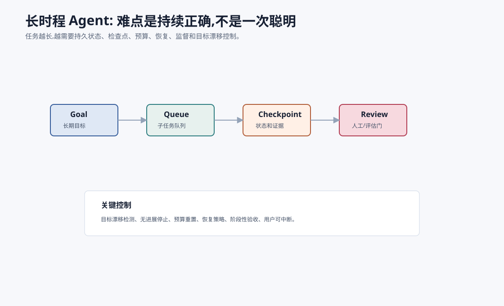
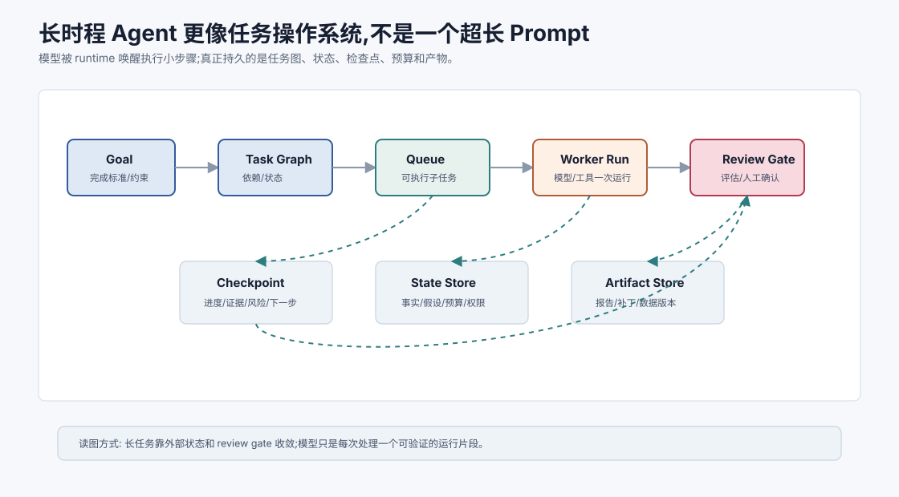
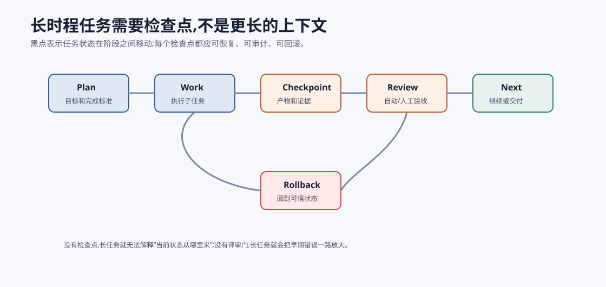
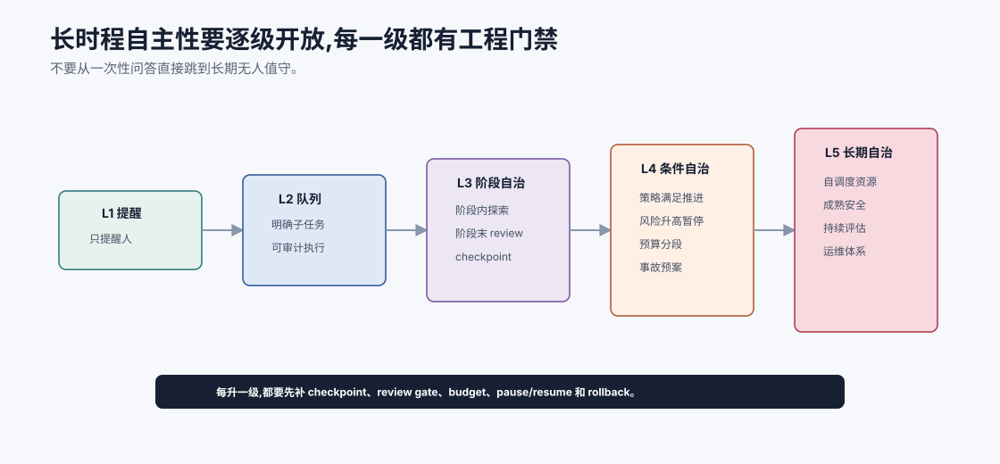

# 趋势:长时程自主任务 `[进阶]`

短任务中,Agent 可以在几轮内完成目标。

长时程任务则不同。它可能持续数小时、数天甚至数周:

- 持续跟踪某个研究方向。
- 自动排查一类线上问题。
- 分阶段完成产品调研。
- 维护一个知识库。
- 跟进多个外部系统的变化。

长时程 Agent 的难点不是“会不会推理”,而是**能否持续保持目标、状态、质量和安全边界**。



## 长任务和短任务的本质区别

| 维度 | 短任务 | 长时程任务 |
| --- | --- | --- |
| 状态 | 上下文内即可 | 需要持久状态 |
| 错误 | 影响有限 | 会累积和放大 |
| 目标 | 相对稳定 | 容易漂移 |
| 评估 | 结束时评估 | 阶段性检查 |
| 安全 | 单次动作控制 | 持续权限和预算 |
| 用户 | 等待结果 | 需要中断和监督 |

长时程任务需要任务操作系统,不是一个长 prompt。

## 运行时模型

长时程 Agent 可以看成一个带持久状态的任务运行时:

```text
Goal -> Task Graph -> Work Queue -> Worker Runs -> Checkpoints -> Review Gates -> Final Artifact
```



关键对象包括:

| 对象 | 作用 |
| --- | --- |
| Goal | 长期目标和完成标准 |
| Task Graph | 子任务、依赖和状态 |
| Work Queue | 可执行任务队列 |
| Checkpoint | 阶段产物、证据和决策 |
| Review Gate | 自动评估或人工确认点 |
| Artifact Store | 保存中间产物和最终产物 |

这个模型把长任务从“一个 Agent 一直想”变成“一个系统持续调度和验收”。

一个容易忽略的点是:长任务里真正持久运行的不是模型,而是任务状态。模型只是被 runtime 一次次唤醒,读取当前状态,完成一个可验收的小步骤,再把结果写回系统。

## 持久状态

长任务必须把状态存在外部。

包括:

- 长期目标。
- 当前子任务队列。
- 已完成工作。
- 已否定假设。
- 关键证据。
- 决策记录。
- 待用户确认项。
- 预算消耗。

不要依赖模型上下文记住几天前发生了什么。

## 状态腐败比单次错误更危险

短任务里,一次错误可能只影响当前回答。长任务里,错误如果写进状态,会污染后续所有步骤。

常见状态腐败包括:

- 把未验证假设写成 accepted fact。
- 把过期证据继续当成有效证据。
- 把用户临时偏好写成永久记忆。
- 把失败工具调用误记为已完成任务。
- 把一次低置信判断升级成后续计划的前提。

因此长时程 Agent 的状态更新要有类型和审计。

| 状态类型 | 写入要求 | 过期/回滚 |
| --- | --- | --- |
| accepted facts | 需要证据或用户确认 | 证据变更时重新验证 |
| hypotheses | 必须标注未验证 | 被反证后删除或降权 |
| decisions | 记录原因、时间和责任方 | 目标变化时复审 |
| artifacts | 版本化保存 | 可回滚到旧版本 |
| user preferences | 标注 scope | 支持查看、修改和删除 |

长任务不是记得越多越好,而是每条状态都知道自己从哪里来、能用到什么时候、谁可以改。

## 检查点

长任务要有 checkpoint。



checkpoint 记录:

- 当前进度。
- 产物。
- 风险。
- 下一步。
- 是否需要用户确认。

checkpoint 让任务可以暂停、恢复、回滚和审计。

一个好的 checkpoint 不是“当前聊到哪了”的摘要,而是可恢复的系统状态。至少应该包含:

| 字段 | 为什么重要 |
| --- | --- |
| `goal_version` | 目标是否被用户或系统变更过 |
| `accepted_facts` | 已验证事实,避免后续重新争论 |
| `open_questions` | 尚未解决的问题,避免假装完成 |
| `artifacts` | 已生成产物和版本 |
| `decisions` | 为什么选择当前路径 |
| `risk_state` | 当前权限、敏感动作和确认状态 |
| `budget_state` | 已消耗和剩余预算 |
| `resume_action` | 恢复时从哪一步继续 |

如果 checkpoint 只有自然语言总结,系统仍然很难恢复。长时程 Agent 需要机器可读状态和人类可读说明同时存在。

## 目标漂移

任务越长,越容易偏离原目标。

防止目标漂移的方法:

- 明确目标和完成标准。
- 每阶段对照目标。
- 记录目标变更。
- 高影响变更请求用户确认。
- Critic 检查是否偏题。

## 无进展检测

长任务可能陷入循环。

例如反复搜索、反复修正、反复运行失败工具。

系统应检测:

- 同一错误重复出现。
- 新证据没有增加。
- 子任务长期未完成。
- 成本持续增加但分数不变。
- 计划频繁重写但没有执行。

无进展时应停止、总结当前状态并请求用户或人工介入。

## 人类监督

长时程任务不等于无人值守。

合理的人类监督点:

- 目标确认。
- 阶段 checkpoint。
- 高风险动作。
- 预算超限。
- 低置信结论。
- 任务方向变化。

人类监督应是结构化的,让用户能快速判断是否继续。

## 长时程任务的安全问题

长任务会让风险累积。

例如:

- 一开始授权的目标后来被逐渐扩大。
- 多次小动作组合成高风险副作用。
- 旧证据过期但仍被使用。
- 预算消耗失控。
- Agent 在用户离线时执行敏感动作。

因此长任务需要更强控制:

- 权限按阶段授予。
- 高风险动作永远需要确认。
- 定期重新确认目标。
- 预算和时间窗口明确。
- 每个 checkpoint 可审计。
- 用户可随时暂停和撤销。

长时程自主不是长期放任。

## 触发式运行,而不是一直运行

很多长时程任务不需要 Agent 真的持续在线思考。更稳定的方式是事件触发:

- 到达计划时间。
- 新文档进入知识库。
- 外部系统出现告警。
- 用户回复确认。
- 子任务依赖完成。
- 预算或风险阈值变化。

事件触发的好处是可审计、可预算、可暂停。每次唤醒都应该有明确 trigger、输入状态、预期产物和停止条件。这样长任务更像可靠后台作业,而不是一个永远醒着的聊天模型。

## 评估

长任务评估要看阶段性指标:

- 子任务完成率。
- checkpoint 质量。
- 目标一致性。
- 失败恢复率。
- 人类接管率。
- 成本和时间。
- 最终产物质量。

只评最终结果会漏掉过程风险。

## 长时程 Agent 的落地分级

长时程自主性不要一步到位。可以按五级推进:

| 等级 | 形态 | 适合场景 |
| --- | --- | --- |
| L1 定时提醒 | Agent 只提醒人做下一步 | 低风险跟进、研究订阅 |
| L2 队列执行 | Agent 执行明确子任务,每步可审计 | 报告收集、工单分类 |
| L3 阶段自治 | Agent 在阶段内自主探索,阶段末 review | 调研、排错、代码修复 |
| L4 条件自治 | 满足策略时自动推进,风险升高时暂停 | 监控、数据质量巡检 |
| L5 长期自治 | 长期运行并能自我调度资源 | 需要成熟安全、评估和运维体系 |

大多数团队应先做到 L2/L3。L5 听起来诱人,但如果没有 checkpoint、budget、review gate 和事故响应,它只是在更长时间尺度上放大错误。



长时程自主性应该按门禁逐级开放。L1 只是提醒人,L2 执行明确子任务,L3 在阶段内自治但阶段末 review,L4 根据策略自动推进但风险升高即暂停,L5 才是长期自治。每升一级,都要补对应的 checkpoint、预算、权限、review gate、暂停恢复、回滚和事故响应。

这个分级能避免一个常见误判:把“能连续跑很多步”当成“能长期自治”。连续执行只是长度,自治是权力。权力越大,越需要状态治理和责任边界。没有这些控制面,L5 不是前沿,只是更难复盘的后台进程。

## 设计检查清单

做长时程 Agent 前,至少回答这些问题:

| 问题 | 不清楚时的风险 |
| --- | --- |
| 目标完成标准是什么? | Agent 可能无限优化或过早结束 |
| 状态存在哪里,谁能修改? | 中断后无法恢复,或模型把猜测写成事实 |
| 多久 checkpoint 一次? | 错误发现太晚,无法回滚 |
| 哪些动作需要 review gate? | 长期权限逐渐扩大 |
| 预算如何随阶段分配? | 早期探索耗尽全部资源 |
| 用户如何暂停、恢复和撤销? | 长任务变成不可控后台进程 |
| 证据多久过期? | 旧事实污染新决策 |

这些问题比“用哪个模型”更早出现。模型越强,越应该先把运行边界讲清楚。

## 本章小结

长时程 Agent 的核心挑战是持久状态、检查点、目标漂移、无进展检测、预算控制和人类监督。它不是把上下文窗口拉长就能解决的任务。可靠长任务需要外部任务状态、阶段性评估、可恢复流程和明确停止条件。未来长时程 Agent 会更像任务操作系统:它调度子任务、保存检查点、执行 review gate、控制预算和权限,而不是让一个模型在长 prompt 里一直“记住所有事”。
