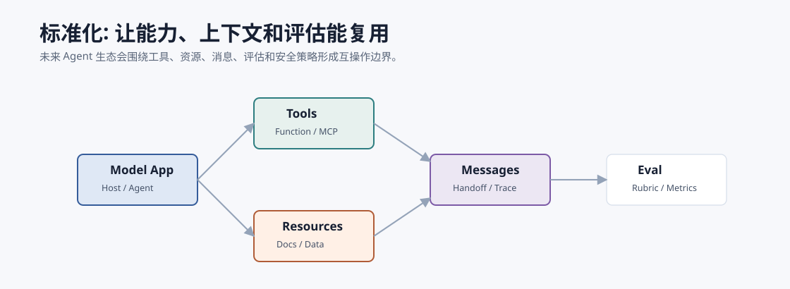
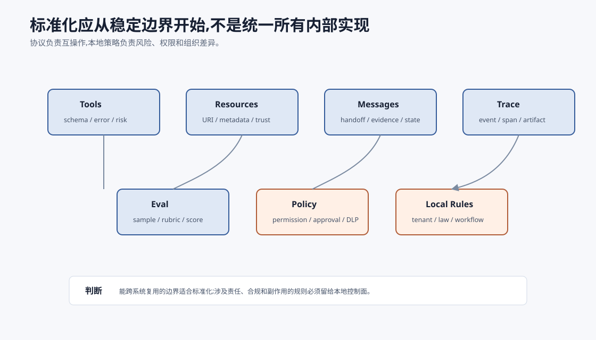

# 趋势:标准化与互操作 `[进阶]`

Agent 生态越复杂,越需要标准化。

如果每个模型应用、工具、资源、消息、评估器和安全策略都用私有格式,系统会难以复用、迁移和审计。

标准化的目标不是让所有系统变成一个样子,而是让边界更清楚:

**工具如何描述,资源如何读取,消息如何传递,评估如何比较,安全策略如何执行。**



## 哪些东西需要标准化

### 工具协议

工具名称、描述、输入 schema、输出结构、错误类型和副作用标注。

### 资源协议

文件、文档、数据库 schema、日志等上下文如何被发现、读取和标注来源。

### 消息协议

Agent 之间如何 handoff,如何传递证据、状态、错误和 trace。

### 评估协议

样本、rubric、Judge 输出、指标和回归报告如何表示。

### 安全策略

权限、数据分类、工具风险、确认要求如何被系统执行。

## MCP 的位置

MCP 是标准化趋势中的一个重要方向,它关注模型应用如何连接外部工具、资源和提示能力。

但标准化不止 MCP。

一个完整 Agent 系统还需要:

- 内部状态协议。
- 多 Agent 消息协议。
- 评估数据格式。
- trace 结构。
- 策略和权限模型。

## 互操作的价值

标准化带来:

- 工具可复用。
- Host 可替换。
- 评估可比较。
- trace 可分析。
- 安全策略可审计。
- 多 Agent 可组合。

例如同一个文档搜索 Server 可以被 IDE、桌面助手和研究助手复用。

## 标准化的风险

标准也可能带来问题:

- 过早标准化限制创新。
- 抽象太厚导致能力损失。
- 协议支持最低公共能力。
- 安全假设不一致。
- 厂商扩展造成碎片化。

因此标准化应从稳定边界开始,例如工具 schema、资源 URI、trace 和评估格式。

## 工程判断

是否采用某个标准,可以问:

- 是否有多个 Host 或工具需要互操作?
- 是否能减少集成成本?
- 是否能表达安全和权限?
- 是否有足够生态支持?
- 是否会限制关键能力?
- 是否便于调试和评估?

不要为了“标准”而标准。标准的价值在复用和边界。

## 哪些边界最值得先标准化

从工程收益看,最值得先标准化的是稳定、重复、跨系统的边界。



### Tool schema

工具名称、参数、错误、返回、风险等级和副作用。

### Resource metadata

资源 URI、来源、更新时间、权限、信任级别和内容类型。

### Trace event

模型调用、工具调用、状态更新、策略决策和 artifact 引用。

### Eval sample

输入、期望行为、标签、评分器、失败归因。

这些标准化能直接提升调试、复用和评估。相比之下,“统一所有 Agent 内部思考格式”更难,也不一定值得。

## 标准化不是把业务规则搬进协议

一个常见误区是:看到标准化,就想把所有业务语义都统一掉。

这通常会失败。

例如 `send_message` 可以标准化输入字段:

```json
{
  "channel": "slack",
  "target": "C123",
  "text": "...",
  "idempotency_key": "..."
}
```

但它不能统一所有组织的真实策略:

- 哪些频道允许机器人发消息。
- 是否允许向外部用户发送。
- 是否需要审批。
- 文本里是否包含敏感数据。
- 发送失败后是否重试。

协议负责表达动作和结果,本地策略负责判断动作是否允许。把二者混在一起,标准会变得过重;完全分离又会让安全假设不清。好的协议应提供策略挂钩,例如风险等级、身份、scope、数据分类、confirmation requirement 和 audit id。

## 版本和能力发现

Agent 标准化必须考虑版本。工具和资源不是静态的。

一个可用协议至少要支持:

- capability discovery:Host 知道 Server 支持哪些工具、资源和事件。
- version negotiation:客户端和服务端知道彼此支持的 schema 版本。
- graceful degradation:不支持某能力时能降级,而不是静默失败。
- extension fields:允许实现特定字段,但不能破坏基础兼容。
- deprecation policy:旧工具和旧字段如何下线。

没有这些机制,标准越普及,升级越痛苦。

## 标准化的成熟度模型

可以把 Agent 互操作分成四级。

| 等级 | 能力 | 典型问题 |
| --- | --- | --- |
| L1 格式统一 | 工具输入输出有 schema | 仍缺权限、错误和 trace |
| L2 能力发现 | Host 能发现工具、资源和提示 | 不同实现语义仍不一致 |
| L3 策略可接入 | 协议携带身份、scope、风险和确认点 | 策略需要本地解释 |
| L4 可评估互操作 | trace、eval sample、artifact 都可跨系统分析 | 需要生态共识和工具链 |

很多系统现在停在 L1/L2。真正的生产互操作要走向 L3/L4,否则工具虽然能调用,但不能可靠治理。

## 采用标准前的检查清单

| 问题 | 判断 |
| --- | --- |
| 是否有多个 Host 或客户端要接同一能力? | 没有则内部接口可能更简单 |
| 协议是否表达错误和副作用? | 只表达 happy path 不够生产化 |
| 是否能携带身份、scope 和权限信息? | 不能则安全策略会散落在胶水代码里 |
| 是否支持 trace 和 artifact 引用? | 不能则评估和调试会断链 |
| 是否有版本协商和降级? | 没有则升级成本会很高 |
| 标准是否限制关键能力? | 如果限制核心差异,不要勉强采用 |

标准的价值来自复用和边界清晰。如果一个标准让系统更难解释、更难审计、更难表达本地策略,就要谨慎。

## 标准化和抽象泄漏

标准不可能覆盖所有细节。

例如一个工具协议可以描述 `send_email`,但不同组织对外部收件人、附件、敏感数据和审批的策略完全不同。标准提供接口,本地策略仍然要存在。

所以设计标准时要允许:

- 能力扩展。
- 策略挂钩。
- 版本协商。
- 权限声明。
- 实现特定元数据。

互操作不是消灭差异,而是让差异有明确位置。

## 本章小结

Agent 生态会越来越需要标准化和互操作。工具、资源、消息、评估和安全策略都需要清晰协议。MCP 是外部能力接入的重要方向,但不是全部。好的标准化应从稳定边界开始,提升复用、审计和评估能力,同时保留本地策略、版本协商和扩展空间。标准不是替你做安全和业务判断,而是让这些判断有清楚的位置。
