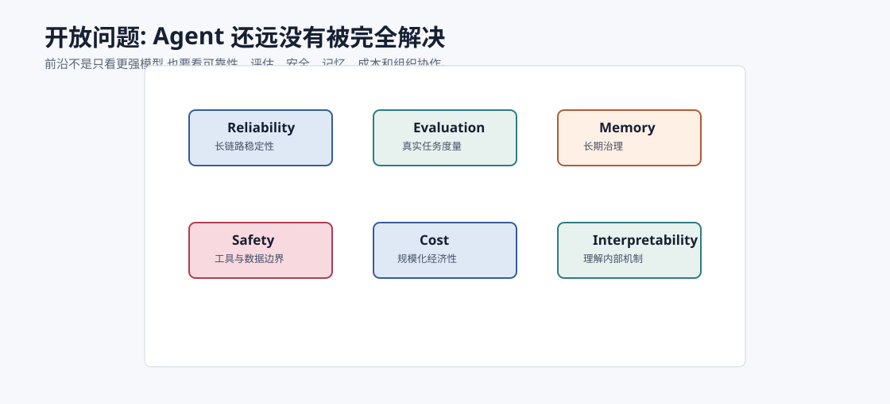
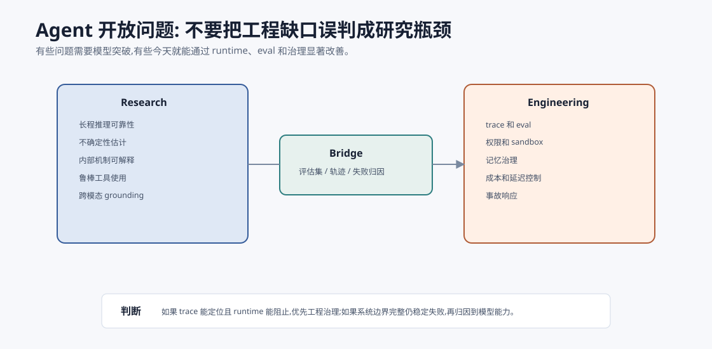

# 开放问题与局限 `[进阶]`

AI Agent 很有前景,但远没有完全解决。

如果只看演示,Agent 似乎已经能做很多事。但一旦进入真实任务,问题会立刻出现:不稳定、难评估、成本高、上下文污染、工具误用、长期记忆错误、安全边界脆弱。

这一章不是泼冷水,而是帮助你建立清醒判断。

## 可靠性

Agent 的长链路会放大错误。

一次任务可能包含:

- 计划。
- 检索。
- 工具调用。
- 观察解释。
- 状态更新。
- 生成。
- 校验。

每一步 95% 准确,10 步串起来也可能明显不稳。

可靠性不是单点模型能力,而是系统级问题。

## 研究问题和工程问题要分开

Agent 的开放问题有两类。

### 研究问题

需要模型和算法突破:

- 更可靠的长程推理。
- 更强的因果理解。
- 更好的不确定性估计。
- 更可解释的内部机制。
- 更鲁棒的工具使用能力。

### 工程问题

需要系统设计和产品实践:

- trace 和 eval。
- 权限和护栏。
- 数据治理。
- 成本控制。
- 人机交互。
- 事故响应。

很多失败不是因为缺少下一代模型,而是因为当前工程边界没做好。反过来,有些问题确实需要模型能力进步。区分二者,能避免把所有希望都押在模型升级上。

一个实用判断是:

| 失败现象 | 先看工程 | 再看研究 |
| --- | --- | --- |
| 工具越权执行 | 权限、策略、Harness | 模型是否更会拒绝 |
| 引用不存在 | evidence id 校验、RAG trace | 模型事实性 |
| 长任务空转 | 进展检测、停止条件 | 长程规划能力 |
| 忘记用户偏好 | 记忆 scope、更新和删除 | 个性化学习 |
| 误解复杂界面 | DOM/可访问性树、状态建模 | 多模态理解 |
| 不知道自己不确定 | 置信度协议、eval gate | 不确定性估计 |

如果工程层能明确拦住或观测问题,就先补工程。只有当输入、状态、工具和评估都清楚后仍然失败,才更像模型能力边界。

## 评估困难

很多 Agent 任务没有唯一标准答案。

真实任务还涉及过程质量、安全、成本和用户满意度。

评估难点:

- 样本代表性不足。
- Judge 偏差。
- 线上分布变化。
- 工具和知识源变化。
- 长任务难复现。

评估会长期是 Agent 工程的核心瓶颈。

## 长期记忆治理

长期记忆听起来像智能,但很难治理。

开放问题:

- 什么值得记住?
- 如何避免隐私风险?
- 如何处理过期和冲突?
- 如何解释某次行为受哪条记忆影响?
- 如何真正删除记忆?

记忆不是越多越好,而是越可控越好。

## 安全和权限

Agent 能调用工具后,安全边界更复杂。

开放问题:

- Prompt Injection 如何系统性防御?
- 多 Agent 数据流如何控制?
- 高风险动作如何平衡自动化和确认?
- 模型误判时 runtime 如何兜底?
- 如何证明系统满足安全要求?

这不是单靠模型训练能解决的问题。

## 成本和延迟

复杂 Agent 可能需要多轮模型调用、检索、rerank、工具等待和 Judge。

开放问题:

- 如何在质量和成本之间找 Pareto 最优?
- 如何动态路由模型?
- 如何减少无效步骤?
- 长任务如何控制预算?

真正大规模使用时,成本和延迟会决定产品形态。

## 可解释性

现在 Agent 的可解释性更多来自 trace 和证据链,而不是模型内部机制。

开放问题:

- 模型为什么选择某个工具?
- 为什么忽略某条证据?
- 哪个内部特征导致错误判断?
- 如何区分模型理解和模式匹配?

可解释性会影响安全、调试和信任。

## 人机协作

Agent 不是简单替代人。

很多场景更适合人机协作:

- Agent 做检索和草稿。
- 人做判断和授权。
- Agent 做监控和提醒。
- 人处理异常和责任。

开放问题是如何设计交互,让人类不过度负担,也不失去关键控制。

## 组织和责任边界

Agent 进入真实业务后,还有一个常被低估的问题:责任归属。

当 Agent 自动完成任务时,团队必须回答:

- 谁批准了工具权限?
- 谁负责评估集和上线门禁?
- 谁处理错误执行后的回滚?
- 谁决定长期记忆的保留和删除?
- 谁对外部消息或客户结果负责?
- 谁审计 prompt、工具、skills 和配置变更?

这些不是纯技术问题,但会反过来决定技术架构。没有责任边界的系统,最后会把所有风险推给“模型不可控”。成熟团队会把 Agent 当作有权限的软件系统治理,而不是把它当成一个会说话的助手随便接到生产。

## 不要把开放问题包装成路线图承诺

前沿领域很容易把“可能”写成“马上”。更稳妥的表达是按证据分层:

| 说法 | 应该需要的证据 |
| --- | --- |
| 能在 demo 中完成 | 单个案例和录屏 |
| 能在评估集上稳定 | 可复现 benchmark 和失败分析 |
| 能在生产低风险场景使用 | 监控、回滚、权限和用户反馈 |
| 能在高风险场景自动执行 | 审计、安全评估、合规和事故响应 |

读前沿论文、产品发布和开源项目时,要先问它处在哪一层。很多争论来自把 demo 能力误当成生产能力。

## 给团队的优先级建议

如果你已经有一个 Agent 原型,优先级通常不是“立刻换更强模型”,而是:

1. 先补 trace,让失败可见。
2. 再补 eval set,让改动可比较。
3. 再补 Harness,让危险动作可控。
4. 再补 Context/RAG 质量,让事实可追溯。
5. 再优化成本和延迟,让系统可持续。
6. 最后再考虑更强模型、微调或更复杂多 Agent。

这个顺序不是绝对的,但它避免一种常见浪费:在看不见失败、不能复现失败、没有评估标准时,反复换模型和改 prompt。

## 能力边界会动态变化

Agent 的边界不是固定的。

模型变强、工具变好、标准更成熟后,昨天不可靠的任务可能变得可用。但这不意味着所有边界自动消失。

每次能力升级都要重新评估:

- 哪些任务可以自动化程度提高?
- 哪些风险仍需人工确认?
- eval 是否覆盖新能力?
- 成本是否下降到可接受?
- 安全策略是否仍有效?

前沿判断要跟随证据更新,而不是跟随热度更新。

## 本章小结

Agent 的开放问题集中在可靠性、评估、长期记忆、安全、成本、可解释性、人机协作和责任边界。前沿不只是更强模型,也包括更好的系统边界、评估方法、工具协议、安全策略和交互设计。清醒认识局限,不是降低想象力,而是把想象力放到能验证、能审计、能承担后果的系统里。
