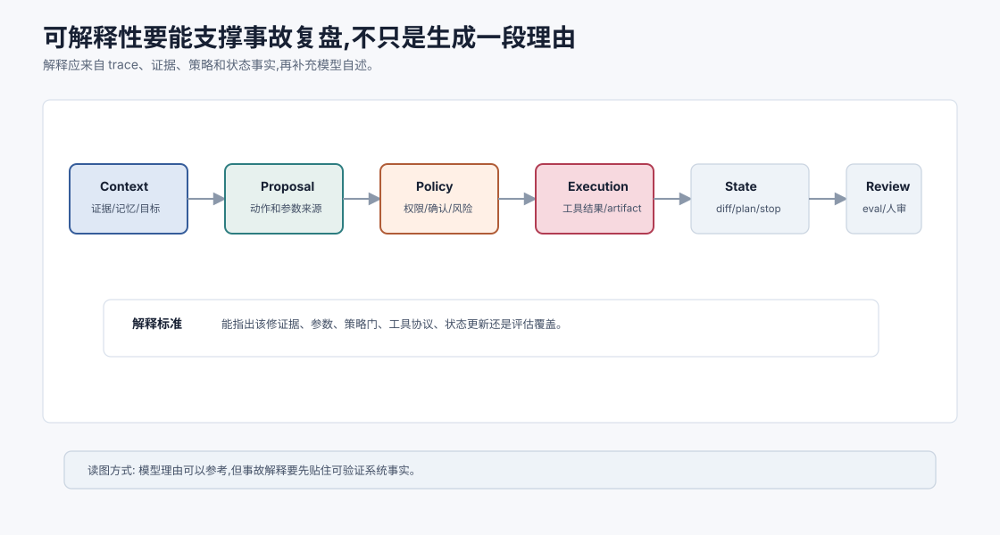
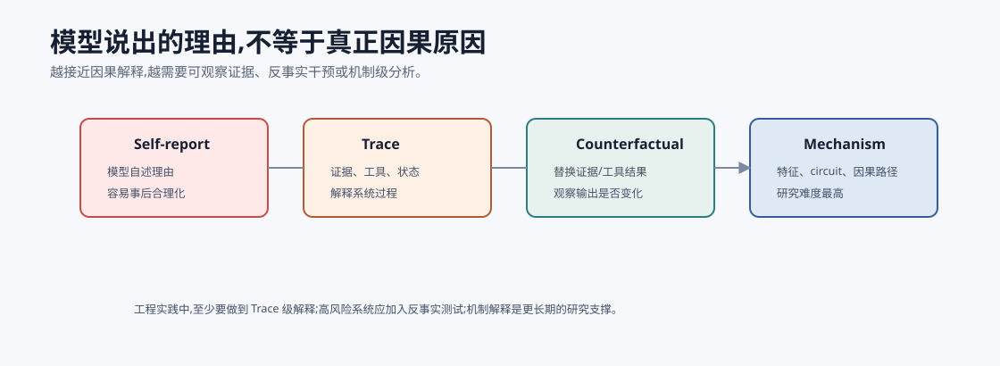
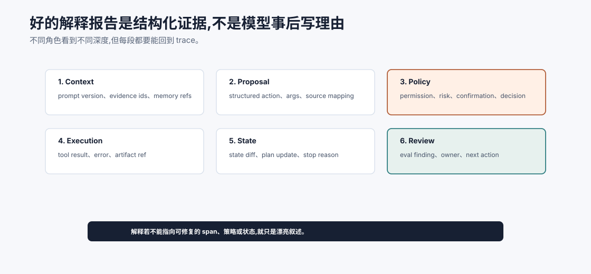

# 大模型可解释性 `[进阶]`

可解释性是理解大模型和 Agent 的重要方向。

但“解释”这个词有很多层含义。

有时我们说解释,指的是模型输出一段理由。有时指 trace 中的证据链。有时指理解模型内部哪些特征和线路导致某个行为。

这些不是一回事。


## 行为解释

最外层是行为解释。

例如:

```text
模型为什么给出这个答案?
```

可以通过:

- 引用证据。
- 展示工具 trace。
- 展示计划和观察。
- 展示评审结果。

对 Agent 工程来说,这层最实用。

## 过程解释

Agent 的过程解释包括:

- 为什么调用某个工具。
- 参数来源是什么。
- 哪条证据支持哪个结论。
- 哪个护栏放行或拦截。
- 哪次状态更新改变了路径。

这来自系统 trace,不一定来自模型内部。

## 模型内部解释

更深层是理解模型内部:

- 表示空间。
- 注意力模式。
- 特征。
- circuit。
- 因果机制。

这类研究希望回答:模型内部如何表示事实、语法、推理步骤、拒绝行为或工具使用倾向。

## 为什么重要

可解释性可能帮助:

- 发现模型偏差。
- 理解幻觉机制。
- 定位安全风险。
- 改进模型编辑。
- 建立更可靠评估。
- 解释关键决策。

但目前可解释性仍是开放研究方向,不能夸大短期能力。

## 对 Agent 工程的现实意义

短期内,Agent 工程最实用的可解释性是:

- trace。
- evidence pack。
- tool event log。
- state diff。
- guardrail decision。
- eval failure attribution。

这些不能解释模型内部每个神经元,但能解释系统为什么这么做。

## 一次 Agent 事故应该如何解释

真正的可解释性要经得起事故复盘。假设 Agent 发出了一封不该发的邮件,一个好解释不能只说“模型判断需要通知用户”。它要能沿链路回答:



| 环节 | 要解释什么 |
| --- | --- |
| Context | 模型当时看到了哪些用户目标、证据、记忆和工具结果 |
| Proposal | 模型提出了什么动作,参数从哪里来 |
| Policy | runtime 为什么允许或拒绝,是否需要确认 |
| Execution | 工具实际执行了什么,返回了什么 artifact |
| State | 哪些状态被更新,影响了后续哪一步 |
| Review | 哪个评估或人工环节应该发现问题 |

这类解释不依赖模型自述,而依赖系统事实。它能让团队修复具体缺口:是证据污染、参数来源错误、策略门太松、确认缺失,还是评估没有覆盖。

## 解释的三个用途

解释不只是为了“看懂”。不同用途需要不同解释。

| 用途 | 需要的解释 |
| --- | --- |
| 调试 | 哪个 span、证据、工具或状态导致错误 |
| 审计 | 谁在何时基于什么依据执行了什么动作 |
| 科学理解 | 模型内部如何表示和计算某种能力 |

Agent 工程日常最需要前两者。机制可解释性更接近研究前沿,它可能长期改善安全和模型设计,但短期不能替代 trace 和审计。

## 模型理由不等于因果原因

让模型回答“我为什么这么做”很有用,但要谨慎。



模型生成的理由可能:

- 遗漏真实影响因素。
- 事后合理化。
- 受 prompt 诱导。
- 听起来合理但无法验证。

因此 Agent 的解释应优先基于可观察事实:

- 它看到了哪些证据。
- 调用了哪些工具。
- 工具返回了什么。
- 哪条策略放行。
- 哪个 state 字段改变。

模型自述可以作为补充,不能作为唯一解释。

## Agent 可解释性的最小数据结构

如果你做的是 Agent 产品,最先要实现的不是神经元级解释,而是过程级解释。一个可解释 trace 至少应该回答五个问题:

| 问题 | 需要记录 |
| --- | --- |
| 它看见了什么? | prompt version、context summary、evidence ids、memory refs |
| 它建议了什么? | structured action、tool name、arguments、risk level |
| 系统为什么允许? | schema validation、permission check、policy decision、confirmation |
| 世界返回了什么? | observation、tool result、error type、artifact ref |
| 下一轮为什么改变? | state diff、plan update、progress marker、stop reason |

这套数据结构不解释模型内部每个激活值,但能解释系统行为。生产事故里,你通常先需要知道“为什么发了这封邮件”“为什么用了这条证据”“为什么忽略工具错误”,而不是先看注意力头。

## 什么时候需要更深的机制解释

机制可解释性更适合回答另一类问题:

- 模型为什么系统性偏向某种错误模式?
- 某个安全行为是否由稳定特征触发?
- 模型内部是否有可定位的事实、拒绝或工具使用 circuit?
- 微调是否改变了某类内部表示?
- 能否通过编辑或稀疏特征分析降低特定风险?

这些问题重要,但成本高、研究不确定性强,通常不是产品上线前能快速补齐的工程依赖。现实路线是:短期用 trace 和评估保证系统可解释;长期关注机制研究,把它转化为更好的模型、监控和安全方法。

## 解释质量也要评估

解释本身会出错,所以也要评估。

可以检查:

- faithful:解释是否和真实 trace 一致。
- complete:是否覆盖关键证据和工具。
- actionable:工程师能否据此修复问题。
- concise:是否足够短,不会淹没关键信息。
- uncertainty-aware:是否标注不确定和缺口。
- privacy-safe:是否避免泄露敏感上下文。

一个很长、很流畅的“理由”如果不能定位错误,就不是好解释。对 Agent 来说,解释的第一价值是让失败可复盘、可修复、可追责。

可以把解释也做成回归样本。给定同一条失败 trace,新版本系统生成的解释应该更准确地指出失败层,而不是更会写漂亮总结。解释如果和 trace 冲突,应以 trace 为准。

解释还要避免泄露。审计人员可能需要完整上下文,普通用户可能只需要“哪些资料支持这个结论”。不同角色看到的解释深度应该不同。



一个可用的解释报告可以按六段组织:Context 说明模型当时看到了什么;Proposal 说明模型建议了什么动作和参数来源;Policy 说明 runtime 为什么允许、拒绝或要求确认;Execution 说明工具实际做了什么;State 说明哪些状态被更新;Review 说明哪个评估、人工或事故流程应该发现问题。

这份报告不需要暴露所有敏感原文,但必须能回到 trace。用户视角可能只看到证据和结果,工程师视角需要 span、artifact 和 state diff,审计视角需要策略、确认和责任边界。解释不是一个统一长文本,而是按角色裁剪的结构化证据。

## 可解释性落地顺序

建议按这个顺序建设:

1. 先记录完整 trace:模型输入输出、工具、状态、成本、错误。
2. 再做 evidence mapping:每个关键结论对应哪些证据。
3. 再做 decision log:高风险动作为什么被允许或拒绝。
4. 再做 failure attribution:把失败归因到 prompt/context/harness/loop/tool/model。
5. 最后再关注机制解释研究如何改善模型和安全。

这条路线很朴素,但对真实团队最有效。它把“解释”从漂亮叙述变成可调试数据。

## 常见误解

### 误解一:让模型写理由就是可解释

不完全。模型写的理由可能是事后合理化。

### 误解二:注意力图能完整解释模型

注意力有参考价值,但不能等同于因果解释。

### 误解三:有 trace 就理解了模型内部

Trace 解释系统过程,不解释参数内部机制。

### 误解四:可解释性短期能解决所有安全问题

不能。安全仍需要权限、护栏和评估。

## 本章小结

可解释性有多层:行为解释、过程解释、表示和机制解释。对当前 Agent 工程来说,最实用的是系统级解释:trace、证据链、工具日志、状态变化和护栏决策。模型内部可解释性仍是重要前沿,但不能替代工程安全和评估。短期先让系统行为可复盘,长期再把机制理解转化为更可靠的模型和更强的安全方法。

下一章会看另一个前沿方向:OpenClaw 这类个人 Agent Gateway 如何把多渠道入口、运行时边界、工具权限和本地工作区组织成长期在线的助理系统。
