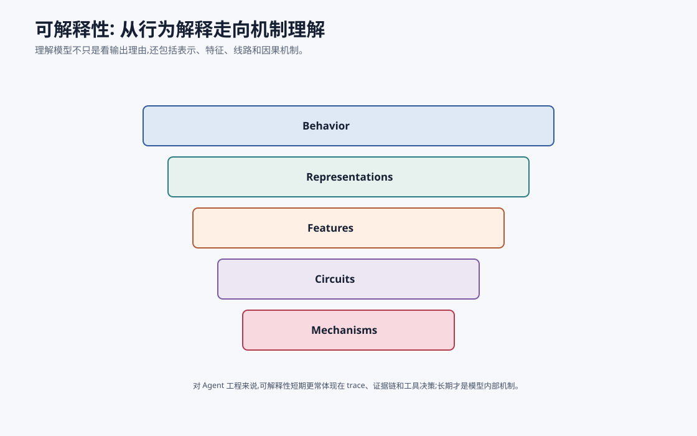

# 大模型可解释性 `[进阶]`

可解释性是理解大模型和 Agent 的重要方向。

但“解释”这个词有很多层含义。

有时我们说解释,指的是模型输出一段理由。有时指 trace 中的证据链。有时指理解模型内部哪些特征和线路导致某个行为。

这些不是一回事。



## 行为解释

最外层是行为解释。

例如:

```text
模型为什么给出这个答案?
```

可以通过:

- 引用证据。
- 展示工具 trace。
- 展示计划和观察。
- 展示评审结果。

对 Agent 工程来说,这层最实用。

## 过程解释

Agent 的过程解释包括:

- 为什么调用某个工具。
- 参数来源是什么。
- 哪条证据支持哪个结论。
- 哪个护栏放行或拦截。
- 哪次状态更新改变了路径。

这来自系统 trace,不一定来自模型内部。

## 模型内部解释

更深层是理解模型内部:

- 表示空间。
- 注意力模式。
- 特征。
- circuit。
- 因果机制。

这类研究希望回答:模型内部如何表示事实、语法、推理步骤、拒绝行为或工具使用倾向。

## 为什么重要

可解释性可能帮助:

- 发现模型偏差。
- 理解幻觉机制。
- 定位安全风险。
- 改进模型编辑。
- 建立更可靠评估。
- 解释关键决策。

但目前可解释性仍是开放研究方向,不能夸大短期能力。

## 对 Agent 工程的现实意义

短期内,Agent 工程最实用的可解释性是:

- trace。
- evidence pack。
- tool event log。
- state diff。
- guardrail decision。
- eval failure attribution。

这些不能解释模型内部每个神经元,但能解释系统为什么这么做。

## 解释的三个用途

解释不只是为了“看懂”。不同用途需要不同解释。

| 用途 | 需要的解释 |
| --- | --- |
| 调试 | 哪个 span、证据、工具或状态导致错误 |
| 审计 | 谁在何时基于什么依据执行了什么动作 |
| 科学理解 | 模型内部如何表示和计算某种能力 |

Agent 工程日常最需要前两者。机制可解释性更接近研究前沿,它可能长期改善安全和模型设计,但短期不能替代 trace 和审计。

## 模型理由不等于因果原因

让模型回答“我为什么这么做”很有用,但要谨慎。

模型生成的理由可能:

- 遗漏真实影响因素。
- 事后合理化。
- 受 prompt 诱导。
- 听起来合理但无法验证。

因此 Agent 的解释应优先基于可观察事实:

- 它看到了哪些证据。
- 调用了哪些工具。
- 工具返回了什么。
- 哪条策略放行。
- 哪个 state 字段改变。

模型自述可以作为补充,不能作为唯一解释。

## 常见误解

### 误解一:让模型写理由就是可解释

不完全。模型写的理由可能是事后合理化。

### 误解二:注意力图能完整解释模型

注意力有参考价值,但不能等同于因果解释。

### 误解三:有 trace 就理解了模型内部

Trace 解释系统过程,不解释参数内部机制。

### 误解四:可解释性短期能解决所有安全问题

不能。安全仍需要权限、护栏和评估。

## 本章小结

可解释性有多层:行为解释、过程解释、表示和机制解释。对当前 Agent 工程来说,最实用的是系统级解释:trace、证据链、工具日志、状态变化和护栏决策。模型内部可解释性仍是重要前沿,但不能替代工程安全和评估。未来更好的可解释性会帮助我们理解模型为什么会错,也帮助构建更可靠的 Agent。
