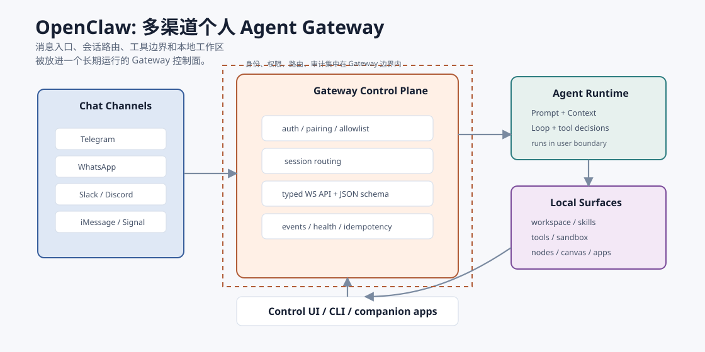
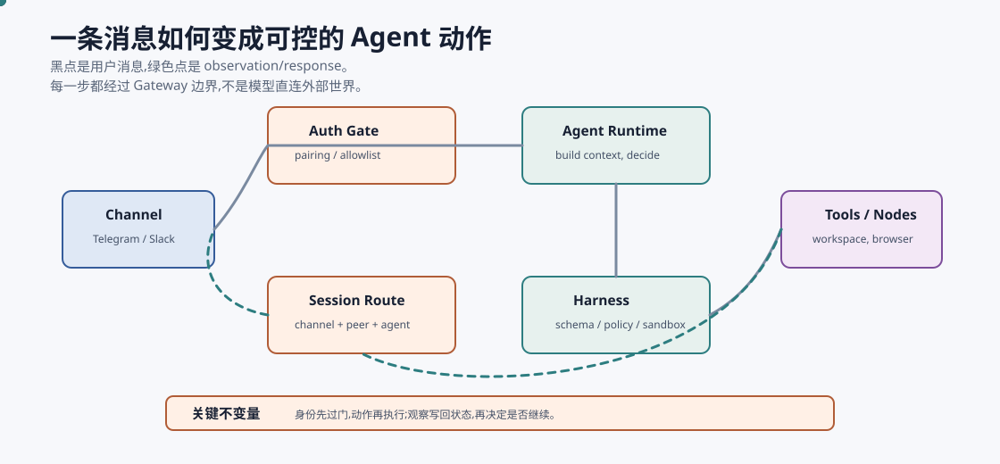
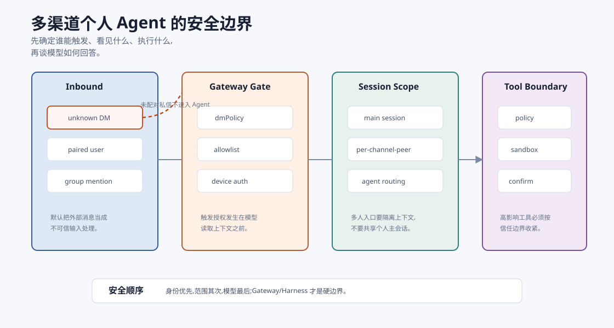

# OpenClaw:小龙虾与个人 Agent Gateway `[进阶]` ★

先把概念校正清楚:这里的 OpenClaw 指的是最近很火的“小龙虾”项目,也就是官方文档和 README 中描述的 **personal AI assistant / self-hosted Gateway**。它不是一个单纯的强化学习训练框架。

OpenClaw 的关键价值不在于又包装了一个聊天机器人,而在于它把 Agent 放进一个更接近真实生活的入口里:WhatsApp、Telegram、Slack、Discord、Signal、iMessage、Google Chat、Microsoft Teams、Matrix、Zalo、WeChat、QQ、WebChat 等常用消息渠道。你在自己的机器或服务器上运行 Gateway,消息从渠道进入 Gateway,再被路由到 Agent、workspace、skills、tools、nodes 和 companion apps。

这就是它值得放进前沿章节的原因:OpenClaw 让我们看到 Agent 产品形态正在从“打开一个 IDE/网页对话框”走向“一个长期在线、可从多渠道触达、由本地 Gateway 管控的个人助理”。



本章会讲:

- OpenClaw 到底是什么,不是什么。
- 为什么 Gateway 是它的核心抽象。
- 它如何体现 Prompt、Context、Harness、Loop 四层工程。
- 多渠道个人 Agent 的安全边界为什么比普通聊天机器人复杂。
- 即使你不使用 OpenClaw,也能从它的架构里学到什么。

## 一句话定义

可以把 OpenClaw 理解成:

> 一个本地优先、自托管的个人 Agent Gateway,把你常用的消息渠道、Agent runtime、workspace、skills、tools、nodes 和控制界面连接起来。

这句话里有四个关键词。

**个人 Agent**:官方 README 明确把它描述为运行在你自己设备上的 personal AI assistant。它面向的是单用户或同一信任边界内的个人助理场景,不是天然面向敌对多租户的 SaaS 平台。

**Gateway**:Gateway 是长期运行的控制平面。它维护渠道连接、会话、路由、工具、事件、节点和 WebSocket API。官方架构文档强调,Gateway 是会话、路由和频道连接的可信来源。

**多渠道**:OpenClaw 的入口不是单一网页输入框,而是你已经在用的聊天应用。用户可以从手机消息里触发 Agent,而不是总要切到开发工具或专门 App。

**本地优先**:它可以运行在自己的机器或服务器上,状态、配置、workspace 和凭证都需要由使用者自己治理。这带来控制权,也带来安全责任。

## 它不是什么

理解 OpenClaw,先排除几个误解。

### 不是强化学习训练框架

OpenClaw 的官方 README 和文档强调的是 personal assistant、Gateway、channels、tools、skills、nodes、sandbox、security 和 Control UI。不要把它误读成“从真实交互中训练模型”的 RL 系统。

真实交互反馈当然可以成为未来 Agent 评估和个性化的材料,但这不是 OpenClaw 当前公开文档里的核心定位。

### 不是普通聊天机器人

普通聊天机器人通常是:

```text
channel webhook -> bot handler -> model -> reply
```

OpenClaw 更接近:

```text
channels -> Gateway -> session routing -> agent runtime -> tools/nodes/workspace -> reply/events
```

差别在于 Gateway 不是一段 webhook glue code,而是长期运行的控制面。它要处理会话、配对、认证、工具策略、节点能力、事件流、幂等和安全审计。

### 不是“多用户共享大脑”的安全边界

官方安全文档非常直接:OpenClaw 的安全模型假定每个 Gateway 只有一个受信任的操作员边界。它不应被理解为一个可以让互不信任用户共享同一个强工具 Agent 的敌对多租户隔离层。

这点很重要。多渠道不等于多租户。很多团队会把“能接 Slack/Discord 群聊”误解为“可以给所有人共享一个带 shell 权限的 Agent”。这是危险的。

## Gateway 为什么是核心

在传统软件中,用户入口、业务逻辑和执行权限常常在同一个后端里。Agent 系统不一样。模型会读取上下文、提出动作、调用工具、影响外部世界,所以中间必须有一个能管控动作的运行时边界。

OpenClaw 的 Gateway 正是这个边界。

官方架构文档中,Gateway 做几类事情:

| 责任 | 含义 |
| --- | --- |
| 渠道连接 | 维护 WhatsApp、Telegram、Slack、Discord、Signal、iMessage、WebChat 等消息表面 |
| 控制 API | CLI、Web UI、macOS app、自动化客户端通过 WebSocket 连接 Gateway |
| 节点连接 | macOS/iOS/Android/headless nodes 以 `role: node` 连接,声明 caps 和 commands |
| 协议校验 | 入站帧使用 JSON Schema 验证,请求、响应和事件是类型化协议 |
| 会话路由 | 把不同渠道、账号、发送者、群组路由到对应 session 或 agent |
| 副作用保护 | 对 `send`、`agent` 等有副作用方法要求幂等键,便于安全重试 |
| 运行监督 | 支持 daemon、health、status、event stream、Control UI |

把这些放在一起看,OpenClaw 的 Gateway 很像个人 Agent 的“控制塔”。消息从不同渠道进入,但是否接收、路由到哪里、允许调用什么工具、返回什么事件,都不应该由模型直接决定。

## 从四层看 OpenClaw

前面 Part 2 讲过 Prompt、Context、Harness、Loop 四层。OpenClaw 是一个很好的现实案例。

| 层 | 在 OpenClaw 中大致对应什么 | 关键问题 |
| --- | --- | --- |
| Prompt | agent 指令、workspace 中的约定文件、skills 描述、工具说明 | 这个 Agent 应该如何工作 |
| Context | channel 消息、session 历史、workspace、工具结果、节点状态 | 这一轮 Agent 能看见什么 |
| Harness | Gateway 协议、schema、认证、配对、allowlist、tool policy、sandbox、幂等、审计 | 模型建议的动作能否执行 |
| Loop | 收消息、路由、运行 agent、调用工具/节点、返回结果、更新 session 的循环 | 多轮任务如何持续推进 |

如果只把 OpenClaw 看成“接了很多聊天软件”,就看浅了。更准确地说,它把个人 Agent 的四层工程问题放到了一个长期运行的 Gateway 中。

## 一个消息如何变成 Agent 动作

可以用一条 Telegram 消息举例:

```text
帮我看一下这个项目今天的失败测试,整理原因,给我一个修复计划。
```

在 OpenClaw 这类架构里,它不会只是直接拼进 prompt。

更合理的路径是:

1. 渠道插件收到消息。
2. Gateway 检查发送者是否已配对或在允许列表中。
3. Gateway 根据渠道、账号、peer、群组、提及规则选择 session。
4. Agent runtime 构建当前 Context,包括用户消息、session 状态、workspace 约定、可用工具和预算。
5. 模型提出下一步动作,例如读取测试日志或运行只读诊断。
6. Harness 检查工具权限、参数、风险等级和 sandbox。
7. 工具或节点执行,Observation 写回 session 和 trace。
8. Loop 判断继续读取、请求用户确认、生成计划,还是结束。
9. Gateway 把结果送回原渠道。



这条路径说明:真正的产品能力不是“模型会回答”,而是“消息、状态、工具和权限能形成闭环”。

## 多渠道改变了威胁模型

OpenClaw 官方安全文档里有一句很重要的判断:连接真实消息表面时,入站私信要被当成不可信输入。

这和普通本地 IDE Agent 很不一样。

在 IDE 里,触发 Agent 的通常是你本人。在多渠道 Gateway 中,消息可能来自:

- 你自己的手机。
- 你授权过的联系人。
- 群聊里的其他人。
- 被转发的文本。
- 外部网页、邮件、附件或日志。
- 被 prompt injection 污染的内容。

因此 OpenClaw 的安全文档强调几类控制:

- `dmPolicy="pairing"`:未知私信发送者先拿配对码,未批准前不处理消息。
- `allowlist`:只允许明确列出的发送者或群组触发。
- `dmPolicy="open"`:必须显式选择,并且应谨慎使用。
- 群聊提及门控:避免 bot 在公共房间里始终在线响应所有内容。
- `session.dmScope`:多人可以私信时,用 per-channel-peer 等模式隔离私信上下文。
- Gateway 绑定和认证:默认优先 loopback、本地令牌、Tailscale/VPN 或 SSH tunnel,避免裸露公网。
- 工具策略和 sandbox:对 exec、文件、浏览器、网络等高影响工具做限制。



这正好呼应本书的安全章节:Prompt Injection 不能只靠系统提示词防。硬边界来自身份、范围、工具策略、sandbox、确认和审计。

## OpenClaw 的 Harness 价值

OpenClaw 让 Harness 这个词变得具体。

一个个人助理如果只能聊天,风险有限。但它一旦可以:

- 读写文件。
- 调用 shell 或进程工具。
- 控制浏览器。
- 发送消息。
- 访问 Canvas、camera、screen、location 等节点能力。
- 使用 workspace skills。

就必须有 Harness。

OpenClaw 的 Harness 价值体现在几个地方。

### 协议先于执行

Gateway 文档强调请求、响应、事件通过 WebSocket 的类型化协议传输,并用 JSON Schema 验证。这让动作不是一段任意文本,而是结构化事件。

这点很关键。只有动作被结构化,系统才能做校验、幂等、审计和策略控制。

### 身份先于上下文

OpenClaw 通过设备配对、Gateway auth、DM pairing、allowlist、group policy 等机制先决定“谁可以触发”。这比把所有消息都塞给模型再让模型判断安全可靠得多。

身份和触发授权应该在模型前面,不是模型后面。

### 风险先于工具

官方安全基线建议在必要时禁用或收紧 runtime、fs、sessions、gateway、cron 等工具组,并使用 sandbox。换句话说,工具不是“装上就都给模型用”,而要按信任边界、会话和任务风险配置。

### 幂等先于重试

有副作用的 Gateway 方法需要幂等键,这是非常工程化的细节。Agent loop 中重试很常见,如果没有幂等保护,一次网络抖动可能变成重复发消息、重复创建任务、重复执行副作用。

## OpenClaw 的 Loop 价值

OpenClaw 的另一个价值是把 Loop 从单进程脚本扩展成长期在线系统。

最小 Agent loop 可以写成:

```python
while not done:
    action = model(context)
    observation = tool(action)
    context.append(observation)
```

但个人 Gateway 的 Loop 更复杂:

- 消息可能异步到达。
- 多个渠道共享或隔离 session。
- Agent 运行可能流式返回。
- 工具和节点有不同延迟。
- 用户可能在手机上继续补充信息。
- 长任务可能要跨设备、跨时间恢复。
- 某些动作需要确认或等待配对。

所以 Loop Engineering 里的状态机、预算、停止条件、检查点、事件流和恢复机制在这里都不是理论概念,而是实际产品需求。

## 和 IDE Coding Agent 的差别

OpenClaw 和 IDE coding agent 都可以做代码任务,但产品边界不同。

| 维度 | IDE Coding Agent | OpenClaw 类个人 Gateway |
| --- | --- | --- |
| 入口 | IDE、终端、编辑器 | WhatsApp、Telegram、Slack、Discord、WebChat 等渠道 |
| 在线形态 | 多数由用户显式打开 | Gateway daemon 可长期运行 |
| 会话边界 | 通常围绕 workspace 或项目 | 围绕 channel、peer、agent、workspace 和 session routing |
| 安全重点 | 文件修改、命令执行、代码 diff | 入站身份、群聊触发、远程访问、节点权限、工具影响半径 |
| 用户体验 | 面向开发中的交互 | 面向随时随地的个人助理 |
| 典型风险 | 改错代码、运行危险命令 | 陌生消息触发工具、共享会话泄露、远程 Gateway 暴露 |

这不是谁替代谁。更可能的未来是二者合流:IDE 里做深度开发,消息渠道里做调度、提醒、轻量任务和异步跟进。

## 和普通 SaaS Bot 的差别

普通 SaaS Bot 的优势是部署简单,但状态和控制权常在平台侧。OpenClaw 的自托管路线把控制权还给用户,也把运维责任交给用户。

| 维度 | SaaS Bot | OpenClaw 类自托管 Gateway |
| --- | --- | --- |
| 部署 | 平台托管 | 用户机器、服务器或本地 daemon |
| 数据控制 | 平台策略为主 | 用户自己管理状态、凭证、日志和 workspace |
| 集成深度 | 平台提供什么就用什么 | 可连接本地工具、节点、skills、workspace |
| 安全责任 | 平台承担一部分 | 用户必须理解暴露、认证、allowlist、sandbox |
| 扩展方式 | 平台插件或 webhook | channel plugin、skills、tools、nodes |

这也是为什么 OpenClaw 的官方安全文档篇幅很大。自托管不是天然安全,它只是给你更强的控制权。控制权必须配合配置、审计和隔离。

## Skills 和 workspace 的意义

OpenClaw README 提到 agent workspace 和 skills。workspace 不是简单文件夹,而是个人 Agent 的工作环境:配置、技能、约定、会话和工具都围绕它组织。

这带来一个重要趋势:未来个人 Agent 的能力不只来自模型参数,还来自可安装、可管理、可审计的技能层。

但 skills 也带来供应链问题:

- skill 是否来自可信来源?
- 它要求哪些工具权限?
- 它是否读取敏感文件?
- 它是否改变 prompt、context 或工具调用方式?
- 它的更新是否可审计?

所以 skills 不是“多装多强”,而是需要权限和来源治理。

## 一个可落地的安全基线

如果你设计类似 OpenClaw 的个人 Agent Gateway,至少应该具备这些基线。

| 层 | 基线 |
| --- | --- |
| 网络 | 默认只监听 loopback,远程访问优先 Tailscale/VPN/SSH tunnel |
| 认证 | Gateway API 必须有 token/password/device auth,不要公开无认证入口 |
| 私信 | 默认 pairing 或 allowlist,不要默认 open |
| 群聊 | 默认需要 mention 或明确 allowlist |
| 会话 | 多发送者时隔离 session,不要让陌生人共享主会话 |
| 工具 | 默认最小权限,危险工具按 agent/session 单独开启 |
| 执行 | shell、文件、浏览器、节点命令尽量 sandbox 或确认 |
| 观测 | 保存脱敏 trace,记录 state/action/observation 和策略决策 |
| 事件响应 | 支持停机、撤销访问、轮换 token、检查日志和会话转录 |

这些听起来不像“AI 能力”,但恰恰决定 Agent 能不能进入真实生活。

## 设计启发

即使不使用 OpenClaw,它也给 Agent 工程提供了几条启发。

第一,把入口和执行分开。消息入口可以很多,但执行边界必须集中管理。

第二,把 Gateway 当控制面。模型不应该直接拥有渠道、工具、节点和凭证的最终控制权。

第三,多渠道先解决身份。谁能触发 Agent,比 Agent 会不会回答更基础。

第四,本地优先不是免安全。自托管意味着你要管理凭证、日志、网络暴露、更新和备份。

第五,个人 Agent 不等于企业多租户。一个强工具个人助理可以非常有用,但不要把它直接开放给互不信任的人共享。

第六,长期在线 Agent 必须有运维意识。daemon、health、status、security audit、日志脱敏、恢复和升级,都是产品能力的一部分。

## 常见误解

### 误解一:OpenClaw 只是把 Agent 接到聊天软件

不只是。多渠道只是外层入口。核心是 Gateway 把渠道、会话、Agent、工具、节点、安全策略和控制界面组织到一个运行时。

### 误解二:本地运行就一定安全

不一定。本地运行减少了对托管平台的依赖,但如果 Gateway 暴露公网、私信 open、工具全开、日志不脱敏,风险仍然很高。

### 误解三:只要是我的个人助理,就可以给所有群友用

不对。个人助理的工具权限通常绑定你的身份和机器。让群友触发它,就等于让群友间接使用你授予 Agent 的能力。

### 误解四:多渠道 Agent 主要难在模型

模型重要,但工程难点更多在身份、路由、会话隔离、工具权限、节点能力、幂等、trace 和恢复。

### 误解五:Gateway 越开放越方便

短期方便,长期危险。Gateway 是控制面,开放范围越大,越需要认证、allowlist、sandbox、审计和明确的信任边界。

## 本章小结

OpenClaw“小龙虾”代表的是一种正在变得重要的 Agent 产品形态:本地优先、自托管、多渠道、长期在线的个人 Agent Gateway。它不是训练论文式的概念框架,也不只是聊天机器人。它的核心在于 Gateway:把消息渠道、session routing、agent runtime、workspace、skills、tools、nodes、Control UI 和安全策略组织起来。用本书的四层框架看,OpenClaw 把 Prompt、Context、Harness 和 Loop 都放进了真实运行时。它提醒我们:未来 Agent 的关键竞争力不只是模型会不会回答,还包括谁能触发、能看见什么、能执行什么、如何审计、如何恢复,以及用户是否真正掌握自己的数据和边界。

下一章回到全书结语。理解这些前沿系统之后,更重要的是把基础打牢:从一个小而可靠的闭环开始,逐步扩展入口、工具和自主性。
