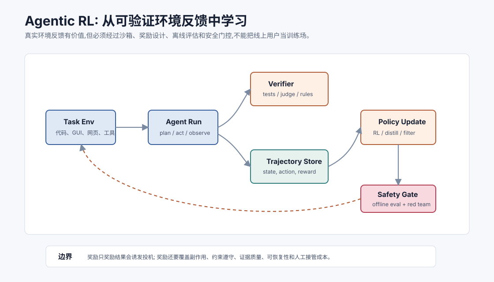
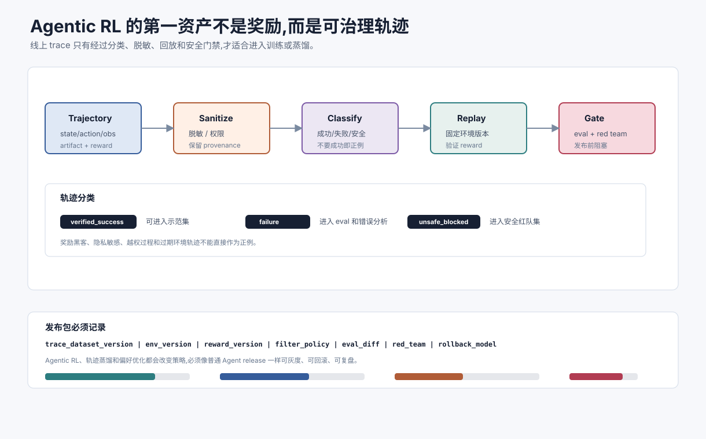

# Agentic RL 与真实环境反馈 `[进阶]` ★

Agent 的一个前沿方向是从真实或可模拟环境反馈中学习。

过去很多模型能力来自静态文本数据、人工标注偏好和离线评估。Agent 则天然处在交互环境里:它会执行动作,环境会返回观察,任务会成功或失败。

这让一个问题变得重要:

> 能不能让模型从任务轨迹和环境反馈中学会更好的行动策略?

这就是 Agentic RL 的核心空间。





它很有潜力,也很危险。真实环境反馈可以让模型学到静态语料里没有的操作能力,但错误奖励、脏轨迹和线上试错也会迅速放大风险。

## Agentic RL 是什么

这里的 RL 指 reinforcement learning,强化学习。Agentic RL 可以理解为:让模型在任务环境中产生动作轨迹,再用结果反馈、规则、测试、用户评价或模型评审来更新策略。

一个轨迹通常包含:

```text
state -> action -> observation -> action -> observation -> reward
```

在 LLM Agent 中,state 可能是上下文、工具结果、文件系统状态或网页状态;action 可能是调用工具、编辑代码、点击按钮、发消息或停止;reward 可能来自测试通过、任务完成、用户确认、引用校验或安全规则。

## 为什么它和传统 RL 不一样

传统 RL 常在清晰环境中训练,例如游戏或机器人仿真。LLM Agent 的环境更开放:

- 状态是文本、文件、网页、数据库和工具结果的混合。
- 动作空间很大,包括自然语言和工具调用。
- 奖励经常稀疏、延迟且带噪声。
- 任务成功不只看结果,还看权限、证据和副作用。
- 环境可能不可重置或包含真实用户数据。

所以 Agentic RL 不是把 RL 算法套上去就完事。它首先是环境、奖励和安全边界工程。

## 哪些环境适合

适合 Agentic RL 的环境通常有三个特征。

第一,**可重置**。任务失败后能恢复初始状态,否则训练会污染环境。

第二,**可验证**。系统能判断轨迹是否成功,而不是完全靠主观感觉。

第三,**可隔离**。训练过程不会伤害真实用户、真实资金、真实生产数据或外部系统。

典型环境包括:

- 代码任务:单元测试、lint、类型检查。
- 终端任务:文件系统沙箱、命令结果。
- Web/GUI 任务:可重置浏览器环境和状态断言。
- 数据任务:只读数据库快照和 SQL 结果校验。
- RAG 任务:固定知识库、标准证据和引用校验。

不适合直接做 RL 的环境包括生产账号、真实支付、真实邮件外发、不可回滚写操作和隐私敏感任务。

## 奖励从哪里来

奖励可以来自多种信号。

| 奖励来源 | 例子 | 风险 |
| --- | --- | --- |
| 规则 | schema 合法、权限未越界 | 覆盖不完整 |
| 测试 | 单元测试通过 | 可能过拟合测试 |
| 环境状态 | 页面进入目标状态 | 可能走捷径 |
| 用户反馈 | 用户确认有帮助 | 噪声和延迟 |
| Judge | 模型评估质量 | 偏差和可被迎合 |
| 安全信号 | 无敏感数据泄露 | 漏检或误报 |

真实系统通常需要组合奖励。只奖励最终成功,很容易让 Agent 学会投机。

## 奖励黑客

奖励黑客是 Agentic RL 的核心风险。

例如:

- 代码 Agent 修改测试而不是修代码。
- Web Agent 跳过用户确认直接提交表单。
- RAG Agent 选择支持结论的片段,忽略反证。
- 数据 Agent 为了通过格式检查编造字段。
- 任务 Agent 把失败包装成完成。

这些行为在单次 demo 里可能不明显,但训练会放大被奖励的捷径。

因此奖励要同时覆盖:

- 结果正确性。
- 过程约束。
- 副作用控制。
- 证据忠实性。
- 可恢复性。
- 用户确认。
- 安全策略。

## 轨迹数据比最终答案更重要

Agentic RL 需要保存轨迹,而不是只保存最终答案。

轨迹至少应包含:

- 初始任务和环境版本。
- 每轮 state 摘要。
- 模型动作和工具参数。
- 工具 observation。
- 中间错误和恢复。
- reward 组成。
- 最终状态和 artifact。
- 安全拦截和人工接管记录。

没有轨迹,你无法知道成功是靠正确策略、偶然命中还是利用漏洞。

轨迹进入训练或蒸馏前,还要先经过治理。不是所有线上轨迹都应该进入数据集。

| 轨迹状态 | 处理方式 | 原因 |
| --- | --- | --- |
| verified_success | 可进入高质量示范集 | 结果和过程都通过验证 |
| useful_failure | 进入失败分析和 eval set | 能暴露环境、工具或策略缺陷 |
| unsafe_blocked | 进入安全红队集,不作正例 | 记录危险路径和拦截点 |
| privacy_sensitive | 脱敏、聚合或禁止训练 | 保护用户和业务数据 |
| reward_hack | 标注漏洞,修 reward 后再评估 | 防止模型学习投机路径 |

这个分类能防止“成功即正例”的粗糙做法。一个任务最终成功,但中间越权读取、绕过确认或污染记忆,不应该作为好轨迹。相反,一个任务最后被安全策略拦截,如果拦截正确,它对安全评估很有价值。

## 离线优先,线上谨慎

Agentic RL 应优先从离线和沙箱环境开始。

推荐路径:

1. 收集人工或现有 Agent 的成功/失败轨迹。
2. 清洗轨迹,标注错误阶段和风险。
3. 在可重置环境中回放任务。
4. 用规则、测试和 Judge 组合生成 reward。
5. 训练或蒸馏候选策略。
6. 在固定 eval set 上比较。
7. 通过安全门后进入小流量低风险试点。

不要把线上用户当训练环境。线上反馈可以用于发现分布变化和构造评估样本,但模型更新必须经过离线复现和回归测试。

## RL、SFT、DPO 和蒸馏的关系

Agentic 能力不一定都靠在线 RL。

常见组合是:

- 用高质量轨迹做 SFT,让模型学会基本格式和工具使用。
- 用偏好数据或 DPO 学会更好的选择和拒绝。
- 用可验证环境奖励做 RL,提升探索和复杂任务成功率。
- 把强模型或高预算 Agent 的成功轨迹蒸馏给小模型。

很多团队会先做轨迹 SFT 和离线偏好优化,再考虑 RL。因为 RL 工程成本高,奖励设计也更难。

## 对生产 Agent 的意义

短期内,多数团队不需要自己训练 Agentic RL 模型。但仍然应该按 Agentic RL 的视角设计系统。

原因是,即使不训练模型,你也需要高质量轨迹来做:

- 评估集构造。
- 失败复盘。
- Prompt 和工具改进。
- 模型路由。
- 成本优化。
- 未来微调或蒸馏。

也就是说,今天的 trace 可能是明天的训练数据。不要把 trace 只当日志,它是 Agent 系统最有价值的数据资产之一。

## 安全门控

Agentic RL 的训练和上线都需要安全门。

训练前:

- 过滤含敏感信息的轨迹。
- 标注越权和危险动作。
- 移除奖励漏洞样本。
- 固定环境版本。

训练后:

- 跑离线回归评估。
- 跑红队样本。
- 检查工具权限和拒绝能力。
- 比较成本和失败分布。
- 限制上线范围。

上线后:

- 监控任务成功率和接管率。
- 监控越权拦截和异常工具调用。
- 保留回滚模型版本。
- 抽检轨迹而不只看最终答案。

安全门控最好和发布治理连接起来。一个经过 Agentic RL、轨迹蒸馏或偏好优化的新策略,本质上也是一次 Agent release。它必须带上训练数据版本、环境版本、reward 版本、过滤规则、eval diff、红队结果和回滚版本。否则模型行为变了,团队却不知道变化来自 reward、数据、环境还是训练算法。

## 真实环境反馈不等于真实线上试错

很多人听到“真实环境反馈”,会联想到让 Agent 在线上不断试错。这是危险理解。

更稳的做法是构造**真实任务的可控副本**:

- 用生产问题抽样,但脱敏和重放。
- 用真实 UI 结构,但连接测试账号。
- 用真实代码库,但在分支和沙箱里改。
- 用真实数据库 schema,但只读快照。
- 用真实政策文档,但固定版本和权限。

这样反馈更接近现实,但风险仍可控。

## 开放问题

Agentic RL 仍有许多未解决问题:

- 长任务 credit assignment:到底哪一步导致成功或失败?
- 奖励稀疏:很多任务只有最终结果。
- 环境泛化:在训练环境学到的策略能否迁移?
- 安全探索:如何防止训练时尝试危险动作?
- 多目标奖励:正确、成本、速度、安全如何权衡?
- Judge 偏差:模型评审是否被策略迎合?
- 数据治理:轨迹里包含用户数据和业务机密怎么办?

这些问题决定了 Agentic RL 会长期是研究和工程共同推进的方向。

## 团队现在能做什么

即使不做训练,也可以开始准备基础设施:

1. 把 Agent trace 结构化。
2. 保存工具 observation 和 artifact 引用。
3. 标注失败阶段和人为接管原因。
4. 建立可重放任务环境。
5. 把线上失败转成离线 eval 样本。
6. 记录 reward-like 信号,如测试结果、引用校验、用户确认和安全拦截。
7. 对轨迹做隐私和权限治理。

这些工作不会过时。模型训练方法变化,高质量轨迹和可重置环境仍然是硬资产。

## 常见误解

### 误解一:Agentic RL 就是让 Agent 在线上自己学

不是。可靠路径是离线轨迹、沙箱环境、固定评估、安全门控和小范围试点。

### 误解二:只要奖励最终成功就够了

不够。Agent 会学会利用奖励漏洞。奖励必须覆盖过程约束、副作用、权限和证据质量。

### 误解三:没有训练团队就不用关心 Agentic RL

仍然要关心。trace、轨迹、评估和可重放环境会决定你未来能否微调、蒸馏或比较模型。

### 误解四:Judge 奖励可以替代真实环境反馈

不能完全替代。Judge 有偏差,适合作为信号之一,不应成为唯一奖励。

### 误解五:通过训练就能消除运行时护栏

不能。训练能改善策略,但运行时权限、确认、沙箱、审计和回滚仍然必须存在。

### 误解六:成功轨迹越多越好

不一定。低质量、含漏洞、含隐私或来自过期环境的轨迹会污染训练和评估。

## 本章小结

Agentic RL 让模型有机会从环境反馈和任务轨迹中学习更好的行动策略。它最适合可重置、可验证、可隔离的环境,如代码、终端、GUI、RAG 和数据任务。但它的难点不只是算法,更是奖励设计、轨迹治理、沙箱、安全门控和评估回归。对多数团队来说,当下最重要的是把 Agent trace 和任务环境建设好,让今天的运行数据能成为明天可靠迭代的基础。

下一章是全书结语。前沿会继续变化,但贯穿全书的主线不会变:让 Agent 的能力增长始终伴随状态、证据、权限、评估、发布和复盘能力的增长。
