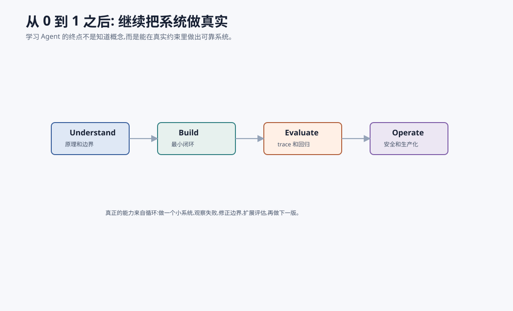
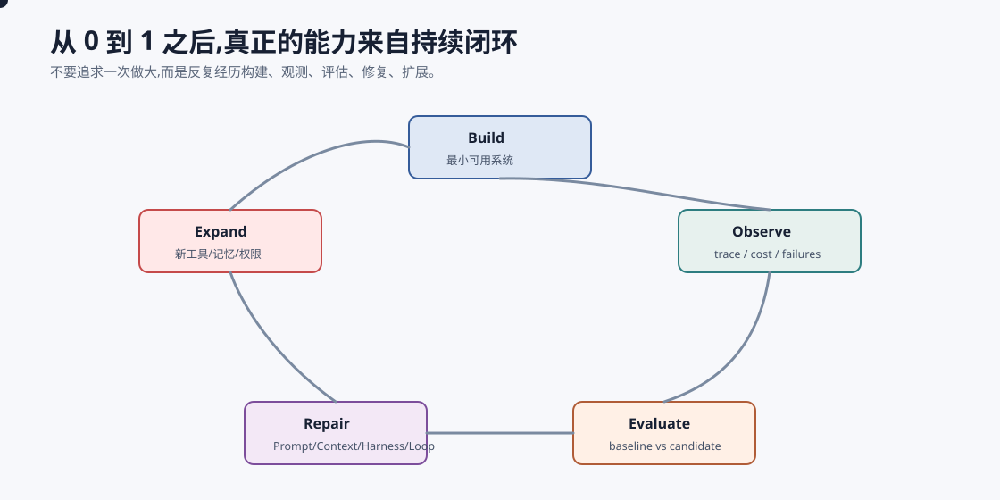

# 结语:从 0 到 1 之后 `[主线]`

如果你一路读到这里,你已经走过了 AI Agent 从 0 到 1 的主要路径。

我们从 AI 和 LLM 的历史出发,打开 Transformer 的内部世界,理解 Agent 循环、工具、规划、Prompt/Context/Harness/Loop、记忆、RAG、多 Agent、工程评估、安全护栏和个人 Agent Gateway 等前沿形态,最后搭了一个个人研究助手。

这不是终点。

## 你现在应该带走什么

最重要的不是某个框架名,也不是某个 prompt 模板。

而是几条判断原则:

### 1. Agent 是系统,不是一段 prompt

可靠 Agent 来自状态、工具、上下文、评估、安全和观测的组合。

### 2. 模型能力很重要,但边界更重要

模型会犯错。系统要知道哪些事情不能只交给模型。

### 3. 证据链比流畅回答更重要

在知识任务中,可信来源、引用和校验决定系统是否可靠。

### 4. 评估是迭代的发动机

没有 eval,你不知道自己是在进步还是绕圈。

### 5. 从小闭环开始

先做一个能跑、可观测、可评估的最小系统,再扩展工具和自主性。

## 一个 30 天实践路线

如果你想把本书变成能力,可以用一个 30 天小计划。

### 第 1 周:复现最小 Agent

- 写一个 Agent loop。
- 接一个只读工具。
- 保存 trace。
- 做 5 条 eval 样本。

交付物不是“代码能跑”,而是一次任务可以被复盘:你能看到每轮 context、action、observation、cost 和 stop reason。

### 第 2 周:加入 RAG

- 准备一个小资料库。
- 做 chunk 和检索。
- 输出 evidence pack。
- 加引用校验。

交付物是一份带引用的回答,并且系统能拒绝不存在的 evidence id。不要只看答案是否流畅,要看证据是否真的支持结论。

### 第 3 周:加入工程边界

- 加预算。
- 加工具 schema 校验。
- 加简单 guardrails。
- 加失败归因。

交付物是一个“失败也可控”的版本:工具参数错会返回结构化错误,预算耗尽会停止并说明进展,高风险动作不会直接执行。

### 第 4 周:做一次版本迭代

- 找 10 个失败样本。
- 改一处检索或上下文。
- 跑 baseline vs candidate。
- 写一份评估报告。

交付物是一份小型 release note:改了什么、为什么改、哪些样本变好、哪些样本变差、下一步风险是什么。

这个计划不追求大而全。它的目标是让你真的经历一次 Agent 工程闭环。

## 判断自己是否真的掌握

可以用下面几个问题自测:

| 问题 | 如果答不上来,说明还缺什么 |
| --- | --- |
| 失败时能定位到 Prompt、Context、Harness 还是 Loop 吗? | 缺少分层诊断 |
| 能复现一条失败 trace 吗? | 缺少可观测性 |
| 能证明答案来自证据而不是模型猜测吗? | 缺少引用和校验 |
| 工具执行前有权限和风险判断吗? | 缺少 Harness |
| 多轮任务什么时候停止? | 缺少 Loop Engineering |
| 新版本是否真的更好? | 缺少 eval 和回归 |

真正的掌握不是会说术语,而是能在系统失败时判断该修哪一层,并用评估证明修复有效。

## 继续往哪里走

你可以选择几条路线。

### 工程路线

深入可观测、评估、成本、安全和部署,把 Agent 送进真实生产环境。

### RAG 路线

深入检索、重排、切块、知识图谱、引用校验和企业知识治理。

### 多 Agent 路线

研究角色分工、编排、消息协议、共享状态和协作评估。

### 模型原理路线

继续深入训练、对齐、推理优化、可解释性和新模型架构。

### 产品路线

研究用户如何和 Agent 协作,什么时候自动化,什么时候确认,什么时候交还给人。

## 一个最小合格标准

从 0 到 1 的项目不必功能很多,但至少应该合格。可以用下面标准验收:

| 维度 | 最小合格标准 |
| --- | --- |
| 目标 | 用户目标能被写成明确任务和完成标准 |
| 状态 | 每轮有 state summary,不是只堆聊天历史 |
| 工具 | 工具有 schema、错误协议和权限边界 |
| 证据 | 知识型回答能追溯到 evidence id |
| Loop | 有预算、停止条件和无进展处理 |
| Harness | 高风险动作不会直接执行 |
| 评估 | 至少有一组固定样本和版本对比 |
| 观测 | 失败可以通过 trace 复盘 |
| 安全 | 不可信输入、敏感数据和工具权限有基本控制 |

如果这些都具备,即使功能很小,它也是一个真正的 Agent 工程原型。如果这些都没有,即使 demo 很炫,也还只是一次模型能力展示。

## 保持谦逊,但别失去野心

学习 Agent 最健康的心态,是同时相信两件事。

第一,它现在确实有很多限制。模型会错,工具会失败,评估会漏,用户需求会变,安全边界会被挑战。

第二,它也确实在打开新的软件形态。自然语言、工具、状态、知识和工作流开始可以被同一个系统协调起来。以前需要人跨多个软件手工完成的任务,正在变成可设计、可评估、可迭代的系统能力。

好的工程不是压低想象力,而是给想象力装上仪表盘、刹车和测试集。

## 最后一句

AI Agent 最迷人的地方,不是它像一个万能魔法盒。

恰恰相反,它迷人的地方在于:当我们认真理解它的能力和边界,把模型、工具、状态、证据、评估和安全组合起来时,我们真的可以做出新的软件形态。

从 0 到 1 之后,真正的路才开始。把这个小闭环跑起来,你就已经不只是读懂 Agent,而是在训练自己的工程直觉。
