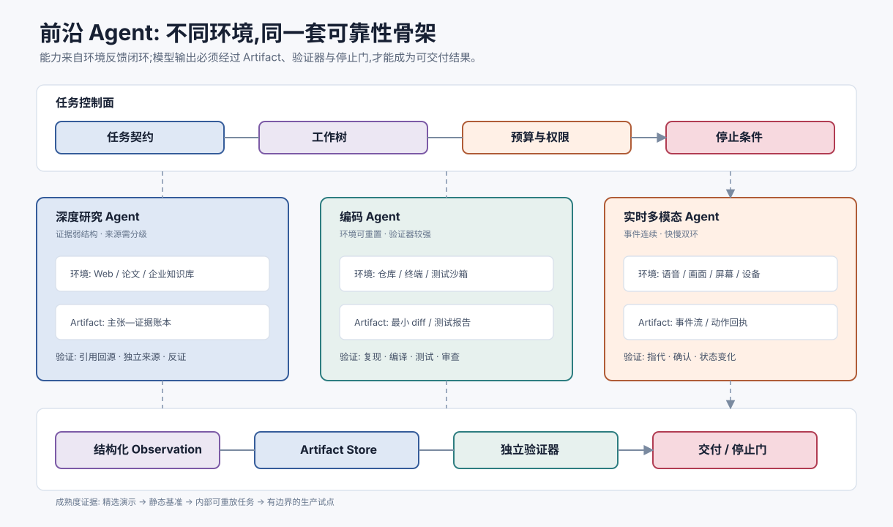

# 前沿 Agent 系统:研究、编码与实时多模态 `[进阶]` ★

深度研究、编码与实时多模态 Agent 是当前最具代表性的三类前沿系统。它们处理的对象不同,却共享一个事实:能力不再来自单次回答,而来自模型、工具、环境反馈、状态管理和验证器组成的闭环。



## 三类系统有什么不同

| 系统 | 主要环境 | 核心产物 | 强验证信号 | 主要风险 |
| --- | --- | --- | --- | --- |
| 深度研究 Agent | Web、论文、企业知识库 | 主张—证据账本与报告 | 引用回源、来源交叉验证 | 来源污染、错引、遗漏反证 |
| 编码 Agent | 仓库、终端、测试环境 | 最小 diff 与验证记录 | 编译、测试、静态检查 | 越权修改、伪通过、供应链风险 |
| 实时多模态 Agent | 音频、视频、屏幕、设备事件 | 连续交互与外部动作 | 状态变化、用户确认、工具回执 | 误听、误指代、隐私与误操作 |

三者都不应被理解为“更长的聊天”。它们是以 artifact 和环境反馈为中心的任务运行时。

## 共同运行时

### 任务契约

开始前固定目标、非目标、交付格式、工具、预算、权限和停止条件。“研究一下”或“修一下”都不是可执行契约;前者要明确时间范围和来源要求,后者要明确复现条件、允许路径和必须通过的测试。

### 工作树

开放任务不适合只维护线性计划。运行时还要保存:

- 已确认事实。
- 待验证假设。
- 证据或测试缺口。
- 可并行子任务。
- 被否决路径及原因。
- 仍阻塞交付的问题。

工作树让 Agent 能局部修正计划,而不是每轮推翻全部上下文。

### Artifact Store

网页快照、长日志、数据表、补丁和测试报告应保存为 artifact。上下文只放摘要、引用、版本和内容哈希。这样既降低上下文成本,也避免摘要覆盖原始证据。

### 独立验证器

生成与验证必须分离。研究任务检查引用是否真的支持主张;编码任务运行测试并检查 diff;实时系统核对当前对象、确认和工具回执。模型自述“已经完成”不能成为完成证据。

### 停止控制器

停止应综合需求覆盖 $C$、证据充分度 $E$、验证通过度 $V$、未解决风险 $R$ 与预算压力 $B$:

$$
S = w_c C + w_e E + w_v V - w_r R - w_b B
$$

公式不一定直接用于打分,它表达的是:完成度不能只由输出是否流畅决定。

## 深度研究:从搜索结果到证据包

可靠研究链路是:

```text
query -> source discovery -> source qualification
      -> claim extraction -> cross-check -> citation binding
```

搜索摘要只能用于发现线索。关键结论优先使用原始规范、论文、数据和官方公告,并记录发布日期、抓取时间和正文定位。

每个重要主张应绑定一个证据条目:

| 字段 | 含义 |
| --- | --- |
| `claim` | 最小、可核验的陈述 |
| `source` | 原始来源与定位 |
| `support_type` | 直接支持、间接推断或反证 |
| `freshness` | 发布时间与抓取时间 |
| `confidence` | 证据质量,不是语言语气 |
| `conflicts` | 相冲突的来源或解释 |

先写报告再补引用,容易产生“引用存在但不支持主张”。报告应是证据账本的一个视图。

## 编码 Agent:从复现到最小 diff

编码任务的可靠闭环是:

```text
reproduce -> localize -> propose -> patch -> verify -> review
```

没有复现就修改,很容易修错问题。复现可以是失败测试、错误日志、最小输入或明确静态证据。无法复现时应交付假设和不确定性,不能伪装成确定修复。

测试也不是单一通过灯。至少检查:

- 原始失败是否转为通过。
- 新测试在旧实现上是否失败。
- 邻近功能是否回归。
- 是否存在跳过、超时或 flaky。
- diff 是否超出授权范围。

SWE-bench、SWE-Lancer 等基准推动了真实代码任务评估,但公开基准不能代替内部仓库、工具和权限上的回归集。

## 实时多模态:从轮次到事件

实时系统同时处理音频帧、语音端点、增量输出、插话、画面变化和异步工具结果。核心抽象不再是一轮消息,而是带时间戳、来源、会话版本和因果关系的事件。

可靠架构通常包含两个时间尺度:

- **快环**:采集、端点检测、流式播放、插话、取消、重连和背压。
- **慢环**:目标更新、长推理、工具调用、高风险确认和任务持久化。

用户感知延迟大致为:

$$
T_{e2e}=T_{capture}+T_{endpoint}+T_{network}+T_{model}+T_{tool}+T_{render}
$$

优化要看关键路径。工具耗时数秒时,系统应反馈进度,而不是只追求更快的首 token。

“停止播报”和“取消动作”必须分开。用户打断解释不一定要取消查询;若用户说“别发送”,则必须阻止尚未提交的外部动作。高风险语音确认应绑定动作哈希、会话版本和有效期,避免一句“可以”被复用于另一个动作。

持续感知还要求最小采集原则:麦克风、摄像头和屏幕分别授权,持续显示采集状态,明确哪些数据上传、保存和删除。

## 多 Agent 何时值得

研究任务可并行搜索不同证据面,编码任务可并行调查代码、测试和历史。但多 Agent 只有在子任务相对独立、结果可合并、并行收益高于协调成本时才有价值。

常见结构是 Lead 维护任务契约和预算,Worker 交付边界清晰的 artifact,Critic 检查遗漏,Runtime 保存全局状态并执行策略门。Worker 不应靠自由聊天同步,而应通过结构化交付合并。

## 如何判断能力是否成熟

前沿能力应沿证据阶梯逐级上升:

1. **演示**:证明精选任务可能成功。
2. **静态基准**:固定任务和评分器便于比较。
3. **内部重放**:在脱敏、固定版本的真实任务环境验证。
4. **受控试点**:在有限用户、低风险动作和明确回滚条件下运行。

METR 提出的 $50\%$ task-completion time horizon,用熟练人类完成任务的时间描述 AI 在 $50\%$ 成功率处的能力跨度。这个指标有助于理解长任务趋势,但依赖任务分布,不能直接等同于可无人值守时长,更不能单独决定权限等级。

评估报告至少固定模型、Harness、工具、环境、预算、重试和人工接管策略,并同时报告成功率、成本、延迟、安全事件、接管率和主要失败分布。否则“模型更强”可能只是获得了更多预算或更好的工具。

## 常见误解

### 误解一:上下文越长,研究越深入

长上下文不能自动提高来源质量、覆盖度或引用正确性。

### 误解二:测试通过就说明编码任务完成

测试可能不充分、被跳过或只覆盖表象,还要检查复现、diff 和副作用。

### 误解三:低延迟就等于实时体验

低延迟但频繁抢话、无法插话或重连丢状态,体验仍然很差。

### 误解四:排行榜第一就是生产最优

排行榜通常不覆盖本地数据、权限、成本、人工介入和事故代价。

## 资料锚点

- [Anthropic: Building effective agents](https://www.anthropic.com/engineering/building-effective-agents)
- [Anthropic: How we built our multi-agent research system](https://www.anthropic.com/engineering/multi-agent-research-system)
- [Measuring AI Ability to Complete Long Software Tasks](https://arxiv.org/abs/2503.14499)
- [SWE-bench](https://arxiv.org/abs/2310.06770)
- [SWE-Lancer](https://arxiv.org/abs/2502.12115)
- [OpenAI Realtime and audio guide](https://platform.openai.com/docs/guides/realtime)
- [Google Gemini Live API overview](https://ai.google.dev/gemini-api/docs/live)

## 本章小结

研究、编码和实时多模态 Agent 的共同基础是任务契约、工作树、artifact、环境反馈、独立验证和停止控制。研究系统围绕主张—证据账本组织,编码系统围绕复现—补丁—验证闭环组织,实时系统围绕事件、双环和取消语义组织。前沿能力必须从演示逐级走向内部重放和受控试点,不能用单次成功替代生产证据。

